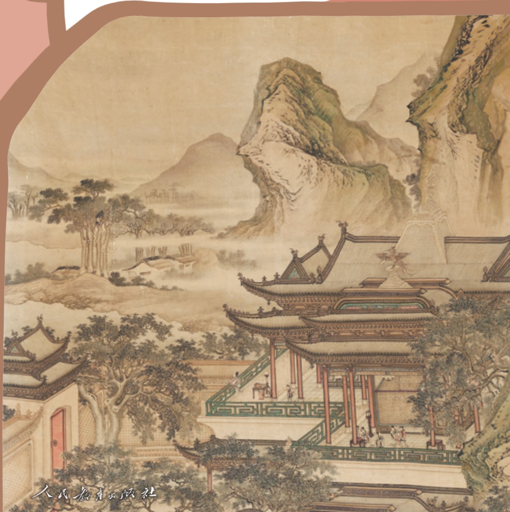
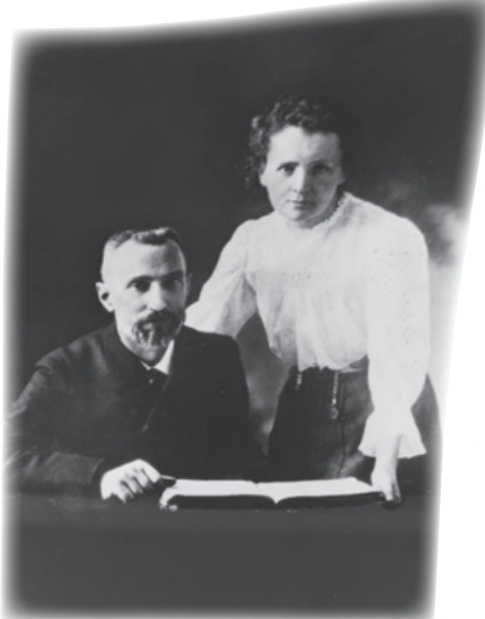
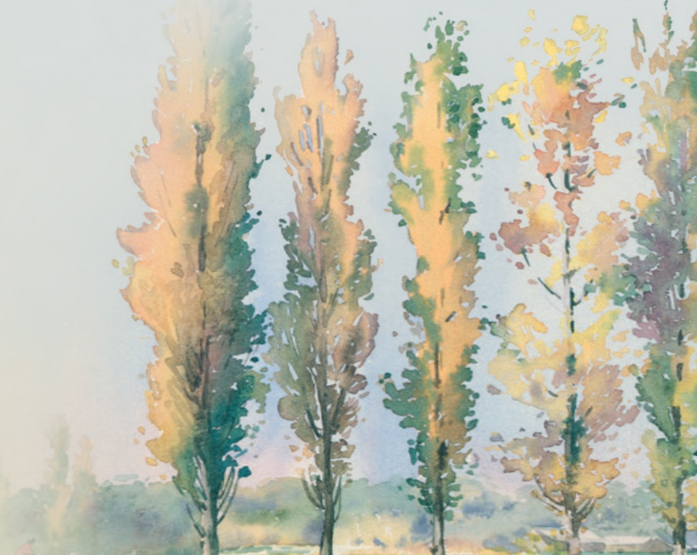
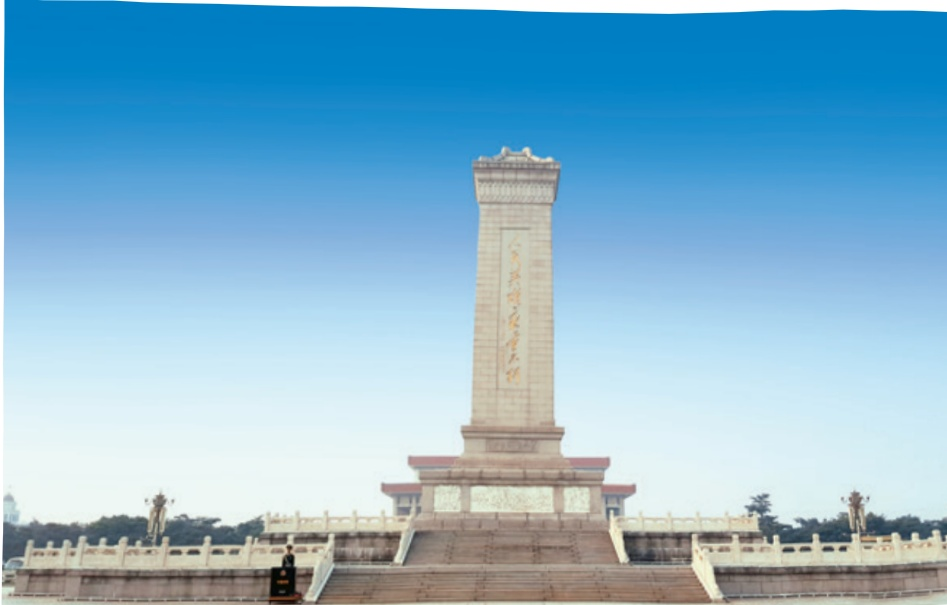
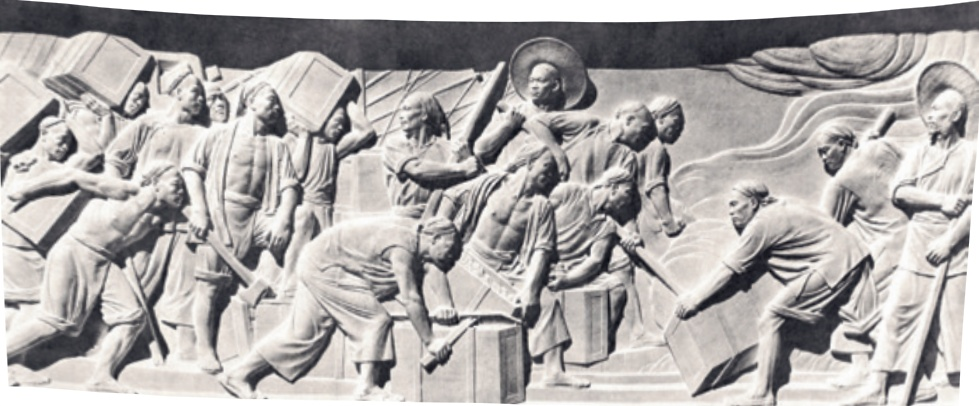
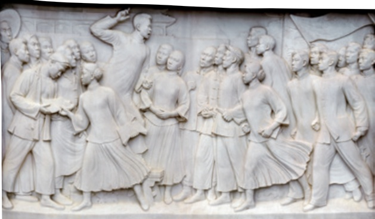
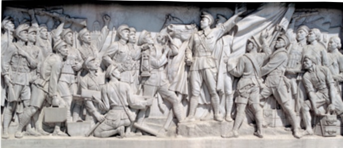
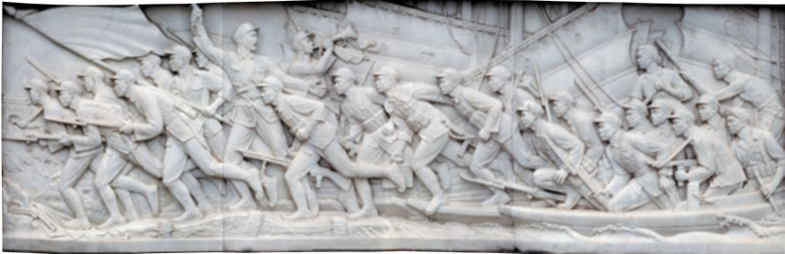
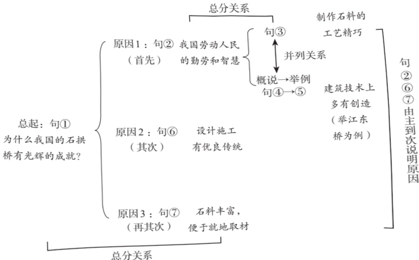

# 语文

八年级上册

---

# 八年级 上册

教育部组织编写

人民教育出版社·北京·

---

编修委员会

主任：温儒敏王立军

副主任：张伯江王荣生

成员（以姓氏笔画为序）：

王敏王本华过常宝朱于国伍新春李小龙李明新

汪锋 宋亚云张继晓张彬福陈先云陈建华林建华

倪文锦徐轶漆永祥

本册主编：张彬福李小龙

编写人员（以姓氏笔画为序）：

尤炜张静张伟忠陈恒舒

倪文尖曹刚覃文珍靳彤责任编辑：覃文珍责任设计：惠凌峰责任校对：闵冬娜责任印制：

义务教育教科书语文八年级上册

教育部组织编写

出版人民教育出版社

（北京市海淀区中关村南大街17号院1号楼邮编：100081）

网址http:/www.pep.com.cn

---

## 目录

第一单元活动·探究1  
任务一新闻阅读2  
1消息二则/毛泽东3  
我三十万大军胜利南渡长江  
人民解放军百万大军横渡长江  
2中国人首次进入自己的空间站／余建斌  
吴月辉刘诗瑶6  
3首届诺贝尔奖颁发8  
4“飞天”凌空  
  
——跳水姑娘吕伟夺魁记/夏浩然樊云芳10  
5一着惊海天  
  
——目击我国航母舰载战斗机首架次  
成功着舰/蔡年迟蒲海洋12  
6国行公祭，为佑世界和平／钟声15  
任务二新闻采访17  
任务三新闻写作19  
第二单元23  
阅读7藤野先生/鲁迅24  
8回忆鲁迅先生（节选）／萧红32  
9*天上有颗“南仁东星”/王宏甲40

---

10*美丽的颜色/艾芙·居里48  
阅读综合实践53  
写作学写传记54  
整本书阅读  
  
《红星照耀中国》怎样读红色经典作品57  
61  
阅读11三峡／郦道元62  
12 短文二篇64  
答谢中书书/陶弘景  
  
记承天寺夜游/苏轼  
  
13*与朱元思书/吴均67  
14 唐诗五首69  
王/青  
  
  
王/  
  
  
  
3  
写作学习描写景物74  
专题学习活动  
  
人无信不立77  
课外古诗词诵读  
  
81  
庭中有奇树/《古诗十九首》  
  
龟虽寿/曹操  
  
赠从弟（其二）／刘桢

---

第四单元83  
阅读15 背影/朱自清84  
16 白杨礼赞/茅盾88  
17* 散文二篇92  
永久的生命/严文井  
  
我为什么而活着/罗素  
18*昆明的雨/汪曾祺96  
阅读综合实践101  
写作语言要连贯103  
整本书阅读  
  
《红岩》106  
第五单元107  
阅读19中国石拱桥/茅以昇108  
20苏州园林/叶圣陶113  
21*人民英雄永垂不朽  
  
-瞻仰首都人民英雄纪念碑/周定舫117  
22*梦回繁华/毛宁125  
阅读综合实践129  
写作说明事物要抓住特征131  
专题学习活动  
  
身边的文化遗产135

---

## 第六单元

143  
阅读23《孟子》三章144  
得道多助，失道寡助  
  
富贵不能淫  
  
生于忧患，死于安乐  
  
24 愚公移山/《列子》148  
25*周亚夫军细柳/司马迁151  
26诗词五首154  
饮酒（其五）/陶渊明  
  
春望/杜甫  
  
雁门太守行/李贺  
  
赤壁/杜牧  
  
渔家傲（天接云涛连晓雾）/李清照  
阅读综合实践158  
写作表达要得体160  
课外古诗词诵读163  
浣溪沙（一曲新词酒一杯）/晏殊  
  
采桑子（轻舟短棹西湖好）/欧阳修  
相见欢（金陵城上西楼）/朱敦儒  
  
如梦令（常记溪亭日暮）/李清照

---

# 第一单元活动·探究

## 活动任务单

新闻是我们了解世界的窗口。每天都有各种各样的新闻，通过报纸、广播、电视、互联网等媒介传播。它们报道新近发生的事实，记录着历史的进程、社会的发展。本单元，我们将跟随新闻作品重回历史现场，触摸时代脉搏；了解常见的新闻体裁及其特点，关注不同媒介在传播新闻时表达上的差异；还将体验新闻的采访过程，试着撰写新闻稿，编辑制作报纸页面、新闻网页等。

## 任务一

新闻阅读。阅读消息、新闻特写、通讯、新闻评论等不同体裁的新闻作品，了解新闻内容，把握不同新闻体裁的特点，学习阅读新闻的方法，探究不同媒体是怎样报道新闻的；养成阅读新闻的习惯，关注新闻本身的发展。

## 任务二

新闻采访。熟悉新闻采访的一般方法和步骤。自主确定报道题材，制订采访方案，草拟采访提纲，分小组进行采访实践，搜集并整理新闻素材。

## 任务三：

新闻写作。一、必做任务，每位同学写一则消息；二、自选任务，撰写新闻特写、通讯等；三、拓展任务，编辑制作报纸页面、新闻网页、短视频等，选择适合的媒介发布。

---

## 任务一

## 新闻阅读

阅读本单元所选的新闻作品，了解其内容，把握不同新闻体裁的特点，学习阅读新闻的方法。阅读时可以采用如下策略：

1．从新闻要素的角度把握课文的内容。人们常把“何时”“何地”“何事”“何人”“何故”“如何”称为新闻的“六要素”，有些新闻要素齐全，也有些新闻会侧重某些要素。阅读课文时，要梳理其中的新闻要素，把握主要新闻事实。可以分条列举，也可以画图表。

2.在比较中了解不同新闻体裁的特点。本单元的新闻作品体裁不同，写法各异。可以结合旁批与补白，从篇幅、时效性、表达方式等角度，在比较中归纳消息、新闻特写、通讯、新闻评论各自的特点。重点把握消息在标题、结构、语言等方面的主要特点，为后面的写作任务作准备。

3.边读课文边揣摩作者的态度与倾向。新闻注重准确性，呈现客观事实，作者的感情与思想往往隐含于字里行间。阅读时要注意区分客观事实与主观评价，了解作者的立场与观点，也可以试着从不同的角度来思考新闻的内容，培养独立思考的习惯。

此外，还要养成经常浏览报刊、新闻类网站及新媒体平台的习惯，并试着用比较专业的视角去选择、阅读和思考。例如，通读一份报纸，看看它着重报道哪些新闻，初步了解它的特点和定位；搜集多个媒体的独家新闻，与同学讨论该怎样捕捉新闻线索，发现新闻事件；对比阅读不同媒体对同一事件的报道，想一想它们选取的角度、所持的立场各有什么不同；关注某一新闻事件，了解报纸、广播、电视、社交媒体、短视频平台等分别是怎样报道的，探究不同媒介的表达特点；等等。

随着社会生活、信息技术的快速发展和受众需求的日趋多元，新闻的写法与传播方式也在不断发生相应的变化。在平时的阅读中，要关注这些变化，持续更新自己对新闻的认识。

---

# 1 消息二则°

毛泽东

## 我三十万大军胜利南渡长江（一九四九年四月二十二日）

新华社长江前线二十二日二时电英勇的人民解放军二十一日已有大约三十万人渡过长江。渡江战斗于二十日午夜开始，地点在芜湖、安庆之间。国民党反动派经营了三个半月的长江防线，遇着人民解放军好似摧枯拉朽②，军无斗志，纷纷溃退。长江风平浪静，我军万船齐放，直取对岸，不到二十四小时，三十万人民解放军即已突破敌阵，

标题简明、醒目，概括性强。

黑体字是电头，正文第一句是导语，导语以下是消息的主体。

《百万雄师过大江》邹健东摄

---

时间、地点、人数及事件发展趋势等，叙述得准确而精要。

占领南岸广大地区，现正向繁昌、铜陵、青阳、获港、鲁港诸城进击中。人民解放军正以自己的英雄式的战斗，坚决地执行毛主席朱总司令的命令。

## 人民解放军百万大军横渡长江（一九四九年四月二十二日）

新华社长江前线二十二日二十二时电人民解放军百万大军，从一千余华里的战线上，冲破敌阵，横渡长江。西起九江（不含），东至江阴，均是人民解放军的渡江区域。二十日夜起，长江北岸人民解放军中路军首先突破安庆、芜湖线，渡至繁昌、铜陵、青阳、荻港、鲁港地区，二十四小时内即已渡过三十万人。二十一日下午五时起，我西路军开始渡江，地点在九江、安庆段。至发电时止，该路三十五万人民解放军已渡过三分之二，余部二十三日可渡完。这一路现已占领贵池、殷家

渡江战役主要作战地区

---

汇、东流、至德①、彭泽之线的广大南岸阵地，正向南扩展中。和中路军所遇敌情一样，我西路军当面之敌亦纷纷溃退，毫无斗志，我军所遇之抵抗，甚为微弱。此种情况，一方面由于人民解放军英勇善战，锐不可当；另一方面，这和国民党反动派拒绝签订和平协定，有很大关系。国民党的广大官兵一致希望和平，不想再打了，听见南京拒绝和平，都很泄气。战犯汤恩伯二十一日到芜湖督战，不起丝毫作用。汤恩伯认为南京、江阴段防线是很巩固的，弱点只存在于南京、九江一线。不料正是汤恩伯到芜湖的那一天，东面防线又被我军突破了。我东路三十五万大军与西路同日同时发起渡江作战。所有预定计划，都已实现。至发电时止，我东路各军已大部渡过南岸，余部二十三日可以渡完。此处敌军抵抗较为顽强，然在二十一日下午至二十二日下午的整天激战中，我已歼灭及击溃一切抵抗之敌，占领扬中、镇江、江阴诸县的广大地区，并控制江阴要塞，封锁长江。我军前锋，业已②切断镇江、无锡段铁路线。

## 读读写写

这里对西路军战况的描述，哪些地方体现了作者的态度?

晚间的消息，报道当天下午的战况，时效性很强。

---

# 神舟十二号三名航天员 顺利进驻天和核心舱 2中国人首次进入 自己的空间站

余建斌吴月辉刘诗瑶

引题与正题配合。注意体会标题中的关键词，感受其中传达的民族自豪感。

交代信息来源，体现了新闻的权威性。

《人民日报》酒泉2021年6月17日电 记者从中国载人航天工程办公室获悉：6月17日9时22分，神舟十二号载人飞船在酒泉卫星发射中心②发射升空，准确进入预定轨道，顺利将三名航天员送上太空。神舟十二号载人飞船入轨后顺利完成入轨状态设置，于北京时间6月17日15时54分，采用自主快速交会对接模式成功对接于天和核心舱前向端口，与此前已对接的天舟二号货运飞船一起构成三舱（船）组合体，整个交会对接过程历时约6.5小时。这是天和核心舱发射入轨后，首次与载人飞船进行的交会对接。

神舟十二号载人飞船与天和核心舱自主快速交会对接成功金立旺摄于北京航天飞行控制中心 

射试验基地，位于甘肃酒泉东北。是我国建设最早的航天器发射试验基地。

---

在神舟十二号载人飞船与天和核心舱成功实现自主快速交会对接后，航天员乘组从返回舱进入轨道舱。按程序完成各项准备后，先后开启节点舱舱门、核心舱舱门。北京时间17日18时48分，航天员聂海胜、刘伯明、汤洪波先后进入天和核心舱，标志着中国人首次进入自己的空间站。

中国空间站模拟构型图中国载人航天工程办公室提供

后续，航天员乘组将按计划开展相关工作，完成为期三个月的在轨驻留，开展机械臂操作、出舱活动等工作，验证航天员长期在轨驻留、再生生保①等一系列关键技术。

## 读读写写

逐一介绍航天员进入空间站的各个环节，让读者具体了解标题中的信息。

概述后续工作，文字简洁，信息完备。

<html><body><table border="1"><tr><td></td><td></td><td></td><td></td><td></td><td></td><td></td><td></td><td></td><td></td><td></td><td></td><td></td><td></td><td></td><td></td><td></td><td></td></tr></table></body></html>

适于人类生存的基本环境，并提供必需的生活支持保障。

---

## 3 首届诺贝尔奖颁发

关注电头和导语交代了哪些内容。

一一列举获奖者的国籍、姓名、所获奖项和主要成就，新闻事实表述简洁、准确。

明确颁奖机构、颁奖时间和地点。

路透社斯德哥尔摩1901年12月10日电 瑞典国王和挪威诺贝尔基金会今天首次颁发了诺贝尔奖。根据诺贝尔的遗嘱，诺贝尔奖每年发给那些在过去的一年里，在物理学、化学、生理学或医学、文学及和平事业方面为人类作出最大贡献的人。

今年诺贝尔奖的获得者有：德国的伦琴②（物理学奖)，他发现了X射线；荷兰的范托夫③（化学奖)，他发现了化学动力学定律和渗透压定律；德国的贝林④（生理学或医学奖），他在血清疗法的研究方面卓有成就；法国的普吕多姆⑤（文学奖)，他在诗歌创作方面颇有建树。诺贝尔和平奖的获得者有：瑞士的迪南⑥，他于1864年建立了红十字会；经济学家帕西⑦，他建立了促进国际仲裁的各国议会联盟。

从即日起，根据诺贝尔的遗嘱，诺贝尔奖由4个机构（瑞典3个，挪威1个）颁发，从按诺贝尔

---

遗嘱建立的基金中拨款。授奖仪式每年于12月10日诺贝尔逝世周年纪念日在瑞典的斯德哥尔摩和挪威的奥斯陆举行。

1867年，瑞典化学家诺贝尔发明了黄色炸药，以后又发明了多种炸药，这使他获得巨额收入。1896年诺贝尔逝世，这笔巨款用来设立诺贝尔奖金。他留下来的资金每年的利息将支付这5种诺贝尔奖金。诺贝尔基金会是这笔资金的合法拥有者，并管理这笔资金的投资，但与诺贝尔奖的评定无关。诺贝尔奖的评议权属于瑞典和挪威的诺贝尔奖评委会。

交代新闻背景，介绍诺贝尔奖金的来源。作者特别说明资金管理权和奖项评议权的分离，有什么用意?

诺贝尔

贝林的诺贝尔奖证书

---

# 4“飞天”凌空1

——跳水姑娘吕伟夺魁记

夏浩然 樊云芳

描写白云、飞鸟，既表现跳台的高，又衬出“飞天”的沉静。

连贯的跳水动作被分解成起跳、腾空、入水三个步骤，逐一描写，犹如慢镜头回放。

展现生动的画面，是新闻特写常用的写法。

她站在十米高台的前沿，沉静自若，风度优雅，白云似在她的头顶飘浮，飞鸟掠过她的身旁。这是达卡多拉游泳场的八千名观众一齐翘首②而望、屏息③敛声的一刹那。

轻舒双臂，向上举起，只见吕伟轻轻一蹬，就向空中飞去。一瞬间，她那修长美妙的身体犹如被空气托住了，衬着蓝天白云，酷似敦煌壁画中凌空翔舞的“飞天”。

紧接着，是向前翻腾一周半，同时伴随着旋风般的空中转体三周，动作疾如流星，又潇洒自如，1.7秒的时间对她似乎特别慷慨，让她从容不迫地展示身体优美的线条，从前伸的手指，一直延续到绷直的足尖。

还没等观众从眼花缭乱中反应过来，她已经展开身体，像轻盈的、笔直的箭，“哧”地插进碧波之中，几串白色的气泡拥抱了这位自天而降的仙女，四面水花则悄然④不惊。

“妙！妙极了！”站在我们旁边的一名外国记者跳了起来。这时，整个游泳场都沸腾了，如梦初

---

醒的观众用震耳欲聋的掌声和欢呼声，来向他们喜爱的运动员表达由衷的赞赏。

吕伟精彩的表演，将游泳场的气氛推向了高潮。她的这个动作“5136①”，让几位裁判亮出了9.5分的高分。

这位年方十六的中国姑娘，赢得了金牌。

当一个印度观众了解到这个姑娘是中国跳水集训队中最年轻的新秀时，惊讶不已。他说：“了不起，你们中国的人才太多了！”

## 读读写写

侧面描写，表达自豪之情。

## 什么是新闻特写

新闻特写，是指以形象化的描写作为主要表现手段，截取新闻事件中最具有价值、最生动感人、最富有特征的片段和部分予以放大，从而鲜明再现典型人物、事件、场景的一种新闻体裁。新闻特写兼有新闻和文学的特点，但由于其强调新闻性、时效性和真实性，所以更接近于通讯体裁。简要和迅速地报道新闻事实，是新闻特写与消息的共同点所在。二者差异在于，消息往往要报道新闻事件的全过程，新闻特写则主要描绘新闻事件中的片段。重视运用形象思维，采取多种文学手法，生动形象地报道新闻事实，是新闻特写与通讯的共同点所在。它们的差异在于，在报道同一新闻事实时，通讯一般展示新闻事件的纵剖面，来龙去脉比较完整；新闻特写则是集中笔力，主要展示新闻事件的某一横剖面，着重描写精彩瞬间，并且比通讯更强调时效性和现场感。

（摘自吴麟、张玉洪《新闻采访与写作》)

---

# 5一着惊海天?

一目击我国航母舰载战斗机首架次成功着舰

蔡年迟 蒲海洋

渤海某海域，海风呼啸，海浪澎湃。辽阔的海面上，我国第一艘航空母舰—辽宁舰斩浪向前。舰岛②的主桅杆上，艳红的“八一”军旗迎风招展。

2012年11月23日上午8时，顶着凛冽的寒风，身着不同颜色马甲的甲板工作人员在战位③就位。阻拦索④安全观察员手持专业工具，一丝不苟地对阻拦索做最后一次检查。备受外界关注的我国航母舰载战斗机首次着舰进入最关键时刻。

这不是一次普通的飞行。航母舰载战斗机上舰，承载着国人的强军梦想。浩瀚的大海可以做证：为了这一梦想成真，古老的中华民族，已经等了近百年；人民海军官兵，已经期盼了半个多世纪。

这更不是一次普通的降落。这是世界公认的最具风险的难题。从高速飞行的舰载战斗机上往下看，航母就像汪洋中的一片树叶，在海上起伏行进，飞机每次着舰都面临着生与死的考验。据统计，航母大国舰载机80%的事故发生在着舰过程中。第二次世界大战结束到现在，某大国海军已经坠毁了1000多架飞机，700多名飞行员丧生，其中绝大部分事故是发生在着舰的时候。

飞行塔台内的广播响了：“歼-15飞机552号已于(c)$\times\times\times\times$ 起飞，预计$\times\times\times\times$ 临空！”

着舰指挥员从容地走上甲板指挥平台。“刀尖上的舞蹈”就要开始了，现

---

场所有的人都捏着一把汗。

塔台内，时钟指针的每次跳动，都在揪着人心。

“航向××，航速××节……”口令声中，辽宁舰官兵娴熟地操纵着航空母舰，舰艉①留下一道宽阔笔直的航迹。

×时××分，远方的天空中传来舰载机的低吼声。循声望去，记者看到，湛蓝的天幕上，一架歼-15舰载机正向辽宁舰飞来。

飞行塔台内，一双双布满血丝的眼睛，紧盯着监视屏幕上不断跳动的参数和曲线，密切跟踪正在空中调整飞行姿态的舰载机。

塔台起降指挥监控台，不时传来着舰指挥员和飞行员的对话声——

飞行员：“请示下降高度！”

着舰指挥员：“可以下降高度至×××！”

着舰指挥员：“航向××，航速××……”

飞行员：“明白！”

…

在两人时断时续、不急不缓的对话声中，舰、机配合堪称完美。

发动机的咆哮声越来越大，舰载机越来越近了。绕舰一转弯，二转弯，放下起落架，放下尾钩，歼-15舰载机像凌波海燕，轻巧灵活地调整好姿态飞至舰艉后上方，对准甲板跑道，以几近完美的轨迹迅速下滑。

声如千骑疾，气卷万山来②。惊心动魄的一幕出现了：9时08分，伴随震耳欲聋的喷气式发动机轰鸣声，眨眼之间，舰载机的两个主轮触到航母甲板上，机腹后方的尾钩牢牢地挂住了第二道阻拦索。刹那间，疾如闪电的舰载机在阻拦索系统的作用下，滑行数十米后，稳稳地停了下来。

记者眼前的飞行甲板上，定格了一个象征胜利的巨大“V”字：阻拦索的两端构成“V”上边的两头，尾钩钩住处，则是“V”字的底尖。

“成功了！”欢呼声中，一颗颗揪紧的心，一下子舒展开来。各个战位上热烈的掌声，瞬间点燃了所有人内心的激情，每个人的脸上都绽放出胜利

---

的笑容。许多人落泪了！他们说：“太让人激动了！”

舰载战斗机上舰，中国白手起家①，一切从零开始。某大国一名上将曾说：“我们可以把航空母舰送给你们，但是，十年之内，你们不可能让舰载机上舰！”为了这一着，面对技术封锁，多少人殚精竭虑②，青丝变白发；多少人顽强攻关，累倒在试验场；多少人无怨无悔，默默奉献……今天，终于有了一个圆满的结果，能不激动吗?

“快点儿！快点儿！”有人向飞行甲板冲去。几分钟前还空空荡荡的飞行甲板上，一下跑来了一大群人。

打开舱门，飞行员冲着围过来的将士们说：“一切正常，感觉好极了！”

歼-15舰载机前沸腾了，鲜花映衬着飞行员的笑脸，人们忘情地与飞行员紧紧拥抱，争相与飞行员合影留念……

“咔嚓！”“咔嚓！”……随着照相机的快门声响起，中国第一位成功着舰的航母舰载战斗机飞行员的风采，定格在人们的镜头里，镌刻③在共和国的史册上。

（本报辽宁舰11月25日电）

## 读读写写

<html><body><table border="1"><tr><td></td><td></td><td></td><td></td><td></td><td></td><td></td><td></td><td></td><td></td><td></td><td></td><td></td><td></td><td></td><td></td><td></td></tr><tr><td></td><td></td><td></td><td></td><td></td><td></td><td></td><td></td><td></td><td></td><td></td><td></td><td></td><td></td><td></td><td></td><td></td></tr></table></body></html>

---

# 6国行公祭，为佑世界和平

钟声

“国行公祭，法立典章。铸兹宝鼎，祀我国殇②。”侵华日军南京大屠杀遇难同胞纪念馆集会广场上，国家公祭鼎铭文向世人讲述南京大屠杀史实，讲述设立国家公祭日的初衷。1937年12月13日，侵华日军野蛮侵入南京，随后制造了惨绝人寰③的南京大屠杀惨案，30多万中国同胞惨遭杀戮。南京的历史，人类的记忆。今天，第四个南京大屠杀死难者国家公祭日，中国再次以隆重的公祭仪式悼念死难同胞。中国人民永远牢记南京大屠杀历史，与全世界爱好和平与正义的人们共同维护和平。

《别让南京消失在人们的记忆中》，这是美国《波士顿环球邮报》近日发表的有关南京大屠杀长篇文章的标题。南京大屠杀发生80年后，全世界的正义之士仍在以不同方式纪念死难者。加拿大安大略省议会于2017年10月通过有关“设立南京大屠杀纪念日”的动议；美国圣迭戈市的图书馆举办活动，为民众讲述南京大屠杀史实；加利福尼亚州街头不久前落成的美国医生罗伯特·威尔逊④的纪念碑前摆满鲜花——东京审判时，他是南京大屠杀的第一位证人；在日本，由高中和大学老师组成的研究会建议将“南京大屠杀”等词语列入教科书……历史，不可能被忘却！

但人们也看到，在日本，右翼分子否认历史的态度仍然顽固。在连锁酒店大肆摆放美化侵略战争的书籍，大规模篡改③历史教材，阻止有良知的日本国民追寻事实真相；在美国旧金山市议会2017年9月一致通过设立“慰安妇日”的议案后，属于日本右翼的大阪市市长却表示，要解除大阪市与旧金山市的姐妹城市

---

关系……在南京大屠杀幸存者已不足100位的今天，日本右翼还在不断寻找各种借口对当年的军国主义罪行百般抵赖，扭曲历史，美化战争，颠倒黑白，并企图通过修宪复活军国主义。那些人以丑态百出的表演，妄图辱没人类的良知。

历史不会因时代变迁而改变，事实也不会因巧舌抵赖而消失。日本右翼越顽固，越会引起爱好和平的人们高度警惕。2017年11月，日内瓦裁军会议取消了日本和平演讲的资格；联合国人权理事会提出218项建议，狠批日本在历史问题上的态度，要求日本“正视历史，应努力向后代讲述真实的历史”。南京大屠杀，早已是所有正义力量的集体记忆，唯有日本右翼分子仍在梦中呓语。国家公祭日之长鸣警钟振聋发聩①，那些装睡梦游的罪恶灵魂无处遁形②。

80年，沧海桑田。1937年12月18日，《纽约时报》在一则报道中写道：“大规模抢劫、侵犯妇女、杀害平民……日军将南京变成了一座恐怖之城。”2017年9月，国际和平城市协会宣布，南京成为“国际和平城市”。国际和平城市协会项目执行会长弗雷德·阿门特指出，南京这座城市是第二次世界大战中饱受战火摧残的一个典型，如今成为国际和平城市后，方便全世界的人们更多地了解中华民族热爱、追求和平的悠久历史。

从“恐怖之城”到“和平之城”，南京的命运变迁足证和平是何等珍贵。中国早已成为具有保卫人民和平生活的坚强能力的伟大国家，矢志捍卫世界和平。铭记历史、缅怀先烈、珍爱和平、开创未来，中国一以贯之的和平誓言，彰显坚定的信念、磅礴的力量。

## 自读读写写

<html><body><table border="1"><tr><td></td><td></td><td></td><td></td><td></td><td></td><td></td><td></td><td></td><td></td><td></td><td></td><td></td><td></td><td></td><td></td><td></td><td></td></tr><tr><td></td><td></td><td></td><td></td><td></td><td></td><td></td><td></td><td></td><td></td><td></td><td></td><td></td><td></td><td></td><td></td><td></td><td></td></tr><tr><td></td><td></td><td></td><td></td><td></td><td></td><td></td><td></td><td></td><td></td><td></td><td></td><td></td><td></td><td></td><td></td><td></td><td></td></tr></table></body></html>

---

## 任务二

## 新闻采访

1.以小组为单位召开新闻采访准备会，确定报道题材，制订采访方案。报道的题材要有意义，有价值，彰显正能量，最好与同学们的生活密切相关，如学校的热点话题、家乡的最新变化、本地的重大事件等。可以结合“任务三”中的“自选任务”和“拓展任务”，在充分讨论后确定采访方案，明确组内分工，如了解事件的总体情况、采访事件亲历者、搜集相关资料、拍摄新闻照片、录制音视频等。既可以实地采访，也可以利用互联网进行远程采访。

2.草拟新闻采访提纲。采访提纲没有固定的格式，一般包括采访的时间、地点、对象、目的、方式、问题等。另外，还要注明采访需要的器材用具。采访提纲的主要内容是预先拟好的采访问题，所提问题要具体、客观、有针对性，问题之间要有一定的逻辑联系。可以读一些访谈文章，看一些相关视频（如电视台对各行各业榜样人物的专访），学习怎样设计和组织采访问题。

示例：

采访提纲

<html><body><table border="1"><tr><td>时间、地点</td><td>×月×日下午放学后，××中学教师办公室</td></tr><tr><td>采访对象</td><td>从教二十多年、深受学生爱戴的李老师</td></tr><tr><td>采访目的</td><td>了解李老师的工作经历和他对教育工作的感受、思考</td></tr><tr><td>采访方式</td><td>实地采访，深度访谈</td></tr></table></body></html>

---

续表

<html><body><table border="1"><tr><td>采访用具</td><td>纸、笔、相机（或手机）</td></tr><tr><td>采访问题 （示例）</td><td>（1）您怎样概括您的执教经历？在这二十多年中，有哪些人和事对 您产生了重要的影响？（请对方具体讲述） （2）很多同学都特别喜欢上您的课，您觉得主要是因为什么？ （3）从初上讲台至今，您对教育工作的认识有哪些变化？ （4）近年来，我国教育事业发展很快，您有什么具体的感受? （5）如果您的学生有志于成为教师，您会给他们哪些建议？</td></tr></table></body></html>

3.采访过程中，要尊重采访对象，注意言行得体。例如：不要强求采访对象回答不愿或不能回答的问题；拍摄人物照片或录制音视频时，要事先征得对方的同意。

4.采访结束后，要及时整理所获得的素材，理清头绪，去粗存精，为新闻写作作好准备。其中的一些关键信息，要认真核实，确保不出现错误或偏差。形成初稿后，可以将稿件交给采访对象过目，以便对方确认事实、明确观点、修正措辞。

---

## 任务三

## 新闻写作

1．必做任务。每位同学都要根据“任务二”中自己搜集的新闻素材，参考“技巧点拨”（见下页)，写一则消息。写完后，组内同学互相交流，修改完善。

2.自选任务。消息受篇幅、时效性等因素的限制，往往无法进行更为详尽的报道。因此，若想生动展现新闻场景、集中表现新闻人物、全面记述新闻事件，可以采用其他新闻体裁。每位同学从下面的体裁中任选其一，撰写新闻作品。

<html><body><table border="1"><tr><td>新闻特写</td><td>具体描述新闻事件中的某一场景，生动形象地展现新闻 现场</td></tr><tr><td>人物通讯</td><td>围绕新闻事件中的人物，报道其言行、事迹，展现人物的 精神</td></tr><tr><td>事件通讯</td><td>相对完整地记述新闻事件，展示其发展过程与社会意义</td></tr></table></body></html>

此外，也可以采写一些背景资料，呈现新闻事件的社会历史背景或深层原因；还可以记录主体事件之外的一些有价值或有趣味的新闻花絮。背景资料与新闻花絮可以帮助读者深入、细致地理解报道内容，提高其阅读新闻的兴趣。

3.拓展任务。有条件、有兴趣的同学，可以试着整合本组或全班同学的新闻作品，以恰当的方式编辑制作成报纸页面、新闻网页、短视频等。在编辑制作之前，可以预先设定发布媒介，根据自己对该媒介特点的了解，对文字、图片、音视频材料等进行组织、设计。要注意价值导向正确，重点突出，语言规范，图文并茂，版面美观，以优化传播效果。

---

技巧点拨

## 怎样写消息

消息是迅速、简要地报道新近发生的事件的一种新闻体裁，它最大的特点是真实客观和时效性强。本单元所选的消息，在今天看来已经成为“旧闻”，而在发表的当时，报道的都是刚刚发生的事，有很强的时效性。写作消息时有一些要点需要注意。

首先，要确定一个恰当的标题。标题要准确概括消息的主要内容，如《首届诺贝尔奖颁发》。标题还要尽可能重点突出，简洁醒目。如《我三十万大军胜利南渡长江》，“三十万”“胜利”“南渡”这些关键词，突出了消息中最具新闻价值的要素，很容易引起受众的关注。除单一标题外，很多消息还有引题或副题，它们分别位于正题前后，与正题配合，虚实互现，共同起到传递信息和吸引读者的作用。

其次，要合理安排正文的结构。消息的正文一般包括导语、主体、背景和结语四部分（后两部分有时暗含在主体中)。导语常用简要的文字，集中呈现最重要、最新鲜或最有特点的新闻事实，提示消息的要旨；也有一些新闻导语只呈现部分新闻事实，将其他一些关键内容安排在主体中。无论采用哪种写法，其目的都是吸引读者进一步阅读新闻。

主体是消息的主要部分。它承接导语，具体叙述新闻事实，提供更详尽的信息；有时还要阐述导语所揭示的主题，或回答导语中提出的问题。如《人民解放军百万大军横渡长江》的主体部分，具体介绍了三路大军勇往直前、敌军纷纷溃退的战况，还精要地分析了敌军惨败的原因，内容相当丰富。

消息正文的结构通常是按照重要性递减的原则安排的，即所谓“倒金字塔结构”。如《首届诺贝尔奖颁发》，导语部分集中讲述最重要的新闻事实，随着文章的展开，事实的重要性逐渐降低，相关的背景材料一般放在新闻事实的后面。这种结构的好处是关键信息集中，读来一目了然。

---

也有一些消息的写法相对自由，如《中国人首次进入自己的空间站》，标题中容纳较多的关键信息，正文按时间顺序展开，依次介绍新闻事件的始末。这样的结构脉络清楚，方便读者对事件的过程获得清晰、完整的印象。

再次，要写好导语。一般说来，导语是消息的核心，也是消息这一新闻体裁的重要特征。著名记者范长江说：“新闻写作对导语的要求很高，要写得有魅力，令老百姓看了非读不可。”甚至有学者认为：“写好导语等于写好了消息。”在写作时可以参考下列要求，反复琢磨。

<html><body><table border="1"><tr><td>导语写作要求</td><td>具体阐释</td></tr><tr><td>突出重点，吸引读者</td><td>舍弃可有可无的内容，突出关键信息，集中呈现最有新闻价 值、最受读者关注的新闻事实</td></tr><tr><td>言之有物，事实说话</td><td>要浓缩、概括新闻事实，但不能流于抽象、空洞，尽量用事 实而非概念来说话</td></tr><tr><td>简明扼要，开启全篇</td><td>要简洁明了，避免与主体部分重复，用精练的语言呈现精要 的内容，同时为整篇消息定下基调</td></tr><tr><td>形式多样，体现特色</td><td>可以直接陈述新闻事实，也可以在不违背新闻真实性的前提 下，表现场面，描写细节，渲染气氛，讲述故事</td></tr></table></body></html>

最后，要注意语言的准确、简练、易懂，在此基础上，可适当讲究生动形

---

象。准确，是指语言表述要与新闻事实本身高度吻合，不能夸大或缩小，也不能含糊其词。简练，是指在呈现新闻事实的时候要讲究语言干净利落，删去多余的文字。易懂，是指写消息时要有读者意识，考虑受众需求，尽量采用大众化的语言，不用生僻词语，少用专业术语。写完一则消息后，可以根据上述要求，修改文章的语言。要反复体会教科书中四则消息的语言特点，也可以关注身边的各种媒体，看看它们发布的消息的语言有什么特点。

值得注意的是，消息虽然有着比较固定的格式和写法，但它并不是简单的格式文本。好的消息往往能体现历史的发展，引领时代的方向，反映人民的愿望。新中国成立当天的一篇《开国大典》，成为几代中国人的集体记忆。《我登山队登上世界最高峰》《五星红旗首次插上南极洲》《我核潜艇水下发射运载火箭成功》等，曾让无数中国人激情澎湃，自豪不已。《我国钢产量跃居世界第一》《三峡工程大江截流胜利实现》《青藏铁路全线胜利建成通车》《我国大力加强和完善社会领域立法》《我国社会保障体系框架基本形成》等，记录了中华民族在各个领域改革创新、稳步发展的历程。《我国第二艘航空母舰下水》《中国北斗联天下》《我科学家刷新暗物质探测灵敏度》《我国所有贫困县全部脱贫》《复兴号奔向“未来之城”》《C919大型客机圆满完成首次商业飞行》等，让我们见证了新时代的中国踔厉奋发、勇毅前行的雄姿。

---

## 第二单元

历史不可“穿越”，却能在回忆性散文、传记中得以再现。本单元的课文，或深情回忆，叙述难忘的人与事；或心怀景仰，展现人物的品格与精神。它们是过往生活的记录，又可成为我们未来人生旅途中的宝贵财富。

学习本单元，要了解文中人物的经历与品格，丰富自己的生活体验，提升精神境界。阅读时，要把握文章内容真实、事件典型等特点，理解作者是怎样选择和组织材料，多角度、多层次地展现人物精神风貌的；还要学习用细节描写刻画人物的方法，品味风格多样的语言。

---

# 7藤野先生

鲁迅

预习

在鲁迅的人生中，有几位老师令他终生难忘，其中就包括三味书屋中的寿镜吾先生和本文所写的藤野先生。通读课文，看看作者笔下的藤野先生是一个什么样的人，他为什么“最使我感激”。

鲁迅作品的语言简洁、幽默，富于感情色彩，耐人寻味。阅读时宜放慢速度，细细体会。多读几遍，就能有所感受。

东京也无非是这样。上野②的樱花烂慢③的时节，望去确也像绯红的轻云，但花下也缺不了成群结队的“清国留学生”的速成班④，头顶上盘着大辫子，顶得学生制帽的顶上高高耸起，形成一座富士山⑤。也有解散辫子，盘得平的，除下帽来，油光可鉴⑥，宛如小姑娘的发髻一般，还要将脖子扭几扭。实在标致⑦极了。

中国留学生会馆的门房里有几本书买，有时还值得去一转；倘在上午，

---

里面的几间洋房里倒也还可以坐坐的。但到傍晚，有一间的地板便常不免要咚咚咚地响得震天，兼以满房烟尘斗乱①；问问精通时事②的人，答道，“那是在学跳舞。”

## 到别的地方去看看，如何呢?

我就往仙台③的医学专门学校去。从东京出发，不久便到一处驿站，写道：日暮里。不知怎地，我到现在还记得这名目。其次却只记得水户④了，这是明的遗民朱舜水⑤先生客死⑥的地方。仙台是一个市镇，并不大；冬天冷得利害⑦；还没有中国的学生。

大概是物以希③为贵罢。北京的白菜运往浙江，便用红头绳系住菜根，倒挂在水果店头，尊为“胶菜”；福建野生着的芦荟，一到北京就请进温室，且美其名曰“龙舌兰”。我到仙台也颇受了这样的优待，不但学校不收学费，几个职员还为我的食宿操心。我先是住在监狱旁边一个客店里的，初冬已经颇冷，蚊子却还多，后来用被盖了全身，用衣服包了头脸，只留两个鼻孔出气。在这呼吸不息的地方，蚊子竟无从插嘴，居然睡安稳了。饭食也不坏。但一位先生却以为这客店也包办囚人的饭食，我住在那里不相宜，几次三番，几次三番地说。我虽然觉得客店兼办囚人的饭食和我不相干，然而好意难却，也只得别寻相宜的住处了。于是搬到别一家，离监狱也很远，可惜每天总要喝难以下咽的芋梗汤。

从此就看见许多陌生的先生，听到许多新鲜的讲义。解剖学是两个教授分任的。最初是骨学。其时进来的是一个黑瘦的先生，八字须，戴着眼镜，挟着一叠大大小小的书。一将书放在讲台上，便用了缓慢而很有顿挫的声调，向

---

学生介绍自己道：

“我就是叫作藤野严九郎的……”

后面有几个人笑起来了。他接着便讲述解剖学在日本发达的历史，那些大大小小的书，便是从最初到现今关于这一门学问的著作。起初有几本是线装的；还有翻刻中国译本的，他们的翻译和研究新的医学，并不比中国早。

那坐在后面发笑的是上学年不及格的留级学生，在校已经一年，掌故①颇为熟悉的了。他们便给新生讲演每个教授的历史。这藤野先生，据说是穿衣服太模胡②了，有时竟会忘记带③领结；冬天是一件旧外套，寒颤颤的，有一回上火车去，致使管车的疑心他是扒手，叫车里的客人大家小心些。

他们的话大概是真的，我就亲见他有一次上讲堂没有带领结。

过了一星期，大约是星期六，他使助手来叫我了。到得研究室，见他坐在人骨和许多单独的头骨中间，—他其时正在研究着头骨，后来有一篇论文在本校的杂志上发表出来。

“我的讲义，你能抄下来么？”他问。

“可以抄一点。”

“拿来我看！”

我交出所抄的讲义去，他收下了，第二三天便还我，并且说，此后每一星期要送给他看一回。我拿下来打开看时，很吃了一惊，同时也感到一种不安和感激。原来我的讲义已经从头到末，都用红笔添改过了，不但增加了许多脱漏的地方，连文法的错误，也都一一订正。这样一直继续到教完了他所担任的功课：骨学，血管学，神经学。

可惜我那时太不用功，有时也很任性。还记得有一回藤野先生将我叫到他的研究室里去，翻出我那讲义上的一个图来，是下臂的血管，指着，向我和蔼的说道：

“你看，你将这条血管移了一点位置了。—一自然，这样一移，的确比较的好看些，然而解剖图不是美术，实物是那么样的，我们没法改换它。现在我

---

给你改好了，以后你要全照着黑板上那样的画。”

但是我还不服气，口头答应着，心里却想道：

“图还是我画的不错；至于实在的情形，我心里自然记得的。”

学年试验①完毕之后，我便到东京玩了一夏天，秋初再回学校，成绩早已发表了，同学一百余人之中，我在中间，不过是没有落第②。这回藤野先生所担任的功课，是解剖实习和局部解剖学。

解剖实习了大概一星期，他又叫我去了，很高兴地，仍用了极有抑扬的声调对我说道：

“我因为听说中国人是很敬重鬼的，所以很担心，怕你不肯解剖尸体。现在总算放心了，没有这回事。”

但他也偶有使我很为难的时候。他听说中国的女人是裹脚的，但不知道详细，所以要问我怎么裹法，足骨变成怎样的畸形，还叹息道，“总要看一看才知道。究竟是怎么一回事呢？”

有一天，本级的学生会干事到我寓里来了，要借我的讲义看。我检出来交给他们，却只翻检了一通，并没有带走。但他们一走，邮差就送到一封很厚的信，拆开看时，第一句是：

“你改悔罢！”

这是《新约》上的句子罢，但经托尔斯泰③新近引用过的。其时正值日俄战争④，托老先生便写了一封给俄国和日本的皇帝的信⑤，开首便是这一句。日本报纸上很斥责他的不逊⑥，爱国青年也愤然，然而暗地里却早受了他的影响了。其次的话，大略是说上年解剖学试验的题目，是藤野先生在讲义上做

---

了记号，我预先知道的，所以能有这样的成绩。末尾是匿名①。

我这才回忆到前几天的一件事。因为要开同级会，干事便在黑板上写广告，末一句是“请全数到会勿漏为要”，而且在“漏”字旁边加了一个圈。我当时虽然觉到圈得可笑，但是毫不介意，这回才悟出那字也在讥刺我了，犹言②我得了教员漏泄出来的题目。

我便将这事告知了藤野先生；有几个和我熟识的同学也很不平，一同去诘责③干事托辞④检查的无礼，并且要求他们将检查的结果，发表出来。终于这流言消灭了，干事却又竭力运动，要收回那一封匿名信去。结末是我便将这托尔斯泰式的信退还了他们。

中国是弱国，所以中国人当然是低能儿，分数在六十分以上，便不是自己的能力了：也无怪他们疑惑。但我接着便有参观枪毙中国人的命运了。第二年添教霉菌学，细菌的形状是全用电影⑤来显示的，一段落已完而还没有到下课的时候，便影⑥几片时事的片子，自然都是日本战胜俄国的情形。但偏有中国人夹在里边：给俄国人做侦探，被日本军捕获，要枪毙了，围着看的也是一群中国人；在讲堂里的还有一个我。

“万岁！”他们都拍掌欢呼起来。

这种欢呼，是每看一片都有的，但在我，这一声却特别听得刺耳。此后回到中国来，我看见那些闲看枪毙犯人的人们，他们也何尝不酒醉似的喝采⑦，——呜呼，无法可想！但在那时那地，我的意见却变化了。

到第二学年的终结，我便去寻藤野先生，告诉他我将不学医学，并且离开这仙台。他的脸色仿佛有些悲哀，似乎想说话，但竟没有说。

“我想去学生物学，先生教给我的学问，也还有用的。”其实我并没有决意

---

要学生物学，因为看得他有些凄然，便说了一个慰安他的谎话。

“为医学而教的解剖学之类，怕于生物学也没有什么大帮助。”他叹息说。

将走的前几天，他叫我到他家里去，交给我一张照相①，后面写着两个字道：“惜别”，还说希望将我的也送他。但我这时适值②没有照相了；他便叮嘱a 

藤野先生的照片和手迹

我离开仙台之后，就多年没有照过相，又因为状况也无聊，说起来无非使他失望，便连信也怕敢写了。经过的年月一多，话更无从说起，所以虽然有时想写信，却又难以下笔，这样的一直到现在，竟没有寄过一封信和一张照片。从他那一面看起来，是一去之后，查无消息③了。

但不知怎地，我总还时时记起他，在我所认为我师的之中，他是最使我感激，给我鼓励的一个。有时我常常想：他的对于我的热心的希望，不倦的教诲，小而言之，是为中国，就是希望中国有新的医学；大而言之，是为学术，就是希望新的医学传到中国去。他的性格，在我的眼里和心里是伟大的，虽然他的姓名并不为许多人所知道。

他所改正的讲义，我曾经订成三厚本，收藏着的，将作为永久的纪念。不幸七年前迁居④的时候，中途毁坏了一口书箱，失去半箱书，恰巧这讲义也遗

---

失在内①了。责成运送局去找寻，寂无回信。只有他的照相至今还挂在我北京寓居②的东墙上，书桌对面。每当夜间疲倦，正想偷懒时，仰面在灯光中瞥见他黑瘦的面貌，似乎正要说出抑扬顿挫的话来，便使我忽又良心发现，而且增加勇气了，于是点上一枝③烟，再继续写些为“正人君子④”之流所深恶痛疾⑤的文字。

十月十二日

## 思考·探究·积累

一本文是一篇回忆性散文。看看文章记录了作者留学期间的哪几件事，试为每件事拟一个小标题。

二阅读课文中作者与藤野先生交往的部分，结合“但不知怎地……”一段，说说为什么“他的性格，在我的眼里和心里是伟大的”。

三作者在回忆藤野先生的同时，还用不少篇幅写与藤野先生无关的见闻和感受，你认为这两部分内容之间有什么样的关系?

四鲁迅非常重视文章的修改。仔细比较下面的原稿和改定稿，谈谈这些修改好在哪里。

<html><body><table border="1"><tr><td>原稿</td><td>改定稿</td></tr><tr><td>上野的樱花烂慢的时节，望去确也像 绯红的轻云，但也缺不了“清国留学 生”的速成班……</td><td>上野的樱花烂熳的时节，望去确也像 绯红的轻云，但花下也缺不了成群结 队的“清国留学生”的速成班……</td></tr><tr><td>但到傍晚，地板便常不免要咚咚地响 得震天，兼以满房烟尘斗乱；问问 熟识时事的人，答道，“那是在学跳 舞。”</td><td>但到傍晚，有一间的地板便常不免要 咚咚咚地响得震天，兼以满房烟尘斗 乱；问问精通时事的人，答道，“那 是在学跳舞。”</td></tr></table></body></html>

④〔正人君子〕这里是反语，讽刺那些为军阀政

客张目而自命为“正人君子”的文人。

⑤〔深恶（wù）痛疾〕厌恶、痛恨到了极点。

疾，痛恨。

⑥〔十月十二日〕指1926年10月12日。

---

<html><body><table border="1"><tr><td>原稿</td><td>改定稿</td></tr><tr><td>……似乎正要说出抑扬顿挫的话来， 便使我忽又良心发现，再继续写些为 “正人君子”之流所深恶痛疾的文字。</td><td>……似乎正要说出抑扬顿挫的话来， 便使我忽又良心发现，而且增加勇气 了，于是点上一枝烟，再继续写些为 “正人君子”之流所深恶痛疾的文字。</td></tr></table></body></html>

五“弃医从文”是鲁迅人生中的重大选择之一，除了课文，还有一些文章对此也有记述，如《呐喊〉自序》。课后查找相关资料，读一读，加深对鲁迅这一人生选择的理解。联系实际，说说鲁迅的选择给了你哪些启示。

## 自读读写写

<html><body><table border="1"><tr><td></td><td></td><td></td><td></td><td></td><td></td><td></td><td></td><td></td><td></td><td></td><td></td><td></td><td></td><td></td><td></td><td></td><td></td></tr><tr><td>挟</td><td></td><td></td><td></td><td></td><td></td><td></td><td></td><td></td><td></td><td></td><td></td><td></td><td></td><td></td><td></td><td></td><td></td></tr><tr><td></td><td></td><td></td><td></td><td></td><td></td><td></td><td></td><td></td><td></td><td></td><td></td><td></td><td></td><td></td><td></td><td></td><td></td></tr><tr><td></td><td></td><td></td><td></td><td></td><td></td><td></td><td></td><td></td><td></td><td></td><td></td><td></td><td></td><td></td><td></td><td></td><td></td></tr></table></body></html>

## 许寿裳谈鲁迅“弃医从文”

鲁迅在弘文学院的时候，常常和我讨论下列三个相关的大问题：

一、怎样才是最理想的人性?

二、中国国民性中最缺乏的是什么？

三、它的病根何在？

他对这三大问题的研究，毕生孜孜不懈，后来所以毅然决然放弃学医而从事于文艺运动，其目标之一，就是想解决这些问题，他知道即使不能骤然得到全部解决，也求于逐渐解决上有所贡献。因之，办杂志、译小说，主旨重在此；后半生的创作数百万言，主旨也重在此。

（摘自许寿裳《亡友鲁迅印象记》)

---

# 8 回忆鲁迅先生(节选)

萧红

预习

 在你的印象中，鲁迅是怎样的一个人？阅读课文，看看作者笔下的鲁迅形象与你以往所了解的有什么不同。

我们学过不少回忆性散文，本文的写法独具一格，阅读时注意体会。

鲁迅先生的笑声是明朗的，是从心里的欢喜。若有人说了什么可笑的话，鲁迅先生笑得连烟卷都拿不住了，常常是笑得咳嗽起来。

鲁迅先生走路很轻捷，尤其使人记得清楚的，是他刚抓起帽子来往头上一扣，同时左腿就伸出去了，仿佛不顾一切地走去。

在鲁迅先生家里做客人，刚开始是从法租界来到虹口，搭电车也要差不多一个钟头的工夫，所以那时候来的次数比较少。还记得有一次谈到半夜了，一过十二点电车就没有的，但那天不知讲了些什么，讲到一个段落就看看旁边小长桌上的圆钟，十一点半了，十一点四十五分了，电车没有了。

“反正已十二点，电车已没有，那么再坐一会儿。”许先生②如此劝着。

鲁迅先生好像听了所讲的什么起了幻想，安顿③地举着象牙烟嘴在沉思着。

---

一点钟以后，送我（还有别的朋友）出来的是许先生，外边下着小雨，弄堂①里灯光全然灭掉了，鲁迅先生嘱咐许先生一定让坐小汽车回去，并且一定嘱咐许先生付钱。

以后也住到北四川路来，就每夜饭后必到大陆新村来了，刮风的天，下雨的天，几乎没有间断的时候。

鲁迅先生很喜欢北方饭。还喜欢吃油炸的东西，喜欢吃硬的东西，就是后来生病的时候，也不大吃牛奶。鸡汤端到旁边用调羹舀了一二下就算了事。

有一天约好我去包饺子吃，那还是住在法租界，所以带了外国酸菜和用绞肉机绞成的牛肉，就和许先生站在客厅后边的方桌边包起来。海婴②公子围着闹得起劲，一会儿把按成圆饼的面拿去了，他说做了一只船来，送在我们的眼前，我们不看它，转身他又做了一只小鸡。许先生和我都不去看它，对他竭力避免加以赞美，若一赞美起来，怕他更做得起劲。

客厅后没到黄昏就先黑了，背上感到些微的寒凉，知道衣裳不够了，但为着忙，没有加衣裳去。等把饺子包完了看看那数目并不多，这才知道许先生和我们谈话谈得太多，误了工作。许先生怎样离开家的，怎样到天津读书的，在女师大读书时怎样做了家庭教师，她去考家庭教师的那一段描写，非常有趣,只取一名，可是考了好几十名，她之能够当选算是难的了。指望对于学费有点补足，冬天来了，北平又冷，那家离学校又远，每月除了车子钱之外，若伤风感冒还得自己拿出买阿司匹林③的钱来，每月薪金十元要从西城跑到东城……

饺子煮好，一上楼梯，就听到楼上鲁迅先生明朗的笑声冲下楼梯来，原来有几个朋友在楼上也正谈得热闹。那一天吃得是很好的。

以后我们又做过韭菜合子，又做过荷叶饼，我一提议，鲁迅先生必然赞成，而我做得又不好，可是鲁迅先生还是在饭桌上举着筷子问许先生：“我再吃几个吗？”

因为鲁迅先生的胃不大好，每饭后必吃“脾自美”胃药丸一二粒。

---

有一天下午鲁迅先生正在校对着瞿秋白的《海上述林》①，我一走进卧室去，他从那圆转椅上转过来了，向着我，还微微站起了一点。

“好久不见，好久不见。”一边说着一边向我点头。

刚刚我不是来过了吗？怎么会好久不见？就是上午我来的那次周先生忘记了，可是我也每天来呀……怎么都忘记了吗?

周先生转身坐在躺椅上才自己笑起来，他是在开着玩笑。

梅雨季，很少有晴天。一天的上午刚一放晴，我高兴极了，就到鲁迅先生家去了，跑上楼还喘着，鲁迅先生说：“来啦！”我说：“来啦！”

我喘着连茶也喝不下。

鲁迅先生就问我：

“有什么事吗？”

我说：“天晴啦，太阳出来啦。”

许先生和鲁迅先生都笑着，一种对于冲破忧郁心境的展然的会心的笑。

青年人写信，写得太草率，鲁迅先生是深恶痛绝之的。

“字不一定要写得好，但必须得使人一看了就认识，青年人现在都太忙了……他自己赶快胡乱写完了事，别人看了三遍五遍看不明白，这费了多少工夫，他不管。反正这费的工夫不是他的。这存心②是不太好的。”

但他还是展读着每封由不同角落里投来的青年的信，眼睛不济时，便戴起眼镜来看，常常看到夜里很深的时光。

鲁迅先生的原稿，在拉都路一家炸油条的那里用着包油条，我得到了一张，是译《死魂灵》③的原稿，写信告诉了鲁迅先生，鲁迅先生不以为稀奇。许先生倒很生气。

---

鲁迅先生出书的校样，都用来揩①桌子，或做什么的。请客人在家里吃饭，吃到半道，鲁迅先生回身去拿来校样给大家分着，客人接到手里一看，这怎么可以？鲁迅先生说：

“擦一擦，拿着鸡吃，手是腻的。”

到洗澡间去，那边也摆着校样纸。

许先生从早晨忙到晚上，在楼下陪客人，一边还手里打着毛线。不然就是一边谈着话，一边站起来用手摘掉花盆里花上已干枯了的叶子。许先生每送一个客人，都要送到楼下的门口，替客人把门开开，客人走出去而后轻轻地关了门再上楼来。

来了客人还要到街上去买鱼或鸡，买回来还要到厨房里去工作。

鲁迅先生临时要寄一封信，就得许先生换起皮鞋子来到邮局或者大陆新村旁边的信筒那里去。落着雨的天，许先生就打起伞来。

许先生是忙的，许先生的笑是愉快的，但是头发有些是白了的。

夜里去看电影，施高塔路的汽车房只有一辆车，鲁迅先生一定不坐，一定让我们坐。许先生，周建人②夫人……海婴，周建人先生的三位女公子，我们上车了。

鲁迅先生和周建人先生，还有别的一二位朋友在后边。

看完了电影出来，又只叫到一部汽车，鲁迅先生又一定不肯坐，让周建人先生的全家坐着先走了。

鲁迅先生旁边走着海婴，过了苏州河的大桥去等电车去了。等了二三十分钟电车还没有来，鲁迅先生依着沿苏州河的铁栏杆坐在桥边的石围上了，并且拿出香烟来，装上烟嘴，悠然地吸着烟。

海婴不安地来回乱跑，鲁迅先生还招呼他和自己并排地坐下。

鲁迅先生坐在那儿，和一个乡下的安静老人一样。

---

鲁迅先生的休息，不听留声机，不出去散步，也不倒在床上睡觉，鲁迅先生自己说：

“坐在椅子上翻一翻书就是休息了。”

鲁迅先生从下午两三点钟起就陪客人，陪到五点钟，陪到六点钟，客人若在家吃饭，吃过饭又必要在一起喝茶，或者刚刚喝完茶走了，或者还没走就又来了客人，于是又陪下去，陪到八点钟，十点钟，常常陪到十二点钟。从下午两三点钟起，陪到夜里十二点，这么长的时间，鲁迅先生都是坐在藤躺椅上，不断地吸着烟。

客人一走，已经是下半夜了，本来已经是睡觉的时候了，可是鲁迅先生正要开始工作。在工作之前，他稍微阖①一阖眼睛，燃起一支烟来，躺在床边上，这一支烟还没有吸完，许先生差不多就在床里边睡着了。（许先生为什么睡得这样快？因为第二天早晨六七点钟就要起来管理家务。）海婴这时也在三楼和保姆一道睡着了。

全楼都寂静下去，窗外也是一点声音没有了，鲁迅先生站起来，坐到书桌边，在那绿色的台灯下开始写文章了。

许先生说，鸡鸣的时候，鲁迅先生还是坐着，街上的汽车嘟嘟地叫起来了，鲁迅先生还是坐着。

有时许先生醒了，看着玻璃窗白萨萨的了，灯光也不显得怎样亮了，鲁迅先生的背影不像夜里那样黑大。

鲁迅先生背影是灰黑色的，仍旧坐在那里。

人家都起来了，鲁迅先生才睡下。

海婴从三楼下来了，背着书包，保姆送他到学校去，经过鲁迅先生的门前，保姆总是吩咐他说：

“轻一点走，轻一点走。”

鲁迅先生刚一睡下，太阳就高起来了。太阳照着隔院子的人家，明亮亮的，照着鲁迅先生花园的夹竹桃，明亮亮的。

---

鲁迅先生的书桌整整齐齐的，写好的文章压在书下边，毛笔在烧瓷的小龟背上站着。

一双拖鞋停在床下，鲁迅先生在枕头上边睡着了。

从福建菜馆叫的菜，有一碗鱼做的丸子。

海婴一吃就说不新鲜，许先生不信，别的人也都不信。因为那丸子有的新鲜，有的不新鲜，别人吃到嘴里的恰好都是没有改味的。

许先生又给海婴一个，海婴一吃，又是不好的，他又嚷嚷着。别人都不注意，鲁迅先生把海婴碟里的拿来尝尝。果然是不新鲜的。鲁迅先生说：

“他说不新鲜，一定也有他的道理，不加以查看就抹杀是不对的。”

## ……

以后我想起这件事来，私下和许先生谈过，许先生说：“周先生的做人，真是我们学不了的。哪怕一点点小事。”

鲁迅先生包一个纸包也要包到整整齐齐，他常常把要寄出的书，从许先生手里拿过来自己包。许先生本来包得多么好，而鲁迅先生还要亲自动手。

鲁迅先生把书包好了，用细绳捆上，那包方方正正的，连一个角也不准歪一点或扁一点，而后拿着剪刀，把捆书的那绳头都剪得整整齐齐。

就是包这书的纸都不是新的，都是从街上买东西回来留下来的。许先生上街回来把买来的东西一打开，随手就把包东西的牛皮纸折起来，随手把小细绳圈了一个圈。若小细绳上有一个疙瘩，也要随手把它解开的。准备着随时用随时方便。

鲁迅先生必得休息的，须藤老医生是这样说的。可是鲁迅先生从此不但没有休息，并且脑子里所想的更多了，要做的事情都像非立刻就做不可，校《海上述林》的校样，印珂勒惠支①的画，翻译《死魂灵》下部；刚好了，这些就都一起开始了，还计算着出三十年集（即《鲁迅全集》)。

---

鲁迅先生感到自己的身体不好，就更没有时间注意身体，所以要多做，赶快做。当时大家不解其中的意思，都以为鲁迅先生不加以休息不以为然，后来读了鲁迅先生《死》的那篇文章才了然了。

鲁迅先生知道自己的健康不成了，工作的时间没有几年了，死了是不要紧的，只要留给人类更多，鲁迅先生就是这样。

不久书桌上德文字典和日文字典都摆起来了，果戈理的《死魂灵》，又开始翻译了。

## 思考·探究·积累

本文捕捉鲁迅先生日常生活中的一些小事，将其组合在一起，呈现出一个“别样”的鲁迅。通读全文，边读边圈画出鲁迅先生让你印象深刻之处，想一想其中表现了他什么样的个性和思想。

二本文在表现鲁迅先生时运用了多种写法，既有对鲁迅言行细节的描写，也有与其他人物的对比，还有形象的刻画、环境的烘托、氛围的描摹等。选择你喜欢的两三处细加赏析，体会文章写法的独到之处。

三回忆性散文在记述回忆对象的言行时，往往会融入作者的感情。细读下面的句子，联系上下文，说说其中表达了什么样的感情。

1.鲁迅先生走路很轻捷，尤其使人记得清楚的，是他刚抓起帽子来往头上一扣，同时左腿就伸出去了，仿佛不顾一切地走去。

2.但他还是展读着每封由不同角落里投来的青年的信，眼睛不济时，便戴起眼镜来看，常常看到夜里很深的时光。

3.鲁迅先生的休息，不听留声机，不出去散步，也不倒在床上睡觉，鲁迅先生自己说：

“坐在椅子上翻一翻书就是休息了。”

4.许先生说，鸡鸣的时候，鲁迅先生还是坐着，街上的汽车嘟嘟地叫起来了，鲁迅先生还是坐着。

5.鲁迅先生把书包好了，用细绳捆上，那包方方正正的，连一个角也不准歪一点或扁一点，而后拿着剪刀，把捆书的那绳头都剪得整整齐齐。

---

四鲁迅逝世后，有很多人撰写回忆性文章，记述他们心目中的鲁迅，追忆自己与先生的交往。课外阅读冯雪峰《回忆鲁迅》、许寿裳《鲁迅的精神》靳以《忆鲁迅先生》、阿累《一面》等作品，把自己对鲁迅的认识写下来，讲给同学听。

## 读读写写

<html><body><table border="1"><tr><td>舀</td><td></td><td></td><td>揩</td><td></td><td></td><td>碟</td><td></td><td></td><td>捆</td><td></td><td></td><td></td><td></td><td></td><td></td><td></td><td></td></tr><tr><td></td><td></td><td></td><td></td><td></td><td></td><td></td><td></td><td></td><td></td><td></td><td></td><td></td><td></td><td></td><td></td><td></td><td></td></tr><tr><td></td><td></td><td></td><td></td><td></td><td></td><td></td><td></td><td></td><td></td><td></td><td></td><td></td><td></td><td></td><td></td><td></td><td></td></tr></table></body></html>

## 夸张

你听说过这样的话吧？

(1）你看他，尾巴都翘到天上去了。

(2)老虎一声大吼，震得群山都在发抖。

真的会这样吗？肯定不会。这是故意言过其实，对人或事物作扩大、缩小的描述，以强调或突出某一方面特点，这种修辞手法我们称之为夸张。

夸张在文学作品中很常见，如李白的诗句“黄河之水天上来”“白发三千丈”“蜀道之难，难于上青天”等。有些成语其实也带有夸张的特点，如“惊天动地”“气吞山河”“千钧一发”等。

夸张可以是扩大的夸张，也就是把人或事物故意往大、多、快、长、强等方面说。例如：

有一间的地板便常不免要咚咚咚地响得震天……（鲁迅《藤野先生》)

夸张也可以是缩小的夸张，就是把人或事物故意往小、少、慢、短、弱等方面说。例如：

一个浑身黑色的人，站在老栓面前，眼光正像两把刀，刺得老栓缩小了一半。(鲁迅《药》)

---

# 9 天上有颗“南仁东星”①

王宏甲

从“看星星”的往事写起，有什么用意?

多处提到年份和传主的年龄，形成一条自然的线索。

每个人在童年，可能都会对星空感到惊奇。也许，浩瀚星空正是开启我们想象力的启蒙老师。

1945年2月，南仁东出生在辽河上游的吉林辽源。少年时，他常常到离家不远的龙首山上看星星。在地理课上，他曾这样问老师：“南半球看到的星星，跟我们看到的一样吗？”他总是对不知道的事物发出追问。那时他并不知道自己的未来会与星星产生那么深刻的联系，更想不到将来天上会有一颗星星以他的名字来命名。

从小学到初中，南仁东的成绩不错，但并不拔尖。初三那年，一位老师发现了南仁东身上的潜质，把他叫到自己家里，和他畅谈未来和理想。老师谈到人生需要立志，谈到要为国家作贡献，还谈到那些在历史星空中闪耀光芒的伟大人物。从这天开始，南仁东变了。之后，他以优异的成绩考进了辽源五中，高中三年一路领先。高中毕业的那年夏天，他以优异的成绩考入清华大学无线电电子学系。

那是1963年，南仁东18岁。

---

1968年，南仁东被分配到吉林省通化市无线电厂，在这个总共不到150人的小厂做“小金工”。这是技术活儿，他喜欢。可是，他很快就遭遇到了“做个简单的小零件也连连出废品”的尴尬。正是这尴尬，让他对什么叫“一丝不苟”“严丝合缝”有了深刻的认识。

这个普通的小厂，成了南仁东成长的摇篮。这是他从清华大学毕业后上的社会实践大学。十年间，他作为技术骨干参与了三种新产品从研发到生产的全过程。在研制十千瓦电视发射机时，有人说：“搞电视发射机，不是我们想干就能干的。这不可能。”南仁东反驳道：“怎么不可能！半导体收音机，我们不是也干下来了吗？”电视发射机当年就顺利通过了省级验收。“怎么不可能！”也成了南仁东的口头禅。他体会到了，世界上的一切发明创造，都是把不可能变成可能。

1978年，南仁东被中国科学院研究生院录取为天体物理学研究生。这年他33岁。

儿时仰望星空的记忆又回到了南仁东的脑海。

在从事了一系列尖端天文学研究之后，南仁东被一项科研计划推向了“看星星”的国际前台。1993年9月，第二十四届国际无线电科学联盟大会在日本召开，多国天文学家共同提出，要联手建设新一代功能强大的“大射电望远镜”。

“这是个必须抓住的机会。”南仁东立即向中国科学院提出报告。他说：“要争取把这个大望远镜建到中国来。”南仁东的激情、自信，还有志向，仿佛都在燃烧。

注意理解南仁东的早年经历对他后来成就的影响。

---

详细介绍时间、数据，对比鲜明，突显南仁东工作的价值。

艰险的环境，艰苦的努力，深刻的感悟。

回应前文，也点出了可贵的独立自主精神。

早在1963年，美国就在波多黎各建造了后来被认为是人类20世纪十大工程之首的阿雷西博射电望远镜，口径305米。1972年，联邦德国也建造了埃菲尔斯伯格射电望远镜，口径100米。1993年，中国最大的射电望远镜，口径只有25米。如果把这个国际项目的台址争取到中国来，对提高我国天文学乃至整个基础科学的研究水平意义重大。

南仁东的建议得到了中国科学院的支持。1994年春夏之交，南仁东开始主持大射电望远镜的选址工作。反复筛选出的百余个地点大多位于贵州大山深处，人迹罕至，南仁东坚持每个都要去实地考察。在选址的十余年中，从省长到不少村干部都认识了这个“穿短裤的天文学家”。

贵州的清晨和黄昏，寒冬和酷暑，烈日和细雨，见证了南仁东不肯放弃的脚步。到处都是高差巨大的山体，典型的岩溶地貌，弯弯曲曲的石阶。河谷幽深，湍急的河水在两山之间的绳索桥下咆哮。解放鞋、雨衣、柴刀、拐杖，是永远的装备。万山深处，只能靠走。无路的地方，要用柴刀在丛林中劈出一条路来，没有山民的帮助是进不去的。夜宿山乡，点起篝火，南仁东和同事们坐在火堆边仰望星空。他们都感受到，不论科学多么尖端，理想多么高远，还需脚踏大地。

不过，在深山选址的同时，南仁东越来越感到有一股力量在阻止中国争取这个国际项目。他意识到，不能把希望完全放在争取国际项目上。南仁东想起了当年通化无线电厂车间里贴着的标语“自力更生，奋发图强”，一个计划在他头脑里逐渐成形—中国应该独立建造一台500米口径的

---

球面射电望远镜。

有人说：“南仁东疯了！”

“你们连汽车发动机都做不好，怎么能造大射电望远镜？”有外国专家这样质疑。

“正因为落后，才要奋起。”南仁东说。

2006年，国际大射电望远镜项目确定在南非和澳大利亚建造。南仁东先前的愿望落空了，但他已展开预研究的中国500米口径球面射电望远镜项目一刻也没有止步地向前挺进。中国科学院随即向国家申报立项。2007年7月10日，国家发展和改革委员会批复正式立项。

这一天，南仁东把团队集合起来，对大家说：“我们只是刚刚出发，但是，我们正在向宇宙的深处进军。”

这一年，南仁东62岁了。

2011年3月25日，贵州省平塘县大窝函，我国独立自主建设的500米口径球面射电望远镜工程正式开工，南仁东担任首席科学家兼总工程师。来自全国近200家大中型企业、大专院校、科研院所的100多位科学家，5000余名建设者参与了这个大科学工程的建设。他们的科研激情与力量，在“自力更生”的旗帜下，瞬间被极大地释放出来。工程的推进速度，令很多心存疑虑者瞠目结舌①。

“那些日子，南老师的头发，每一根都是竖着的。”他的学生说。

每一根头发“都是竖着的”，这是一种怎样的精神状态！

---

动作定格，宛如雕塑。

这期间，南仁东被查出患了肺癌，已是晚期。手术后，南仁东被“强制要求”居家治疗和休养。可是，病情稍有缓解，他就又返回了工地。

“南老，食堂师傅给您做了鱼。”他的学生高兴地把一条鱼端来。可是南仁东不吃。

“南老师怎么不吃鱼呀？”食堂的师傅问。

“他说吃鱼要剔刺，他没时间。”学生苦笑着说。

2015年11月21日，馈源舱成功地在大窝函的上空升起。馈源舱是500米口径球面射电望远镜接收和回传信号的最核心部件。有人把它比喻为望远镜的眼珠，也有人说它是望远镜的视网膜。

南仁东目睹了馈源舱升空的全过程。当他举起右手遮在安全帽前，仿佛是在向银光闪闪的馈源舱敬礼。阳光照在他仰起的脸上，他那从青年时就蓄起的胡子已经花白了，而耗费了他无数心血的观天巨眼也终于快要“开眼”了。

南仁东张蜀新摄

这时，南仁东又病倒了，再次被送回北京救治。临走前，他对学生说：“我们没有退路，我们一定要冲出去！”

## 第二单元

---

2016年9月25日，是中国天文学史、中国科技史都要郑重记录的日子。这一天，被誉为“中国天眼”的500米口径球面射电望远镜正式落成启用。

此前一天的傍晚，南仁东最后一次出现在“中国天眼”基地。同事和学生们在综合楼前迎接他，一见面就请他赶紧休息。可是他执意要先去看“天眼”完全建成的模样。

没有人能阻止他。

“我的安全帽呢？”他的嗓音很小。有人跑去拿来他的安全帽，他戴上了，兴奋而威严，像一个将军。小车把他带了过去，他下车了。大家要陪他去，他阻止了：“让我自己过去看。”学生说：“我们陪您过去。”他平静地摆摆手，大家看到，他已经热泪盈眶了。

这个黄昏，高原的夕阳又大又圆。戴着安全帽的南仁东一步一步向“中国天眼”走去，身后只有一只名叫函函的狗紧紧跟着他，夕阳映出他们长长的影子。

沿着高高的平台，南仁东和函函踏上了高高的圈梁。这是大射电望远镜的最高处。在这里，这个有30个足球场那么大的超级望远镜球冠反射面一览无余。

从这里往下看有多高？“中国天眼”从底部到顶部垂直高度138米，是国家体育场“鸟巢”垂直高度的两倍，也超过了埃及胡夫金字塔现在的高

南仁东为什么一定要“自己过去看”?

用伟大建筑来衬托，写出“中国天眼”的雄伟，更显出南仁东事业的伟大。

---

回忆与现实交融，人生与天地同辉。

基于事实，展开想象，描绘出一幅恢宏的画卷，浪漫而悲壮。

回扣标题，照应开头。

度—约137米。胡夫金字塔底座边长约230米，“中国天眼”的口径500米。它不仅是世界上最大的望远镜，也是地球上的伟大建筑！

多么壮观啊，“中国天眼”！火红的夕阳在巨大的球冠反射面上反射出万道金光，绚丽无比。在给青少年讲课时，南仁东回忆过自己学生时代经常朗读的毛泽东主席的一段话：“世界是你们的，也是我们的，但是归根结底是你们的。你们青年人朝气蓬勃，正在兴旺时期，好像早晨八九点钟的太阳。希望寄托在你们身上。”毛主席说这段话时，南仁东12岁。如今，胡须花白的南仁东在夕阳下泪流满面。

这一年，南仁东71岁。

他的同事和学生看到他双手扶在“天眼”圈梁的栏杆上，俯身朝下……他的串串泪珠滴下来，从高高的圈梁上落向那金光闪闪的望远镜……应该有电影镜头来追踪那下落的泪珠，泪珠飞向世界最大的望远镜，滴下来，滴下来，滴下来……最后雨点般敲打在那伟大的镜面上，溅起细碎的水花，发出金属般的绝响。人们看见了吗？听见了吗？晚霞浸染的群山看见了！高远的天穹看见了！广袤的宇宙听见了！

2017年9月15日，南仁东逝世，享年72岁。

2018年10月15日，经国际天文学联合会小天体命名委员会批准，国际永久编号第79694号的小行星被命名为“南仁东星”。

南仁东，那个曾经爱看星星的少年，变成了让无数少年仰望的星星。

---

## 阅读提示

本文以3000多字的篇幅，浓缩了“中国天眼”的主要发起者和奠基人南仁东的一生。文章选取了他人生中的多个重要阶段，依时间顺序展开叙述，从少年时的求学、青年时的成长，到主持的伟大工程落成启用，着重展现南仁东为建成“中国天眼”付出的巨大努力。作者以“看星星”串起全文，展现了一个爱看星星的少年是怎样成为“让无数少年仰望的星星”的，自然呈现他坚持理想、永不服输、艰苦奋斗、自力更生的可贵品格。

文章以概括式的叙述为主，穿插了具体的语言、环境、场景描写，展现出众多生动的画面，让传主在读者心目中“立”起来，“活”起来。作者在平实的叙述中融入了深沉的情感，使文章具有浓厚的抒情意味，更能激发读者对南仁东的崇敬之情。

## m 读读写写

<html><body><table border="1"><tr><td></td><td></td><td></td><td></td><td></td><td></td><td></td><td></td><td></td><td></td><td></td><td></td><td></td><td></td><td></td><td></td><td></td><td></td></tr><tr><td></td><td></td><td></td><td></td><td></td><td></td><td></td><td></td><td></td><td></td><td></td><td></td><td></td><td></td><td></td><td></td><td></td><td></td></tr><tr><td></td><td></td><td></td><td></td><td></td><td></td><td></td><td></td><td></td><td></td><td></td><td></td><td></td><td></td><td></td><td></td><td></td><td></td></tr></table></body></html>

---

# 10 美丽的颜色①

艾芙·居里

玛丽·斯可罗多夫斯卡②的学生生活中最愉快的时期，是在顶楼里度过的；玛丽·居里现在又要在一个残破的小屋里，尝到新的极大的快乐了。这是一种奇异的新的开始，这种艰苦而且微妙的快乐（无疑地在玛丽以前没有一个女人体验过)，两次都挑选了最简陋的布景。

娄蒙路③的棚屋，可以说是不舒服的典型。在夏天，因为棚顶是玻璃的，棚屋里面燥热得像温室。在冬天，简直不知道是应该希望下霜④还是应该希望下雨。若是下雨，雨水就以一种令人厌烦的轻柔声音，一滴一滴地落在地上，落在工作台上，落在这两个物理学家标上记号永远不放仪器的地方；若是下霜，就连人都冻僵了，没有方法补救。那个炉子即使把它烧到炽热的程度，也令人完全失望。走到差不多可以碰着它的地方，才能感受一点儿暖气，可是离开一步，立刻就回到寒带去了。

然而，玛丽和皮埃尔更要习惯忍受室外的严寒。他们炼制沥青铀矿的设备极其简陋，由于没有把有害气体排出去的“通风罩”，炼制的大部分工作就必须在院子的露天地里进行。每逢骤雨猝⑤至，这两位物理学家就匆忙把设备搬进棚屋，大开着门窗让空气流通，以便继续工作，而不至于因烟窒息⑥。

---

这种极特殊的治疗结核症的方法，玛丽多半没有对佛提埃大夫吹嘘①过!

后来她写过这样一段话：“我们没有钱，没有实验室，而且几乎没有人帮助我们把这件既重要而又困难的工作做好。这像是要由无中创出有来。假如我过学生生活的几年是卡西密尔·德卢斯基从前说的我的姨妹一生中的英勇岁月’，我可以毫不夸大地说，现在这个时期是我丈夫和我的共同生活中的英勇时期。

“……然而我们生活中最美好而且最快乐的几年，还是在这个简陋的旧棚屋中度过的，我们把精力完全用在工作上。我常常就在那里做我们吃的饭，以便某种特别重要的工序不至于中断。有时候我整天用差不多和我一般高的铁条，搅动一大堆沸腾着的东西。到了晚上，简直是筋疲力尽。”

从1898年到1902年，居里先生和夫人就是在这种条件之下工作的。

第一年里，他们共同从事镭②和钋③的化学离析④工作，并且研究他们所得到的活性产物的放射性。不久，他们认为分工的效率比较高，皮埃尔便试着确定镭的特性，以求熟悉这种新金属。玛丽继续炼制，提取纯镭盐⑤。

在这种分工中，玛丽选了“男子的职务”，做的是壮工的工作。她的丈夫在棚屋里专心做细致的实验。玛丽在院子里穿着满是尘污和酸渍的旧工作服，头发被风吹得飘起来，周围的烟刺激着眼睛和咽喉。

她独自一个人就是一家工厂。

她写道：“我一次炼制20公斤材料，结果是棚屋里放满了装着沉淀物和溶液的大瓶子。搬运容器，移注溶液，连续几小时搅动熔化锅里沸腾着的材料，这真是一种极累人的工作。”

但是镭要保持它的神秘性，丝毫不希望人类认识它。玛丽从前很天真地预料沥青铀矿的残渣里含有百分之一的镭，那个估计现在到哪里去了？这种新物质的放射性极强，极少量的镭散布在矿石中，就是一些触目的现象的来源，很容易观察或测量。最困难的，或者说几乎不可能的，乃是离析这极小含量的物质，使它从与它密切混合着的杂质中分离出来。

---

工作日变成了工作月，工作月变成了工作年，皮埃尔和玛丽并没有失掉勇气。这种抵抗他们的材料迷住了他们。他们之间的柔情和他们智力上的热情，把他们结合在一起；他们在这个木板屋里过着“反自然”的生活，他们彼此一样，都是为了过这种生活而降生的。

玛丽后来写道：“感谢这种意外的发现，在这个时期里，我们完全被那展开在我们面前的新领域吸引住了。虽然我们的工作条件带给我们许多困难，但是我们仍然觉得很快乐。我们的时光就在实验室里度过。在我们十分可怜的棚屋里笼罩着极大的宁

居里夫妇

静；有时候我们来回踱①着，一面密切注意着某种实验的进行，一面谈着目前和将来的工作。觉得冷的时候，我们在炉旁喝一杯热茶，就又舒服了。我们在一种独特的专心景况②中过日子，像是在梦里一样。

“……我们在实验室里只有很少的几个客人。偶尔有几位物理学家或化学家来，或是来看我们的实验，或是来请教皮埃尔·居里某些问题，他在物理学的许多分支领域，是很出名的。他们就在黑板前谈话，这种谈话给人留下了清晰的记忆，因为它们是科学兴趣和工作热情的一种提神剂，并不打断思考的进程，也不扰乱平静专注的空气，这是实验室的真正气氛。”

皮埃尔和玛丽有时候离开仪器，平静地闲谈一会儿，他们谈的总是他们所迷恋的镭，说的话由极高深的到极幼稚的，无一不有。

有一天，玛丽像期盼别人已经答应给的玩具的小孩一样，怀着热切的好奇

①〔踱(duó)〕慢步行走。

②〔景况〕情况。

---

心说：“我真想知道它’会是什么样子，它的相貌如何。皮埃尔，在你的想象中，它是什么形状？”

这个物理学家和颜悦色地回答：“我不知道……你可以想到，我希望它有很美丽的颜色。”

…

那天他们工作得很辛苦，照道理这两位学者此刻应该休息了。但是皮埃尔和玛丽并不总是照道理行事。他们穿上外衣，告诉居里大夫①说他们要出去，就溜走了……他们挽臂步行，话说得很少。沿着这个远离市中心的街区的热闹街道，走过工厂、空地和不讲究的住房。他们到了娄蒙路，穿过院子，皮埃尔把钥匙插入锁孔，那扇门嘎嘎地响着（它已经这样响过几千次了)，他们走进他们的领域，走进他们的梦境。

玛丽说：“不要点灯！”接着轻轻地笑了笑，再说：“你记得你对我说我希望它有很美丽的颜色’的那一天吗？”

几个月以来使皮埃尔和玛丽入迷的镭的真相，实际上比他们以前天真地希望着的样子还要可爱。镭不只有“美丽的颜色”，它还自动发光！在这个黑暗的棚屋里没有柜子，这些零星的宝贝装在极小的玻璃容器里，放在钉在墙上的板子或桌子上；它们那些略带蓝色荧光的轮廓②闪耀着，悬在夜的黑暗中。

“看哪……看哪！”这位年轻妇人低声说着。

她小心翼翼地走上前去找，找到一张有草垫的椅子，坐下了。在黑暗中，在寂静中，两个人的脸都转向这些微光，转向这射线的神秘来源，转向镭，转向他们的镭！玛丽身体前倾，热切地望着，她此时的姿势，就像一小时前在她睡着了的孩子床头看着孩子一样。

她的伴侣用手轻轻地抚摸她的头发。

她永远记得看荧光的这一晚，永远记得这种神妙世界的奇观。

---

## 阅读提示

文章记述了居里夫妇在棚屋中用四年时间提取镭的过程。作者像一个摄影师，充满深情地将一个个镜头展示出来。我们仿佛置身于简陋的棚屋，看到居里夫妇忙碌的身影，感受到科学发现的艰辛，也领略到科学家的坚守与乐观。

在叙事中，作者多次引用居里夫人自己的话，补充历史细节，展示出传主的心理感受。这样的写法增强了文章的真实性，同时变换了叙述节奏，使行文更加生动。多读几遍，体会这一写作特点。

课外读一读《居里夫人传》，了解这位伟大科学家的卓越贡献，感受其品德力量。

## 读读写写

<html><body><table border="1"><tr><td></td><td></td><td></td><td></td><td></td><td></td><td></td><td></td><td></td><td></td><td></td><td></td><td></td><td></td><td></td><td></td><td></td></tr><tr><td></td><td></td><td></td><td></td><td></td><td></td><td></td><td></td><td></td><td></td><td></td><td></td><td></td><td></td><td></td><td></td><td></td></tr></table></body></html>

---

## 阅读综合实践

一“最使我感激，给我鼓励”的藤野先生，“只要留给人类更多”的鲁迅先生，终生探索星空的南仁东，对镭的样子有着热切期盼的居里夫人，这些人物的个性、思想都是通过作者对事件的描述自然地展现出来的。小组合作探究：本单元四篇课文分别是怎样选取和组合具体事件以表现人物的？还可结合以往的阅读经验，进一步归纳一些“以事写人”的方法。

二作家沙汀认为，写作时“抓故事容易，找零件困难”，他所说的“零件”就是细节。重读本单元课文，品味其中令你印象深刻的细节，感受其表达效果。小组合作，从外貌、神态、语言、动作、心理等角度，分类、汇总本组同学关注的细节，共同探究细节是怎样表现人物的。

三本单元课文中有一些句子，或看似寻常而寓有深意，或言在此而意在彼，或以独特的形式传达特别的情感，值得细细品味。品读下列语句，结合上下文，思考并回答括号内的问题。试着再找一些让你印象深刻的句子，设计问题，同学之间互问互答。

1．我检出来交给他们，却只翻检了一通，并没有带走。但他们一走，邮差就送到一封很厚的信……（加点词语暗示出事情的真相是什么？表现了作者怎样的情感？）

2.鲁迅先生从下午两三点钟起就陪客人，陪到五点钟，陪到六点钟，客人若在家吃饭，吃过饭又必要在一起喝茶，或者刚刚喝完茶走了，或者还没走就又来了客人，于是又陪下去，陪到八点钟，十点钟，常常陪到十二点钟。（反复交代鲁迅先生陪客人的时间，看起来有些重复，是否可以删去？为什么？）

3.在黑暗中，在寂静中，两个人的脸都转向这些微光，转向这射线的神秘来源，转向镭，转向他们的镭！（句中四个“转向”所领起的内容之间有什么样的顺序？作者为什么要用这样的方式来写居里夫妇的一个动作？）

---

## 学写传记

传记是记述人物生平事迹的作品，一般由别人记叙；自述生平的，称为“自传”。在你读过的传记中，印象最深的是哪一篇（部）呢？不妨与同学交流一下阅读感受，然后说说传记的特点。

传记要求真实，凡是文中涉及的时间、地点、人物、事件等都必须是准确的，有时还要引用一些可靠的资料，保证叙述的真实可信。但是，传记又不是枯燥的生平简介或履历表，作者可以发挥想象，以填补事实的空隙，生动传神地表现人物。如《天上有颗“南仁东星”》一文，作者基于日记、档案、访谈记录等材料，真实还原了南仁东一生的主要经历，又借助合理想象，表现传主的内心世界。这样就使得人物形象跃然纸上，令读者过目难忘。

在记述事件时，要具体表现人物的言行，让人物“自行”展现他们的思想感情、性格特点等。传记不一定要像散文、小说那样对人物作细致入微的描摹，往往记录典型语言和重要行为就能达到所需要的表达效果。在《美丽的颜色》中，作者对居里夫人的描写并不多，只撷取几个细节，稍加点染，如“头发被风吹得飘起来”“轻轻地笑了笑”“身体前倾，热切地望着”等，就表现出居里夫人从事科学工作的艰辛和独特的个性气质。

学写传记，可以从写小传入手。比起一般的传记，小传记述较简略，篇幅也较短，因此，作者往往把笔墨集中在传主的主要经历上，通过勾勒生平经历，叙述典型事件，体现人物的特点。例如老舍在《著者略历》这篇小传中这样写道：

舒舍予，字老舍，现年四十岁，面黄无须。生于北平，三岁失怙，可谓无父。志学之年，帝王不存，可谓无君。无父无君，特别孝爱老母，布尔乔亚之仁未能一扫空也。幼读三百千，不求甚解。继学师范，遂奠教书匠之基。及壮，糊口四方，教书为业，甚难发财；每购奖券，以得末彩为荣，示甘于寒贱也。二十七岁，发愤著书，科学哲学无所懂，故写小说，博大家一笑，没什么了不得。三十四岁结婚，今已有一女一男，均狡猾可

---

喜。闲时喜养花，不得其法，每每有叶无花，亦不忍弃。书无所不读，全无所获，并不着急。教书做事，均甚认真，往往吃亏，亦不后悔。如是而已，再活四十年也许能有点出息！

这里不仅介绍了外貌、籍贯、职业、家庭组成等基本情况，更结合个人主要经历，集中表现自己的特长爱好、性格特点、行事风格等，语言幽默生动，很有表现力。文章很短，内容却全面、充实而又重点突出。

## 写作实践

从呱呱坠地到成长为一个少年学生，你已经有了十多年的人生经历。回顾过往，有利于更好地成长。写一段自我介绍，说说自己过去的经历。300字左右。

## 提示：

1.写清楚自己的出生日期、出生地等基本信息。

2.选取自己生活经历中的重要事情，体现自己的性格特点、兴趣爱好。

3.写完后与家人、朋友交流，并请大家提出修改建议。

二你和家人朝夕相处，感情深厚，但你知道他们的爱好、经历吗？请为你的一位家人写一篇小传，看看通过写小传，你是不是对他有了更多的认识、更深的理解。不少于500字。

## 提示：

1.与你要写的家人深入交流，进一步了解他的生活经历。

2.既要有概括性的介绍，也要选择几个重要事件，描写言行细节，使人物有血有肉，形象丰满。

3.写完后给传主看一看或读给他听，听听他的意见，作些修改。

三各学科的学习，都会涉及一些中华民族的杰出人物。这些人物促进了文明的发展，推动了社会的进步，值得中华儿女永远铭记。学校拟编辑一部

---

《中华英杰谱》，面向全校学生征稿。请你选择一位杰出人物，为他写一篇小传。不少于500字。

## 提示：

1.利用多种途径搜集传主的资料，理清传主的生平。

2.选择对传主思想个性或人生发展有重要影响的事件，体现人物的独特魅力。

3.写作完成后在班级进行交流，并根据班级拟定的评价标准，选出大家普遍认可的5~10篇作品，以班级为单位向学校投稿。

## 孙犁谈传记写作

写传记，都知看重第一手材料。即个人观察所得，眼见是实的材料。这种材料，是不易得到的。即使调查来的材料，也还有个剪裁取舍的问题，不一定完全可靠。至于文献记载，就更应该有所鉴别。过去，人物传记，有所谓家乘（shèng),即本人家族保存的材料；有所谓弟子记，即他的门人记录的材料；有所谓碑传，即死后刻在墓碑上的文字。这些材料，还都不能叫作传记，其中有很多不实之处。历史家把这些材料，都看作第二手材料，加以取舍。作者还要实地考察。直接观察以求更可靠的印象和材料。司马迁世为史官，掌握着不少文字材料，但他在写作《史记》之先，还是要出去旅行，访问故老，收集传闻。

（摘自孙犁《与友人论传记》)

---

# 《红星照耀中国》怎样读红色经典作品

我们的美国朋友斯诺是第一个进入我们共产党领导的民主根据地的，也是第一个了解我们的外国人。他是个新闻记者，把我们根据地的情况介绍给全世界，包括国民党统治区的中国人民，使他们了解了共产党是什么性质的政党，红军的奋斗目标是什么，共产党的主张和政策是什么。

——邓颖超

《红星照耀中国》始终是许多国家的畅销书。直到作者去世以后，它仍然是国外研究中国问题的首要的通俗读物。

——胡愈之

1927年4月12日，以蒋介石为首的国民党右派发动了反革命政变，大肆迫害屠杀共产党员、国民党左派和革命群众。此后，与中国共产党、红军有关的消息被严密封锁。正如美国记者埃德加·斯诺所形容的那样，“红军在地球上人口最多的国度的腹地进行着战斗，九年以来一直遭到铜墙铁壁一样严密的新闻封锁而与世隔绝”，苏区和红军的存在成了一个难解的谜。有太多的疑问在斯诺心头盘旋，他很想弄清这样一些问题：“中国共产党人究竟是什么样的人？”“有什么不可动摇的力量推动他们豁出性命去拥护这种政见呢？”“他们的运动的革命基础是什么？是什么样的希望，什么样的目标，什么样的理想，使他们成为顽强到令人难以置信的战士的呢？”“共产党怎样穿衣？怎样吃饭？怎样娱乐？怎样恋爱？怎样工作？”

为了解开这些谜，给萦绕在心头的问题找到答案，1936年，埃德加·斯诺冒着生命危险，穿越重重封锁，深入保安（今陕西省志丹县），深入根据地，深入西方媒体眼中的“土匪聚集的地方”，切实了解中国共产党人的生活经历和革命精神。后来，他根据采访和考察得来的第一手资料，写成了《红星

---

照耀中国》（RED STAROVER CHINA，当时为了在已沦陷的上海出版方便，曾以《西行漫记》为书名)。此书一问世便引起轰动，1937年在伦敦首次出版，几个星期内就加印了5次，销售10万册以上。

《红星照耀中国》的意义，首先在于它通过一个外国人的所见所闻，客观地向全世界报道了共产党和红军的真实情况，使西方人更多地了解到中国共产党人的真实生活。在陕北，斯诺采访了众多共产党领袖和红军将领，如毛泽东、周恩来、彭德怀、林伯渠、邓发、徐海东等。他描述他们的言谈举止，追溯他们的家庭背景和青少年时代，试图从其出身和成长经历中，找寻他们成为共产党人的原因。通过访谈与对话，他还搜集到大量有关长征的第一手资料，并在作品中描述了中国工农红军长征的经过，向全世界报道了这一举世无双的壮举。此外，他还深入红军战士和根据地老百姓之中，对共产党的基本政策、军事策略，红军战士的生活，以及陕北根据地的社会制度、货币政策、工业和教育等情况作了广泛的调查，为全世界解答了“红军没有任何大工业基地，没有大炮，没有毒气，没有飞机，没有金钱，也没有现代技术，他们是怎样生存下来并扩大了自己的队伍”的疑问。

《红星照耀中国》的意义，还在于书中不仅记录了考察所得的第一手资料，而且深入分析和探究了“红色中国”产生、发展的原因，对中国共产党和中国革命作了客观的评价。作者从多个方面展示中国共产党为民族解放而艰苦奋斗和牺牲奉献的崇高精神，瓦解了种种歪曲、丑化共产党的谣言。这本书以毋庸置疑的事实向全世界宣告：中国共产党及其领导的红色革命犹如一颗闪亮的红星，不仅照耀着中国的西北，而且必将照耀全中国。事实证明，这一预言是非常有远见的。

在采访和考察的同时，斯诺还拍摄了大量关于陕北的照片，为后人留下了许多珍贵的影像资料，如毛泽东头戴八角帽的半身像，一直广为流传。

## 阅读指导

红色经典作品记录着中国共产党的光辉历史，承载着光荣的革命传统。阅读红色经典，能帮助我们了解在过去一百多年里，党团结带领全国各族人民为

---

争取民族独立、人民解放和实现国家富强、人民幸福而不懈奋斗的伟大历程，有助于我们传承红色基因，赓续红色血脉，坚定为实现中华民族伟大复兴而奋斗的信心。

阅读红色经典，要自觉接受革命精神的熏陶感染，净化、丰富自身的精神世界。红色经典因其题材的特殊性，有着深刻的教育意义和强烈的鼓舞作用，是我们接受革命传统教育的宝贵资源。伟大建党精神、井冈山精神、长征精神、延安精神、抗战精神、红岩精神等中国共产党的伟大精神，是红色经典的精髓，需要我们在阅读中悉心领会。《铁道游击队》中的刘洪，《红日》中的沈振新，《林海雪原》中的少剑波、杨子荣，《红旗谱》中的朱老忠，《红岩》中的江姐、许云峰……数不胜数的英雄形象，成为几代中国人的精神偶像。在阅读红色经典时，要认真体会英雄们对理想信念的坚守、对革命事业的忠诚,学习他们英勇顽强、积极乐观、不畏艰难、视死如归的品质，感受他们独特的人格魅力，从经典中汲取精神营养，涵养自身的浩然正气。

阅读红色经典，应借助历史知识去还原历史情境、把握时代特点。许多作品是以重大历史事件为题材的，体现出对特定历史阶段中时代精神的准确洞察和深刻把握。如《红星照耀中国》，介绍了红军的创立、革命根据地的斗争和二万五千里长征，让全世界看到了红军将领及普通战士的成长历程和精神品格。阅读作品时，可以结合在历史课上了解到的有关土地革命斗争和长征的内容，丰富自己对书中相关内容的认知，深化对革命斗争的意义和长征精神的理解。

阅读红色经典，要注意体会作品的艺术特色。红色经典往往有“文艺为人民大众服务”的自觉意识，善于汲取传统文化和民间文艺的精华，采用人民群众喜闻乐见的写作形式，语言通俗，故事性强，且富于抒情意味。可以和同学组织读书活动，通过诵读作品精华、宣讲英雄故事、编演情景剧、分享读书心得等形式，传达红色经典鼓舞人心的独特魅力。

---

## 阅读任务

## 任务1：为革命者写小传

从《红星照耀中国》一书介绍的众多革命者中选择一位，梳理书中关于他的内容，如家庭出身、成长经历、投身革命的缘由、在革命中的贡献，以及外貌言谈、性格气度等。根据梳理的内容，为他写一篇小传。

## 任务2：制作“长征图册”

小组合作，梳理《红星照耀中国》中有关长征的内容，制作一本长征图册。根据书中内容和历史课的相关知识，在地图上描画红军长征的路线，标出“突破湘江”“遵义会议”“四渡赤水”“飞夺泸定桥”“过雪山草地”“三大主力会师”等重大事件的发生地，将这幅地图作为图册的首页。根据在地图上作的标注，搜集整理与长征中重大事件有关的历史照片或美术作品等，并附上自己撰写的说明文字（或摘抄书中的相关语句），作为图册的主体内容。图册完成后，向全班同学展示。

## 任务3：举办读书分享会

《红星照耀中国》展现了众多革命者形象，讲述了革命历程中许多可歌可泣的事迹。读完这部作品，你是不是对革命精神有了更深的体悟？有没有从光辉历史中获得前进的动力？可以举办一次读书分享会，围绕“中国共产党人的革命信仰”“长征精神的内涵”“当代青少年如何传承长征精神”等话题，谈谈你的阅读体会和获得的启示。

---

## 第三单元

“山川之美，古来共谈。”自然山水，或清幽，或雄奇，或秀丽，均显造化之妙；深入其中，总能让人流连忘返，引起无限的情思。古代诗文中有很多歌咏山水的优美篇章，阅读这类作品，可以获得美的享受，净化心灵，陶冶情操。

学习本单元课文，要借助注释和工具书，整体把握文章大意，感受文言之美。要反复诵读，体会古诗文的韵律；借助联想和想象，进入诗文的意境，领略山川风物之灵秀，理解作者寄寓其中的情怀；还要注意积累常见的文言实词、虚词。

---

## 11 三峡

郦道元

预习

三峡景色奇绝，两岸高山对峙，崖壁陡峭，江中水流湍急，险滩密布，历代文人多有吟咏。课外查找有关三峡的资料，了解三峡山水的特点。

朗读课文，感受课文句式整齐、声韵和谐的特点。

自②三峡七百里中，两岸连山，略无阙处③。重岩④叠嶂⑤，隐天蔽日，自非⑥亭午夜分③，不见曦月。

至于夏水襄陵，沿溯阻绝。或王命急宣，有时朝发白帝③，暮到江陵④，其间千二百里，虽乘奔御风，不以疾也。

④〔岩〕山峰，山崖。

⑤〔嶂〕直立似屏障的山峰。

⑥〔自非〕如果不是。

⑦〔亭午〕正午。

⑧〔夜分〕半夜。

⑨〔曦（xī）月〕日月。曦，日光，这里指太阳。

①〔夏水〕指夏天的江水。

〔襄（xiāng）陵〕水漫上山陵。襄，冲上、漫

上。陵，山陵。

①②〔沿溯（sù）阻绝〕意思是下行和上行的航道

都被阻断，不能通航。沿，顺流而下。溯，

逆流而上。

①③〔白帝〕古城名，故址在今重庆奉节东瞿塘峡口。

①④〔江陵〕古城名，在今湖北荆州。

⑤〔虽〕即使。

6〔奔〕这里指飞奔的马。

①〔御风〕乘风飞行。

8〔不以疾〕没有这么快。

---

春冬之时，则素湍①绿潭，回清②倒影，绝巘③多生怪柏，悬泉瀑布，飞漱④其间，清荣峻茂⑤，良⑥多趣味。

每至晴初⑦霜旦，林寒涧肃⑨，常有高猿长啸，属引凄异，空谷传响，哀转③久绝。故渔者歌曰：“巴东④三峡巫峡长，猿鸣三声泪沾裳。”

## 思考·探究·积累

一朗读并背诵课文。说说作者是按什么顺序写三峡景物的，这样写有什么好处。

二写景要抓住景物特征。说说作者笔下三峡不同季节的景物各有怎样的特征。

三解释下列加点的词。

1.自三峡七百里中2.沿溯阻绝自非亭午夜分绝多生怪柏孤常读书，自以为大有所益哀转久绝

3.素湍绿潭

可以调素琴，阅金经

四翻译课文的中间两段，把原文和自己的译文都朗读一遍，边读边体会它们不同的语言特点。

五《水经注》在古代游记散文的发展中有着重要的地位，明末清初文学家张岱认为“古人记山水手，太上郦道元”。课外可以阅读《水经注》中描写孟门山、拒马河、黄牛滩、西陵峡等的段落，体会其写景文字的精彩。

---

## 12 短文二篇

预习

面对风景，拥有发现美的眼光和感受美的心情，才能真正领会其中的美。默读课文，展开联想与想象，体会两位作者发现的美和寄寓的情。

朗读课文，体会两篇文章不同的语言风格。

## 答谢中书书①

陶弘景

山川之美，古来共谈。高峰入云，清流见底。两岸石壁，五色交晖②。青林翠竹，四时③俱备。晓雾将歇④，猿鸟乱鸣；夕日欲颓⑤，沉鳞⑥竞跃。实是欲界之仙都。自康乐③以来，未复有能与其奇者。

---

# ①

特

自日中盖⑨竹柏影也。何夜无月？何处无竹柏？但少闲人如吾两人者耳。

《承天夜游图》《承天夜游图》，【清】任伯年作【清】任伯年作

---

## 思考·探究·积累

一朗读并背诵课文。比较两篇短文在句式、节奏等方面的不同之处，说说它们分别带给你什么样的美感。

二《答谢中书书》所写的景物有什么特征？文章结尾说：“自康乐以来，未复有能与其奇者。”想一想，其中有什么言外之意?

三细读《记承天寺夜游》，体会作者的心境。结合写作背景和你对苏轼生平、思想的认识，谈谈对“闲人”的理解。

四解释下列加点的词，并体会其妙处。

1．山川之美，古来共谈

两岸石壁，五色交晖

青林翠竹，四时俱备

2.高峰入云，清流见底

晓雾将歇，猿鸟乱鸣

夕日欲颓，沉鳞竞跃

五从两篇短文中任选其一，发挥想象，将其改写成一篇白话散文。

---

# 与朱元思书?

吴均

## 阅读提示

本文是吴均写给友人的信的一部分，也是一篇精美的写景短文。作者用生花妙笔，为友人描绘出富春江的奇山异水，也写出自己面对美景的感受，意在劝友人放下争名夺利之心，忘情于天地大美之中。朗读课文，体会文中描绘的山水情境，陶冶自己的性情，把你的感受与同学分享。

风烟俱净，天山共色②。从流飘荡③，任意东西④。自富阳至桐庐一百许⑤里，奇山异水，天下独绝。

水皆缥碧⑥，千丈见底。游鱼细石，直视无碍。急湍甚箭⑦，猛浪若奔。

夹岸高山，皆生寒树，负势竞上，互相轩邈，争高直指，千百成峰。泉水激③石，泠泠④作响；好鸟相鸣，嘤嘤成韵。蝉则千转不穷，猿

---

则百叫无绝。鸢飞戾天①者，望峰息心②；经纶世务③者，窥谷忘反④。横柯5上蔽，在昼犹昏；疏条交映⑥，有时见日。

《富春山居图》(局部）〔元】黄公望作

## 思考·探究·积累

一朗读并背诵课文。说一说，文中所写的山水“独绝”在哪里?

二面对富春江的“奇山异水”，作者有什么样的感想？你如何理解这种感想?

三解释下列加点的词，并指出其用法。

1.任意东西

2.负势竞上

3.横柯上蔽

四吴均的《与施从事书》《与顾章书》和《与朱元思书》并称“吴均三书”，都是描写山水的名篇，学者钱锺书认为其成就可与《水经注》中的写景段落相提并论。阅读课文以外的两“书”，进一步体会吴均写景文章的特点。

---

## 14 唐诗五首

## 预习

唐代是诗歌的时代。唐诗流派众多，名家辈出，佳作迭现，是中国古代诗歌的巅峰。查找资料，熟悉有关唐诗的常识，了解本课五位诗人的生平和他们的文学成就。

反复诵读诗作，读出节奏与韵味，感受格律之美，领略五首诗的不同风格。

## 野望①

王绩

东皋②薄暮③望，徙倚④欲何依。树树皆秋色，山山唯落晖。牧人驱犊③返，猎马带禽⑥归。相顾无相识，长歌怀采薇⑦。

①选自《王绩集会校》（上海古籍出版社2023年版）。王绩（约589—644），字无功，号东皋子，绛州龙门（今山西河津）人，唐代诗人。

②〔东皋〕地名，今属山西万荣。作者弃官后隐居于此。皋，水边地。

③〔薄暮〕傍晚。薄，接近。

④〔徙倚〕徘徊。

⑤〔犊(dú)〕小牛。这里指牛群。⑥〔禽〕泛指猎获的鸟兽。

⑦〔采薇〕采食野菜。据《史记·伯夷列传》，商末孤竹君之子伯夷、叔齐在商亡之后，“不食周粟，隐于首阳山，采薇而食之”。后遂以“采薇”比喻隐居不仕。

《山水图》（局部）【明】董其昌作

---

黄鹤楼①

崔颢

昔人②已乘黄鹤去，此地空余黄鹤楼。

黄鹤一去不复返，白云千载空悠悠③。

晴川④历历⑤汉阳树，芳草萋萋鹦鹉洲⑧。

日暮乡关⑨何处是？烟波江上使人愁。

## 使至塞上

王维

单车欲问边，属国过居延④。征蓬出汉塞，归雁入胡天。大漠孤烟直，长河落日圆。萧关逢候骑，都护在燕然。

①选自《全唐诗》卷一三（中华书局1960年版)。黄鹤楼，故址在今湖北武汉蛇山的黄鹄（hú）矶上。《太平寰宇记》：“昔费祎（yī）登仙，每乘黄鹤于此憩驾，故号为黄鹤楼。”此楼屡毁屡建，现在的黄鹤楼是1985年建的。崔颢(hào）（？—754），汴州（今河南开封）人，唐代诗人。

②〔昔人〕指传说中骑鹤飞去的仙人。③〔悠悠〕飘飘荡荡的样子。

④〔晴川〕晴日里的原野。川，平川、原野。⑤〔历历〕分明的样子。

⑥〔汉阳〕地名，今湖北武汉汉阳区，与黄鹤楼隔江相望。

⑦〔萋（qī）萋〕草木茂盛的样子。⑧〔鹦鹉洲〕原在湖北武汉西南长江中，后被

江水淹没。今天的鹦鹉洲已非唐代故地。⑨〔乡关〕故乡。

①选自《王维集校注》卷二（中华书局

1997年版）。此诗是开元二十五年（737）

王维以监察御史身份出使凉州时所作。

塞上，边境地区，也泛指北方长城内外。〔单车〕一辆车，表明此次出使随从不多。①②〔问边〕慰问边关守军。

①③〔属国〕典属国的简称。汉代称负责少数民族事务的官员为典属国，诗人在这里借指自己出使边塞的使者身份。一说，附属国。

①④〔居延〕地名，在今内蒙古额济纳旗。这里泛指辽远的边塞地区。

⑤〔征蓬〕飘飞的蓬草，古诗中常用来比喻远行之人。

①6〔孤烟〕唐代边关以点燃一道烽烟的方式报告边境平安，故称孤烟。烟，指烽烟。①⑦〔长河〕指黄河。

①8〔萧关〕古关名，故址在今宁夏固原东南。①⑨〔候骑〕负责侦察、巡逻的骑兵。20〔都护〕官名，汉代始置，唐代边疆设有大都护府，其长官称大都护。这里指前线统帅。

---

## 渡荆门送别?

李白

渡远荆门外，来从②楚国③游。山随平野尽，江入大荒④流。月下飞天镜⑤，云生结海楼⑥。仍怜故乡水③，万里送行舟。

## 钱塘湖春行⑨

白居易

孤山寺北贾亭西，水面初平云脚低。

几处早莺争暖树④，谁家新燕啄春泥。

乱花渐欲迷人眼，浅草才能没马蹄。

最爱湖东行不足，绿杨阴里白沙堤。

## 思考·探究·积累

①选自《李白集校注》卷十五（上海古籍出版社1980年版）。荆门，即荆门山，在今湖北宜都西北长江南岸，与北岸虎牙山对峙，形势险要，战国时是楚国的战略门户。李白早年曾长期居住在蜀地，二十多岁时“仗剑去国，辞亲远游”，《渡荆门送别》就写于他第一次乘舟东下、出蜀入楚的途中。

②〔从〕往。

③〔楚国〕楚地。这里指今湖北一带。

④〔大荒〕辽远无际的原野。

⑤〔月下飞天镜〕月亮倒映在水中，犹如从天上飞来一面明镜。

⑥〔海楼〕海市蜃楼。这里形容江上云霞多变形成的美丽景象。

⑦〔怜〕喜爱。

⑧〔故乡水〕指从四川流来的长江水。李白从小生活在蜀地，故以蜀地为故乡。

⑨选自《白居易集》卷二十（中华书局1979年版)。钱塘湖，即杭州西湖。白居易（772—846），字乐天，晚年号香山居士，祖籍太原（今属山西），生于新郑（今属河南），唐代诗人。著有《白氏长庆集》。

⑩〔孤山〕在西湖的里湖与外湖之间，山上有孤山寺。

〔贾亭〕即贾公亭。唐贞元（785—805）年间，贾全在杭州做官时在西湖边建造此亭。①②〔水面初平〕春天湖水初涨，水面刚刚与湖岸齐平。初，刚刚。

①③〔云脚低〕白云重重叠叠，同湖面上的波浪连成一片，看上去浮云很低。

①〔暖树〕向阳的树。

①5〔白沙堤〕指西湖的白堤，又称“断桥堤”。此堤在唐代以前即已筑成，为纪念曾任杭州刺史的白居易，后人又将此堤称为“白堤”。

一《野望》描绘了一幅什么样的画面？联系作者的生平，说说你对诗作思想感情的理解。

---

二《黄鹤楼》一诗是怎样将神话传说与眼前景物融为一体的？抒发了诗人什么样的情感?

三《使至塞上》的颈联被誉为“独绝千古”，清人黄培芳认为其妙处在于“直’圆’二字极锻炼，亦极自然”。你怎么理解这一说法？你觉得这两句诗好在哪里?

四细读《渡荆门送别》，用自己的话描述诗中所写的景色，注意写景视角的转换，体会诗人心境的变化。

五同是春天，初春、仲春、暮春的景色各有不同。《钱塘湖春行》写的是初春景色，诗中哪些词语透露出这一点？品读下列诗句，想一想它们分别描写了春天的哪个阶段，说说你的理由。

1.带雪梅初暖，含烟柳尚青。（孟浩然《陪姚使君题惠上人房》)

2.雨中草色绿堪染，水上桃花红欲燃。（王维《辋川别业》)

3.杨柳阴阴细雨晴，残花落尽见流莺。（武元衡《春兴》)

4.半烟半雨江桥畔，映杏映桃山路中。（郑谷《柳》)

六背诵这五首诗。以其中一首为例，参考补白，具体说说律诗在对仗、押韵方面的特点。

## 关于律诗

律诗是近体诗的一种，要求诗句字数整齐划一，每句五个字或七个字，简称“五律”或“七律”。通常的律诗规定每首八句，每两句成一联，计四联。习惯上称第一联为首联，第二联为颔联，第三联为颈联，第四联为尾联。一般说来，律诗二、三两联（即颔联、颈联）的上下句应是对仗句。此外，也有十句以上的律诗，称“排律”或“长律”。

律诗必须讲究平仄，句中每个位置上使用平声字还是仄声字有一定之规。古代汉语的声调分为平、上（shǎng)、去、入四声，后三种声调统称仄声，与平声相对。其中，入声在现代汉语普通话中已不存在，分别归入其他三声，而平声又分为阴平和阳平两种。一般情况下，律诗要求全诗通押一个韵，而且限押平声韵；第二、四、六、八句押韵，首句可押可不押。

---

## 阅读综合实践

人是自然之子，“登山则情满于山，观海则意溢于海”（《文心雕龙·神思》)，人的思想感情与自然之间有着密切的联系。本单元的古诗文多有对自然美景的描写，在营造或雄奇壮丽、或灵秀多彩、或清静幽远的意境的同时，也展现了作者独特的心灵世界。以课文内容为基础，结合课外阅读和生活经验，小组合作准备一段发言，谈谈自然风景怎样激发了人的情思，情思又怎样让风景“染”上了特有的色彩。以“风景与心灵”为话题，组织一次讨论会，分享对上述问题的理解。

二宋人孔武仲曾说：“文者无形之画，画者有形之文，二者异迹而同趣。”细读本单元课文，选取其中的一两个段落或一两句诗，为其配上插图，结合写景文字，对自己所选或所绘的图画作简要说明。全班同学品评、交流，选出图文结合较佳的作品，合作编辑本单元的“文画合璧卷”。

三本单元所选的文言文，或于两两相对的四字句间穿插少量其他句式，或灵活运用多种句式，文章语言各具美感，读来都令人叹赏不已。反复诵读这些文章，能真切地感受文言之美。通过诵读，熟记其中的一些语句，对提高个人的表达能力也很有帮助。重读课文，从以下任务中选择一项完成。

1．组织一次文言文诵读活动，分小组进行准备，推选代表参加班级比赛。准备时要反复诵读课文，读准字音和停顿；注意节奏、起伏、韵律，读出文中蕴含的情感；还要通过语气、语调的变化，增强诵读的感染力。

2.反复品味《三峡》《答谢中书书》《与朱元思书》，体会其用语、句式方面的特点。选择自己的一篇写景作文，回忆观景经历，作些修改。修改时灵活运用课文的词句、句式，使自己的作文带有一些文言美感。

---

## 学习描写景物

东升的旭日，斑驳的树影，陡峭的山峰，潺潺的溪流……世间万物，千姿百态，四季景象，美不胜收。在你的生活中，哪些景物让你印象深刻？又有哪些景致让你流连忘返？你能把它们描写出来吗?

选择一个你熟悉或感兴趣的景物，尝试从多个角度观察、体会，丰富自己对景物特征的感受和认识。在观察过程中作些记录，与同学分享、交流。

描写景物，要抓住景物的特征。景物特征，常常表现在形状、色彩等方面。如《春》中对雨的描写：“雨是最寻常的，一下就是三两天。可别恼。看，像牛毛，像花针，像细丝，密密地斜织着……”作者巧妙地运用比喻，将春雨比作牛毛、花针、细丝，突出了春雨既细且密、闪闪发亮的特点。

描写景物，除了描述人的视觉感受，还可以描述听觉、嗅觉、触觉等多种感受。如《紫藤萝瀑布》中的描写：“这里除了光彩，还有淡淡的芳香，香气似乎也是浅紫色的，梦幻一般轻轻地笼罩着我。”这里从色彩写到气味，又赋予气味以色彩，将视觉和嗅觉互通，传神地描绘出紫藤萝花的美丽和繁盛。

为了使景物描写更加丰满、生动，对某一个景物，可以俯视、仰视，近观、远望，也可以写静态、动态，还可以写不同时段中的不同形态。如《三峡》一文，描写了三峡不同季节的不同景致，让人感受到三峡多样的美。其中春冬季节“素湍绿潭，回清倒影，绝多生怪柏，悬泉瀑布，飞漱其间”的景

---

象，俯仰结合，动静相衬，描写灵活生动，读来让人有身临其境之感。

描写景物，要注意融入情感。相同的景物在不同人笔下往往是不同的，而同一人笔下的同一景物，在不同的心境下，也会发生改变。“一切景语皆情语”，描写景物时恰当地融入情感，能使客观的景物鲜活起来，更具有打动人心的力量。如《雨的四季》中，春雨驱走冬天，改变世界的姿容；夏雨热烈而粗犷，“别有一番风情”；秋雨端庄而又沉静，使人静谧、怀想、动情；冬雨自然、平静，给人特殊的温暖。作者用极富情感的描写，既展示了四季的雨的客观特征，又主观地赋予它们不同的“性格”和内涵，使它们更有生命气息，更有感染力。

## 写作实践

对同学们来说，最熟悉的地方莫过于校园了。想一想，你所在的校园有什么风景？校园里的风景有什么独特之处？围绕“校园一景”写一个片段。300 字以内。

## 提示：

1.“一景”，意味着不能面面俱到，而是要选取某一时段或校园的某个局部进行细致具体的描写。

2.除了描写景物外，还可以写一写师生在其中的活动，展现出校园景色的特点。

3.描写景物要按一定顺序，例如由远及近、由高到低等。

二你留意过窗外的景物吗？或许是车水马龙的道路，或许是花木茂盛的园圃，或许是小伙伴们玩要的场地……以《窗外》为题，写一篇作文。不少于500字。

## 提示：

1.注意描写范围的选择。可以将窗户当作一个“画框”，只描写“画框”内的风景，也可以将视野扩大至窗外能看到的所有景物；可以选取窗外景物的一个局部进行细致描绘，也可以整体勾勒，把握全局。

---

以2其根据窗口所处位意调度，选取一个主要的观察视角，再

美

（，中篇作文，写出风景的独特之处。不少于500字。

## 提示：

1．风景的独特，也许在于山水独绝，也许在于人文荟萃，也许是富于时代特征，也许是充满地域特色。注意细心观察思考，选取独特之处着力表现。

2.除了描写风景，还可以融入相关的历史、传说、典故等内容，增强文章的文化意蕴。

3.要把对所写风景的喜爱、赞美之情渗透在字里行间，做到寓情于景，情景交融。

---

## 人无信不立

“信”，即诚信，是中华民族的传统美德之一，也是社会主义核心价值观之一。在古人眼中，“信”是立身之本、交友之道、经商之魂、为政之要；在现代社会，诚信是公民的第二张“身份证”。无论古今，诚信都应该成为个人必备的精神品质。诚实做人，讲求信用，弘扬诚信文化，建设诚信社会，要从生活中的一点一滴做起。

下面的活动围绕“信”展开，同学们分小组探究“信”的传统内涵和现代意义，然后全班集中，举办一次小型的演讲会。

## 活动一：引经据典话诚信

从古至今，“信”都被认为是个人立身、社会发展中不可或缺的美德。古代先哲在思考“信”这一道德规范时，留下了很多精彩论述；历代的道德楷模践行“信”的美德，他们的品行令人景仰。理解古人对“信”的论述和践行，有助于我们追溯诚信思想的渊源，深入把握其内涵。

1．全班分为若干小组，各组分别搜集有关“信”的名言警句、成语典故、名人逸事或其他经典论述，理解“信”的内涵。

2.汇总并整理本组搜集的资料。可将资料先划分为观点类和事例类，再根据“信”的类别，进一步划分为“交友之信”“经商之信”“国家之信”等；也可将所有资料划分为“正面”“反面”两类。最后各小组将整理后的资料制作成小册子，借助合适的媒介分享。

3.研读整理后的资料，小组讨论：我国古代典籍中出现的“信”有哪些含义？“信”对于个人、社会、国家有怎样的重要意义？讨论结束后，组内推选一名代表作简要总结，在班级交流分享。

---

## 古代关于“信”的名言

轻诺必寡信。(《老子》六十三章)

志不强者，智不达。言不信者，行不果。(《墨子·修身》)

儒有不宝金玉，而忠信以为宝。(《礼记·儒行》)

人倍（违背）信则名不达。（刘向《说苑·谈丛》)

若有人兮天一方，忠为衣兮信为裳。（卢照邻《中和乐九章·总歌第九》)

三杯吐然诺，五岳倒为轻。（李白《侠客行》)

## 曾子烹彘

曾子之妻之市，其子随之而泣。其母曰：“女还，顾反为女杀彘。”妻适市来，曾子欲捕彘杀之。妻止之曰：“特与婴儿戏耳。”曾子曰：“婴儿非与戏也。婴儿非有知也，待父母而学者也，听父母之教。今子欺之，是教子欺也。母欺子，子而不信其母，非以成教也。”遂烹彘也。

——《韩非子·外储说左上》

## 商鞅立木

令既具，未布，恐民之不信，已乃立三丈之木于国都市南门，募民有能徙置北门者予十金。民怪之，莫敢徙。复曰“能徙者予五十金”。有一人徙之，辄予五十金，以明不欺。卒下令。

于是太子犯法。卫鞅曰：“法之不行，自上犯之。”将法太子。太子，君嗣也，不可施刑，刑其傅公子虔，黥其师公孙贾。明日，秦人皆趋令。行之十年，秦民大说，道不拾遗，山无盗贼，家给人足。民勇于公战，怯于私斗，乡邑大治。

——《史记·商君列传》

## 活动二：环顾身边思诚信

通过上面的活动，我们已经初步了解诚信的内涵与价值，那么如何才能

---

做到诚信呢？让我们环顾身边，寻找守信之人，听取长辈观点，思考如何建设诚信社会。

1.讲述身边的诚信故事。我们身边有这样一些人，他们讲诚信，重责任，言必信，行必果。从你身边找一两位这样的人去访问，听听他们的故事，问问他们的想法。把他们的故事讲给同学听，并说说你的感想。

2.访问你的父母、老师等长辈，听听他们对诚信的理解，相信他们的认识和经验对你践行诚信一定会有所帮助。

3.联系你所了解的社会上的一些诚信故事，小组展开讨论：当下社会生活中的哪些方面特别需要讲求诚信？我们应该如何倡导共建诚信社会?

## 网络诚信

网络空间融通了虚拟与现实、时间与空间、生活与生产的界限，给人类提供了更广阔的生存发展空间，也带给人们更多的机会和期待。诚信作为现实社会的传统美德，也是网络文化的道德基础，网络互动中诚信与否，决定了信息内容的真与假、行为后果的善与恶、关系环境的虚与实、交往质量的高与低。

网络诚信是指具有完全民事行为能力的自然人、法人和非法人组织，在网络空间活动中尊崇道德、遵守法律、履行契约、恪守承诺的状态。网络诚信建设既重在守信、规范，强调履约、守法，也包含对失信行为的约束、监管和惩戒。由于网络具有匿名性、瞬时性等特点，基于网络的生产生活等交往活动也因此面临诚信缺失的挑战。

实践证明，网络诚信是互联网发展的基石，没有网络诚信，就没有经济社会的健康发展，就没有网络空间的天朗气清。网络诚信作为一种被不同空间、不同时间、不同文化、不同价值观所高度认同的伦理规范与道德标准，在网络空间治理中发挥着重要作用。

—《中国网络诚信发展报告（2022)》

## 活动三：班级演讲说诚信

1．围绕“诚信”这一话题，每人写一篇演讲稿，在小组内试讲。小组推

---

荐一篇写得精彩的演讲稿和一位演讲出色的同学参加班级的演讲会。小组同学合作，共同修改演讲稿，并为推荐出来作演讲的同学出谋划策。写演讲稿时，要注意恰当地运用前面活动中搜集到的资料。

2.组织一次班级演讲会。想一想策划、组织这次演讲会需要做些什么工作，列出清单，各小组分工完成。

## 演讲

演讲的核心是“讲”，是口头表达，应该注意以下问题：

### 1. 表达

（1）演讲者要注意与听众的沟通交流，拉近与听众之间的心理距离，营造适宜演讲的氛围。

(2）观点鲜明，可适当使用一些表明个人倾向的词语，诸如“显而易见”“依我看来”等。

(3）重点突出，层次分明，并恰当运用一些关联词语和修辞手法，使讲话有逻辑，有气势，活泼生动。

(4）多使用常用词语，少用或不用术语、生僻词语，尽量使语言富有生气和活力。

(5）适应口头表达需要，多用短句，适当重复。

### 2. 发音

（1）吐字清楚，发音准确。

(2)音量合适，以在场听众都能听清楚为宜。

(3）恰当使用重音，强调内容的重点，表达自己的感情。

(4）音调自然，有变化，不拿腔拿调。

### 3. 体态语

(1)姿势放松，体态自然，落落大方。

(2）平视前方，可以适时扫视全场，与听众进行目光交流。

(3)从容、自信，随演讲内容恰当调整自己的表情。

(4）根据演讲内容与情感表达的需要，辅以适当的手势，但手势不宜过于夸张、频繁。

---

# 课外古诗词诵读

庭中有奇树①《古诗十九首》

庭中有奇树，绿叶发华②滋③。

攀条④折其荣，将以遗③所思。

馨香盈⑥怀袖，路远莫致⑦之。

此物何足贵？但感别经时③。

诗作开头写叶绿花盛，本是春日佳景，但一人独赏，反动思念之情。于是，女主人公攀枝折花，欲寄远人，然而天长地远，相思何处可达？只好任花香盈袖，愁绪百结，不由得心生感慨：此花不能相赠，有何可贵？徒增思念之苦罢了。全诗因人感物，由物写人，通篇不离“奇树”，篇幅虽短，却有千回百折之态，深得委婉含蓄之妙。《古诗十九首》是文人诗，又有着民歌的质朴自然，辞浅思深，语短情长，值得仔细品味，反复诵读。

龟虽寿⑨曹操

神龟虽寿，犹有竟时；

腾蛇乘雾，终为土灰。

老骥伏枥，志在千里；

烈士④暮年，壮心不已。

盈缩之期，不但在天；

养怡之福，可得永年。

幸甚至哉，歌以咏志。

诗作开头写神龟虽然长寿，腾蛇纵能驾雾，最终也都将归于死亡，仿佛要慨叹人生苦短，接下来却笔锋一转，抒发奋发有为、建功立业的情怀。衰老的骏马，还有奔驰千里的志向；年迈的志士，尚有未曾泯灭的雄心。寿命长短，并不只是被动地由上天安排；身心和悦，就可以益寿延年。诗中所体现的情志乐观向上，历久弥新。

①选自《文选》卷二十九（上海古籍出版社1986年版）。奇树，佳美、珍贵的树。这首诗是《古诗十九首》的第九首。《古诗十九首》最早见于南朝梁萧统（501一531）主持编选的《文选》，是一组五言古诗，作者不详，也不是一时一人之作，一般认为产生于东汉末年。这组古诗多写夫妇朋友间的离愁别绪和士人的彷徨失意，语言朴素自然，描写生动真切，在五言诗的发展史上有重要地位。

②〔华〕花。下文的“荣”也是“花”的意思。

③〔滋〕繁盛。

④〔攀条〕攀引枝条。

⑤〔遗（wèi）〕给予，馈赠。

⑥〔盈〕充满。

⑦〔致〕送达。

⑧〔经时〕历时很久。

⑨选自《曹操集·诗集》（中华书局2018年版）。这首诗是《步出夏门行》四章中的最后一章。

〔竞〕终结。这里指死去。

①〔腾蛇〕传说中一种能腾云驾雾的神蛇。

②〔骥〕骏马，好马。

①③〔枥（lì)〕马槽。

〔烈士〕有气节有壮志的人。

⑤〔盈缩〕这里指人寿命的长短。

16〔养怡〕指调养身心，保持心情愉快。怡，愉快。

①⑦〔永年〕长寿。

---

赠从弟（其二)①刘桢

亭亭②山上松，瑟瑟③谷中风。

风声一何④盛，松枝一何劲！

冰霜正惨凄，终岁常端正。

岂不罹凝寒⑤？松柏有本性。

这是一首咏物诗。诗人运用对比手法，让“山上松”和“谷中风”展开较量，以“风声”之“盛”衬托“松枝”之“劲”，又用“一何”加以咏叹，对松柏的赞美之情溢于言表。接着以冰霜的严酷衬托松柏的“端正”，在一问一答中，突出松柏傲雪凌霜的高洁品格，借松柏之刚劲，明志向之坚贞，对堂弟寄予了无限期望。全诗语言质朴，刚劲峭拔而又情深意长。

梁甫行⑥曹植

八方各异气⑦，千里殊风雨。剧哉边海民，寄身于草野。妻子象禽兽，行止依林阻。柴门何萧条，狐兔翔我宇③。

三国乱世，人民有家不能居，只好逃到荒山野岭，寄身其中，艰难度日。诗人有感而发，写下这首悲慨之作。诗作从地域不同则气候各异写起，引出下面对人民痛苦生活的描写与感叹；中间四句直陈所见所感，几无雕饰，如实记录了百姓流离失所的困境；最后两句，咏叹家园荒芜，狐兔出没，承接前面的描写，进一步抒发了感慨，深化了主题。

①选自《文选》卷二十三（上海古籍出版社1986年版）。从弟，堂弟。刘桢（？一217)，字公干，东汉末诗人，“建安七子”之一。

②〔亭亭〕挺拔的样子。

③〔瑟瑟〕拟声词，形容风声。

④〔一何〕何其，多么。

⑤〔罹（lí）凝寒〕遭受严寒。罹，遭受。凝寒，严寒。

⑥选自《曹植集校注》卷

三（中华书局2016年版）。

梁甫行，乐府古题。曹植

（192—232），字子建，三国

魏诗人，曹操之子。

⑦〔异气〕气候不同。

⑧〔殊〕不同。

⑨〔剧〕艰难。

①〔妻子〕妻子儿女。

〔林阻〕山林险阻之地。

①②〔翔〕自在地行走。

③〔宇〕房屋。

---

## 第四单元

散文“表现着，批评着，解释着人生的各面”(朱自清)。本单元所选的散文，或记事写人，或托物言志，或畅谈哲理，或写景抒情，展现了丰富多彩的自然景物和社会生活，表达了独特的情感体验和深刻的人生感悟。阅读这些文章，可以培养审美情趣，丰富精神世界。

学习本单元，要了解不同类型散文的主要特点，用心体会作品借助语言和形象构建的艺术世界。阅读时，要理解、领会作者对生活的感受和思考，品味、欣赏各具特色的语言。注意分享自己的审美体验，提升审美能力。

---

## 15 背影

朱自清

预习

作家李广田说，在二十世纪三四十年代的中学生心目中，“朱自清”三个字已经和《背影》成为不可分的一体”。这篇文章以它的真实与诚挚，打动了一代又一代的读者。默读课文，设身处地地体会文中描写的情景，联系自己的生活体验，感受文中的父子深情。

 本文语言平实，饱含情感，看似平淡，其实极具表现力。阅读时要注意反复咀嚼，仔细品味。

我与父亲不相见已二年余了，我最不能忘记的是他的背影。

那年冬天，祖母死了，父亲的差使②也交卸了，正是祸不单行的日子。我从北京到徐州，打算跟着父亲奔丧回家。到徐州见着父亲，看见满院狼藉③的东西，又想起祖母，不禁簌簌④地流下眼泪。父亲说：“事已如此，不必难过，好在天无绝人之路！”

回家变卖典质⑤，父亲还了亏空；又借钱办了丧事。这些日子，家中光景很是惨淡，一半为了丧事，一半为了父亲赋闲⑥。丧事完毕，父亲要到南京谋事，我也要回北京念书，我们便同行。

---

到南京时，有朋友约去游逛，勾留①了一日；第二日上午便须渡江到浦口②，下午上车北去。父亲因为事忙，本已说定不送我，叫旅馆里一个熟识的茶房③陪我同去。他再三嘱咐茶房，甚是仔细。但他终于不放心，怕茶房不妥帖；颇踌躇④了一会。其实我那年已二十岁，北京已来往过两三次，是没有什么要紧的了。他踌躇了一会，终于决定还是自己送我去。我再三劝他不必去；他只说：“不要紧，他们去不好！”

我们过了江，进了车站。我买票，他忙着照看行李。行李太多了，得向脚夫⑤行些小费才可过去。他便又忙着和他们讲价钱。我那时真是聪明过分，总觉他说话不大漂亮，非自己插嘴不可，但他终于讲定了价钱；就送我上车。他给我拣定了靠车门的一张椅子；我将他给我做的紫毛大衣铺好座位。他嘱我路上小心，夜里要警醒⑥些，不要受凉。又嘱托茶房好好照应我。我心里暗笑他的迂⑦；他们只认得钱，托他们只是白托！而且我这样大年纪的人，难道还不能料理自己么？唉，我现在想想，那时真是太聪明了！

我说道：“爸爸，你走吧。”他往车外看了看说：“我买几个橘子去。你就在此地，不要走动。”我看那边月台的栅栏外有几个卖东西的等着顾客。走到那边月台，须穿过铁道，须跳下去又爬上去。父亲是一个胖子，走过去自然要费事些。我本来要去的，他不肯，只好让他去。我看见他戴着黑布小帽，穿着黑布大马褂，深青布棉袍，蹒跚地走到铁道边，慢慢探身下去，尚不大难。可是他穿过铁道，要爬上那边月台，就不容易了。他用两手攀着上面，两脚再向上缩；他肥胖的身子向左微倾，显出努力的样子，这时我看见他的背影，我的泪很快地流下来了。我赶紧拭⑨干了泪。怕他看见，也怕别人看见。我再向外看时，他已抱了朱红的橘子往回走了。过铁道时，他先将橘子散放在地上，自己慢慢爬下，再抱起橘子走。到这边时，我赶紧去搀他。他和我走到车上，将橘子一股脑儿放在我的皮大衣上。于是扑扑衣上的泥土，心里很轻松似的。

---

过一会说：“我走了，到那边来信！”我望着他走出去。他走了几步，回过头看见我，说：“进去吧，里边没人。”等他的背影混入来来往往的人里，再找不着了，我便进来坐下，我的眼泪又来了。

近几年来，父亲和我都是东奔西走，家中光景是一日不如一日。他少年出外谋生，独立支持，做了许多大事。哪知老境却如此颓唐①！他触目伤怀，自然情不能自已②。情郁③于中，自然要发之于外；家庭琐屑④便往往触他之怒。他待我渐渐不同往日。但最近两年的不见，他终于忘却我的不好，只是惦记着我，惦记着我的儿子。我北来后，他写了一信给我，信中说道：“我身体平安，唯膀子⑤疼痛厉害，举箸⑥提笔，诸多不便，大约大去⑦之期不远矣。”我读到此处，在晶莹的泪光中，又看见那肥胖的、青布棉袍黑布马褂的背影。唉!我不知何时再能与他相见！

## 思考·探究·积累

朗读课文，把写背影的文字找出来，联系全文细细品味，思考并回答下列问题。

1.文章以《背影》为题，“背影”在全文中起了什么作用？

2.文章第6段写父亲过铁道买橘子的过程。在这段文字中，作者是怎样描写父亲的背影的？为什么写得这样详细？

二在这篇文章中，“我”对父亲的情感态度有怎样的变化？这种变化的原因是什么？

三第4段写父亲“本已说定不送我”，却“终于决定还是自己送我去”。细读这一段，结合文中的细节，说说你是怎样理解父亲这一举动背后的心理活动的。

⑤〔膀子〕胳膊。

⑥〔箸(zhù)〕筷子。

⑦〔大去〕委婉语，指死亡。

---

四本文的语言素朴而又典雅，简净而又细致。试以下列语句为例，加以赏析。

1．回家变卖典质，父亲还了亏空；又借钱办了丧事。这些日子，家中光景很是惨淡，一半为了丧事，一半为了父亲赋闲。

2．他给我拣定了靠车门的一张椅子；我将他给我做的紫毛大衣铺好座位。他嘱我路上小心，夜里要警醒些，不要受凉。又嘱托茶房好好照应我。

3．我本来要去的，他不肯，只好让他去。我看见他戴着黑布小帽，穿着黑布大马褂，深青布棉袍，蹒跚地走到铁道边，慢慢探身下去，尚不大难。可是他穿过铁道，要爬上那边月台，就不容易了。

4.他少年出外谋生，独立支持，做了许多大事。哪知老境却如此颓唐！他触目伤怀，自然情不能自已。情郁于中，自然要发之于外；家庭琐屑便往往触他之怒。

## 读读写写

<html><body><table border="1"><tr><td>拭</td><td></td><td></td><td>搀</td><td></td><td></td><td></td><td></td><td></td><td></td><td></td><td></td><td></td><td></td><td>迁</td><td></td><td></td><td></td></tr><tr><td></td><td></td><td></td><td></td><td></td><td></td><td></td><td></td><td></td><td></td><td></td><td></td><td></td><td></td><td></td><td></td><td></td><td></td></tr><tr><td></td><td></td><td></td><td></td><td></td><td></td><td></td><td></td><td></td><td></td><td></td><td></td><td></td><td></td><td></td><td></td><td></td><td></td></tr></table></body></html>

## 朱自清父亲读《背影》

1928年，我（朱国华，朱自清的三弟——编者按）家已搬至扬州东关街仁丰里一所简陋的屋子。秋日的一天，我接到了开明书店寄赠的《背影》散文集，我手捧书本，不敢怠慢，一口气奔上二楼父亲卧室，让他老人家先睹为快。父亲已行动不便，挪到窗前，依靠在小椅上，戴上了老花眼镜，一字一句诵读着儿子的文章《背影》，只见他的手不住地颤抖，昏黄的眼珠，好像猛然放射出光彩。

(摘自朱国华《朱自清与〈背影〉》)

---

## 16 白杨礼赞

茅盾

茅盾

预习

 这篇文章感情充沛，文气酣畅，特别适合朗读。不妨先浏览一遍，了解大意，边读边作一些朗读标记，然后大声朗读，读出文中的激情与豪气。

本文写于1941年抗日战争相持阶段。作者曾说：“《白杨礼赞》非取材于一地或一时，乃在西北高原走了一趟（即赴新疆，离新疆赴延安，又离延安至重庆）以后在重庆写的。”课外查找资料，了解当时的社会背景，思考作者礼赞白杨树的意图。

白杨树实在是不平凡的，我赞美白杨树！

当汽车在望不到边际的高原上奔驰，扑入你的视野的，是黄绿错综的一条大毯子。黄的是土，未开垦的荒地，几百万年前由伟大的自然力堆积成功的黄土高原的外壳；绿的呢，是人类劳力战胜自然的成果，是麦田，和风吹送，翻起了一轮一轮的绿波，——这时你会真心佩服昔人所造的两个字“麦浪”，若不是妙手偶得②，便确是经过锤炼的语言的精华。黄与绿主宰着，无边无垠，

---

坦荡如砥①，这时如果不是宛若并肩的远山的连峰提醒了你（这些山峰凭你的肉眼来判断，就知道是在你脚底下的)，你会忘记了汽车是在高原上行驶。这时你涌起来的感想也许是“雄壮”，也许是“伟大”，诸如此类的形容词；然而同时你的眼睛也许觉得有点倦怠，你对当前的“雄壮”或“伟大”闭了眼，而另一种的味儿在你心头潜滋暗长②了——“单调”！可不是，单调，有一点儿吧?

然而刹那间，要是你猛抬眼看见了前面远远有一排——不，或者只是三五株，一株，傲然地耸立，像哨兵似的树木的话，那你的恹恹③欲睡的情绪又将如何？我那时是惊奇地叫了一声的！

那就是白杨树，西北极普通的一种树，然而实在是不平凡的一种树！

那是力争上游的一种树，笔直的干，笔直的枝。它的干通常是丈把高，像加过人工似的，一丈以内绝无旁枝。它所有的丫枝一律向上，而且紧紧靠拢，也像加过人工似的，成为一束，绝不旁逸斜出④；它的宽大的叶子也是片片向上，几乎没有斜生的，更不用说倒垂了；它的皮光滑而有银色的晕圈，微微泛出淡青色。这是虽在北方风雪的压迫下却保持着倔强挺立的一种树！哪怕只有碗那样粗细，它却努力向上发展，高到丈许，两丈，参天耸立，不折不挠，对抗着西北风。

这就是白杨树，西北极普通的一种树，然而决不是平凡的树！

它没有婆娑⑤的姿态，没有屈曲盘旋的虬枝。也许你要说它不美。如果美是专指“婆娑”或“旁逸斜出”之类而言，那么，白杨树算不得树中的好女子。但是它伟岸，正直，朴质，严肃，也不缺乏温和，更不用提它的坚强不屈与挺拔，它是树中的伟丈夫！当你在积雪初融的高原上走过，看见平坦的大地上傲然挺立这么一株或一排白杨树，难道你就觉得它只是树？难道你就不想到它的朴质，严肃，坚强不屈，至少也象征了北方的农民？难道你竟一点也不联想到，在敌后的广大土地上，到处有坚强不屈，就像这白杨树一样傲然挺立的守卫他们家乡的哨兵？难道你又不更远一点想到，这样枝枝叶叶靠紧团结，力

---

求上进的白杨树，宛然象征了今天在华北平原纵横决荡①，用血写出新中国历史的那种精神和意志?

白杨不是平凡的树。它在西北极普遍，不被人重视，就跟北方的农民相似；它有极强的生命力，磨折不了，压迫不倒，也跟北方的农民相似。我赞美白杨树，就因为它不但象征了北方的农民，尤其象征了今天我们民族解放斗争中所不可缺的朴质、坚强、力求上进的精神。

让那些看不起民众、贱视民众、顽固的倒退的人们去赞美那贵族化的楠木②(那也是直挺秀颀③的)，去鄙视这极常见、极易生长的白杨树吧，我要高声赞美白杨树！

## 思考·探究·积累

作者开篇即说：“白杨树实在是不平凡的，我赞美白杨树！”之后又几次出现意思大致相同的话。找出这些语句，说说它们与标题有怎样的关系，作者是从哪些方面表达自己的赞美之情的。

二顺着感情的脉络梳理课文内容，探讨下面的问题。

1.文章开篇入题，紧接着又宕开一笔，用一大段文字描写高原景象。这样写有什么好处?

2.本文写法有扬有抑，富于变化。试找出相关的段落，体会这种写法的表达效果。

3.文章最后一段提到楠木，这样写的用意是什么？

三作者说白杨树是“西北极普通的一种树，然而实在是不平凡的一种树”，既“极普通”又“不平凡”，这样表达是否矛盾？试结合全文说说你对这句话的理解。

四带着感情反复朗读课文第5~8段，思考：白杨树有什么象征意义？作者是通过哪些语句层层深入地把这种意义揭示出来的?

---

五写作时恰当使用象征手法，可以让读者咀嚼回味，给人留下深刻的印象。试选取你熟悉的某个事物，赋予它一定的象征意义，完成一次片段写作。

## 读读写写

<html><body><table border="1"><tr><td></td><td></td><td></td><td></td><td></td><td></td><td></td><td></td><td></td><td></td><td></td><td></td><td></td><td></td><td></td><td></td><td></td></tr><tr><td></td><td></td><td></td><td></td><td></td><td></td><td></td><td></td><td></td><td></td><td></td><td></td><td></td><td></td><td></td><td></td><td></td></tr><tr><td></td><td></td><td></td><td></td><td></td><td></td><td></td><td></td><td></td><td></td><td></td><td></td><td></td><td></td><td></td><td></td><td></td></tr><tr><td></td><td></td><td></td><td></td><td></td><td></td><td></td><td></td><td></td><td></td><td></td><td></td><td></td><td></td><td></td><td></td><td></td></tr></table></body></html>

## 题白杨图

茅盾

余曾作短文曰《白杨礼赞》，画家某（指现代画家沈逸千——编者按）取其意作白杨图，为题俚句。

北方有佳树，挺立如长矛。叶叶皆团结，枝枝争上游。羞与楠枋伍，甘居榆枣俦。丹青标风骨，愿与子同仇！

1943年重庆（摘自《茅盾全集》第十卷）

---

## 17 散文二篇

从时光一去不返、个人生命有限写起。

怎样理解“生命自身”的不朽？

## 永久的生命①

严文井

过去了的时间永不再回来。一个人到了三十岁的边头就会发现自己丢失了一些什么：一颗臼齿，一段盲肠，一些头发，一点点和人开玩笑的兴味，这意味着他已经失去了那大半个青春。有限的岁月只能一度为你所有，它们既然离开，就永远不会再返回。智者对此也无能为力！个人生命不像一件衬衣，当你发现它脏了、破了的时候，就可以脱下它来洗涤，把它再补好。那存在过的忧愁，也许你能忘却，但却不能取消它遗留下的印迹。我们都非常可怜！

人们却不应该为此感到悲观。我们没有时间悲观。我们应该看到生命自身的神奇，生命流动着，永远不朽。地面上的小草，它们是那样卑微，那样柔弱，每个严寒的冬天过去后，它们依然一根根从土壤里钻出来，欢乐地迎着春天的风，好像那刚刚过去的寒冷从未存在。一万年前是这样，一万年以后也是这样！在春天，我们以同样感动的眼光看着山坡上那些小牛犊，它们跳跳蹦蹦，炫耀它们遍身金黄的茸毛。永远的小牛犊，永远的金黄色茸毛！

---

感谢生命的奇迹，它分开来是暂时，合起来却是永久。它是一个不懂疲倦的旅客，总是只暂时在哪一个个体内住一会儿，便又离开前去。那些个体消逝了，它却永远存在。它充满了希望，永不休止地繁殖着，蔓延着，随处宣示它的快乐和威势。

我的伙伴们，我们的心应该感到舒畅。那些暴君们能够杀害许多许多人，但是他们消灭不了生命。让我们赞美生命，赞美那毁灭不掉的生命吧！我们将要以不声不响的爱情来赞美它。生命在那些终于要凋谢的花朵里永存，不断给世界以色彩，不断给世界以芬芳。

凋谢和不朽混为一体，这就是奇迹。

## 我为什么而活着①

罗素

对爱情的渴望，对知识的追求，对人类苦难不可遏制的同情，这三种纯洁而无比强烈的感情支配着我的一生。这三种感情就像飓风一样，在深深的苦海上，肆意地把我吹来吹去，吹到濒临绝望的边缘。

我寻求爱情，首先是因为爱情给我带来狂喜，它如此强烈以至我经常愿意牺牲生命中所有剩余

“分开来”“合起来”分别指什么?

生命在“终于要凋谢”的花朵中“永存”，看似矛盾，却富有哲理。

体会这个比喻句的含义及表达效果。

---

，

既然活得这么苦，为什么说是“值得”的?

## 阅读提示

中这就是我所寻求的，虽然它对人生似乎过于美好，然而最终我还是得到了它。

我以同样的热情寻求知识，我希望了解人的心灵。我希望知道星辰为什么闪闪发光，我试图理解毕达哥拉斯①的思想威力，即数字支配着万物流转。这方面我获得一些成就，然而并不多。

爱情和知识，尽其可能地把我引向云霄，但是同情心总把我带回尘世。痛苦的呼号的回声在我心中回荡。饥饿的儿童，被压迫者折磨的受害者，被儿女视为负担的无助的老人，以及充满孤寂、贫穷和痛苦的整个世界，都是对人类应有生活的嘲讽。我渴望减轻这些不幸，但是我无能为力，而且我自己也深受其害。

这就是我的一生，我觉得我活着值得。如果有机会的话，我还乐意再活一次。

有一类散文以哲理见长，仿佛与读者面对面推心置腹地交谈，披露思想历程，讲述人生感悟，字里行间传达着真诚与睿智，让人获得思想的启迪。这两

---

篇散文就是这类散文的典范。《永久的生命》先感慨个人生命的短暂，进而歌颂“生命自身”的神奇和不朽，从悲观中发掘希望，在柔弱中寻觅刚强。《我为什么而活着》开篇点题，用凝练的语言概括了作者一生的三大追求，然后分别展开。文章篇幅短小，意蕴深刻，文采斐然，有许多语句都值得认真揣摩。

读了课文，你感受到两位作者怎样的胸怀和境界？你对自己的人生有哪些新的认识与思考？中外名家抒写生命哲思、人生感悟的文章很多，课余不妨读读冰心的《谈生命》、勃兰兑斯的《人生》等。

## 读读写写

<html><body><table border="1"><tr><td></td><td></td><td></td><td></td><td></td><td></td><td></td><td></td><td></td><td></td><td></td><td></td><td></td><td></td><td></td><td></td><td></td></tr><tr><td></td><td></td><td></td><td></td><td></td><td></td><td></td><td></td><td></td><td></td><td></td><td></td><td></td><td></td><td></td><td></td><td></td></tr></table></body></html>

## 句子的成分

句子是由词或短语构成的、能够独立表达完整意思的语言单位。

句子由不同的成分构成。句子的成分和短语的成分是一致的，主要有主语、谓语、宾语、定语、状语、补语。看下面的例子：

[在春天]，我们Ⅱ[以同样感动的眼光〕看着（山坡上)（那些）（小)牛犊。（严文井《永久的生命》)

“‖”前边是主语部分，后边是谓语部分。“我们”是被陈述的对象，是主语，用“_”标示；“看”用来陈述主语的情况，是谓语中心语，用“_”标示;“着”是动态助词，表示动作正在进行；“牛犊”是动词“看”支配的对象，是宾语中心语，用“”标示；“山坡上”“那些”“小”修饰“牛犊”，都是定语，用“（)”标示；“在春天”“以同样感动的眼光”修饰动词“看”，都是状语，用“[]”标示。如果在动词后边还有补充说明的成分，则是补语，用“{〉”标示。

试用符号标示出下面句子的主要成分：

人民解放军正以自己的英雄式的战斗，坚决地执行毛主席朱总司令的命令。(毛泽东《我三十万大军胜利南渡长江》)

---

# 18昆明的雨①

汪曾祺

汪曾祺

我想念昆明的雨。

宁坤②要我给他画一张画，要有昆明的特点。我想了一些时候，画了一幅：右上角画了一片倒挂着的浓绿的仙人掌，末端开出一朵金黄色的花；左下画了几朵青头菌和牛肝菌③。题了这样几行字：

昆明人家常于门头挂仙人掌一片以辟邪，仙人掌悬空倒挂，尚能存活开花。于此可见仙人掌生命之顽强，亦可见昆明雨季空气之湿润。雨季则有青头菌、牛肝菌，味极鲜腴④。

我以前不知道有所谓雨季。“雨季”，是到昆明以后才有了具体感受的。

我不记得昆明的雨季有多长，从几月到几月，好像是相当长的。但是并不使人厌烦。因为是下下停停，停停下下，不是连绵不断，下起来没完，而且并不使人气闷。我觉得昆明雨季气压不低，人很舒服。

昆明的雨季是明亮的、丰满的，使人动情的。城春草木深，孟夏草木长⑤。昆明的雨季，是浓绿的。草木的枝叶里的水分都到了饱和状态，显示出过分的、近于夸张的旺盛。

---

我的那张画是写实的。我确实亲眼看见过倒挂着还能开花的仙人掌。旧日昆明人家门头上用以辟邪的多是这样一些东西：一面小镜子，周围画着八卦，下面便是一片仙人掌，——在仙人掌上扎一个洞，用麻线穿了，挂在钉子上。昆明仙人掌多，且极肥大。有些人家在菜园的周围种了一圈仙人掌以代替篱笆。——种了仙人掌，猪羊便不敢进园吃菜了。仙人掌有刺，猪和羊怕扎。

昆明菌子极多。雨季逛菜市场，随时可以看到各种菌子。最多，也最便宜的是牛肝菌。牛肝菌下来的时候，家家饭馆卖炒牛肝菌，连西南联大食堂的桌子上都可以有一碗。牛肝菌色如牛肝，滑，嫩，鲜，香，很好吃。炒牛肝菌须多放蒜，否则容易使人晕倒。青头菌比牛肝菌略贵。这种菌子炒熟了也还是浅绿色的，格调比牛肝菌高。菌中之王是鸡纵①，味道鲜浓，无可方比②。鸡纵是名贵的山珍，但并不真的贵得惊人。一盘红烧鸡纵的价钱和一碗黄焖鸡不相上下，因为这东西在云南并不难得。有一个笑话：有人从昆明坐火车到呈贡③，在车上看到地上有一棵鸡纵，他跳下去把鸡纵捡了，紧赶两步，还能爬上火车。这笑话用意在说明昆明到呈贡的火车之慢，但也说明鸡纵随处可见。有一种菌子，中吃不中看，叫作干巴菌。乍一看那样子，真叫人怀疑：这种东西也能吃?！颜色深褐带绿，有点像一堆半干的牛粪或一个被踩破了的马蜂窝。里头还有许多草茎、松毛，乱七八糟！可是下点功夫，把草茎松毛择净，撕成蟹腿肉粗细的丝，和青辣椒同炒，入口便会使你张目结舌：这东西这么好吃？！还有一种菌子，中看不中吃，叫鸡油菌。都是一般大小，有一块银圆那样大，滴溜儿圆，颜色浅黄，恰似鸡油一样。这种菌子只能做菜时配色用，没甚味道。

雨季的果子，是杨梅。卖杨梅的都是苗族女孩子，戴一顶小花帽子，穿着扳尖④的绣了满帮花的鞋，坐在人家阶石的一角，不时吆喝一声：“卖杨梅——”声音娇娇的。她们的声音使得昆明雨季的空气更加柔和了。昆明的杨梅很大，有一个乒乓球那样大，颜色黑红黑红的，叫作“火炭梅”。这个名字

---

起得真好，真是像一球烧得炽红的火炭！一点都不酸！我吃过苏州洞庭山的杨梅、井冈山的杨梅，好像都比不上昆明的火炭梅。

雨季的花是缅桂花。缅桂花即白兰花，北京叫作“把儿兰”（这个名字真不好听）。云南把这种花叫作缅桂花，可能最初这种花是从缅甸传入的，而花的香味又有点像桂花，其实这跟桂花实在没有什么关系。——不过话又说回来，别处叫它白兰、把儿兰，它和兰花也挨不上呀，也不过是因为它很香，香得像兰花。我在家乡看到的白兰多是一人高，昆

《昆明杨梅》汪曾祺作

明的缅桂是大树！我在若园巷二号住过，院里有一棵大缅桂，密密的叶子，把四周房间都映绿了。缅桂盛开的时候，房东（是一个五十多岁的寡妇）就和她的一个养女，搭了梯子上去摘，每天要摘下来好些，拿到花市上去卖。她大概是怕房客们乱摘她的花，时常给各家送去一些。有时送来一个七寸盘子，里面摆得满满的缅桂花！带着雨珠的缅桂花使我的心软软的，不是怀人，不是思乡。

雨，有时是会引起人一点淡淡的乡愁的。李商隐的《夜雨寄北》是为许多久客的游子而写的。我有一天在积雨少住的早晨和德熙①从联大新校舍到莲花池去。看了池里的满池清水，看了着比丘尼装的陈圆圆的石像（传说陈圆圆随

---

吴三桂到云南后出家，暮年投莲花池而死)，雨又下起来了。莲花池边有一条小街，有一个小酒店，我们走进去，要了一碟猪头肉，半斤市酒①（装在上了绿釉②的土瓷杯里)，坐了下来。雨下大了。酒店有几只鸡，都把脑袋反插在翅膀下面，一只脚着地，一动也不动地在檐下站着。酒店院子里有一架大木香花。昆明木香花很多。有的小河沿岸都是木香。但是这样大的木香却不多见。一棵木香，爬在架上，把院子遮得严严的。密匝匝③的细碎的绿叶，数不清的半开的白花和饱涨的花骨朵，都被雨水淋得湿透了。我们走不了，就这样一直坐到午后。四十年后，我还忘不了那天的情味，写了一首诗：

莲花池外少行人，野店苔痕一寸深。

浊酒一杯天过午，木香花湿雨沉沉。

我想念昆明的雨。

1984年5月19日

## 阅读提示

本文题为《昆明的雨》，却并未用大量笔墨直接写雨，而是从一幅画写起，将记忆中昆明雨季的景、物、事一幕幕展现开来：肥大的仙人掌，好吃与不太好吃的菌子，火炭般的杨梅，带着雨珠的缅桂花，还有卖杨梅的苗族女孩，卖缅桂花的房东母女，更有莲花池边小酒店里与友人的对酌……文章信笔所至，无拘无束，看起来有些“散”，但其中贯串着一条情感线索对昆明生活的喜爱与想念。作者将零散的素材聚拢起来，鲜活、立体地描绘出一个“明亮的、丰满的，使人动情的”昆明雨季。

作者曾经说过：“我想把生活中真实的东西、美好的东西、人的美、人的诗意告诉人们，使人们的心灵得到滋润，增强对生活的信心、信念。”本文正是这

---

样一篇充满美感和诗意的作品，其中有景物的美、滋味的美、人情的美、氛围的美。可以试着找出自己喜欢的段落，作些圈点批注，并通过朗读加以品味。

汪曾祺的散文往往拾取生活中的琐细事物，娓娓道来，如话家常，平淡自然，却饶有趣味。再找几篇（如《故乡的食物》《翠湖心影》《我的家乡》等)，细细品读，体会作者散文的独特韵味。

## 读读写写

<html><body><table border="1"><tr><td>乍</td><td></td><td></td><td></td><td></td><td></td><td></td><td></td><td></td><td></td><td></td><td></td><td></td><td></td><td></td><td></td><td></td><td></td></tr><tr><td></td><td></td><td></td><td></td><td></td><td></td><td></td><td></td><td></td><td></td><td></td><td></td><td></td><td></td><td></td><td></td><td></td><td></td></tr></table></body></html>

## 句子的主干

句子的主干是指把句子中的定语、状语、补语压缩掉后剩下的部分。对于一个复杂的长单句，找出句子的主干，就能看出它的基本句型，并且可以看出句子的结构是否完整，句子成分之间的搭配是否得当。例如：

我确实亲眼看见过倒挂着还能开花的仙人掌。（汪曾祺《昆明的雨》)

这句话中，“我”是主语，“确实”“亲眼”是状语，“看见”是谓语中心语，“过”是动态助词，表示动作曾经发生，“倒挂着还能开花的”是定语，“仙人掌”是宾语中心语。把状语和定语压缩掉，剩下的句子主干就是：我看见仙人掌。

需要注意的是，句子的主干不等于原来的句子，意思没有原句那样明确，有时意思甚至跟原句相去甚远。特别要提醒的是，如果谓语中心语前面有否定词语(“不”“没”“没有”等)，要把否定词语放在主干当中，以免主干和原句的意思相反。例如：

他从不和别人吵一句嘴。

这个句子的主干应为：他不吵嘴。

---

## 阅读综合实践

父亲留给儿子的背影，西北高原上不平凡的白杨树，昆明雨季里的草木花果……本单元课文借助对它们的描绘，表达情感，传递哲思。从这些人物形象或自然物象中选择一两个作些分析，可以从其本身的特点、蕴含的思想感情、塑造的方法、在文章中的作用等角度来思考。与同学交流你的思考过程和结论。

二学者张志公认为，在阅读文章时，“比”是“有效的办法之一”。把有相似之处的两三篇放在一起比较，往往“能把各篇的特点显示出来”。以小组为单位，从下面的阅读任务中选择一个完成，通过比较，更深入地理解文章的思想内容和写作手法。

1.《背影》和《台阶》都写“父亲”，也都表现了父子之间的关系和感情，但两篇文章在思路和写作手法上各有特点。试作比较，概括两篇文章各是怎样表现“父亲”形象的。

2.《白杨礼赞》和《井冈翠竹》写于不同的历史时期，具体思想内容也各有特点，但在写法上有相似之处。在比较阅读的基础上，写一小段赏析文字，谈谈这两篇文章共通的写法。

3.《永久的生命》和《我为什么而活着》都阐说哲理，但是在表现哲理的方法上有所不同。试概括两篇文章在写法上的差异，比较其不同的表达效果，把自己的观点说给小组同学听，互相启发、完善。

4.《昆明的雨》集中表现昆明雨季的人、事、景、物，《济南的冬天》细致描绘济南冬天的风景，《春》《雨的四季》在写景方面也各有特色。比较阅读这几篇文章，用图表或自己喜欢的其他形式总结“写景的方法”。

---

工当

同当

①父亲说：“事已如此，不必难过，好在天无绝人之路！”

，单，“不必难过”的宽解，转变为对未来生活的某种期待，与前句中“我”的簌簌流泪形成鲜明的对比。

②然而刹那间，要是你猛抬眼看见了前面远远有一排不，或者只是三五株，一株，傲然地耸立，像哨兵似的树木的话，那你的恹恹欲睡的情绪又将如何？我那时是惊奇地叫了一声的！

使用叹号的句子看起来是一个陈述句，似乎不应该使用叹号。但是由于整段话都是作者在对读者表达从“恹恹欲睡”到“惊奇地叫了一声”的情感变化，在这种类似对话的语境中，作者借助叹号，突破了陈述句式的限制，更强烈地表达了他的惊喜，为下文详细描写白杨树作了铺垫。

---

# 语言要连贯

写文章和说话一样，应当做到语言连贯，衔接紧密，不能前后脱节，条理混乱。读一读下面的语段，你觉得有什么问题吗?

四周的景色非常秀丽。盈盈的湖水一直荡漾到脚边，却又缓缓地退回去了。水里小小的鱼儿，还有调皮的小虾，在眼前游来游去。像慈母拍着将睡未睡的婴儿似的，它轻轻地拍着石岸。

读起来感觉很不连贯啊！

连贯，是从句子前后逻辑关系的角度提出的要求。无论是一段话还是一篇文章，都由多个句子组成，这些句子如果不连贯，就可能给读者的理解带来困难。

要做到语言连贯，首先应该保持话题前后统一。一段话不管有多少句子，都应围绕共同的话题展开。例如《昆明的雨》中写菌子的那部分文字，作者提到了牛肝菌、青头菌、鸡纵、干巴菌、鸡油菌等，还穿插了一个坐火车捡鸡纵的笑话。虽然写的内容不少，但都围绕“昆明的菌子极多”这个话题，句子之间的意思是连贯的，所以读起来并不让人觉得杂乱。

围绕一个话题的各个句子，还应该有合理的顺序。前面出现的“四周的景色非常秀丽……”这段话，虽然各句都围绕着“四周景色”的话题，但因为句子间的顺序不合理，读起来同样让人感到不连贯。应该将第三句和第四句的顺序对调一下，这样第四句中的“它”才能指代“湖水”，整个语段读起来才连贯。

语言连贯还应注意句子间的衔接过渡。适当地运用关联词语、提示性语句或过渡句，可以帮助我们衔接句子。比如鲁迅《藤野先生》中的两段话：

---

我虽然觉得客店兼办囚人的饭食和我不相干，然而好意难却，也只得别寻相宜的住处了。于是搬到别一家，离监狱也很远，可惜每天总要喝难以下咽的芋梗汤。

从此就看见许多陌生的先生，听到许多新鲜的讲义。……

其中，运用关联词语“虽然”“然而”表示句子中的转折关系，用“于是”引出后续的行动，还用“从此就看见许多陌生的先生，听到许多新鲜的讲义”这个过渡句承上启下，自然地引出后文对藤野先生的描写。

此外，要做到语言连贯，还需要养成良好的写作习惯。下笔前，最好先列提纲或打腹稿；下笔时，应当一气呵成，避免断断续续；写完后，要自己多读几遍，凡是读起来拗口、含混、不顺畅的，就应修改。累赘的词语要删除，搭配不当的要更换，语序不当的要调整，这样修改出来的文章才会文从字顺，保持整体的连贯性。

## 写作实践

下面这段文字不连贯，试着根据提示重写。

爸爸是一个热爱工作的人。爸爸工作出色，经常在单位被评为先进工作者，我们家墙上贴的那些奖状有很多都是爸爸的。爸爸单位里有台机器坏了，大家修了一天都找不出问题。爸爸下班回到家里，吃饭时突然想起很久以前曾读过这方面的材料，就马上查阅了资料，并且连夜赶回单位抢修了，终于把机器修好了。爸爸不仅上班忙工作，下了班都在惦记工作。爸爸花很多时间陪家人。周末，他常会领着全家人去郊游。我们每次郊游，都看到了很美的风景，玩得非常开心。为此，他还专门买了本地郊区旅游攻略的书，研究了好多条路线。

## 提示：

1．先浏览这段文字，看看写的内容是否保持了话题的统一。可以加写一个中心句来统领整段话。

2.调整不合理的句子顺序。比如，可以把具体的例子放在要表达的观点后面，“爸爸单位……把机器修好了”应该放在“爸爸不仅上班忙工

---

作，下了班都在惦记工作”的后面，这就是调整句子的顺序。

3.重写时，可以补充一些关联词语、提示性语句、过渡句等，使句子之间衔接自然。

二每逢节日来临，大街小巷到处洋溢着节日的气氛。人们或欢聚畅叙，或出游观光，或回乡探亲，或读书求知。也有不少人坚守岗位，无私奉献。回忆你某次过节的经历，以《节日》为题写一篇散文。不少于500字。

提示：

1．节日活动往往比较丰富，要重点选取一两件事来写，还要注意所选事件之间的联系。选材集中、话题有序，文章的表达就容易做到连贯。

2.在叙述具体事件时，要表现场面，还要描写人们的动作、语言、表情等，特别要注意写出人们在节日里的心情，并表达你的感受。在写作时要留意文章内容的取舍与转换，使文章丰富而不杂乱。

3.注意使句子顺序合理，衔接自然，前后连贯。

三新时代的青少年应该更崇尚劳动，尊重劳动，具有一定的劳动技能。自己主动做一些力所能及的事情，是培养劳动意识、增强劳动能力的常见做法。请就你某次劳动的经历写一篇作文。题目自拟。不少于500字。

## 提示：

1．可以选择相对简单的家务劳动，如做饭、洗衣服、打扫屋子等；也可选择相对复杂的劳动，如制作修理、助残扶弱、种植养殖等。

2.要把劳动的过程写出来，让人了解你是怎么做的。写清楚做事的顺序，保持前后叙述的连贯性。

3.为了避免将文章写成简单的程序介绍，可以在叙事、说明过程中适当穿插描写自己的内心活动或感受。

---

## 整本书阅读

## 《红岩》

《红岩》一出版，就在广大读者中引起了强烈的反应。这是一部震撼人心的共产主义教科书，无论是所反映生活的广度，思想上所达到的深度和所发挥的艺术感染力量，都有巨大的成就。

—孔罗荪、李子云

你一定知道江姐吧？这位面对敌人的毒刑拷打坚贞不屈的共产党员，给几代中国人留下了永不磨灭的印象。她的那句“共产党员的意志是钢铁”，更是令无数读者心潮澎湃。

江姐就是长篇小说《红岩》中的人物之一。这部小说是罗广斌、杨益言以革命回忆录《在烈火中永生》为基础创作的，讲述了重庆解放前夕，重庆的地下党人与垂死挣扎的黑暗势力英勇斗争的故事。在黎明前的至暗时刻，共产党人坚持以《挺进报》为阵地，宣传革命思想；组织罢工、罢课，支持解放战争；组织群众抗丁抗粮，粉碎反动派炸毁城市的图谋。其中最为惊心动魄的，是被捕的地下党人在秘密监狱（渣滓洞和白公馆）这一特殊战场上进行的反压迫、争自由的斗争。作品中种种富有传奇色彩的情节让人激动不已，而贯串其中的革命精神更令人无比景仰。

《红岩》成功地刻画了一批共产党人的光辉形象，除了江姐，还有许云峰、余新江、齐晓轩、刘思扬等，他们“相信胜利，准备牺牲”，是中国人心目中永远的英雄。在革命斗争中，他们舍己为人，互相支持，体现出的同志间的情谊，与他们的高贵品质、革命气节一样，让人备受感动。在他们面前，凶残狡诈而又色厉内荏的叛徒和特务是那么丑恶、可鄙。

阅读这部红色经典作品，让我们一起学习共产党人“在烈火中永生”的光辉事迹，倾听英雄们散发着理想光芒的掷地有声的话语，感受先烈们不畏艰险、无惧牺牲的革命情怀。在感动之余也要思考：今天的我们，应该如何继承先烈的遗志？应该如何为实现中华民族的伟大复兴而尽自己的一份力量?

---

第五单元

如虹卧波的中国石拱桥，如诗如画的苏州园林，宛如乐章的《清明上河图》，展现了传统文化的无穷魅力；雄伟庄严的人民英雄纪念碑，记录着可歌可泣的革命历程。阅读本单元的说明性文章，可以了解我国人民在建筑、绘画艺术方面的卓越成就，感受中华民族的非凡智慧与杰出创造力。

学习本单元，要提取、整合有价值的信息，准确理解文章的内容与思路，把握说明对象的特征。阅读时，要注意了解文章是如何使用恰当的方法来说明的；还要体会说明性文章语言准确、严谨的特点，增强思维的条理性和严密性。

---

## 阅读

## 19 中国石拱桥

茅以昇

茅以昇

## 预习

你可能见过各种各样的桥，这些桥有什么共同点？你能结合自己的观察和理解，用一句话说说“桥”是什么吗?

快速阅读课文，看看能否把握有关中国石拱桥的一些重要信息。

石拱桥的桥洞成弧形，就像虹。古代神话里说，雨后彩虹是“人间天上的桥”，通过彩虹就能上天。我国的诗人爱把拱桥比作虹，说拱桥是“卧虹”“飞虹”，把水上拱桥形容为“长虹卧波”。

石拱桥在世界桥梁史上出现得比较早。这种桥不但形式优美，而且结构坚固，能几十年几百年甚至上千年雄跨在江河之上，在交通方面发挥作用。

我国的石拱桥有悠久的历史。《水经注》里提到的“旅人桥②”，大约建成于公元282年，可能是有记载的最早的石拱桥了。我国的石拱桥几乎到处都有。这些桥大小不一，形式多样，有许多是惊人的杰作。其中最著名的当推河北省赵县的赵州桥，还有北京丰台区的卢沟桥。

赵州桥横跨在洨河③上，是世界著名的古代石拱桥，也是造成后一直使用

---

到现在的最古的石桥。这座桥修建于公元605年左右，到现在已经1300多年①了，还保持着原来的雄姿。到解放的时候，桥身有些残损了，在人民政府的领导下，经过彻底整修，这座古桥又恢复了青春。

赵州桥非常雄伟，全长50.82米，两端宽9.6米，中部略窄，宽约9米。桥的设计完全合乎科学原理，施工技术更是巧妙绝伦。唐朝的张嘉贞②说它“制造奇特，人不知其所以为”。这座桥的特点是：（一）全桥只有一个大拱，长达37.02米，在当时可算是世界上最长的石拱。桥洞不是普通半圆形，而是像一张弓，因而大拱上面的道路没有陡坡，便于车马上下。（二）大拱的两肩上，各有两个小拱。这个创造性的设计，不但节约了石料，减轻了桥身的重量，而且在河水暴涨的时候，还可以增加桥洞的过水量，减轻洪水对桥身的冲击。同时，拱上加拱，桥身也更美观。（三）大拱由28道拱圈拼成，就像这么多同样形状的弓合拢在一起，做成一个弧形的桥洞。每道拱圈都能独立支撑上面的重量，一道坏了，其他各道不致受到影响。（四）全桥结构匀称，和四周景色配合得十分和谐；桥上的石栏石板也雕刻得古朴③美观。唐朝的张鹫④说，远望这座桥就像“初月出云，长虹饮涧”。赵州桥高度的技术水平和不朽的艺术价值，充分显示了我国劳动人民的智慧和力量。桥的主要设计者李春就是一位杰出的工匠，在桥头的碑文里刻着他的名字。

永定河⑤上的卢沟桥，修建于公元1189到1192年间。桥长265米，由11个半圆形的石拱组成，每个石拱长度不一，自16米到21.6米。桥宽约8米，桥面平坦，几乎与河面平行。每两个石拱之间有石砌桥墩，把11个石拱联成一个整体。由于各拱相连，所以这种桥叫作联拱石桥。永定河发水时，来势很猛，以前两岸河堤常被冲毁，但是这座桥极少出事，足见它的坚固。桥面用

---

卢沟桥上的石狮子

石板铺砌，两旁有石栏石柱。每个柱头上都雕刻着不同姿态的狮子。这些石刻狮子，有的母子相抱，有的交头接耳，有的像倾听水声，有的像注视行人，千态万状，惟妙惟肖①。

早在13世纪，卢沟桥就闻名世界。那时候有个意大利人马可·波罗②来过中国，他的游记里，十分推崇这座桥，说它“是世界上独一无二的”，并且特别欣赏桥栏柱上刻的狮子，说它们“共同构成美丽的奇观”。在国内，这座桥也是历来为人们所称赞的。它地处入都要道，而且建筑优美，“卢沟晓月”很早就成为北京的胜景之一。

卢沟桥在我国人民反抗帝国主义侵略战争的历史上，也是值得纪念的。1937年7月7日中国军队在此抗击日本帝国主义的侵略，揭开了中国人民全面抗战的序幕。

为什么我国的石拱桥会有这样光辉的成就呢？首先，在于我国劳动人民的勤劳和智慧。他们制作石料的工艺极其精巧，能把石料切成整块大石碑，又能把石块雕刻成各种形象。在建筑技术上有很多创造，在起重吊装方面更有意想不到的办法。如福建漳州的江东桥，修建于700多年前，有的石梁一块就有200来吨重，究竟是怎样安装上去的，至今还不完全知道。其次，我国石拱桥的设计施工有优良传统，建成的桥，用料省，结构巧，强度高。再其次，我国富有建筑用的各种石料，便于就地取材，这也为修造石桥提供了有利条件。

两千年来，我国修建了无数的石拱桥。解放后，全国大规模兴建起各种形式的公路桥与铁路桥，其中就有不少石拱桥。1961年，云南省建成了一座世界最长的独拱石桥，名叫“长虹大桥”，石拱长达112.5米。在传统的石拱桥

---

的基础上，我们还造了大量的钢筋混凝土拱桥，其中“双曲拱桥”是我国劳动人民的新创造，是世界上所仅有的。近几年来，全国造了总长20余万米的这种拱桥，其中最大的一孔，长达150米。我国桥梁事业的飞跃发展，表明了我国社会主义制度的无比优越。

## 思考·探究·积累

文章为了说明中国历代拱桥的特征，选取了许多例子。从课文中找出这些例子，提取关键信息，填写下面的表格。填完之后，纵向看一看，你有哪些发现?

<html><body><table border="1"><tr><td></td><td>名称</td><td>建造时间</td><td>特征</td></tr><tr><td>1</td><td></td><td>约282年</td><td>可能是有记载的最早的石拱桥</td></tr><tr><td>2</td><td>赵州桥</td><td>约605年</td><td></td></tr><tr><td>3</td><td></td><td>1189—1192年</td><td></td></tr><tr><td>4</td><td>江东桥</td><td></td><td></td></tr><tr><td>5</td><td></td><td>1961年</td><td>当时世界上最长的独拱石桥</td></tr><tr><td>6</td><td>双曲拱桥</td><td>解放后</td><td></td></tr></table></body></html>

二根据课文内容，画出赵州桥的示意图，在相应的位置上标出数据。

三说明性文章中常用一些说明方法，如下定义、举例子、作比较、打比方、分类别、画图表、列数字、引用等。看看本文中用了哪些说明方法，找出实例并说说它们的作用。

四结合下列句子中加点的词语，体会说明性文章语言的准确、严谨。

1．《水经注》里提到的“旅人桥”，大约建成于公元282年，可能是有记载的最早的石拱桥了。

2．全桥只有一个大拱，长达37.02米，在当时可算是世界上最长的石拱。

3．永定河上的卢沟桥，修建于公元1189到1192年间。桥长265米，由11个半圆形的石拱组成，每个石拱长度不一，自16米到21.6米。桥宽约8米，桥面平坦，几乎与河面平行。

---

五茅以昇笔下的赵州桥和卢沟桥设计精巧，结构坚固，形式美观，给人留下了深刻的印象。你的家乡有没有让你印象深刻的建筑？实地考察或借助资料了解这座建筑，制作幻灯片或拍摄短视频，在班上交流。

## 读读写写

<html><body><table border="1"><tr><td></td><td></td><td></td><td></td><td></td><td></td><td></td><td></td><td></td><td></td><td></td><td></td><td></td><td></td><td></td><td></td><td></td></tr><tr><td></td><td></td><td></td><td></td><td></td><td></td><td></td><td></td><td></td><td></td><td></td><td></td><td></td><td></td><td></td><td></td><td></td></tr><tr><td></td><td></td><td></td><td></td><td></td><td></td><td></td><td></td><td></td><td></td><td></td><td></td><td></td><td></td><td></td><td></td><td></td></tr></table></body></html>

## 句子的语气（一）

我们说的每句话都有一定的语气，可能是陈述或疑问的语气，也可能是感叹或祈使的语气。这些不同的语气，在书面上通过不同的标点符号来表示。

根据不同的语气，我们将句子分为陈述句、疑问句、感叹句和祈使句。先读一读下边两组句子，看看它们的语气有什么不同：

<html><body><table border="1"><tr><td>第一组</td><td>第二组</td></tr><tr><td>石拱桥的桥洞成弧形，就像虹。 石拱桥在世界桥梁史上出现得比 较早。 早在13世纪，卢沟桥就闻名世界。 关于这件事，我们的态度很明确。</td><td>为什么我国的石拱桥会有这样光 辉的成就呢? 你是去北京，还是去上海？ 你有没有告诉他真正的原因？ 这难道不是天经地义的事情吗?</td></tr></table></body></html>

显然，第一组都是陈述的语气，句子结尾用句号；第二组都是疑问的语气，句子结尾用问号。

需要注意的是，第二组的疑问句运用了四种不同的疑问方式，回应这些疑问的方式也会有所不同。同学们不妨讨论一下，看看能不能再举出一些例子，归纳出不同疑问句式的不同特点。

---

# 苏州园林

叶圣陶

预习

 中国古典园林兴起于秦汉，繁荣于唐宋，全盛于明清，是一种独具中国特色的建筑形式，也是人类文明的宝贵财富。你了解它的建筑特点吗？看一些有关古典园林的图片、纪录片，自己作些总结，与同学交流。

快速阅读，抓住文中各段的关键语句，把握课文大意。

苏州园林据说有一百多处，我到过的不过十多处。其他地方的园林我也到过一些。倘若要我说说总的印象，我觉得苏州园林是我国各地园林的标本，各地园林或多或少都受到苏州园林的影响。因此，谁如果要鉴赏我国的园林，苏州园林就不该错过。

设计者和匠师们因地制宜，自出心裁，修建成功的园林当然各个不同。可是苏州各个园林在不同之中有个共同点，似乎设计者和匠师们一致追求的是：务必使游览者无论站在哪个点上，眼前总是一幅完美的图画。为了达到这个目的，他们讲究亭台轩②榭③的布局，讲究假山池沼的配合，讲究花草树木的映衬，讲究近景远景的层次。总之，一切都要为构成完美的图画而存在，决不容许有欠美伤美的败笔。他们唯愿游览者得到“如在画图中”的美感，而他们的

---

成绩实现了他们的愿望，游览者来到园里，没有一个不心里想着口头说着“如在画图中”的。

我国的建筑，从古代的宫殿到近代的一般住房，绝大部分是对称的，左边怎么样，右边也怎么样。苏州园林可绝不讲究对称，好像故意避免似的。东边有了一个亭子或者一道回廊，西边决不会来一个同样的亭子或者一道同样的回廊。这是为什么？我想，用图画来比方，对称的建筑是图案画，不是美术画，而园林是美术画，美术画要求自然之趣，是不讲究对称的。

苏州园林里都有假山和池沼。假山的堆叠，可以说是一项艺术而不仅是技术。或者是重峦叠嶂，或者是几座小山配合着竹子花木，全在乎设计者和匠师们生平多阅历，胸中有丘壑①，才能使游览者攀登的时候忘却苏州城市，只觉得身在山间。至于池沼，大多引用活水。有些园林池沼宽敞，就把池沼作为全园的中心，其他景物配合着布置。水面假如成河道模样，往往安排桥梁。假如安排两座以上的桥梁，那就一座一个样，决不雷同。池沼或河道的边沿很少砌齐整的石岸，总是高低屈曲任其自然。还在那儿布置几块玲珑的石头，或者种些花草：这也是为了取得从各个角度看都成一幅画的效果。池沼里养着金鱼或

苏州园林中的窗户和墙上的镂空图案

拙政园秋色华致中摄

①〔胸中有丘壑（hè）〕意思是设计者和匠师们有关于山水风景的高明构思。丘壑，山陵与溪谷，喻指深远的意境。

---

各色鲤鱼，夏秋季节荷花或睡莲开放，游览者看“鱼戏莲叶间”，又是入画的一景。

苏州园林栽种和修剪树木也着眼在画意。高树与低树俯仰生姿。落叶树与常绿树相间，花时不同的多种花树相间，这就一年四季不感到寂寞。没有修剪得像宝塔那样的松柏，没有阅兵式似的道旁树：因为依据中国画的审美观点看，这是不足取的。有几个园里有古老的藤萝，盘曲嶙峋①的枝干就是一幅好画。开花的时候满眼的珠光宝气，使游览者感到无限的繁华和欢悦，可是没法说出来。

游览苏州园林必然会注意到花墙和廊子。有墙壁隔着，有廊子界着，层次多了，景致就见得深了。可是墙壁上有砖砌的各式镂空图案，廊子大多是两边无所依傍的，实际是隔而不隔，界而未界，因而更增加了景致的深度。有几个园林还在适当的位置装上一面大镜子，层次就更多了，几乎可以说把整个园林翻了一番。

游览者必然也不会忽略另外一点，就是苏州园林在每一个角落都注意图画美。阶砌②旁边栽几丛书带草。墙上蔓延着爬山虎或者蔷薇木香。如果开窗正对着白色墙壁，太单调了，给补上几竿竹子或几棵芭蕉。诸如此类，无非要游览者即使就极小范围的局部看，也能得到美的享受。

苏州园林里的门和窗，图案设计和雕镂琢磨功夫都是工艺美术的上品。大致说来，那些门和窗尽量工细而决不庸俗，即使简朴而别具匠心。四扇，八扇，十二扇，综合起来看，谁都要赞叹这是高度的图案美。摄影家挺喜欢这些门和窗，他们斟酌着光和影，摄成称心满意的照片。

苏州园林与北京的园林不同，极少使用彩绘。梁和柱子以及门窗栏杆大多漆广漆③，那是不刺眼的颜色。墙壁白色。有些室内墙壁下半截铺水磨方砖，淡灰色和白色对衬。屋瓦和檐漏④一律淡灰色。这些颜色与草木的绿色配合，引起人们安静闲适的感觉。花开时节，更显得各种花明艳照眼。

可以说的当然不止以上这些，这里不再多写了。

---

课文中哪一句话最能说明苏州园林的整体特征？作者是从哪几个方面来具体展开说明的?

二课文多数段的首句是对本段内容的概括，说说这种写法的好处。

三揣摩下列句子中加点的词语，回答括号里的问题。

1．倘若要我说说总的印象，我觉得苏州园林是我国各地园林的标本……

（“标本”在这里是什么意思？）

2.对称的建筑是图案画，不是美术画，而园林是美术画……

（“图案画”和“美术画”有什么区别？）

3．假山的堆叠，可以说是一项艺术而不仅是技术。

（“艺术”和“技术”有什么异同？）

4.可是墙壁上有砖砌的各式镂空图案，廊子大多是两边无所依傍的，实际是隔而不隔，界而未界，因而更增加了景致的深度。

（“隔而不隔，界而未界”是什么意思？结合课文插图描述一下这是怎样的情形。）

四从下面两项活动中任选其一，独立或小组合作完成。

1．曹雪芹笔下的大观园被认为“是一个南北名园的综合”（陈从周）。读一读《红楼梦》的第十七回，注意其中描写楼台轩榭、假山池沼和花草树木的内容，看看大观园有哪些特征，与课文所写的苏州园林有什么异同。

2．园林在人类历史中出现得很早，经过长期的发展，形成了不同的园林体系。它们风格各异，“表现着美感的民族特点”（宗白华)。查找资料，了解并比较中国、西亚和欧洲古典园林的主要特点，用表格或思维导图的形式呈现你的认识。

<html><body><table border="1"><tr><td>竿</td><td></td><td></td><td></td><td></td><td></td><td></td><td></td><td></td><td></td><td></td><td></td><td></td><td></td><td></td><td></td><td></td></tr><tr><td></td><td></td><td></td><td></td><td></td><td></td><td></td><td></td><td></td><td></td><td></td><td></td><td></td><td></td><td></td><td></td><td></td></tr><tr><td></td><td></td><td></td><td></td><td></td><td></td><td></td><td></td><td></td><td></td><td></td><td></td><td></td><td></td><td></td><td></td><td></td></tr><tr><td></td><td></td><td></td><td></td><td></td><td></td><td></td><td></td><td></td><td></td><td></td><td></td><td></td><td></td><td></td><td></td><td></td></tr></table></body></html>

---

# 21人民英雄永垂不朽

一瞻仰首都人民英雄纪念碑

周定舫

人民英雄纪念碑落成了。我怀着万分崇敬的心情，瞻仰了这座巍峨、雄伟、庄严的纪念碑。

我从东长安街向天安门广场走去，未进入广场就望见纪念碑。它像顶天立地的巨人一样矗立在广

联系“巍峨”“雄伟”“庄严”“顶天立地”等词语，体会人民英雄纪念碑的整体特点。

人民英雄纪念碑

---

介绍“庄严隆重的奠基礼”、建造时的全民支援，强调碑的高度、石材的坚硬洁白，既具体而准确地说明建筑本身，又体现其象征意义。

场南部，和天安门遥遥相对，在远处就可以看到毛主席亲笔题的“人民英雄永垂不朽”八个金色大字。我越过广场，踏着橘黄色花岗石①石道，徐徐走到纪念碑台阶前，从近处仔细瞻仰纪念碑。

这座纪念碑是根据1949年9月30日中国人民政治协商会议②第一届全体会议的决议兴建的。当天傍晚，毛主席率领全体与会代表为纪念碑举行了庄严隆重的奠基礼，毛主席亲自执锨铲土，为纪念碑奠定基石。从1952年8月1日动工兴建以来，得到了全国人民的热情支援和关怀。这是中国自古以来最大的一座纪念碑，从地面到碑顶高达37.94米，有10层楼那么高，比纪念碑对面的天安门还高4.24米。纪念碑是用17000余块坚硬的花岗石和洁白的汉白玉③砌成的。它象征着先烈们的丰功伟绩，标志着全国人民对先烈的怀念。

我踏上花岗石铺成的台阶，到了第二层平台。纪念碑四周围绕着汉白玉栏杆，栏杆的形状和天安门前金水桥的汉白玉栏杆一样，美观朴素，洁白耀眼，使挺拔的碑身显得更加庄严、雄伟。碑的正面朝北，在一块60吨重、14.7米高的碑心石上，有毛主席题的“人民英雄永垂不朽”八个镏金④大字，闪闪发光。这八个字是碑的主题。在碑身背面，一行行镏金字整齐地排列着，这是毛主席亲自起草、周总理亲笔书写的碑文。碑文是：

---

三年以来，在人民解放战争和人民革命中牺牲的人民英雄们永垂不朽！

三十年以来，在人民解放战争和人民革命中牺牲的人民英雄们永垂不朽！

由此上溯①到一千八百四十年，从那时起，为了反对内外敌人，争取民族独立和人民自由幸福，在历次斗争中牺牲的人民英雄们永垂不朽！

碑身东西两侧上部，刻着红星、松柏和旗帜组成的装饰花纹，象征着先烈们的革命精神万年长存。小碑座的四周，雕刻着牡丹花、荷花、菊花等组成的八个大花圈，这些花朵象征着英雄们品质高尚、纯洁，表示全国人民对他们的永远怀念和敬仰。碑顶是民族传统的建筑形式，是上有卷云下有重幔②的小庑殿顶③。整个纪念碑的造型使人们感到既有民族风格，又有鲜明的新时代精神。

10块汉白玉的大浮雕，镶嵌在大碑座的四周。这些大浮雕高2米，合在一起共长40.68米。据地质学家化验证明，这些浮雕至少能耐800~1000年之久。大部分浮雕里有20个左右英雄人物，每个人物都和真人一样大小，他们的面貌、表情和姿态都不相同。

从碑身东面起，按着历史顺序瞻仰。第一幅浮雕是“销毁鸦片烟”，描述了鸦片战争前夕，1839年6月3日，群众在虎门销毁鸦片的事迹。浮雕上，愤怒的群众正在把一箱箱毒害中国人民的鸦

碑文虽短，字字千钧，铭刻历史，歌颂英雄。英雄为人民牺牲，也永远活在人民心中。

既按空间顺序全面介绍，又突出重点，不平均用力。

逐一介绍十幅大浮雕，缓缓展开人民英雄奋勇抗争、前赴后继的革命历史全景图。

---

《烧鸦片》曾竹韶塑

“熊熊的火焰”“践踏”等词语，说明准确，又饱含感情。

片运到海边，倾倒在放有石灰的窖坑里销毁，一股股浓烟从石灰池上升起。人群后面，有炮台和千百只待发的战船，准备随时还击英帝国主义的挑衅。画面上人物的形象，表现出中国人民反抗帝国主义的坚定决心。东面的第二幅浮雕，描写1851年太平天国的“金田起义”。太平天国提出政治、经济、民族、男女四大平等的口号，严重地动摇了清朝封建统治的基础。在这幅浮雕上，一群拿着大刀、梭镖、锄头，扛着土炮起义的汉族、壮族儿女，正从山坡冲下来，革命的旌旗在迎风飘扬。

往南转到碑身的后面，看到的是1911年辛亥革命“武昌起义”的庄严画面。深夜，起义的新军和市民，摧毁了湖广总督府门前的大炮，正向总督府里冲去。总督府内熊熊的火焰冒向天空；总督府的牌子，被打断在阶前；撕碎了的清朝的龙旗，被践踏在地下。辛亥革命，结束了两千多年来的封建帝制。接下来的一幅是“五四爱国运动”。这是中国民主革命由旧民主主义革命转变为新民主主义革命的转折点。浮雕的画面显示出学生们齐集于天安门

---

《五四运动》滑田友塑

前举行爱国示威游行的情景。一群男女青年学生，举着“废除卖国密约”的旗帜，慷慨激昂地来到天安门前。梳着髻子、系着长裙的女学生，在向市民们散发传单。人群高处，一个男学生正在向围着他的群众演说。愤激的青年演说者，怒形于色的人群，使整个浮雕充满了痛恨卖国贼、激动人心的气氛。南面的第三幅是“五卅运动”。1925年5月30日，上海群众一万多人在南京路上举行反帝国主义大示威，英国巡捕①向徒手群众开枪射击，死伤多人。“五卅惨案”引起了全上海以至全国人民的极大愤慨，促使全国范围的大革命风暴的爆发。这幅浮雕表现出由工人阶级领导的各界人民坚强不屈地向帝国主义斗争的情景。画面上成千上万的工人、学生、市民举着“打倒帝国主义”的小旗，冲破英国巡捕的沙袋、铁丝网英勇地前进；商店关门罢市，戴着礼帽的商人也加入了斗争的行列；被打伤的工人，在战友们搀扶下，

适当展开想象，变画面为场景，移过往到眼前，凸显浮雕的传神之处。

---

状貌、阐释意义，三者融为一体。

①

，业票信号—马灯，光辉的红旗举起来了，战马在呼啸，劳动人民在帮助搬运子弹，战士们激昂地高呼着。南昌起义，向国民党反动派打响了第一

《八一南昌起义》萧传玖塑

枪，展开了以革命武装反对反革命武装的斗争。紧接着的一幅是“抗日敌后游击战”，浮雕上显现出抗日战争时期太行山区敌后游击战的场面。远远望去，在一座雄伟峻峭的山里，游击队员们正穿过高大的树林和茂密的青纱帐②，去和敌人战斗。画面上，青年男女农民拿着铁铲，背着土制地雷；白发的母亲送枪给儿子，去打击日本侵略者；年轻小伙子站在指挥员身旁，等候命令，

---

准备随时投入消灭敌人的战斗。

最后来到碑身的正面，看到解放战争时期人民解放军百万雄师“胜利渡长江，解放全中国”

《胜利渡长江，解放全中国》刘开渠塑

的浮雕，这是十幅浮雕中最大的一幅。国民党认为不能逾越的天堑①长江，被英勇无敌的人民解放军胜利地渡过了。浮雕上，号兵吹起冲锋号；指挥员右手高举，连连向高空发射信号弹；已登上敌岸的战士，踏着反动派的旗子，向国民党反动统治的老巢—南京城冲去；后面数不清的战船正在波涛中前进。在这幅浮雕的两旁，是两块装饰性的浮雕。右边，是渡江前夕，工人抬担架、农民运军粮、妇女送军鞋等热烈支援前线的场面。左边的一块，表现全国各阶层人民举着红旗和鲜花，捧着水果，欢迎解放军、慰劳解放军的情景。

看完了所有的浮雕，我又一次瞻仰了“人民英雄永垂不朽”几个大字和碑文。我想，人们从这里可以了解到中国革命所经过的艰苦道路，先烈们的光辉业绩，中国人民为了取得自由、解放

联系碑文想一想，为什么这块浮雕“最大”?

回扣标题，照应开头，再次揭示人民英雄纪念碑的内涵。

---

## 阅读提示

而付出的巨大代价。当我走下台阶、离开纪念碑的时候，我再一次向在历次斗争中牺牲的人民英雄们默默致敬。

人民英雄纪念碑是不朽的建筑杰作，更是近代以来中国人民争取独立解放、自由幸福、繁荣富强的精神象征。作者查阅大量文献资料，访问许多建筑师、雕塑家和建碑工人，并多次实地考察，最终以“瞻仰记”的形式写成此文。文章全面而深入地介绍了人民英雄纪念碑，给读者以身临其境之感。

作者以“人民英雄永垂不朽”为贯串全文的主线，牢牢抓住纪念英雄烈士的立碑意图，依次说明纪念碑的位置、体量、题字与碑文、碑身造型、装饰花纹等，详细介绍了反映革命历史、展现先烈事迹的十幅大浮雕，把对建筑本身的说明、对历史画卷的描绘和对纪念碑内涵的阐释结合起来，笔端饱含崇敬、怀念之情。这让文章不仅具有说明性文章准确、客观的一般特点，又有着很强的感染力和教育价值，阅读时要仔细领会，从先烈那里获取精神的力量。

从紫金山南麓的巍巍中山陵，到俯瞰岷江的红军长征纪念碑，再到香山红叶中的双清别墅，神州大地上分布着众多与中国革命密切相关的建筑，它们共同组成了一部无比恢宏、无比厚重的凝固的史诗。从中选择你熟悉的一座，搜集资料，尽可能实地探访，了解它的建筑特点、相关史实和历史意义，在此基础上，借鉴课文的写法向同学作些介绍，可以写文章，也可以制作音频或视频作品。

## 自读读写写

<html><body><table border="1"><tr><td></td><td></td><td></td><td></td><td></td><td></td><td></td><td></td><td></td><td></td><td></td><td></td><td></td><td></td><td></td><td></td><td></td><td></td></tr><tr><td></td><td></td><td></td><td></td><td></td><td></td><td></td><td></td><td></td><td></td><td></td><td></td><td></td><td></td><td></td><td></td><td></td><td></td></tr><tr><td></td><td></td><td></td><td></td><td></td><td></td><td></td><td></td><td></td><td></td><td></td><td></td><td></td><td></td><td></td><td></td><td></td><td></td></tr></table></body></html>

---

# 22梦回繁华4

毛宁

北宋时期，商业手工业迅速发展，城市布局打破了坊②与市③的严格界限，出现空前的繁荣局面。北宋汴京④商业繁盛，除贵族聚集外，还住有大量的商人、手工业者和市民，城市的文化生活也十分活跃。由此，绘画的题材范围在反映现实生活方面得到了极大的拓展，从唐代以描绘重大历史事件和贵族生活为主，扩展到描绘城乡市井平民生活的各个方面。张择端的《清明上河图》便是北宋风俗画作品中最具代表性的一幅。

张择端，主要活动于北宋末年至南宋初年，生卒年不详，山东东武⑤人，字正道，又字文友。幼读书，游学于汴京，“后习绘事”，徽宗⑥朝进入翰林。据张著题跋，他擅长界画⑦，工舟车、市街、桥梁、城郭。除《清明上河图》外，还有《西湖争标图》相传为他所画。据后代文人考订，《清明上河图》可能作于政和至宣和年间（1111—1125)。那正是北宋统治者在覆灭之前大造盛世假象，以此掩盖内忧外患的时期。建炎⑨之后，南渡的北宋遗民怀念故土，在他们眼中，这幅图卷必有其特殊的意义，正是他们回首故土、梦回繁华的写照。透过此一观念来审视这幅千古名作，我们会发觉那隐藏于繁华背后的心情。

张择端画的《清明上河图》，绢本，设色，纵24.8厘米，横528.7厘米。作品描绘了都城汴京从城郊、汴河到城内街市的繁华景象。整个长卷犹如一部

---

乐章，由慢板①、柔板，逐渐进入快板、紧板，转而进入尾声，留下无尽的回味。

画面开卷处描绘的是汴京近郊的风光。疏林薄雾，农舍田畴，春寒料峭，赶集的乡人驱赶着往城内送炭的毛驴驮队。在进入大道的岔道上，是众多仆从簇拥的轿乘队伍，从插满柳枝的轿顶可知是踏青扫墓归来的权贵。近处小路上骑驴而行的则是长途跋涉②的行旅。树木新发的枝芽，调节了画面的色彩和疏密，表现出北国早春的气息。画面中段是汴河两岸的繁华情景。汴河是当时南北交通的孔道③，也是北宋王朝国家漕运④的枢纽。巨大的漕船，舳舻相接⑤，忙碌的船工从停泊在河边的粮船上卸下沉重的粮包，纤夫们拖着船逆水行驶，一片繁忙景象。汴河上有一座规模宏敞的拱桥，其桥无柱，以巨木虚架而成，结构精美，宛如飞虹。桥的两端紧连着街市，车水马龙，热闹非凡。一艘准备驶过拱桥的巨大漕船的细节描绘，一直为人们所称道：船正在放倒桅杆准备过桥，船夫们呼唤叫喊，握篙盘索。桥上呼应相接，岸边挥臂助阵，过往行人聚集在桥头围观。而那些赶脚、推车、挑担的人们，却无暇一顾。这紧张的一幕，成为全画的一个高潮。后段描写汴京市区的街道。在高大雄伟的城楼两侧，街道纵横，房屋林立，茶坊、酒肆、脚店⑥、肉铺、寺观、

《清明上河图》(局部)【宋】张择端作

④〔漕运〕旧时指国家利用水道调运粮食。

⑤〔舳舻（zhúlú）相接〕船只首尾衔接。舳，船

尾。舻，船头。

⑥〔脚店〕供人临时歇脚的小客店。

---

茅厕等一应俱全。各类店铺经营着罗锦布匹、沉檀①香料、香烛纸马。另有医药门诊、大车修理、看相算命、修面整容，应有尽有。街上行人摩肩接踵②，络绎不绝③，士农工商，男女老少，各行各业，无所不备。

《清明上河图》采用了中国传统绘画特有的手卷④形式，以移动的视点摄取对象。全图内容庞大，却繁而不乱，长而不冗，段落清晰，结构严谨。画中人物有五百多个，形态各异。采用兼工带写的手法⑤，线条遒劲⑥，笔法灵动，有别于一般的界画。《清明上河图》是一幅写实性很强的作品，画中所绘景物，与文献中有关汴京的记载基本一致。《东京梦华录》中所记述的街巷、酒楼、饮食果子，以及“天晓诸人入市”“诸色杂卖”等，都能在这画面中找到生动的图释。画中的“孙羊店”“脚店”等，与《东京梦华录》中所记的“曹婆婆肉饼”“正店七十二户……其余皆谓之脚店”等，无有不符。画面细节的刻画也十分真实，如桥梁的结构，车马的样式，人物的衣冠服饰，各行各业人员的活动，皆细致入微。它不是一般热闹场面的记录，而是通过对各阶层人物活动的生动描绘，深刻地揭示出这一特定历史时期的社会生活状况。画中丰富的内容，有着文字无法取代的历史价值，在艺术表现的同时，也是为12世纪中国城市生活状况留下的重要形象资料。

## 阅读提示

本文以《梦回繁华》为题，介绍《清明上河图》这一国宝级画作，描摹北宋时期繁华的市井风情，丰富了人们对当时社会风貌的认识，激发了人们对古

---

代生活的想象。这幅长卷人物众多，场景复杂，但本文介绍得条理分明、细腻具体，并且挖掘出画面背后的社会历史内涵，使文章显得厚重而有文化韵味。

阅读时可以先浏览全文，了解主要内容，再细读文中的重点段落。细读时要抓住其中的关键语句，梳理各部分的主要内容，看看作者是按怎样的顺序来说明的。还要注意作者的遣词造句，体会大量使用四字短语的表达效果。

## 目读读写写

<html><body><table border="1"><tr><td></td><td></td><td></td><td></td><td></td><td></td><td></td><td></td><td></td><td></td><td></td><td></td><td></td><td></td><td></td><td></td><td></td><td></td></tr><tr><td></td><td></td><td></td><td></td><td></td><td></td><td></td><td></td><td></td><td></td><td></td><td></td><td></td><td></td><td></td><td></td><td></td><td></td></tr><tr><td></td><td></td><td></td><td></td><td></td><td></td><td></td><td></td><td></td><td></td><td></td><td></td><td></td><td></td><td></td><td></td><td></td><td></td></tr><tr><td></td><td></td><td></td><td></td><td></td><td></td><td></td><td></td><td></td><td></td><td></td><td></td><td></td><td></td><td></td><td></td><td></td><td></td></tr></table></body></html>

## 句子的语气（二）

我们看下边两组句子，比较它们语气的不同：

<html><body><table border="1"><tbody><tr><td>联二巢</td><td>唉！我不知何时再能与他相见！</td><td>真是像一球烧得炽红的火炭！</td><td>我要高声赞美白杨树！</td></tr><tr><td>第一组</td><td>你就在此地，不要走动 0</td><td>我走了，到那边来信！</td><td>不准随地吐痰！</td></tr></table></body></html>

显然，第一组句子是在要求别人做什么或不做什么，属于祈使句；第二组句子是用来表示某种感情，属于感叹句。

一般来说，祈使句有命令、请求、催促、劝说等不同的语气。在书面上，语气强烈的句子使用叹号，语气较和缓的则用句号。

过去常常见到这样的标语：“禁止踩踏草坪！”“禁止乱扔废弃物！”现在可能会说：“小草青青，足下留情。”“垃圾进箱，心留余香。”“举手之劳，尽显素养。”同学们讨论一下，意思相同的标语因语气不同可能产生怎样不同的表达效果?

---

## 阅读综合实践

源远流长的传统文化，可歌可泣的革命历程，凝聚在建筑里，铺展在画卷上，散发着永不磨灭的光芒。本单元的课文详细介绍了诸多承载着中华文化、中国精神的重要文化遗产，也带给我们情感和思想的触动。阅读课文，试从说明内容的选取、说明方法的使用等角度进行梳理，说说作者是怎样突出说明对象的特征的，带给你什么样的感受。可以自主选择合适的方式呈现梳理成果，在班上交流。

不同的说明性文章在介绍同一事物时，因写作目的、读者对象的差异，会选取不同的内容，采用不同的写法。小组合作，完成下列学习活动。

1．阅读罗英《中国桥梁史料》中对卢沟桥的介绍，对比《中国石拱桥》中的相关内容，看看它们的内容与写法各有什么不同，简要分析产生这些不同的原因。

卢沟桥是一座联拱式石桥，计11孔，长212.2米，加上两端桥堍（tù）共长约265米。靠河两岸的跨径仅16米左右，逐渐向桥中心增大，最大跨径计21.6米。桥墩上游面造成尖端形，下游面系平头，深合现代科学原理。桥面宽7.6米，全宽约8米。桥面用石板铺砌，桥的两端筑有翼状石栏，连同桥上两旁石栏，北面有石柱140个，南面有石柱141个，其中一个已坍损。柱的间距1.8~2米，柱高1.4米，柱头各刻石狮，每个姿态各异，有立的，卧的，蹲的，伏的，大抱小的，小抱大的，各种形式。柱间各嵌石板为栏，栏高约85厘米。桥的西端有两根石柱，柱上各踞一只朝天吼（hǒu），柱下各有石象一只，雕饰工巧，足增美观。

2.自主选择本单元课文中的一个说明对象，搜集资料，设定读者对象，写一段简明的介绍文字。写完后，与课文的相关内容比较，看看它们选取的角度、采用的顺序、使用的说明方法各有哪些异同。

阅读综合实践

---

三说明性文章讲究条理清晰，层次分明，这一特征既体现于全篇，也体现于段落内部。参照示例，从本单元课文中另找几个段落，分析其内部的句间关系，感受作者思维的清晰与缜密。小组合作完成，用图表的形式进行呈现。

## 示例：

①为什么我国的石拱桥会有这样光辉的成就呢？②首先，在于我国劳动人民的勤劳和智慧。③他们制作石料的工艺极其精巧，能把石料切成整块大石碑，又能把石块雕刻成各种形象。④在建筑技术上有很多创造，在起重吊装方面更有意想不到的办法。⑤如福建漳州的江东桥，修建于700多年前，有的石梁一块就有200来吨重，究竟是怎样安装上去的，至今还不完全知道。⑥其次，我国石拱桥的设计施工有优良传统，建成的桥，用料省，结构巧，强度高。⑦再其次，我国富有建筑用的各种石料，便于就地取材，这也为修造石桥提供了有利条件。

---

## 说明事物要抓住特征

世间万物都有各自的特征。要把一个或一类事物说清楚，首先要抓住其特征。回顾一下《中国石拱桥》这篇课文，看看作者介绍赵州桥时是抓住哪些特征来写的。

对事物特征的把握，来自观察和比较。既要注意某一事物的总体面貌，也要观察其局部。事物大都有主体部分或关键部分，而这往往最能体现它的特征，观察时要特别留意。还要注意比较，例如同是图书馆，其外观、内部格局会有所不同，在认真观察的基础上，通过比较，把握住所要说明的图书馆的特征，就容易把文章写清楚了。

写作说明性文章，有时还要发现一类事物的共同特征。比如，苏州园林有一百多处，每处园林都有不同的亭台轩榭、假山池沼，花草树木也各有特色，似乎很难找到共同点。叶圣陶通过细致的观察，发现“设计者和匠师们一致追求的是：务必使游览者无论站在哪个点上，眼前总是一幅完美的图画”。他就抓住这一点，让读者对苏州园林之美有一个整体的了解。

恰当引用资料，有利于说清楚事物的特征。这些资料包括数据、图表、历史文献、研究资料等。例如《中国石拱桥》里引用《水经注》的记载，说明石拱桥在中国具有悠久的历史；以赵州桥和卢沟桥为例进行说明时，列举了很多数据，使对象的特征更具体、准确。

说明事物要抓住特征

---

有时还可以运用一些生动形象的说明方法，既突出事物的特征，同时也避免文章枯燥乏味。例如《中国拱桥》开篇便说“石拱桥的桥洞成弧形，就像虹”，虽不是严格的定义，却一下就把石拱桥最明显的特征勾勒出来了。又如《梦回繁华》这样说明《清明上河图》节奏感极强的特征：“整个长卷犹如部乐章，由慢板、柔板，逐渐进入快板、紧板，转而进入尾声，留下无尽的回味。”以乐喻画，以简驭繁，有助于读者的理解。

## 写作实践

一利用下面的材料，抓住坎儿井的一两个特征，整理出一篇说明性文章。题目自拟。不少于300字。

①新疆地区多山地、盆地，气候十分干旱，山地承接了较多的降水，成为干旱大地上的一座座“湿岛”。这些水源因干旱区的高温蒸发而大量丧失，为保护这些宝贵的水源，新疆各族人民创造出坎儿井这种利用地下水的巧妙方式。

②坎儿井，其实是一种井、渠结合，在地下引用地下水进行灌溉的水资源利用方式。它依据山势坡度，按引水路线在地面挖出许多竖井，并在地下将这些竖井连通成渠，使深层地下水逐渐转变成浅层地下水，在需要水的地方引出至涝坝（蓄水池)，然后引至农田灌溉。由于水在地下运行，不受地面高温蒸发的影响，保持了水量常年稳定；经过地层过滤，井水也变得清澈甘甜。

③关于坎儿井的来历，比较流行的说法有三种：一是“井渠说”，认为坎儿井与汉武帝时期凿井渠引洛水关系密切。二是“西来说”，认为新疆的坎儿井是从拥有坎儿井最多的古波斯（今伊朗）传来的。三是“本地说”，认为现存最古老的坎儿井通水时间距今至少已500年，坎儿井很可能就是新疆本地的产物。

④不论坎儿井起源于何时何地，可以肯定的是，它是生活在干旱高温的山地、盆地的古代劳动人民的智慧创造。有了坎儿井，他们就有了生存的基础。

---

⑤坎儿井的开凿是十分艰苦的。在开挖线上，每隔数十米就要挖一口竖井。井下渠道开挖靠点油灯作业，总工程量非常大。而且，挖井人还需要知道什么地方地下有水，从开挖处到出水处要挖多少竖井，每个竖井需挖多深，这都要有丰富的经验。

⑥坎儿井起挖在山地，出水在盆地绿洲，平均长度在3000米以上。在吐鲁番盆地，坎儿井的总长度超过5000千米。

⑦20世纪50年代末，新疆共有坎儿井1784条，年出水量6.826亿立方米，灌溉面积36.3万亩。但随着地面引水工程的建设和机井的普及，加上开挖极为困难，坎儿井在灌溉方面的地位不断下降。2003年，新疆的坎儿井数量已锐减至614条，年出水量减少56%，灌溉面积减少52%。

⑧目前，坎儿井的抢救工程已全面启动，有越来越多曾经干涸的坎儿井又流出了汩汩清水。人们已经认识到，与现代引水技术相比，坎儿井有着保护、净化水资源和不消耗其他能源的优势，其文化价值更是不可估量。

（改编自胡文康《地下人工长河—坎儿井》)

## 提示：

1.仔细阅读材料，归纳坎儿井有哪些不同方面的特征。

2.材料中坎儿井的各个特征既有相对的独立性，相互之间又有联系，写作时要注意这一点。

3.利用材料整理文章不等于节录、照抄，要根据自己的思路，整合、组织材料，还要对材料的表述方式作一定程度的调整。

二在我们的生活中有各种各样的建筑，它们或外观独特，或历史悠久，或有重要的意义，或有特殊的功能。写一篇说明性文章，向大家介绍某一建筑。题目自拟。不少于500字。

## 提示：

1.同学之间互相交流，选择说明对象。这一建筑可以是单体建筑，比如一栋楼、一座桥；也可以是群体建筑，比如一条街巷、一座古城。

2.注意实地观察，发现该建筑的外观、构成、用途等的独特之处。

---

3.合理安排文章的结构。可以先说明建筑的总体特征，然后从几个方面分别说明该建筑的具体特征。

三农用无人机、智能家居、可穿戴设备、数字支付……现实生活中的科技新产品、新应用层出不穷。选取你最熟悉的一个，自拟题目，写一篇说明性文章，向家中的老人介绍这一产品或应用。不少于500字。

提示：

1.先尽可能多地搜集相关的材料，从中提炼说明对象的主要特征，如基本功能、技术特点、应用场景等。

2.围绕主要特征从不同角度进行说明，可以恰当使用一些说明方法，增强说明的效果。写作时要注意文章的读者对象，使自己的介绍更有针对性。

3.可以插入一些图表或图片，更加清晰直观地呈现说明对象的特征。

---

## 身边的文化遗产

我们身边有很多宝贵的文化遗产：既有名胜古迹、文物文献等有形的物质文化遗产，也有民间技艺、艺术形式、民俗活动、节庆礼仪等非物质文化遗产；既有传统文化遗产，也有传承革命文化的红色文化遗产。这些文化遗产都彰显出独特的人文价值，凝聚着共同的历史记忆。为进一步加强我国文化遗产的保护，继承和弘扬中华优秀传统文化，国务院决定自2006年起，将每年6月的第二个星期六定为我国的“文化遗产日”，2016年调整设立为“文化和自然遗产日”。

为了更好地保护本地的文化和自然遗产，有关部门准备组织评选本市优秀文化遗产项目，以制定相应的宣传保护措施。请参考“资料夹”中的资料，以班级为单位，组织推荐、评选，并模拟申请和答辩。

## 活动一：文化遗产推荐与评选

全班同学分成若干小组，分别推荐和评选出本组认同的“文化遗产候选项目”。可以是本乡镇、街道的项目，也可以扩大到县、区、市的范围。

1.各小组最好有所分工，避免重复。比如有的负责物质文化遗产，有的负责非物质文化遗产。具体区别可参看“资料一”。

2.自由推荐。首先，阅读“资料一”，了解文化遗产的定义和入选标准。其次，通过回忆、访问、资料搜集等方式，找出你身边符合条件的项目，参考“资料二”，制作资料卡片。

3.小组讨论。组长负责收集组员提交的卡片，召集组员讨论，选出推荐人数最多、认同度最高的项目作为本组的“申遗”项目。

---

## 活动二：实地考察，搜集资料，撰写申请报告

1.如果有条件，实地考察拟申报的项目。以某古代建筑为例，考察步骤可以参考下面的图表。

搜集资料时要重点关注该建筑的现状，独特的人文价值和历史价值（如考古意义、历史资料价值、建筑学价值等），代表性景观，相关的故事传说、诗文对联等。

2.如果条件不允许，也可以通过阅读书籍、网络搜索、访问老人等方式获取资料。

3.小组分工合作，撰写《优秀文化遗产申请报告》。报告中应该包含的内容有（仍以某古代建筑为例）：

 建筑概述

⚫人文、历史价值

建筑保护现状及需要关注的问题（可参考“资料三”和“资料四”，学习文化遗产保护的经典案例，了解破坏文化遗产的种种因素，并据此具体分析对该建筑进行保护时需要注意哪些方面）

---

·拟采取的保护措施

4.报告最好图文并茂，适当使用数字化手段。图片与文字相配合，既可以具体形象地展现该建筑的独特魅力，凸显其独特价值；也可以直观地呈现它的保护现状，以引起大家的关注。如果条件允许，可以提交整合了文字、图片、音频、视频等的数字版申请报告。

## 活动三：班级召开模拟答辩会

1．各小组推举一位组员担任“申遗代表”，负责介绍小组推荐的项目；其他组员也要积极参加答辩会。

2.每个小组推举一位组员担任评委，邀请语文老师或相关学科老师担任首席评委，共同组成评审委员会。本小组答辩时，本组评委应该回避。

3.学习委员负责组织答辩会，会同各小组组长确定时间及流程，拟出相关规则，选定主持人。

活动结束，参考“资料五”，以小组为单位，就文化遗产保护与开发献计献策，展开讨论并形成小组意见，在全班展示、交流。

## 资料夹

## 资料一：关于文化遗产的保护

我国是历史悠久的文明古国。在漫长的岁月中，中华民族创造了丰富多彩、弥足珍贵的文化遗产。

文化遗产包括物质文化遗产和非物质文化遗产。物质文化遗产是具有历史、艺术和科学价值的文物，包括古遗址、

中国文化遗产标志

古墓葬、古建筑、石窟寺、石刻、壁画、近代现代重要史迹及代表性建筑等不可移动文物，历史上各时代的重要实物、艺术品、文献、手稿、图书资料等可移动文物，以及在建筑式样、分布均匀或与环境景色结合方面具有突出普遍价值的历史文化名城（街区、村镇）。

---

## 资料夹

非物质文化遗产是指各种以非物质形态存在的与群众生活密切相关、世代相承的传统文化表现形式，包括口头传统，传统表演艺术，民俗活动和礼仪与节庆，有关自然界和宇宙的民间传统知识和实践，传统手工艺技能等以及与上述传统文化表现形式相关的文化空间。

我国文化遗产蕴含着中华民族特有的精神价值、思维方式、想象力，体现着中华民族的生命力和创造力，是各民族智慧的结晶，也是全人类文明的瑰宝。保护文化遗产，保持民族文化的传承，是联结民族情感纽带、增进民族团结和维护国家统一及社会稳定的重要文化基础，也是维护世界文化多样性和创造性，促进人类共同发展的前提。加强文化遗产保护，是建设社会主义先进文化，贯彻落实科学发展观和构建社会主义和谐社会的必然要求。

文化遗产是不可再生的珍贵资源。随着经济全球化趋势和现代化进程的加快，我国的文化生态正在发生巨大变化，文化遗产及其生存环境受到严重威胁。不少历史文化名城（街区、村镇）、古建筑、古遗址及风景名胜区整体风貌遭到破坏。文物非法交易、盗窃和盗掘古遗址古墓葬以及走私文物的违法犯罪活动在一些地区还没有得到有效遏制，大量珍贵文物流失境外。由于过度开发和不合理利用，许多重要文化遗产消亡或失传。在文化遗存相对丰富的少数民族聚居地区，由于人们生活环境和条件的变迁，民族或区域文化特色消失加快。因此，加强文化遗产保护刻不容缓。

一—《国务院关于加强文化遗产保护的通知》（国发〔2005]42号）

## 资料二：资料卡片示例

<html><body><table border="1"><tr><td>遗产名称</td><td>泰山</td></tr><tr><td>英文名称</td><td>Mount Taishan</td></tr><tr><td>遗产类别</td><td>世界文化与自然双重遗产</td></tr><tr><td>所在地</td><td>山东泰安</td></tr></table></body></html>

---

## 资料夹

续表

<html><body><table border="1"><tr><td>续表 泰山，世界文化遗产和世界自然遗产，世界地质 公园，中国5A级旅游景区，是中外闻名的游览胜地。 主峰玉皇顶海拔1532.7米，气势雄伟磅礴。 自古以来，中国人就崇拜泰山，有“泰山安， 四海皆安”的说法。在汉族传统文化中，泰山一直有</td></tr><tr><td>“五岳独尊”的美誉。自秦始皇封禅泰山后，历朝 历代帝王不断在泰山封禅和祭祀，并且在泰山上下建 庙塑神，刻石题字。古代的文人雅士更对泰山景仰备 遗产概述 至，前来游览，作诗记文。泰山宏大的山体上留下了 20余处古建筑群，2200余处碑碣石刻。这些石刻大都 文辞优美，书法精湛，制作精巧。泰山现存有石 刻1696处，分为摩崖石刻和碑刻，它们记载了泰山的 历史，也是泰山独特的景观。 泰山风景以壮丽著称。重叠的山势，厚重的形 体，苍松巨石的烘托，云烟的变化，使它在雄浑中兼 有明丽，静穆中透着神奇。 资料三：</td></tr><tr><td>箭扣长城修缮工作的一大亮点，是引入了考古环节，坚持修缮、 考古、研究并重。这为科学编制保护方案提供了全面、系统、科学 的依据。比如，修缮过程中发掘出的石雷、石弹有100多枚，所有出 土文物均进行了登记、拍照，由怀柔区博物馆收存，鉴定文物价值， 决定处理方式。“慢慢修长城，边修边研究”，北京长城保护在修缮 中逐步探索新模式，形成大量可推广的经验。 技术的发展，为长城保护注入了新的力量。一方面，技术助力 长城保护修复更加科学精准。比如在箭扣长城的修缮过程中，考古 工作者运用数字化技术、智能传感器等监测长城本体及周边环境， 改变了以往人工巡视的监测方式。另一方面，数字化成为长城保护 的鲜明特点。比如，拍摄长城纪录片、开发相关小程序等，让更多 人了解长城和长城修缮背后的故事。 ——王珏《研究性修缮助力长城保护》 （2022年9月14日《人民日报》)</td></tr></table></body></html>

---

资料夹

资料四：破坏文化遗产的主要因素

资料五:《世界遗产青少年教育苏州宣言》

2004年7月，第28届世界遗产委员会会议在中国苏州召开。参加“世界遗产·中国论坛”的代表，把为世界各国青少年提供帮助，

---

资料夹

实现世界遗产教育的各项目标作为共同的追求。

世界文化和自然遗产是我们共同的财富，它们展现着自然的造化，凝聚了人类的智慧，是我们宝贵的精神财富。

世界遗产青年保卫者标志

府重视世界遗产宣传和教育有关。同时，我们也遗憾地看到，由于战争损毁、旅游发展、自然灾害、环境污染、资金短缺和人们的认识不足等，对一些遗产地造成了不可逆转的破坏。这将导致我们失去多样的物种、美丽的山川，以及祖先所创造的灿烂文化。

我们深刻地认识到，正确地理解和保护世界遗产是我们的共同责任。而世界遗产的未来掌握在今天的青年人手中，他们当中有未来政策的制定者和实施者。加强青年人教育对保护世界遗产至关重要。

近些年来，各国政府越来越重视青少年的世界遗产教育，世界遗产委员会会议也把它列入了重要议程。

1994年联合国教科文组织世界遗产中心与联合国教科文组织联系学校项目网络（ASPnet）发起了称为“年轻人参与世界遗产保护与发展”的区域性世界遗产保护项目。1995年在挪威伯尔根举行的第一次世界遗产青年论坛，1996年5月在克罗地亚举行的第一次欧洲世界遗产青年论坛，1996年9月在赞比亚和津巴布韦举行的第一次非洲地区世界遗产青年论坛，1997年在中国北京举行的第一次亚太地区世界遗产青年论坛等，提出了一系列建设性的建议。联合国教科文组织专门编写了相关教材——《世界遗产与青年人》。

我们根据《保护世界文化和自然遗产公约》等国际文件的精神，制定《世界遗产青少年教育苏州宣言》，作为实现世界遗产青少年教育集体行动的纲领。其目标是：让全世界所有青少年均接受世界遗产教育，确立保护世界遗产的意识，自觉担负起保护世界遗产的责任。

---

## 资料夹

我们呼吁世界各国政府、机构、团体和协会一起行动：● 各国应大力支持世界遗产青年教育，制定本国的行动纲领，提出具体的目标和措施，作为本国世界遗产青少年教育的行动指南。● 鼓励更多的学校将世界遗产教育列入教学计划，设置相关课程，普及遗产知识。

· 继续举办国际、国家及地区论坛，充分利用广播、电视、书刊、网络等媒体进行遗产教育。

· 对世界遗产青少年教育进行监测和评估，促进其可持续发展。

· 国际社会和各国政府应该围绕世界遗产青少年教育加强国际合作，共同开展工作。同时，帮助欠发达地区建立起教育机制，使全世界的青少年都能够接受世界遗产教育。

● 落实世界遗产青少年教育需要必要的经费，因此，各国政府和国际社会作出具体的财政承诺也十分重要。

教科文组织将在协调世界遗产青少年教育合作中继续发挥作用。为此，建议成立专门的教科文组织领导的工作小组，协调和监督世界各国进行世界遗产青少年教育工作，检查各国履行苏州宣言作出的承诺。

《世界遗产青少年教育苏州宣言》将激励世界各地的年轻人，积极参与世界遗产的保护工作，并在世界遗产的保护中成为活跃的宣传者。这同时将促进各个文化间的多元对话和全世界的和平与发展。

本宣言于2004年7月1日在联合国教科文组织第28届世界遗产委员会会议“世界遗产·中国论坛”上起草、讨论，并递交本届大会审议通过。此后，将制定本宣言的《实施细则》。

2004年7月7日

中国·苏州

——《城市文化遗产保护国际宪章与国内法规选编》

---

## 第六单元

人应该有怎样的品格与志趣？这些品格与志趣又当如何砥砺与坚守？本单元的古诗文，或以睿智雄辩纵论人生的理想与担当，或以奇特想象寄寓不凡的追求，或以生动事迹彰显人物品格，或以诗意语言抒写人生感悟与思考，都可以在立身处世、涵养德行方面给我们以教益。

学习本单元，要在整体感知课文内容的基础上，理解作者的观点与感情，感受古人的智慧与胸襟。阅读时，要借助注释或工具书，疏通文意；反复诵读，理清文章的脉络层次;还要注意积累常见文言词语和名言警句。

---

## 阅读

## 23 《孟子》三章

孟子

## 预习

孟子是继孔子之后的儒家学派的代表人物，被尊称为“亚圣”。查找资料，了解孟子其人和他所处的时代。

借助注释，通读课文，了解大意。

## 得道多助，失道寡助

天时不如地利，地利不如人和。三里之城②，七里之郭，环③而攻之而不胜。夫环而攻之，必有得天时者矣，然而不胜者，是天时不如地利也。城非不高也，池④非不深也，兵革⑤非不坚利也，米粟非不多也，委而去之⑥，是地利不如人和也。故曰：域民不以封疆之界⑦，固国不以山溪之险③，威天下不以

---

兵革之利①。得道②者多助，失道者寡助。寡助之至③，亲戚④畔⑤之；多助之至，天下顺之。以天下之所顺，攻亲戚之所畔，故君子有不战，战必胜矣⑥。

## 富贵不能淫

景春⑦曰：“公孙衍、张仪⑨岂不诚大丈夫哉？一怒而诸侯惧，安居而天下熄。”

孟子曰：“是焉③得为大丈夫乎？子未学礼乎？丈夫之冠④也，父命之；女子之嫁也，母命之，往送之门，戒⑥之曰：往之女家⑩，必敬必戒，无违夫子！’以顺为正者，妾妇之道也。居天下之广居，立天下之正位，行天下之大道②。得志，与民由之；不得志，独行其道。富贵不能淫③，贫贱不能移，威武不能屈。此之谓大丈夫。”

---

## 生于忧患，死于安乐

舜发于畎亩之中①，傅说举于版筑之间②，胶鬲举于鱼盐之中③，管夷吾举于士④，孙叔敖举于海⑤，百里奚举于市⑥。故天将降大任于是人也，必先苦其心志，劳其筋骨，饿其体肤⑦，空乏其身③，行拂乱其所为③，所以动心忍性，曾益其所不能。

人恒过，然后能改；困于心，衡于虑③，而后作④；征于色，发于声，而后喻。人则无法家拂士，出则无敌国外患者，国恒亡。然后知生于忧患而死于安乐也。

---

熟读并背诵《得道多助，失道寡助》《生于忧患，死于安乐》。结合课文内容说说你对“得道者多助，失道者寡助”和“生于忧患而死于安乐”的理解，并分别另举一两个事例来证明这两个观点。

二孟子为什么认为公孙衍、张仪不配称为大丈夫？在孟子心目中，什么样的人才是真正的大丈夫？背诵《富贵不能淫》中“居天下之广居……此之谓大丈夫”一段。

三《孟子》文章以雄辩著称，大量使用排比句，气势非凡。反复朗读课文，从中举一两个例子作具体分析。

四翻译下列句子。

1.寡助之至，亲戚畔之；多助之至，天下顺之。

2.一怒而诸侯惧，安居而天下熄。

3.富贵不能淫，贫贱不能移，威武不能屈。

4.困于心，衡于虑，而后作；征于色，发于声，而后喻。

5.入则无法家拂士，出则无敌国外患者，国恒亡。

五《孟子》中有不少历代传诵的名言警句，如果从课文或课文以外的篇目中选择一句作为你的座右铭，你会选择哪一句？说说你的理由。

---

# 24愚公移山①

《列子》

预习

《列子》中有许多大家耳熟能详的寓言，如“歧路亡羊”“詹何钓鱼”“造父学御”“鲍氏之子”“九方皋相马”等。找几篇读一读，结合小学阶段所学的相关内容，进一步了解《列子》寓言的特点。

面对家门前的高山，一位年近九旬的老翁居然决心与全家人“毕力平险”，对此，你怎么看？带着这个问题，结合注释，阅读本文。

太行、王屋②二山，方③七百里，高万仞，本在冀州④之南，河阳⑤之北。北山愚公者，年且⑥九十，面山而居。惩⑦山北之塞，出入之迂也，聚室而谋曰：“吾与汝毕力平险，指通豫南③，达于汉阴④，可乎？”杂然相许。其妻献疑曰：“以君之力，曾不能损魁父之丘，如太行、王屋

---

何①？且焉置土石②？”杂曰：“投诸渤海之尾，隐土之北③。”遂率子孙荷担者三夫④，叩石垦壤⑤，箕畚⑥运于渤海之尾。邻人京城⑦氏之孀妻有遗男，始龀⑩，跳往助之。寒暑易节，始一反焉。

河曲智叟笑而止之曰：“甚矣，汝之不惠④！以残年余力，曾不能毁山之一毛，其如土石何？”北山愚公长息曰：“汝心之固，固不可彻，曾不若孀妻弱子②。虽②我之死，有子存焉。子又生孙，孙又生子；子又有子，子又有孙；子子孙孙无穷匮③也，而山不加增，何苦而不平？”河曲智叟亡以应。

操蛇之神闻之，惧其不已也，告之于帝。帝感其诚，命夸蛾氏二子负二山，一厝朔东③，一厝雍③南。自此，冀之南，汉之阴，无陇断焉。

---

## 思考·探究·积累

文中人物对愚公移山的态度是不同的。找出相关语句，简析他们的态度。

二这则寓言记叙了一件“改天换地”的事情，描写了两个对比鲜明的人物。熟读并背诵课文，想一想它的寓意是什么。和同学讨论交流。

三翻译下面的句子，体会智叟和愚公两人对话背后的心理。

1.甚矣，汝之不惠！以残年余力，曾不能毁山之一毛，其如土石何？

2.子子孙孙无穷匮也，而山不加增，何苦而不平？

四解释下列加点的词。

1.年且九十2.指通豫南，达于汉阴

且焉置土石争高直指，千百成峰

3.寒暑易节，始一反焉4.河曲智叟笑而止之曰

若止印三二本，未为简易身已半入，止露尻尾

5.何苦而不平6.帝感其诚

必先苦其心志公孙衍、张仪岂不诚大丈夫哉

五在中国共产党第七次全国代表大会的闭幕式上，毛泽东同志发表讲话，号召全党学习愚公精神，与全国人民一道挖掉帝国主义和封建主义两座大山。这篇闭幕词在收入《毛泽东选集》时，取题为《愚公移山》。课外阅读这篇文章，联系课文，说说你对愚公移山的寓言有了哪些进一步的认识。

---

# 25周亚夫军细柳

司马迁

司马迁

## 阅读提示

《史记》是我国的第一部纪传体通史，对后世的史书编纂有深远的影响。选自《史记》的这篇课文，主要记叙汉文帝到周亚夫的细柳营慰问军士的事。周亚夫没有迎接天子，最后才露面，且只说了一句话。然而，汉文帝出军门后不由得说“此真将军矣”，赞赏有加。阅读课文，相信你也会深深地被这位将军折服。

文帝之后六年②，匈奴大入边③。乃以宗正④刘礼为将军，军霸上⑤；祝兹侯徐厉为将军，军棘门⑦；以河内守③亚夫为将军，军细柳：以备胡。

---

上自劳军①。至霸上及棘门军②，直驰入，将以下骑送迎。已而③之细柳军，军士吏被⑤甲，锐兵刃⑥，彀弓弩⑦，持满。天子先驱至，不得入。先驱曰：“天子且至！”军门都尉曰：“将军令曰军中闻将军令，不闻天子之诏②’。”居无何，上至，又不得入。于是上乃使使持节④诏将军：“吾欲入劳军。”亚夫乃传言开壁门。壁门士吏谓从属车骑曰：“将军约，军中不得驱驰。”于是天子乃按辔徐行。至营，将军亚夫持兵揖曰：“介胄之士不拜，请以军礼见。”天子为动，改容式车。使人称谢：“皇帝敬劳将军。”成礼而去。

既出军门，群皆惊。文帝曰：“嗟乎，此真将军矣！曩者霸上、棘门军，若儿戏耳，其将固可袭而虏也。至于亚夫，可得而犯邪！”称善者久之。

## 思考·探究·积累

熟读课文，简要复述文中的故事。想一想汉文帝为什么称周亚夫“真将军”，与同学交流。

二《史记》写人时常“用两种突出的性格或两种不同的情势，抑或两种不同的结果，作为对照”（李长之)。细读课文，说说文中哪些地方使用了对比、衬托的写法，对刻画人物起到了什么样的作用。

---

## 三 解释下列加点的词。

1.乃以宗正刘礼为将军，军霸上2.上自劳军军中不得驱驰劳其筋骨3.已而之细柳军4.居无何军中闻将军令，不闻天子之诏居天下之广居

四《史记》长于记人，书中记述了许多各具特点的历史人物。从屈原、廉颇、蔺相如、项羽、张良、韩信、李广等人中任选一位，借助注释与工具书阅读相关的本纪、世家或列传，了解其生平事迹，领略人物的风采，感受《史记》的写人艺术。

## 历代名家评《史记》

自刘向、扬雄博极群书，皆称（司马）迁有良史之才，服其善序事理，辨而不华，质而不俚，其文直，其事核，不虚美，不隐恶，故谓之实录。

——班固《汉书·司马迁传》

“本纪”纪年，“世家”传代，“表”以正历，“书”以类事，“传”以著人，使百代而下，史官不能易其法，学者不能舍其书，六经之后，惟有此作。

——郑樵《通志总序》

（司马迁）恨为弄臣，寄心楮墨，感身世之戮辱，传畸人于千秋，虽背《春秋》之义，固不失为史家之绝唱，无韵之《离骚》矣。

——鲁迅《汉文学史纲要》

从来的史书没有像它（《史记》)这样具有作者个人的色彩的。其中有他自己的生活经验、生活背景，有他自己的情感作用，有他自己的肺腑和心肠。

——李长之《司马迁之人格与风格》

---

## 26 诗词五首

预习

 阅读这五首诗词，初步体会它们各自蕴含的情感。查找五位作者的生平资料，试着结合背景理解作品。

 这五首作品，有古体诗、近体诗，也有词。反复诵读，体会它们不同的韵律特点。

## 饮酒（其五）①

陶渊明

结庐②在人境③，而无车马喧。问君何能尔④？心远地自偏。采菊东篱下，悠然⑤见南山。山气⑥日夕佳，飞鸟相与还。此中有真意，欲辨已忘言

《悠然见南山》【清】石涛作

①选自《陶渊明集校笺（修订本）》卷三（上海古籍出版社2019年版）。《饮酒》是一组五言古诗，共20首，写于作者辞官归隐之后。作者在这组诗的小序中说自己“闲居寡欢……偶有名酒，无夕不饮……既醉之后，辄题数句自娱”。诗作多写饮酒后的所思所感，往往以咏史、咏物、写景的形式来表现。

②〔结庐〕建造房舍。结，建造、构筑。

③〔人境〕尘世。

④〔尔〕如此，这样。

⑤〔悠然〕闲适淡泊的样子。

⑥〔山气〕山间的云气。

⑦〔日夕〕傍晚。

⑧〔忘言〕心中领会真意，不必用语言表达。

---

## 春望①

杜甫

国破山河在，城②春草木深。感时花溅泪，恨别鸟惊心③。烽火④连三月⑤，家书抵万金。白头搔更短，浑⑥欲不胜簪⑦。

雁门太守行?

李贺

黑云压城城欲摧，甲光向日金鳞开。角声满天秋色里，塞上燕脂凝夜紫。半卷红旗临易水③，霜重鼓寒声不起。报君黄金台④上意，提携玉龙为君死。①选自《杜诗详注》卷四（中华书局1979年版）。此诗为杜甫安史之乱时期在长安所作。唐肃宗至德元载（756）八月，杜甫将家小安置在廊（fū）州（今陕西富县），只身前往灵武（今属宁夏）投奔肃宗，途中为叛军所俘，遂困居长安。该诗作于次年三月。

②〔城〕指长安城，当时被叛军占领。

③〔感时花溅泪，恨别鸟惊心〕感叹时事，见花开却流泪，怅恨离别，闻鸟啼而心惊。④〔烽火〕古时边防报警的烟火。这里借指战事。

⑤〔三月〕指时间很长。

⑥〔浑〕简直。

⑦〔不胜簪（zān)〕插不住簪子。胜，能够承受、禁得起。簪，一种别住发髻的长条状首饰。

⑧选自《李贺诗歌集注》卷一（上海人民出版社1977年版）。雁门太守行，乐府古题。李贺（790—816），字长吉，福昌（今河南宜阳）人，唐代诗人。

⑨〔城欲摧〕城墙仿佛将要坍塌。

①〔甲光向日金鳞开〕铠甲迎着（云缝中射下来的）太阳光，如金色鳞片般闪闪发光。〔角〕军中号角。

②〔塞上燕（yān）脂凝夜紫〕边塞上将士的血迹在寒夜中凝为紫色。燕脂，胭脂，色深红。此句中“燕脂”“夜紫”皆形容战场血迹。

③〔易水〕河名，发源于河北易县。战国时荆轲《易水歌》：“风萧萧兮易水寒，壮士一去兮不复还。”

①④〔黄金台〕相传战国时燕昭王在易水东南筑台，上面放着千金，用来招揽天下贤士。

5〔玉龙〕指宝剑。

---

## 赤壁①

杜牧

折戟②沉沙铁未销③，自将④磨洗认前朝。东风不与周郎⑥便，铜雀春深锁二乔⑧。

## 渔家傲9

李清照

天接云涛连晓雾，星河欲转千帆舞。仿佛梦魂归帝所，闻天语，殷勤③问我归何处。我报路长嗟日暮，学诗谩⑥有惊人句。九万里风鹏正举。风休住，蓬舟吹取三山去！

## 」第六单元

①选自《樊川诗集注》卷四（上海古籍出版社1978年版）。赤壁，今湖北武汉赤矶山，一说即今湖北赤壁市西北赤壁山。汉献帝建安十三年（208），孙权与刘备联合在此击败曹操大军。诗中所写的赤壁，实为今湖北黄冈的赤鼻矶，作者是借相同的地名抒发感慨。

②〔戟（jǐ)〕古代兵器。

③〔销〕销蚀。

④〔将〕拿，取。

⑤〔认前朝〕辨认出是前朝遗物。前朝，这里指赤壁之战的时代。

⑥〔周郎〕即周瑜（175—210），字公瑾，庐江舒县（今安徽庐江西南）人，东汉末孙策、孙权手下的重要将领。他曾利用东风之势火烧赤壁，大败曹军。

⑦〔铜雀〕即铜雀台。曹操建于邺城（今河北临漳西），因楼顶铸有大铜雀而得名。

⑧〔二乔〕即江东乔公的两个女儿，东吴美女，被称为大乔、小乔。大乔嫁孙策，小乔嫁周瑜。

⑨选自《李清照集校注》卷一（人民文学出版社2019年版）。渔家傲，词牌名。李清照（1084一约1155），号易安居士，章丘（今属山东）人，宋代词人。

①〔云涛〕翻卷如云的波涛。一说指如波涛翻滚的云。

〔星河欲转〕银河流转，指天快亮了。星河，银河。

②〔帝所〕天帝居住的地方。

①③〔殷勤〕情意恳切。

④〔报〕回答。

①5〔嗟〕叹息，慨叹。

①6〔谩(màn)〕同“漫”，空、徒然。

①⑦〔九万里风鹏正举〕（我要）像大鹏鸟那样乘风高飞。举，高飞。《庄子·逍遥游》：“鹏之徙于南冥也，水击三千里，抟扶摇而上者九万里。”

⑧〔蓬舟〕如飞蓬般轻快的船。

①9〔三山〕神话中的蓬莱、方丈、瀛洲三座海上仙山。

---

## 思考·探究·积累

关于陶渊明《饮酒》（其五)，苏轼这样评述：“因采菊而见山，境与意会，此句最有妙处。近岁俗本皆作望南山’，则此一篇神气都索然矣。”你怎么理解苏轼的这段话？说说你的想法。

二李贺作诗，工于设色，陆游就曾说他的诗“五色炫耀，光夺眼目，使人不敢熟视”。结合《雁门太守行》中表现色彩的词语，发挥想象，用自己的话描述作者呈现的画面。

三细读《赤壁》《渔家傲》，想一想：这两首诗词分别表现了作者对自身才华、命运的哪些认识？查阅相关资料，看看自己的想法是否合理。

四《春望》与《月夜》都是杜诗中的名作，也都作于杜甫困居长安期间。阅读、理解这两首诗，说说它们表达的思想感情有什么异同，在写作手法上各有什么独特之处。

月夜

仅①〔闺中〕女子所住的地方。这里代指作者的妻子。

今夜鄜州月，闺中①只独看。②〔云鬟（huán）〕女子乌黑浓密的头发。

遥怜小儿女，未解忆长安。③〔清辉〕月光。

④〔玉臂〕女子洁白如玉的手臂。

香雾云鬟②湿，清辉③玉臂④寒。

⑤〔虚幌（huǎng）〕薄到透明的帘帷。

何时倚虚幌⑤，双照⑥泪痕干?⑥〔双照〕共照两人。

五背诵这五首诗词。本课诗词中有不少千古传诵的名句，请你任选一两句，发挥联想和想象，描绘你体会到的情境。

---

## 阅读综合实践

得道者“天下顺之”，失道者“亲戚畔之”；“大丈夫”刚正不屈，纵横家“以顺为正”；愚公移山不止，智叟“固不可彻”；“真将军”“介胄不拜”，领兵者忙于迎送……本单元所选的文言文以丰富而鲜明的对比，表达思想，表现人物，带给我们很多启发。重读课文，从以下任务中选择一项完成。

1.课文中那些可贵的思想、观念、品行，既可以属于贤者名人，也可以来自凡夫俗子，正如孟子所肯定的那样——“人皆可以为尧舜”“非独贤者有是心也”。结合课文内容，思考当代青少年应该如何砥砺德行，继承这些在古代就已经被广泛认可，今天依然有着积极意义的宝贵财富。组织一次课堂研讨，同学之间互相交流。

2.以图表方式梳理课文中的对比，简要分析：文章对比了什么？为什么作对比？对比效果怎样？结合自己读书、作文的经验，归纳对比手法在叙事、说理等不同类型文章中的作用。

二语言是不断发展的，古今汉语的词义自然会有变化。语言学家王力说：“在学习古代汉语时，我们必须特别注意古今词义的异同。”回顾学过的文言文，利用注释和工具书，完成下面的学习活动。

1．比较下列加点词的句中含义与它们在现代汉语中的常用义，说说古今词义之间的区别和联系。

①池非不深也

②兵革非不坚利也

③委而去之

④征于色，发于声，而后喻

⑤亚夫乃传言开壁门

2.这些加点词的含义仍然保留在一些成语或现代汉语双音节词语中，请

---

写出相应的词语。从以前学过的文言文中再找出几个这样的文言单音节词，作些积累。

三学习文言文，要在反复诵读中增进对文章的理解，也要学习借助注释、工具书进行翻译。参考链接材料，完成下面的活动。

1．翻译下列语句，看看在翻译时使用了哪些方法。

①乃以宗正刘礼为将军，军霸上；祝兹侯徐厉为将军，军棘门；以河内守亚夫为将军，军细柳：以备胡。

②何夜无月？何处无竹柏？但少闲人如吾两人者耳。

③过中不至，太丘舍去，去后乃至。

④吾十有五而志于学，三十而立，四十而不惑，五十而知天命，六十而耳顺，七十而从心所欲，不逾矩。

⑤蒙辞以军中多务。

2.以小组为单位，选择一篇课外的文言文，运用这些方法，尝试翻译，并互相交流：翻译文言文要注意些什么?

链接材料：

## 几种常见的翻译方法

留——国号、年号、地名、书名、人名等可以保留，直接使用;

替——用现代汉语双音节词替换古代汉语单音节词;

调——调整语序，使其符合现代汉语的表达习惯；

补——补充省略部分，使意思完整；

删——删去无实在意义的词，不译。

---

## 表达要得体

我们有时需要以书面的形式与人交流，如请假条、邀请函、感谢信、倡议书等。对这些涉及人与人交际的应用文，我们要特别注意表达得体。下面是写给来校作讲座的专家的感谢信，由某位同学以校学生会的名义起草，你觉得这封信有什么不妥之处吗?

××先生：

谢谢您昨天拜访我校作关于学习方法的讲座。您讲的内容挺有趣的，态度也很和蔼。特别是您对学习方法的独到见解和海阔天空的议论，显示您确实有较高的水平，令人钦佩。许多同学听完讲座，都觉得挺不错的，还想请您在我校开设系列讲座。在此我们向您表示热烈祝贺！并期待您有机会再来我校作讲座。

此致

敬礼！

××中学学生会×年×月×日

这封感谢信有许多表达不得体的地方。如缺少问候语，感谢用语不够热情、恳切等。同时，作者用“挺有趣的”“海阔天空”“较高的”“觉得挺不错的”这样的词语，评价专家讲座的内容、特点和反响，评价偏低，容易引起误会。更不恰当的是，作者没有准确把握读者对象的身份，显得对专家不够尊重。

怎样做到表达得体?

首先，应考虑写作的目的。不同的写作目的，意味着表达方式、态度应有所不同，以适应特定的需求。比如要表示感谢，用语应恭敬，而不能像上面的感谢信那样流露出自高自大的态度；若是想获得对方的原谅，表达应该诚恳；若是想反映某个问题，则应观点鲜明，指出问题的要害，提出合理的建议。

其次，要考虑读者对象的特点。读者对象的年龄、性别、职业等不同，写

第六单元

---

作时的用语也应有所不同。比如对象是长辈，态度要尊敬；对象是平辈，用语可以亲切。

再次，还要考虑文章应用的场合。比如，正式的感谢信、演讲稿、倡议书等，用语应该庄重；而一般的书信、发言稿等，用语可轻松平易一些。

最后，要注意恰当使用礼貌用语。比如恰当使用敬辞和谦辞，到别人家做客，应用“拜访”；宾客来到自己家，应用“光临”；称对方的父亲为“令尊”，称自己的父亲为“家父”。又如在书面语中直呼他人的姓名时，应考虑在姓名后加上“先生”或“女士”。再如以书面形式提意见或建议时，应说：“我的这些看法并不成熟，请批评指正。”

## 写作实践

一下面这段话是班长准备的班会发言稿中的一段，表达不够得体，试着修改一下。

我们班最近变化很大，卫生好了，纪律好了，学习成绩也好了，本月获得了年级“流动红旗”。之所以取得这样好的成绩，我认为主要归咎于班主任的管理。班主任管理很严格，很到位，很负责，我很欣赏，要充分肯定。

## 提示：

1．可以从多个角度思考发言稿有什么问题。比如，是否注意了文中提及对象的身份、词语使用是否恰当等。

2.修改时要注意发言稿的写作目的和使用场合。

3.如果你觉得修改意见比较多，可以在不改变原意的基础上，重写一段话。

二学生会计划开展“环境保护月”活动，准备邀请领导、专家学者、环保热心人士、家长和其他学校的师生等作为嘉宾参加活动的启动仪式。请你任选一位受邀者，以学生会的名义写一份邀请函。

---

## 提示：

1.明确邀请函的写作目的，体现书面邀请的正式性和对受邀者的尊敬。要根据嘉宾的身份，选择恰当的称呼。

2.应介绍活动的时间、地点、主题等情况，让对方对活动有所了解。如果需要对方在活动中发言，也应该提及，以便对方提前准备。

3.语言要简洁明了，大方得体。

三学校所在的街道拟于近期开展一次主题为“垃圾分类，从我做起”的综合性宣传活动，需要社区各单位和居民配合。校学生会委托你所在的班级向社区居民发出倡议，倡导低碳、环保的理念。请以班级的名义写一份倡议书。不少于500字。

## 提示：

1．应介绍活动的具体情况，说明发出倡议的背景、目的，这样更容易让人理解和信服。

2.围绕“垃圾分类，从我做起”的主题组织倡议书的内容，明确活动的具体安排和要求，避免空喊口号。

3.事先可以就街道垃圾分类的现状、居民对垃圾分类的认识等作些调查研究，以增强倡议书的针对性。

---

## 浣溪沙①晏殊

一曲新词酒一杯，去年天气旧亭台。夕阳西下几时回！无可奈何花落去，似曾相识燕归来。小园香径独徘徊。

在明媚春光里，词人聆听新曲，品尝美酒，过着优雅的生活。但是，面对眼前美景，一种由光阴流转、物是人非带来的感慨与惆怅也轻轻袭来。想到风物依然而时光飞逝，他不禁感慨“夕阳西下几时回”。下片直承此句，既流露了对繁华易尽的“无可奈何”，也传达出看到旧识重来的欣喜，惋惜伤感与通达欣慰交织在一起，融入花开花落、燕去燕来等景物中，透露出某种生活的哲理。最后一句写词人独自徘徊，似赏景，亦似沉思。词作将瞬间的感受与久久的思考熔于一炉，既敏锐，又不乏深沉，自然流畅，婉转圆润。

## 课外古诗词诵读

①选自《二晏词笺注》（上海古籍出版社2008年版）。浣溪沙，词牌名。晏殊（991—1055），字同叔，抚州临川（今属江西）人，北宋政治家、文学家。

## 采桑子②欧阳修

轻舟短棹③西湖好，绿水逶迤，芳草长堤。隐隐笙歌处处随。无风水面琉璃④滑，不觉船移，微动涟漪。惊起沙禽掠岸飞。

这首词歌咏颍州西湖的春景。词人在短桨轻舟的节律中，充分领略到西湖的美好：春水碧绿，流转绵延；长堤芳草，笙歌隐现；水面无风，光滑如镜；船动不觉，沙鸟惊飞。在这湖光波影中，词人目之所及、耳之所闻、身之所感融为一体。这样美好的情境，动静相随，人禽互窥，如梦如幻，令人陶醉、流连。时至今日，我们读这首词，也会真切地感受到作者当年美好的心境、惬意的情怀，更会感叹于作者细入毫芒的观察力和写景手法的细腻。北宋前期词坛，欧阳修与晏殊齐名，均长于小令，词风婉约，但晏词典雅，欧词深挚，多读几首，便能有所体会。

②选自《欧阳修词校注》卷一（上海古籍出版社2015年版)。采桑子，词牌名。欧阳修曾任颖州（今安徽阜阳）知州，喜爱那里的民风、景物，晚年辞官退休后便定居此地，曾作《采桑子》十首，歌咏颖州西湖四时美景，抒发恬淡安适情怀。每首词第一句的最后三个字都是“西湖好”。这是十首词中的第一首。

③〔棹（zhào）〕桨。

④〔琉璃〕一种光滑细腻的釉料，多覆在盆、缸、砖瓦的外层。这里喻指水面平静澄碧。

---

## 相见欢①朱敦儒

金陵②城上西楼，倚清秋。万里夕阳垂地大江流。中原乱，簪缨③散，几时收？试倩④悲风吹泪过扬州⑤。

北宋灭亡，改变了许多文人的命运，转变了他们的生活，转换了他们的情思，也使爱国成为南宋时代诗词创作的主旋律。朱敦儒早年过着锦衣玉食的生活，词作柔美婉约。国破家亡的残酷现实警醒了他，加深了他忧国忧民的情怀。这首词上片写景，写夕阳、大地、长江，视野宽广，气魄宏大，苍凉沉郁。残阳仿佛在抗议，长江好像在诉说，大地似乎在哭泣。下片转为抒情，格调也由舒缓变为高亢激越。一个“乱”字，概括了中原沦丧的现实；一个“散”字，描绘了达官显贵狼狈逃散的状态。“几时收”的发问，既是痛切的质疑，也是无望的感叹。最后一句是点睛之笔，词人乞求西风把自己的泪水吹过大江，吹到已成为战争前线的扬州，充满无限悲慨。

## 如梦令⑥ 李清照

常记溪亭日暮，沉醉不知归路。兴尽晚回舟，误入藕花深处。争渡⑨，争渡，惊起一滩鸥鹭。

这是一段美好的回忆。这一天，词人驾舟出游，沉浸在山光水色、鸟语花香中，赏心悦目，饮酒为乐，醉意渐沉。待到兴尽欲归，却已是日落黄昏，不免有一点着急。慌乱之际，小船捉弄人，误闯荷花丛中。待到奋力划出，却惊起一群水鸟振翅纷飞，词人瞬间的惊愕很快变成喜悦。这首小词仅三十余字，却讲述了一个如此曲折的“故事”，洋溢着生活的气息和欢快的旋律，读之令人沉醉。

①选自《樵歌校注》卷下（上海古籍出版社2010年版）。相见欢，词牌名。朱敦儒（1081—1159），字希真，洛阳（今属河南）人，宋代词人。

②〔金陵〕古城名，即今江苏南京。

③〔簪缨〕代指达官显贵。缨，帽带。

④〔倩(qing）〕请。

⑤〔扬州〕今属江苏。

⑥选自《李清照集校注》卷一（人民文学出版社2019年版)。如梦令，词牌名。⑦〔溪亭〕溪边的亭子。⑧〔藕花〕荷花。

⑨〔争渡〕奋力把船划出去。

---

## 后记

2017年投入使用的《义务教育教科书语文》由温儒敏担任总主编，七~九年级由王本华、曹文轩、顾之川、张笑庸担任主编。王本华、尤炜、冯善亮、朱于国、刘华、刘真福、姚守梅、贺敏参加八年级上册编写。2022年，教育部组建编修委员会，根据《义务教育语文课程标准（2022年版)》对教科书进行编写修订。编修委员会由温儒敏、王立军担任主任，张伯江、王荣生担任副主任。编修委员会下设修订组，负责具体修订工作。

教科书在北京、内蒙古、吉林、浙江、山东、湖北、湖南、广东、重庆、四川等地部分学校进行了试教试用，征求了百余位专家学者和一线教师的意见。人民教育出版社承担了教科书的编辑出版和美术设计工作。丁永康为本套教科书“读读写写”栏目写了硬笔书法范字，李晨、查家伍为本套教科书绘制了部分插图。在教科书修订、编辑出版过程中，很多专家都提供过帮助，在此一并表示诚挚的谢意。

教科书需要在使用过程中不断修改完善，真诚希望广大师生和家长继续提出宝贵意见！

联系方式

电话：010-58758938

电子邮箱：jcfk@pep.com.cn 

意见反馈平台：jcyjfk.pep.com.cn

---

## 本册封面及单元页图片说明

封面：〔清〕袁江（款)《桂林秋月图》(局部）

第一单元：董希文《百万雄师下江南》(局部)

第二单元：汤小铭《永不休战》

第三单元：陆俨少《江涛万古峡》(局部)

第四单元：古元《秋天的杨树》(局部)

第五单元：桂天奇《卢沟桥》

第六单元：吴为山《愚公移山》

---

义务教育教科书

# 语文

八年级上册

YIWUJIAOYUJIAOKESHU 

YUWEN 

