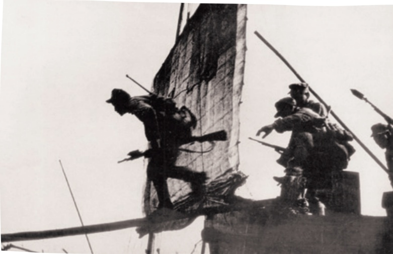
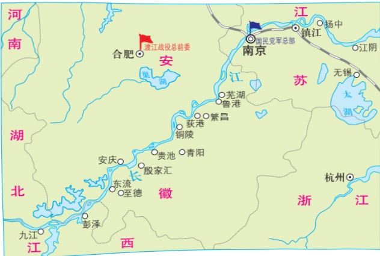

# 消息二则

**【学科】** 语文 | **【学段/年级】** 初中八年级 | **【册次】** volume_1 | **【单元】** 第一单元活动·探究  
**【作者/出处】** 毛泽东 | **【体裁类别】** 新闻消息

---

## 课文正文与教学内容

# 1 消息二则°

毛泽东

## 我三十万大军胜利南渡长江（一九四九年四月二十二日）

新华社长江前线二十二日二时电英勇的人民解放军二十一日已有大约三十万人渡过长江。渡江战斗于二十日午夜开始，地点在芜湖、安庆之间。国民党反动派经营了三个半月的长江防线，遇着人民解放军好似摧枯拉朽②，军无斗志，纷纷溃退。长江风平浪静，我军万船齐放，直取对岸，不到二十四小时，三十万人民解放军即已突破敌阵，

标题简明、醒目，概括性强。

黑体字是电头，正文第一句是导语，导语以下是消息的主体。

《百万雄师过大江》邹健东摄

---

时间、地点、人数及事件发展趋势等，叙述得准确而精要。

占领南岸广大地区，现正向繁昌、铜陵、青阳、获港、鲁港诸城进击中。人民解放军正以自己的英雄式的战斗，坚决地执行毛主席朱总司令的命令。

## 人民解放军百万大军横渡长江（一九四九年四月二十二日）

新华社长江前线二十二日二十二时电人民解放军百万大军，从一千余华里的战线上，冲破敌阵，横渡长江。西起九江（不含），东至江阴，均是人民解放军的渡江区域。二十日夜起，长江北岸人民解放军中路军首先突破安庆、芜湖线，渡至繁昌、铜陵、青阳、荻港、鲁港地区，二十四小时内即已渡过三十万人。二十一日下午五时起，我西路军开始渡江，地点在九江、安庆段。至发电时止，该路三十五万人民解放军已渡过三分之二，余部二十三日可渡完。这一路现已占领贵池、殷家

渡江战役主要作战地区

---

汇、东流、至德①、彭泽之线的广大南岸阵地，正向南扩展中。和中路军所遇敌情一样，我西路军当面之敌亦纷纷溃退，毫无斗志，我军所遇之抵抗，甚为微弱。此种情况，一方面由于人民解放军英勇善战，锐不可当；另一方面，这和国民党反动派拒绝签订和平协定，有很大关系。国民党的广大官兵一致希望和平，不想再打了，听见南京拒绝和平，都很泄气。战犯汤恩伯二十一日到芜湖督战，不起丝毫作用。汤恩伯认为南京、江阴段防线是很巩固的，弱点只存在于南京、九江一线。不料正是汤恩伯到芜湖的那一天，东面防线又被我军突破了。我东路三十五万大军与西路同日同时发起渡江作战。所有预定计划，都已实现。至发电时止，我东路各军已大部渡过南岸，余部二十三日可以渡完。此处敌军抵抗较为顽强，然在二十一日下午至二十二日下午的整天激战中，我已歼灭及击溃一切抵抗之敌，占领扬中、镇江、江阴诸县的广大地区，并控制江阴要塞，封锁长江。我军前锋，业已②切断镇江、无锡段铁路线。

## 读读写写

这里对西路军战况的描述，哪些地方体现了作者的态度?

晚间的消息，报道当天下午的战况，时效性很强。

