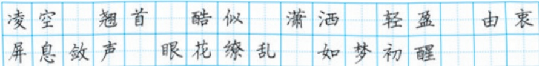

# 飞天凌空

# 4“飞天”凌空1

——跳水姑娘吕伟夺魁记

夏浩然 樊云芳

描写白云、飞鸟，既表现跳台的高，又衬出“飞天”的沉静。

连贯的跳水动作被分解成起跳、腾空、入水三个步骤，逐一描写，犹如慢镜头回放。

展现生动的画面，是新闻特写常用的写法。

她站在十米高台的前沿，沉静自若，风度优雅，白云似在她的头顶飘浮，飞鸟掠过她的身旁。这是达卡多拉游泳场的八千名观众一齐翘首②而望、屏息③敛声的一刹那。

轻舒双臂，向上举起，只见吕伟轻轻一蹬，就向空中飞去。一瞬间，她那修长美妙的身体犹如被空气托住了，衬着蓝天白云，酷似敦煌壁画中凌空翔舞的“飞天”。

紧接着，是向前翻腾一周半，同时伴随着旋风般的空中转体三周，动作疾如流星，又潇洒自如，1.7秒的时间对她似乎特别慷慨，让她从容不迫地展示身体优美的线条，从前伸的手指，一直延续到绷直的足尖。

还没等观众从眼花缭乱中反应过来，她已经展开身体，像轻盈的、笔直的箭，“哧”地插进碧波之中，几串白色的气泡拥抱了这位自天而降的仙女，四面水花则悄然④不惊。

“妙！妙极了！”站在我们旁边的一名外国记者跳了起来。这时，整个游泳场都沸腾了，如梦初

醒的观众用震耳欲聋的掌声和欢呼声，来向他们喜爱的运动员表达由衷的赞赏。

吕伟精彩的表演，将游泳场的气氛推向了高潮。她的这个动作“5136①”，让几位裁判亮出了9.5分的高分。

这位年方十六的中国姑娘，赢得了金牌。

当一个印度观众了解到这个姑娘是中国跳水集训队中最年轻的新秀时，惊讶不已。他说：“了不起，你们中国的人才太多了！”

## 读读写写

侧面描写，表达自豪之情。

## 什么是新闻特写

新闻特写，是指以形象化的描写作为主要表现手段，截取新闻事件中最具有价值、最生动感人、最富有特征的片段和部分予以放大，从而鲜明再现典型人物、事件、场景的一种新闻体裁。新闻特写兼有新闻和文学的特点，但由于其强调新闻性、时效性和真实性，所以更接近于通讯体裁。简要和迅速地报道新闻事实，是新闻特写与消息的共同点所在。二者差异在于，消息往往要报道新闻事件的全过程，新闻特写则主要描绘新闻事件中的片段。重视运用形象思维，采取多种文学手法，生动形象地报道新闻事实，是新闻特写与通讯的共同点所在。它们的差异在于，在报道同一新闻事实时，通讯一般展示新闻事件的纵剖面，来龙去脉比较完整；新闻特写则是集中笔力，主要展示新闻事件的某一横剖面，着重描写精彩瞬间，并且比通讯更强调时效性和现场感。

（摘自吴麟、张玉洪《新闻采访与写作》)
