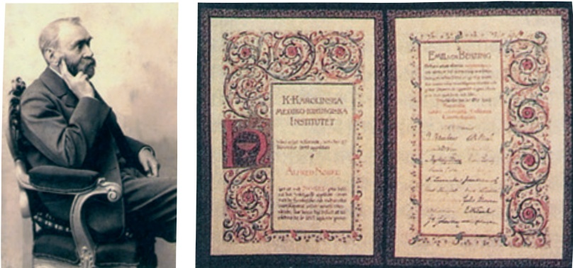
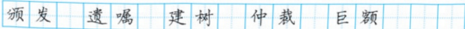

# 首届诺贝尔奖颁发

**【学科】** 语文 | **【学段/年级】** 初中八年级 | **【册次】** volume_1 | **【单元】** 第一单元活动·探究  
**【作者/出处】** 新华社 | **【体裁类别】** 新闻消息

---

## 课文正文与教学内容

## 3 首届诺贝尔奖颁发

关注电头和导语交代了哪些内容。

一一列举获奖者的国籍、姓名、所获奖项和主要成就，新闻事实表述简洁、准确。

明确颁奖机构、颁奖时间和地点。

路透社斯德哥尔摩1901年12月10日电 瑞典国王和挪威诺贝尔基金会今天首次颁发了诺贝尔奖。根据诺贝尔的遗嘱，诺贝尔奖每年发给那些在过去的一年里，在物理学、化学、生理学或医学、文学及和平事业方面为人类作出最大贡献的人。

今年诺贝尔奖的获得者有：德国的伦琴②（物理学奖)，他发现了X射线；荷兰的范托夫③（化学奖)，他发现了化学动力学定律和渗透压定律；德国的贝林④（生理学或医学奖），他在血清疗法的研究方面卓有成就；法国的普吕多姆⑤（文学奖)，他在诗歌创作方面颇有建树。诺贝尔和平奖的获得者有：瑞士的迪南⑥，他于1864年建立了红十字会；经济学家帕西⑦，他建立了促进国际仲裁的各国议会联盟。

从即日起，根据诺贝尔的遗嘱，诺贝尔奖由4个机构（瑞典3个，挪威1个）颁发，从按诺贝尔

---

遗嘱建立的基金中拨款。授奖仪式每年于12月10日诺贝尔逝世周年纪念日在瑞典的斯德哥尔摩和挪威的奥斯陆举行。

1867年，瑞典化学家诺贝尔发明了黄色炸药，以后又发明了多种炸药，这使他获得巨额收入。1896年诺贝尔逝世，这笔巨款用来设立诺贝尔奖金。他留下来的资金每年的利息将支付这5种诺贝尔奖金。诺贝尔基金会是这笔资金的合法拥有者，并管理这笔资金的投资，但与诺贝尔奖的评定无关。诺贝尔奖的评议权属于瑞典和挪威的诺贝尔奖评委会。

交代新闻背景，介绍诺贝尔奖金的来源。作者特别说明资金管理权和奖项评议权的分离，有什么用意?

诺贝尔

贝林的诺贝尔奖证书

---

# 4“飞天”凌空1

——跳水姑娘吕伟夺魁记

夏浩然 樊云芳

描写白云、飞鸟，既表现跳台的高，又衬出“飞天”的沉静。

连贯的跳水动作被分解成起跳、腾空、入水三个步骤，逐一描写，犹如慢镜头回放。

展现生动的画面，是新闻特写常用的写法。

她站在十米高台的前沿，沉静自若，风度优雅，白云似在她的头顶飘浮，飞鸟掠过她的身旁。这是达卡多拉游泳场的八千名观众一齐翘首②而望、屏息③敛声的一刹那。

轻舒双臂，向上举起，只见吕伟轻轻一蹬，就向空中飞去。一瞬间，她那修长美妙的身体犹如被空气托住了，衬着蓝天白云，酷似敦煌壁画中凌空翔舞的“飞天”。

紧接着，是向前翻腾一周半，同时伴随着旋风般的空中转体三周，动作疾如流星，又潇洒自如，1.7秒的时间对她似乎特别慷慨，让她从容不迫地展示身体优美的线条，从前伸的手指，一直延续到绷直的足尖。

还没等观众从眼花缭乱中反应过来，她已经展开身体，像轻盈的、笔直的箭，“哧”地插进碧波之中，几串白色的气泡拥抱了这位自天而降的仙女，四面水花则悄然④不惊。

“妙！妙极了！”站在我们旁边的一名外国记者跳了起来。这时，整个游泳场都沸腾了，如梦初
