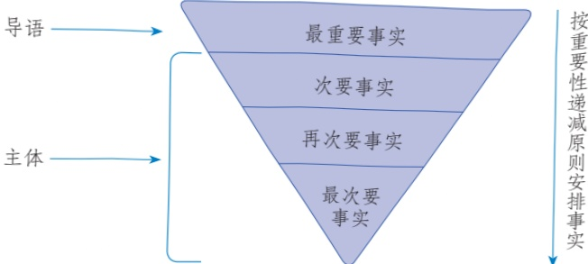
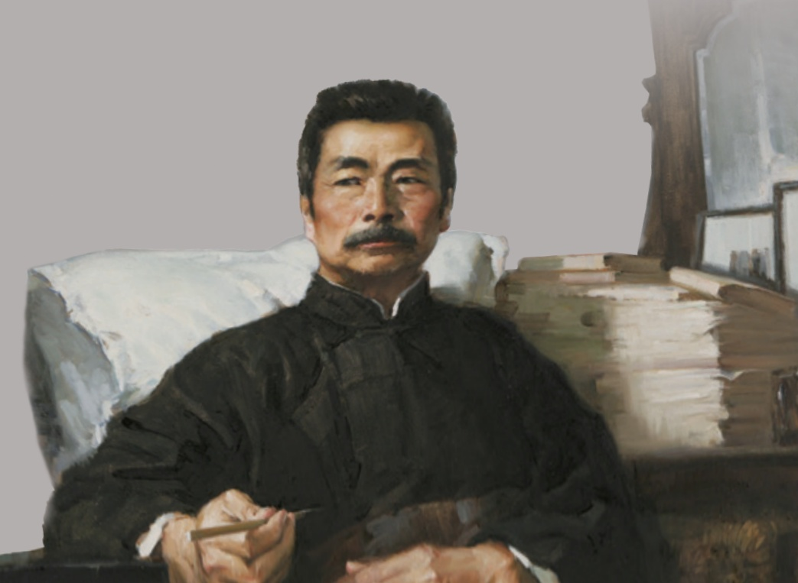

# 国行公祭，为佑世界和平

# 6国行公祭，为佑世界和平

钟声

“国行公祭，法立典章。铸兹宝鼎，祀我国殇②。”侵华日军南京大屠杀遇难同胞纪念馆集会广场上，国家公祭鼎铭文向世人讲述南京大屠杀史实，讲述设立国家公祭日的初衷。1937年12月13日，侵华日军野蛮侵入南京，随后制造了惨绝人寰③的南京大屠杀惨案，30多万中国同胞惨遭杀戮。南京的历史，人类的记忆。今天，第四个南京大屠杀死难者国家公祭日，中国再次以隆重的公祭仪式悼念死难同胞。中国人民永远牢记南京大屠杀历史，与全世界爱好和平与正义的人们共同维护和平。

《别让南京消失在人们的记忆中》，这是美国《波士顿环球邮报》近日发表的有关南京大屠杀长篇文章的标题。南京大屠杀发生80年后，全世界的正义之士仍在以不同方式纪念死难者。加拿大安大略省议会于2017年10月通过有关“设立南京大屠杀纪念日”的动议；美国圣迭戈市的图书馆举办活动，为民众讲述南京大屠杀史实；加利福尼亚州街头不久前落成的美国医生罗伯特·威尔逊④的纪念碑前摆满鲜花——东京审判时，他是南京大屠杀的第一位证人；在日本，由高中和大学老师组成的研究会建议将“南京大屠杀”等词语列入教科书……历史，不可能被忘却！

但人们也看到，在日本，右翼分子否认历史的态度仍然顽固。在连锁酒店大肆摆放美化侵略战争的书籍，大规模篡改③历史教材，阻止有良知的日本国民追寻事实真相；在美国旧金山市议会2017年9月一致通过设立“慰安妇日”的议案后，属于日本右翼的大阪市市长却表示，要解除大阪市与旧金山市的姐妹城市

关系……在南京大屠杀幸存者已不足100位的今天，日本右翼还在不断寻找各种借口对当年的军国主义罪行百般抵赖，扭曲历史，美化战争，颠倒黑白，并企图通过修宪复活军国主义。那些人以丑态百出的表演，妄图辱没人类的良知。

历史不会因时代变迁而改变，事实也不会因巧舌抵赖而消失。日本右翼越顽固，越会引起爱好和平的人们高度警惕。2017年11月，日内瓦裁军会议取消了日本和平演讲的资格；联合国人权理事会提出218项建议，狠批日本在历史问题上的态度，要求日本“正视历史，应努力向后代讲述真实的历史”。南京大屠杀，早已是所有正义力量的集体记忆，唯有日本右翼分子仍在梦中呓语。国家公祭日之长鸣警钟振聋发聩①，那些装睡梦游的罪恶灵魂无处遁形②。

80年，沧海桑田。1937年12月18日，《纽约时报》在一则报道中写道：“大规模抢劫、侵犯妇女、杀害平民……日军将南京变成了一座恐怖之城。”2017年9月，国际和平城市协会宣布，南京成为“国际和平城市”。国际和平城市协会项目执行会长弗雷德·阿门特指出，南京这座城市是第二次世界大战中饱受战火摧残的一个典型，如今成为国际和平城市后，方便全世界的人们更多地了解中华民族热爱、追求和平的悠久历史。

从“恐怖之城”到“和平之城”，南京的命运变迁足证和平是何等珍贵。中国早已成为具有保卫人民和平生活的坚强能力的伟大国家，矢志捍卫世界和平。铭记历史、缅怀先烈、珍爱和平、开创未来，中国一以贯之的和平誓言，彰显坚定的信念、磅礴的力量。

## 自读读写写

<html><body><table border="1"><tr><td></td><td></td><td></td><td></td><td></td><td></td><td></td><td></td><td></td><td></td><td></td><td></td><td></td><td></td><td></td><td></td><td></td><td></td></tr><tr><td></td><td></td><td></td><td></td><td></td><td></td><td></td><td></td><td></td><td></td><td></td><td></td><td></td><td></td><td></td><td></td><td></td><td></td></tr><tr><td></td><td></td><td></td><td></td><td></td><td></td><td></td><td></td><td></td><td></td><td></td><td></td><td></td><td></td><td></td><td></td><td></td><td></td></tr></table></body></html>

## 任务二

## 新闻采访

1.以小组为单位召开新闻采访准备会，确定报道题材，制订采访方案。报道的题材要有意义，有价值，彰显正能量，最好与同学们的生活密切相关，如学校的热点话题、家乡的最新变化、本地的重大事件等。可以结合“任务三”中的“自选任务”和“拓展任务”，在充分讨论后确定采访方案，明确组内分工，如了解事件的总体情况、采访事件亲历者、搜集相关资料、拍摄新闻照片、录制音视频等。既可以实地采访，也可以利用互联网进行远程采访。

2.草拟新闻采访提纲。采访提纲没有固定的格式，一般包括采访的时间、地点、对象、目的、方式、问题等。另外，还要注明采访需要的器材用具。采访提纲的主要内容是预先拟好的采访问题，所提问题要具体、客观、有针对性，问题之间要有一定的逻辑联系。可以读一些访谈文章，看一些相关视频（如电视台对各行各业榜样人物的专访），学习怎样设计和组织采访问题。

示例：

采访提纲

<html><body><table border="1"><tr><td>时间、地点</td><td>×月×日下午放学后，××中学教师办公室</td></tr><tr><td>采访对象</td><td>从教二十多年、深受学生爱戴的李老师</td></tr><tr><td>采访目的</td><td>了解李老师的工作经历和他对教育工作的感受、思考</td></tr><tr><td>采访方式</td><td>实地采访，深度访谈</td></tr></table></body></html>

续表

<html><body><table border="1"><tr><td>采访用具</td><td>纸、笔、相机（或手机）</td></tr><tr><td>采访问题 （示例）</td><td>（1）您怎样概括您的执教经历？在这二十多年中，有哪些人和事对 您产生了重要的影响？（请对方具体讲述） （2）很多同学都特别喜欢上您的课，您觉得主要是因为什么？ （3）从初上讲台至今，您对教育工作的认识有哪些变化？ （4）近年来，我国教育事业发展很快，您有什么具体的感受? （5）如果您的学生有志于成为教师，您会给他们哪些建议？</td></tr></table></body></html>

3.采访过程中，要尊重采访对象，注意言行得体。例如：不要强求采访对象回答不愿或不能回答的问题；拍摄人物照片或录制音视频时，要事先征得对方的同意。

4.采访结束后，要及时整理所获得的素材，理清头绪，去粗存精，为新闻写作作好准备。其中的一些关键信息，要认真核实，确保不出现错误或偏差。形成初稿后，可以将稿件交给采访对象过目，以便对方确认事实、明确观点、修正措辞。

## 任务三

## 新闻写作

1．必做任务。每位同学都要根据“任务二”中自己搜集的新闻素材，参考“技巧点拨”（见下页)，写一则消息。写完后，组内同学互相交流，修改完善。

2.自选任务。消息受篇幅、时效性等因素的限制，往往无法进行更为详尽的报道。因此，若想生动展现新闻场景、集中表现新闻人物、全面记述新闻事件，可以采用其他新闻体裁。每位同学从下面的体裁中任选其一，撰写新闻作品。

<html><body><table border="1"><tr><td>新闻特写</td><td>具体描述新闻事件中的某一场景，生动形象地展现新闻 现场</td></tr><tr><td>人物通讯</td><td>围绕新闻事件中的人物，报道其言行、事迹，展现人物的 精神</td></tr><tr><td>事件通讯</td><td>相对完整地记述新闻事件，展示其发展过程与社会意义</td></tr></table></body></html>

此外，也可以采写一些背景资料，呈现新闻事件的社会历史背景或深层原因；还可以记录主体事件之外的一些有价值或有趣味的新闻花絮。背景资料与新闻花絮可以帮助读者深入、细致地理解报道内容，提高其阅读新闻的兴趣。

3.拓展任务。有条件、有兴趣的同学，可以试着整合本组或全班同学的新闻作品，以恰当的方式编辑制作成报纸页面、新闻网页、短视频等。在编辑制作之前，可以预先设定发布媒介，根据自己对该媒介特点的了解，对文字、图片、音视频材料等进行组织、设计。要注意价值导向正确，重点突出，语言规范，图文并茂，版面美观，以优化传播效果。

技巧点拨

## 怎样写消息

消息是迅速、简要地报道新近发生的事件的一种新闻体裁，它最大的特点是真实客观和时效性强。本单元所选的消息，在今天看来已经成为“旧闻”，而在发表的当时，报道的都是刚刚发生的事，有很强的时效性。写作消息时有一些要点需要注意。

首先，要确定一个恰当的标题。标题要准确概括消息的主要内容，如《首届诺贝尔奖颁发》。标题还要尽可能重点突出，简洁醒目。如《我三十万大军胜利南渡长江》，“三十万”“胜利”“南渡”这些关键词，突出了消息中最具新闻价值的要素，很容易引起受众的关注。除单一标题外，很多消息还有引题或副题，它们分别位于正题前后，与正题配合，虚实互现，共同起到传递信息和吸引读者的作用。

其次，要合理安排正文的结构。消息的正文一般包括导语、主体、背景和结语四部分（后两部分有时暗含在主体中)。导语常用简要的文字，集中呈现最重要、最新鲜或最有特点的新闻事实，提示消息的要旨；也有一些新闻导语只呈现部分新闻事实，将其他一些关键内容安排在主体中。无论采用哪种写法，其目的都是吸引读者进一步阅读新闻。

主体是消息的主要部分。它承接导语，具体叙述新闻事实，提供更详尽的信息；有时还要阐述导语所揭示的主题，或回答导语中提出的问题。如《人民解放军百万大军横渡长江》的主体部分，具体介绍了三路大军勇往直前、敌军纷纷溃退的战况，还精要地分析了敌军惨败的原因，内容相当丰富。

消息正文的结构通常是按照重要性递减的原则安排的，即所谓“倒金字塔结构”。如《首届诺贝尔奖颁发》，导语部分集中讲述最重要的新闻事实，随着文章的展开，事实的重要性逐渐降低，相关的背景材料一般放在新闻事实的后面。这种结构的好处是关键信息集中，读来一目了然。

也有一些消息的写法相对自由，如《中国人首次进入自己的空间站》，标题中容纳较多的关键信息，正文按时间顺序展开，依次介绍新闻事件的始末。这样的结构脉络清楚，方便读者对事件的过程获得清晰、完整的印象。

再次，要写好导语。一般说来，导语是消息的核心，也是消息这一新闻体裁的重要特征。著名记者范长江说：“新闻写作对导语的要求很高，要写得有魅力，令老百姓看了非读不可。”甚至有学者认为：“写好导语等于写好了消息。”在写作时可以参考下列要求，反复琢磨。

<html><body><table border="1"><tr><td>导语写作要求</td><td>具体阐释</td></tr><tr><td>突出重点，吸引读者</td><td>舍弃可有可无的内容，突出关键信息，集中呈现最有新闻价 值、最受读者关注的新闻事实</td></tr><tr><td>言之有物，事实说话</td><td>要浓缩、概括新闻事实，但不能流于抽象、空洞，尽量用事 实而非概念来说话</td></tr><tr><td>简明扼要，开启全篇</td><td>要简洁明了，避免与主体部分重复，用精练的语言呈现精要 的内容，同时为整篇消息定下基调</td></tr><tr><td>形式多样，体现特色</td><td>可以直接陈述新闻事实，也可以在不违背新闻真实性的前提 下，表现场面，描写细节，渲染气氛，讲述故事</td></tr></table></body></html>

最后，要注意语言的准确、简练、易懂，在此基础上，可适当讲究生动形

象。准确，是指语言表述要与新闻事实本身高度吻合，不能夸大或缩小，也不能含糊其词。简练，是指在呈现新闻事实的时候要讲究语言干净利落，删去多余的文字。易懂，是指写消息时要有读者意识，考虑受众需求，尽量采用大众化的语言，不用生僻词语，少用专业术语。写完一则消息后，可以根据上述要求，修改文章的语言。要反复体会教科书中四则消息的语言特点，也可以关注身边的各种媒体，看看它们发布的消息的语言有什么特点。

值得注意的是，消息虽然有着比较固定的格式和写法，但它并不是简单的格式文本。好的消息往往能体现历史的发展，引领时代的方向，反映人民的愿望。新中国成立当天的一篇《开国大典》，成为几代中国人的集体记忆。《我登山队登上世界最高峰》《五星红旗首次插上南极洲》《我核潜艇水下发射运载火箭成功》等，曾让无数中国人激情澎湃，自豪不已。《我国钢产量跃居世界第一》《三峡工程大江截流胜利实现》《青藏铁路全线胜利建成通车》《我国大力加强和完善社会领域立法》《我国社会保障体系框架基本形成》等，记录了中华民族在各个领域改革创新、稳步发展的历程。《我国第二艘航空母舰下水》《中国北斗联天下》《我科学家刷新暗物质探测灵敏度》《我国所有贫困县全部脱贫》《复兴号奔向“未来之城”》《C919大型客机圆满完成首次商业飞行》等，让我们见证了新时代的中国踔厉奋发、勇毅前行的雄姿。

## 第二单元

历史不可“穿越”，却能在回忆性散文、传记中得以再现。本单元的课文，或深情回忆，叙述难忘的人与事；或心怀景仰，展现人物的品格与精神。它们是过往生活的记录，又可成为我们未来人生旅途中的宝贵财富。

学习本单元，要了解文中人物的经历与品格，丰富自己的生活体验，提升精神境界。阅读时，要把握文章内容真实、事件典型等特点，理解作者是怎样选择和组织材料，多角度、多层次地展现人物精神风貌的；还要学习用细节描写刻画人物的方法，品味风格多样的语言。

