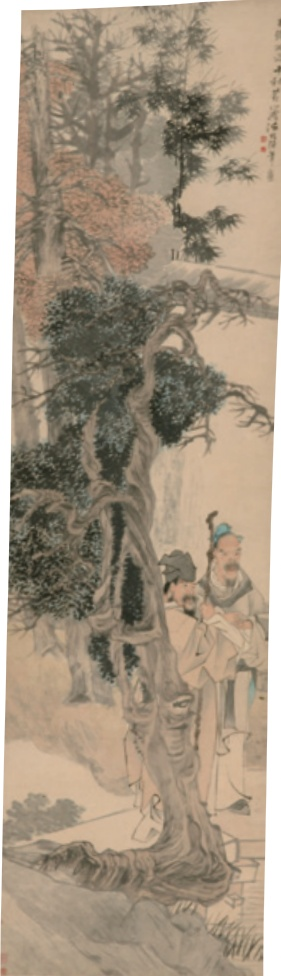

# 短文二篇（答谢中书书 / 记承天寺夜游）

**【学科】** 语文 | **【学段/年级】** 初中八年级 | **【册次】** volume_1 | **【单元】** 第三单元  
**【作者/出处】** 陶弘景、苏轼 | **【体裁类别】** 文言文

---

## 课文正文与教学内容

## 12 短文二篇

预习

面对风景，拥有发现美的眼光和感受美的心情，才能真正领会其中的美。默读课文，展开联想与想象，体会两位作者发现的美和寄寓的情。

朗读课文，体会两篇文章不同的语言风格。

## 答谢中书书①

陶弘景

山川之美，古来共谈。高峰入云，清流见底。两岸石壁，五色交晖②。青林翠竹，四时③俱备。晓雾将歇④，猿鸟乱鸣；夕日欲颓⑤，沉鳞⑥竞跃。实是欲界之仙都。自康乐③以来，未复有能与其奇者。

---

# ①

特

自日中盖⑨竹柏影也。何夜无月？何处无竹柏？但少闲人如吾两人者耳。

《承天夜游图》《承天夜游图》，【清】任伯年作【清】任伯年作

---

## 思考·探究·积累

一朗读并背诵课文。比较两篇短文在句式、节奏等方面的不同之处，说说它们分别带给你什么样的美感。

二《答谢中书书》所写的景物有什么特征？文章结尾说：“自康乐以来，未复有能与其奇者。”想一想，其中有什么言外之意?

三细读《记承天寺夜游》，体会作者的心境。结合写作背景和你对苏轼生平、思想的认识，谈谈对“闲人”的理解。

四解释下列加点的词，并体会其妙处。

1．山川之美，古来共谈

两岸石壁，五色交晖

青林翠竹，四时俱备

2.高峰入云，清流见底

晓雾将歇，猿鸟乱鸣

夕日欲颓，沉鳞竞跃

五从两篇短文中任选其一，发挥想象，将其改写成一篇白话散文。
