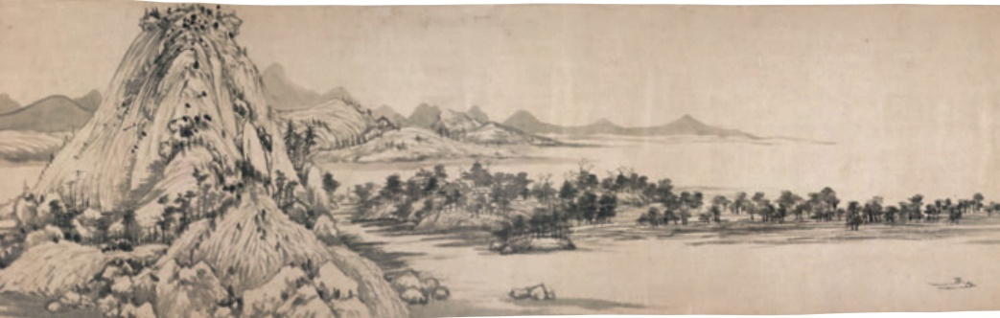
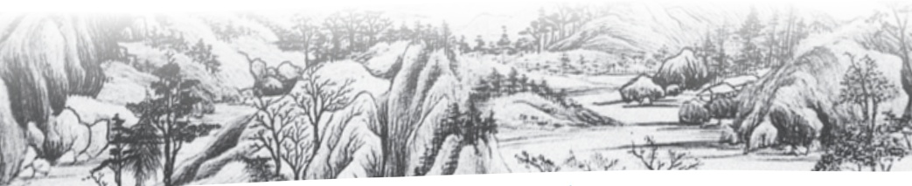

# 与朱元思书

**【学科】** 语文 | **【学段/年级】** 初中八年级 | **【册次】** volume_1 | **【单元】** 第三单元  
**【作者/出处】** 吴均 | **【体裁类别】** 文言文

---

## 课文正文与教学内容

# 与朱元思书?

吴均

## 阅读提示

本文是吴均写给友人的信的一部分，也是一篇精美的写景短文。作者用生花妙笔，为友人描绘出富春江的奇山异水，也写出自己面对美景的感受，意在劝友人放下争名夺利之心，忘情于天地大美之中。朗读课文，体会文中描绘的山水情境，陶冶自己的性情，把你的感受与同学分享。

风烟俱净，天山共色②。从流飘荡③，任意东西④。自富阳至桐庐一百许⑤里，奇山异水，天下独绝。

水皆缥碧⑥，千丈见底。游鱼细石，直视无碍。急湍甚箭⑦，猛浪若奔。

夹岸高山，皆生寒树，负势竞上，互相轩邈，争高直指，千百成峰。泉水激③石，泠泠④作响；好鸟相鸣，嘤嘤成韵。蝉则千转不穷，猿

---

则百叫无绝。鸢飞戾天①者，望峰息心②；经纶世务③者，窥谷忘反④。横柯5上蔽，在昼犹昏；疏条交映⑥，有时见日。

《富春山居图》(局部）〔元】黄公望作

## 思考·探究·积累

一朗读并背诵课文。说一说，文中所写的山水“独绝”在哪里?

二面对富春江的“奇山异水”，作者有什么样的感想？你如何理解这种感想?

三解释下列加点的词，并指出其用法。

1.任意东西

2.负势竞上

3.横柯上蔽

四吴均的《与施从事书》《与顾章书》和《与朱元思书》并称“吴均三书”，都是描写山水的名篇，学者钱锺书认为其成就可与《水经注》中的写景段落相提并论。阅读课文以外的两“书”，进一步体会吴均写景文章的特点。

---

## 14 唐诗五首

## 预习

唐代是诗歌的时代。唐诗流派众多，名家辈出，佳作迭现，是中国古代诗歌的巅峰。查找资料，熟悉有关唐诗的常识，了解本课五位诗人的生平和他们的文学成就。

反复诵读诗作，读出节奏与韵味，感受格律之美，领略五首诗的不同风格。

## 野望①

王绩

东皋②薄暮③望，徙倚④欲何依。树树皆秋色，山山唯落晖。牧人驱犊③返，猎马带禽⑥归。相顾无相识，长歌怀采薇⑦。

①选自《王绩集会校》（上海古籍出版社2023年版）。王绩（约589—644），字无功，号东皋子，绛州龙门（今山西河津）人，唐代诗人。

②〔东皋〕地名，今属山西万荣。作者弃官后隐居于此。皋，水边地。

③〔薄暮〕傍晚。薄，接近。

④〔徙倚〕徘徊。

⑤〔犊(dú)〕小牛。这里指牛群。⑥〔禽〕泛指猎获的鸟兽。

⑦〔采薇〕采食野菜。据《史记·伯夷列传》，商末孤竹君之子伯夷、叔齐在商亡之后，“不食周粟，隐于首阳山，采薇而食之”。后遂以“采薇”比喻隐居不仕。

《山水图》（局部）【明】董其昌作

