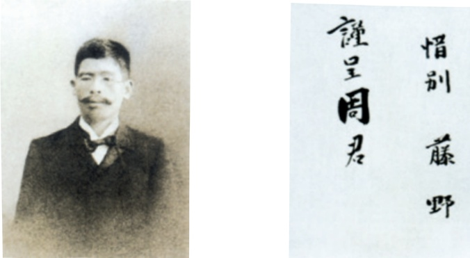

# 藤野先生

# 7藤野先生

鲁迅

预习

在鲁迅的人生中，有几位老师令他终生难忘，其中就包括三味书屋中的寿镜吾先生和本文所写的藤野先生。通读课文，看看作者笔下的藤野先生是一个什么样的人，他为什么“最使我感激”。

鲁迅作品的语言简洁、幽默，富于感情色彩，耐人寻味。阅读时宜放慢速度，细细体会。多读几遍，就能有所感受。

东京也无非是这样。上野②的樱花烂慢③的时节，望去确也像绯红的轻云，但花下也缺不了成群结队的“清国留学生”的速成班④，头顶上盘着大辫子，顶得学生制帽的顶上高高耸起，形成一座富士山⑤。也有解散辫子，盘得平的，除下帽来，油光可鉴⑥，宛如小姑娘的发髻一般，还要将脖子扭几扭。实在标致⑦极了。

中国留学生会馆的门房里有几本书买，有时还值得去一转；倘在上午，

里面的几间洋房里倒也还可以坐坐的。但到傍晚，有一间的地板便常不免要咚咚咚地响得震天，兼以满房烟尘斗乱①；问问精通时事②的人，答道，“那是在学跳舞。”

## 到别的地方去看看，如何呢?

我就往仙台③的医学专门学校去。从东京出发，不久便到一处驿站，写道：日暮里。不知怎地，我到现在还记得这名目。其次却只记得水户④了，这是明的遗民朱舜水⑤先生客死⑥的地方。仙台是一个市镇，并不大；冬天冷得利害⑦；还没有中国的学生。

大概是物以希③为贵罢。北京的白菜运往浙江，便用红头绳系住菜根，倒挂在水果店头，尊为“胶菜”；福建野生着的芦荟，一到北京就请进温室，且美其名曰“龙舌兰”。我到仙台也颇受了这样的优待，不但学校不收学费，几个职员还为我的食宿操心。我先是住在监狱旁边一个客店里的，初冬已经颇冷，蚊子却还多，后来用被盖了全身，用衣服包了头脸，只留两个鼻孔出气。在这呼吸不息的地方，蚊子竟无从插嘴，居然睡安稳了。饭食也不坏。但一位先生却以为这客店也包办囚人的饭食，我住在那里不相宜，几次三番，几次三番地说。我虽然觉得客店兼办囚人的饭食和我不相干，然而好意难却，也只得别寻相宜的住处了。于是搬到别一家，离监狱也很远，可惜每天总要喝难以下咽的芋梗汤。

从此就看见许多陌生的先生，听到许多新鲜的讲义。解剖学是两个教授分任的。最初是骨学。其时进来的是一个黑瘦的先生，八字须，戴着眼镜，挟着一叠大大小小的书。一将书放在讲台上，便用了缓慢而很有顿挫的声调，向

学生介绍自己道：

“我就是叫作藤野严九郎的……”

后面有几个人笑起来了。他接着便讲述解剖学在日本发达的历史，那些大大小小的书，便是从最初到现今关于这一门学问的著作。起初有几本是线装的；还有翻刻中国译本的，他们的翻译和研究新的医学，并不比中国早。

那坐在后面发笑的是上学年不及格的留级学生，在校已经一年，掌故①颇为熟悉的了。他们便给新生讲演每个教授的历史。这藤野先生，据说是穿衣服太模胡②了，有时竟会忘记带③领结；冬天是一件旧外套，寒颤颤的，有一回上火车去，致使管车的疑心他是扒手，叫车里的客人大家小心些。

他们的话大概是真的，我就亲见他有一次上讲堂没有带领结。

过了一星期，大约是星期六，他使助手来叫我了。到得研究室，见他坐在人骨和许多单独的头骨中间，—他其时正在研究着头骨，后来有一篇论文在本校的杂志上发表出来。

“我的讲义，你能抄下来么？”他问。

“可以抄一点。”

“拿来我看！”

我交出所抄的讲义去，他收下了，第二三天便还我，并且说，此后每一星期要送给他看一回。我拿下来打开看时，很吃了一惊，同时也感到一种不安和感激。原来我的讲义已经从头到末，都用红笔添改过了，不但增加了许多脱漏的地方，连文法的错误，也都一一订正。这样一直继续到教完了他所担任的功课：骨学，血管学，神经学。

可惜我那时太不用功，有时也很任性。还记得有一回藤野先生将我叫到他的研究室里去，翻出我那讲义上的一个图来，是下臂的血管，指着，向我和蔼的说道：

“你看，你将这条血管移了一点位置了。—一自然，这样一移，的确比较的好看些，然而解剖图不是美术，实物是那么样的，我们没法改换它。现在我

给你改好了，以后你要全照着黑板上那样的画。”

但是我还不服气，口头答应着，心里却想道：

“图还是我画的不错；至于实在的情形，我心里自然记得的。”

学年试验①完毕之后，我便到东京玩了一夏天，秋初再回学校，成绩早已发表了，同学一百余人之中，我在中间，不过是没有落第②。这回藤野先生所担任的功课，是解剖实习和局部解剖学。

解剖实习了大概一星期，他又叫我去了，很高兴地，仍用了极有抑扬的声调对我说道：

“我因为听说中国人是很敬重鬼的，所以很担心，怕你不肯解剖尸体。现在总算放心了，没有这回事。”

但他也偶有使我很为难的时候。他听说中国的女人是裹脚的，但不知道详细，所以要问我怎么裹法，足骨变成怎样的畸形，还叹息道，“总要看一看才知道。究竟是怎么一回事呢？”

有一天，本级的学生会干事到我寓里来了，要借我的讲义看。我检出来交给他们，却只翻检了一通，并没有带走。但他们一走，邮差就送到一封很厚的信，拆开看时，第一句是：

“你改悔罢！”

这是《新约》上的句子罢，但经托尔斯泰③新近引用过的。其时正值日俄战争④，托老先生便写了一封给俄国和日本的皇帝的信⑤，开首便是这一句。日本报纸上很斥责他的不逊⑥，爱国青年也愤然，然而暗地里却早受了他的影响了。其次的话，大略是说上年解剖学试验的题目，是藤野先生在讲义上做

了记号，我预先知道的，所以能有这样的成绩。末尾是匿名①。

我这才回忆到前几天的一件事。因为要开同级会，干事便在黑板上写广告，末一句是“请全数到会勿漏为要”，而且在“漏”字旁边加了一个圈。我当时虽然觉到圈得可笑，但是毫不介意，这回才悟出那字也在讥刺我了，犹言②我得了教员漏泄出来的题目。

我便将这事告知了藤野先生；有几个和我熟识的同学也很不平，一同去诘责③干事托辞④检查的无礼，并且要求他们将检查的结果，发表出来。终于这流言消灭了，干事却又竭力运动，要收回那一封匿名信去。结末是我便将这托尔斯泰式的信退还了他们。

中国是弱国，所以中国人当然是低能儿，分数在六十分以上，便不是自己的能力了：也无怪他们疑惑。但我接着便有参观枪毙中国人的命运了。第二年添教霉菌学，细菌的形状是全用电影⑤来显示的，一段落已完而还没有到下课的时候，便影⑥几片时事的片子，自然都是日本战胜俄国的情形。但偏有中国人夹在里边：给俄国人做侦探，被日本军捕获，要枪毙了，围着看的也是一群中国人；在讲堂里的还有一个我。

“万岁！”他们都拍掌欢呼起来。

这种欢呼，是每看一片都有的，但在我，这一声却特别听得刺耳。此后回到中国来，我看见那些闲看枪毙犯人的人们，他们也何尝不酒醉似的喝采⑦，——呜呼，无法可想！但在那时那地，我的意见却变化了。

到第二学年的终结，我便去寻藤野先生，告诉他我将不学医学，并且离开这仙台。他的脸色仿佛有些悲哀，似乎想说话，但竟没有说。

“我想去学生物学，先生教给我的学问，也还有用的。”其实我并没有决意

要学生物学，因为看得他有些凄然，便说了一个慰安他的谎话。

“为医学而教的解剖学之类，怕于生物学也没有什么大帮助。”他叹息说。

将走的前几天，他叫我到他家里去，交给我一张照相①，后面写着两个字道：“惜别”，还说希望将我的也送他。但我这时适值②没有照相了；他便叮嘱a 

藤野先生的照片和手迹

我离开仙台之后，就多年没有照过相，又因为状况也无聊，说起来无非使他失望，便连信也怕敢写了。经过的年月一多，话更无从说起，所以虽然有时想写信，却又难以下笔，这样的一直到现在，竟没有寄过一封信和一张照片。从他那一面看起来，是一去之后，查无消息③了。

但不知怎地，我总还时时记起他，在我所认为我师的之中，他是最使我感激，给我鼓励的一个。有时我常常想：他的对于我的热心的希望，不倦的教诲，小而言之，是为中国，就是希望中国有新的医学；大而言之，是为学术，就是希望新的医学传到中国去。他的性格，在我的眼里和心里是伟大的，虽然他的姓名并不为许多人所知道。

他所改正的讲义，我曾经订成三厚本，收藏着的，将作为永久的纪念。不幸七年前迁居④的时候，中途毁坏了一口书箱，失去半箱书，恰巧这讲义也遗

失在内①了。责成运送局去找寻，寂无回信。只有他的照相至今还挂在我北京寓居②的东墙上，书桌对面。每当夜间疲倦，正想偷懒时，仰面在灯光中瞥见他黑瘦的面貌，似乎正要说出抑扬顿挫的话来，便使我忽又良心发现，而且增加勇气了，于是点上一枝③烟，再继续写些为“正人君子④”之流所深恶痛疾⑤的文字。

十月十二日

## 思考·探究·积累

一本文是一篇回忆性散文。看看文章记录了作者留学期间的哪几件事，试为每件事拟一个小标题。

二阅读课文中作者与藤野先生交往的部分，结合“但不知怎地……”一段，说说为什么“他的性格，在我的眼里和心里是伟大的”。

三作者在回忆藤野先生的同时，还用不少篇幅写与藤野先生无关的见闻和感受，你认为这两部分内容之间有什么样的关系?

四鲁迅非常重视文章的修改。仔细比较下面的原稿和改定稿，谈谈这些修改好在哪里。

<html><body><table border="1"><tr><td>原稿</td><td>改定稿</td></tr><tr><td>上野的樱花烂慢的时节，望去确也像 绯红的轻云，但也缺不了“清国留学 生”的速成班……</td><td>上野的樱花烂熳的时节，望去确也像 绯红的轻云，但花下也缺不了成群结 队的“清国留学生”的速成班……</td></tr><tr><td>但到傍晚，地板便常不免要咚咚地响 得震天，兼以满房烟尘斗乱；问问 熟识时事的人，答道，“那是在学跳 舞。”</td><td>但到傍晚，有一间的地板便常不免要 咚咚咚地响得震天，兼以满房烟尘斗 乱；问问精通时事的人，答道，“那 是在学跳舞。”</td></tr></table></body></html>

④〔正人君子〕这里是反语，讽刺那些为军阀政

客张目而自命为“正人君子”的文人。

⑤〔深恶（wù）痛疾〕厌恶、痛恨到了极点。

疾，痛恨。

⑥〔十月十二日〕指1926年10月12日。

<html><body><table border="1"><tr><td>原稿</td><td>改定稿</td></tr><tr><td>……似乎正要说出抑扬顿挫的话来， 便使我忽又良心发现，再继续写些为 “正人君子”之流所深恶痛疾的文字。</td><td>……似乎正要说出抑扬顿挫的话来， 便使我忽又良心发现，而且增加勇气 了，于是点上一枝烟，再继续写些为 “正人君子”之流所深恶痛疾的文字。</td></tr></table></body></html>

五“弃医从文”是鲁迅人生中的重大选择之一，除了课文，还有一些文章对此也有记述，如《呐喊〉自序》。课后查找相关资料，读一读，加深对鲁迅这一人生选择的理解。联系实际，说说鲁迅的选择给了你哪些启示。

## 自读读写写

<html><body><table border="1"><tr><td></td><td></td><td></td><td></td><td></td><td></td><td></td><td></td><td></td><td></td><td></td><td></td><td></td><td></td><td></td><td></td><td></td><td></td></tr><tr><td>挟</td><td></td><td></td><td></td><td></td><td></td><td></td><td></td><td></td><td></td><td></td><td></td><td></td><td></td><td></td><td></td><td></td><td></td></tr><tr><td></td><td></td><td></td><td></td><td></td><td></td><td></td><td></td><td></td><td></td><td></td><td></td><td></td><td></td><td></td><td></td><td></td><td></td></tr><tr><td></td><td></td><td></td><td></td><td></td><td></td><td></td><td></td><td></td><td></td><td></td><td></td><td></td><td></td><td></td><td></td><td></td><td></td></tr></table></body></html>

## 许寿裳谈鲁迅“弃医从文”

鲁迅在弘文学院的时候，常常和我讨论下列三个相关的大问题：

一、怎样才是最理想的人性?

二、中国国民性中最缺乏的是什么？

三、它的病根何在？

他对这三大问题的研究，毕生孜孜不懈，后来所以毅然决然放弃学医而从事于文艺运动，其目标之一，就是想解决这些问题，他知道即使不能骤然得到全部解决，也求于逐渐解决上有所贡献。因之，办杂志、译小说，主旨重在此；后半生的创作数百万言，主旨也重在此。

（摘自许寿裳《亡友鲁迅印象记》)
