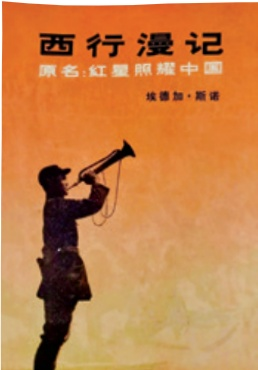
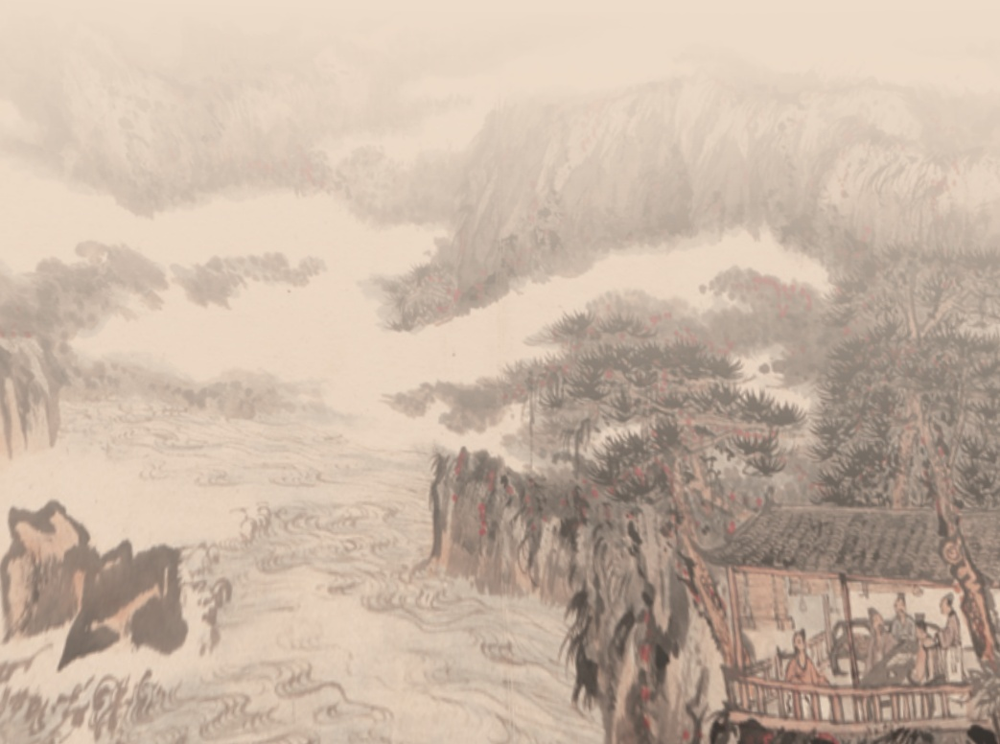

# 写作 实践

喜。闲时喜养花，不得其法，每每有叶无花，亦不忍弃。书无所不读，全无所获，并不着急。教书做事，均甚认真，往往吃亏，亦不后悔。如是而已，再活四十年也许能有点出息！

这里不仅介绍了外貌、籍贯、职业、家庭组成等基本情况，更结合个人主要经历，集中表现自己的特长爱好、性格特点、行事风格等，语言幽默生动，很有表现力。文章很短，内容却全面、充实而又重点突出。

## 写作实践

从呱呱坠地到成长为一个少年学生，你已经有了十多年的人生经历。回顾过往，有利于更好地成长。写一段自我介绍，说说自己过去的经历。300字左右。

## 提示：

1.写清楚自己的出生日期、出生地等基本信息。

2.选取自己生活经历中的重要事情，体现自己的性格特点、兴趣爱好。

3.写完后与家人、朋友交流，并请大家提出修改建议。

二你和家人朝夕相处，感情深厚，但你知道他们的爱好、经历吗？请为你的一位家人写一篇小传，看看通过写小传，你是不是对他有了更多的认识、更深的理解。不少于500字。

## 提示：

1.与你要写的家人深入交流，进一步了解他的生活经历。

2.既要有概括性的介绍，也要选择几个重要事件，描写言行细节，使人物有血有肉，形象丰满。

3.写完后给传主看一看或读给他听，听听他的意见，作些修改。

三各学科的学习，都会涉及一些中华民族的杰出人物。这些人物促进了文明的发展，推动了社会的进步，值得中华儿女永远铭记。学校拟编辑一部

《中华英杰谱》，面向全校学生征稿。请你选择一位杰出人物，为他写一篇小传。不少于500字。

## 提示：

1.利用多种途径搜集传主的资料，理清传主的生平。

2.选择对传主思想个性或人生发展有重要影响的事件，体现人物的独特魅力。

3.写作完成后在班级进行交流，并根据班级拟定的评价标准，选出大家普遍认可的5~10篇作品，以班级为单位向学校投稿。

## 孙犁谈传记写作

写传记，都知看重第一手材料。即个人观察所得，眼见是实的材料。这种材料，是不易得到的。即使调查来的材料，也还有个剪裁取舍的问题，不一定完全可靠。至于文献记载，就更应该有所鉴别。过去，人物传记，有所谓家乘（shèng),即本人家族保存的材料；有所谓弟子记，即他的门人记录的材料；有所谓碑传，即死后刻在墓碑上的文字。这些材料，还都不能叫作传记，其中有很多不实之处。历史家把这些材料，都看作第二手材料，加以取舍。作者还要实地考察。直接观察以求更可靠的印象和材料。司马迁世为史官，掌握着不少文字材料，但他在写作《史记》之先，还是要出去旅行，访问故老，收集传闻。

（摘自孙犁《与友人论传记》)

# 《红星照耀中国》怎样读红色经典作品

我们的美国朋友斯诺是第一个进入我们共产党领导的民主根据地的，也是第一个了解我们的外国人。他是个新闻记者，把我们根据地的情况介绍给全世界，包括国民党统治区的中国人民，使他们了解了共产党是什么性质的政党，红军的奋斗目标是什么，共产党的主张和政策是什么。

——邓颖超

《红星照耀中国》始终是许多国家的畅销书。直到作者去世以后，它仍然是国外研究中国问题的首要的通俗读物。

——胡愈之

1927年4月12日，以蒋介石为首的国民党右派发动了反革命政变，大肆迫害屠杀共产党员、国民党左派和革命群众。此后，与中国共产党、红军有关的消息被严密封锁。正如美国记者埃德加·斯诺所形容的那样，“红军在地球上人口最多的国度的腹地进行着战斗，九年以来一直遭到铜墙铁壁一样严密的新闻封锁而与世隔绝”，苏区和红军的存在成了一个难解的谜。有太多的疑问在斯诺心头盘旋，他很想弄清这样一些问题：“中国共产党人究竟是什么样的人？”“有什么不可动摇的力量推动他们豁出性命去拥护这种政见呢？”“他们的运动的革命基础是什么？是什么样的希望，什么样的目标，什么样的理想，使他们成为顽强到令人难以置信的战士的呢？”“共产党怎样穿衣？怎样吃饭？怎样娱乐？怎样恋爱？怎样工作？”

为了解开这些谜，给萦绕在心头的问题找到答案，1936年，埃德加·斯诺冒着生命危险，穿越重重封锁，深入保安（今陕西省志丹县），深入根据地，深入西方媒体眼中的“土匪聚集的地方”，切实了解中国共产党人的生活经历和革命精神。后来，他根据采访和考察得来的第一手资料，写成了《红星

照耀中国》（RED STAROVER CHINA，当时为了在已沦陷的上海出版方便，曾以《西行漫记》为书名)。此书一问世便引起轰动，1937年在伦敦首次出版，几个星期内就加印了5次，销售10万册以上。

《红星照耀中国》的意义，首先在于它通过一个外国人的所见所闻，客观地向全世界报道了共产党和红军的真实情况，使西方人更多地了解到中国共产党人的真实生活。在陕北，斯诺采访了众多共产党领袖和红军将领，如毛泽东、周恩来、彭德怀、林伯渠、邓发、徐海东等。他描述他们的言谈举止，追溯他们的家庭背景和青少年时代，试图从其出身和成长经历中，找寻他们成为共产党人的原因。通过访谈与对话，他还搜集到大量有关长征的第一手资料，并在作品中描述了中国工农红军长征的经过，向全世界报道了这一举世无双的壮举。此外，他还深入红军战士和根据地老百姓之中，对共产党的基本政策、军事策略，红军战士的生活，以及陕北根据地的社会制度、货币政策、工业和教育等情况作了广泛的调查，为全世界解答了“红军没有任何大工业基地，没有大炮，没有毒气，没有飞机，没有金钱，也没有现代技术，他们是怎样生存下来并扩大了自己的队伍”的疑问。

《红星照耀中国》的意义，还在于书中不仅记录了考察所得的第一手资料，而且深入分析和探究了“红色中国”产生、发展的原因，对中国共产党和中国革命作了客观的评价。作者从多个方面展示中国共产党为民族解放而艰苦奋斗和牺牲奉献的崇高精神，瓦解了种种歪曲、丑化共产党的谣言。这本书以毋庸置疑的事实向全世界宣告：中国共产党及其领导的红色革命犹如一颗闪亮的红星，不仅照耀着中国的西北，而且必将照耀全中国。事实证明，这一预言是非常有远见的。

在采访和考察的同时，斯诺还拍摄了大量关于陕北的照片，为后人留下了许多珍贵的影像资料，如毛泽东头戴八角帽的半身像，一直广为流传。

## 阅读指导

红色经典作品记录着中国共产党的光辉历史，承载着光荣的革命传统。阅读红色经典，能帮助我们了解在过去一百多年里，党团结带领全国各族人民为

争取民族独立、人民解放和实现国家富强、人民幸福而不懈奋斗的伟大历程，有助于我们传承红色基因，赓续红色血脉，坚定为实现中华民族伟大复兴而奋斗的信心。

阅读红色经典，要自觉接受革命精神的熏陶感染，净化、丰富自身的精神世界。红色经典因其题材的特殊性，有着深刻的教育意义和强烈的鼓舞作用，是我们接受革命传统教育的宝贵资源。伟大建党精神、井冈山精神、长征精神、延安精神、抗战精神、红岩精神等中国共产党的伟大精神，是红色经典的精髓，需要我们在阅读中悉心领会。《铁道游击队》中的刘洪，《红日》中的沈振新，《林海雪原》中的少剑波、杨子荣，《红旗谱》中的朱老忠，《红岩》中的江姐、许云峰……数不胜数的英雄形象，成为几代中国人的精神偶像。在阅读红色经典时，要认真体会英雄们对理想信念的坚守、对革命事业的忠诚,学习他们英勇顽强、积极乐观、不畏艰难、视死如归的品质，感受他们独特的人格魅力，从经典中汲取精神营养，涵养自身的浩然正气。

阅读红色经典，应借助历史知识去还原历史情境、把握时代特点。许多作品是以重大历史事件为题材的，体现出对特定历史阶段中时代精神的准确洞察和深刻把握。如《红星照耀中国》，介绍了红军的创立、革命根据地的斗争和二万五千里长征，让全世界看到了红军将领及普通战士的成长历程和精神品格。阅读作品时，可以结合在历史课上了解到的有关土地革命斗争和长征的内容，丰富自己对书中相关内容的认知，深化对革命斗争的意义和长征精神的理解。

阅读红色经典，要注意体会作品的艺术特色。红色经典往往有“文艺为人民大众服务”的自觉意识，善于汲取传统文化和民间文艺的精华，采用人民群众喜闻乐见的写作形式，语言通俗，故事性强，且富于抒情意味。可以和同学组织读书活动，通过诵读作品精华、宣讲英雄故事、编演情景剧、分享读书心得等形式，传达红色经典鼓舞人心的独特魅力。

## 阅读任务

## 任务1：为革命者写小传

从《红星照耀中国》一书介绍的众多革命者中选择一位，梳理书中关于他的内容，如家庭出身、成长经历、投身革命的缘由、在革命中的贡献，以及外貌言谈、性格气度等。根据梳理的内容，为他写一篇小传。

## 任务2：制作“长征图册”

小组合作，梳理《红星照耀中国》中有关长征的内容，制作一本长征图册。根据书中内容和历史课的相关知识，在地图上描画红军长征的路线，标出“突破湘江”“遵义会议”“四渡赤水”“飞夺泸定桥”“过雪山草地”“三大主力会师”等重大事件的发生地，将这幅地图作为图册的首页。根据在地图上作的标注，搜集整理与长征中重大事件有关的历史照片或美术作品等，并附上自己撰写的说明文字（或摘抄书中的相关语句），作为图册的主体内容。图册完成后，向全班同学展示。

## 任务3：举办读书分享会

《红星照耀中国》展现了众多革命者形象，讲述了革命历程中许多可歌可泣的事迹。读完这部作品，你是不是对革命精神有了更深的体悟？有没有从光辉历史中获得前进的动力？可以举办一次读书分享会，围绕“中国共产党人的革命信仰”“长征精神的内涵”“当代青少年如何传承长征精神”等话题，谈谈你的阅读体会和获得的启示。

## 第三单元

“山川之美，古来共谈。”自然山水，或清幽，或雄奇，或秀丽，均显造化之妙；深入其中，总能让人流连忘返，引起无限的情思。古代诗文中有很多歌咏山水的优美篇章，阅读这类作品，可以获得美的享受，净化心灵，陶冶情操。

学习本单元课文，要借助注释和工具书，整体把握文章大意，感受文言之美。要反复诵读，体会古诗文的韵律；借助联想和想象，进入诗文的意境，领略山川风物之灵秀，理解作者寄寓其中的情怀；还要注意积累常见的文言实词、虚词。

