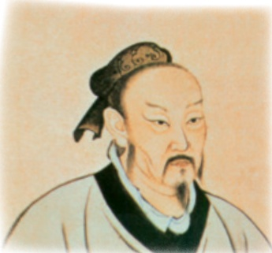

# 《孟子》三章

**【学科】** 语文 | **【学段/年级】** 初中八年级 | **【册次】** volume_1 | **【单元】** 第六单元  
**【作者/出处】** 孟子 | **【体裁类别】** 文言文

---

## 课文正文与教学内容

## 阅读

## 23 《孟子》三章

孟子

## 预习

孟子是继孔子之后的儒家学派的代表人物，被尊称为“亚圣”。查找资料，了解孟子其人和他所处的时代。

借助注释，通读课文，了解大意。

## 得道多助，失道寡助

天时不如地利，地利不如人和。三里之城②，七里之郭，环③而攻之而不胜。夫环而攻之，必有得天时者矣，然而不胜者，是天时不如地利也。城非不高也，池④非不深也，兵革⑤非不坚利也，米粟非不多也，委而去之⑥，是地利不如人和也。故曰：域民不以封疆之界⑦，固国不以山溪之险③，威天下不以

---

兵革之利①。得道②者多助，失道者寡助。寡助之至③，亲戚④畔⑤之；多助之至，天下顺之。以天下之所顺，攻亲戚之所畔，故君子有不战，战必胜矣⑥。

## 富贵不能淫

景春⑦曰：“公孙衍、张仪⑨岂不诚大丈夫哉？一怒而诸侯惧，安居而天下熄。”

孟子曰：“是焉③得为大丈夫乎？子未学礼乎？丈夫之冠④也，父命之；女子之嫁也，母命之，往送之门，戒⑥之曰：往之女家⑩，必敬必戒，无违夫子！’以顺为正者，妾妇之道也。居天下之广居，立天下之正位，行天下之大道②。得志，与民由之；不得志，独行其道。富贵不能淫③，贫贱不能移，威武不能屈。此之谓大丈夫。”

---

## 生于忧患，死于安乐

舜发于畎亩之中①，傅说举于版筑之间②，胶鬲举于鱼盐之中③，管夷吾举于士④，孙叔敖举于海⑤，百里奚举于市⑥。故天将降大任于是人也，必先苦其心志，劳其筋骨，饿其体肤⑦，空乏其身③，行拂乱其所为③，所以动心忍性，曾益其所不能。

人恒过，然后能改；困于心，衡于虑③，而后作④；征于色，发于声，而后喻。人则无法家拂士，出则无敌国外患者，国恒亡。然后知生于忧患而死于安乐也。
