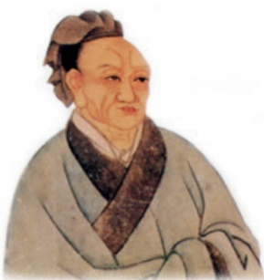

# 愚公移山

**【学科】** 语文 | **【学段/年级】** 初中八年级 | **【册次】** volume_1 | **【单元】** 第六单元  
**【作者/出处】** 《列子》 | **【体裁类别】** 文言文/神话寓言

---

## 课文正文与教学内容

## 思考·探究·积累

文中人物对愚公移山的态度是不同的。找出相关语句，简析他们的态度。

二这则寓言记叙了一件“改天换地”的事情，描写了两个对比鲜明的人物。熟读并背诵课文，想一想它的寓意是什么。和同学讨论交流。

三翻译下面的句子，体会智叟和愚公两人对话背后的心理。

1.甚矣，汝之不惠！以残年余力，曾不能毁山之一毛，其如土石何？

2.子子孙孙无穷匮也，而山不加增，何苦而不平？

四解释下列加点的词。

1.年且九十2.指通豫南，达于汉阴

且焉置土石争高直指，千百成峰

3.寒暑易节，始一反焉4.河曲智叟笑而止之曰

若止印三二本，未为简易身已半入，止露尻尾

5.何苦而不平6.帝感其诚

必先苦其心志公孙衍、张仪岂不诚大丈夫哉

五在中国共产党第七次全国代表大会的闭幕式上，毛泽东同志发表讲话，号召全党学习愚公精神，与全国人民一道挖掉帝国主义和封建主义两座大山。这篇闭幕词在收入《毛泽东选集》时，取题为《愚公移山》。课外阅读这篇文章，联系课文，说说你对愚公移山的寓言有了哪些进一步的认识。

---

# 25周亚夫军细柳

司马迁

司马迁

## 阅读提示

《史记》是我国的第一部纪传体通史，对后世的史书编纂有深远的影响。选自《史记》的这篇课文，主要记叙汉文帝到周亚夫的细柳营慰问军士的事。周亚夫没有迎接天子，最后才露面，且只说了一句话。然而，汉文帝出军门后不由得说“此真将军矣”，赞赏有加。阅读课文，相信你也会深深地被这位将军折服。

文帝之后六年②，匈奴大入边③。乃以宗正④刘礼为将军，军霸上⑤；祝兹侯徐厉为将军，军棘门⑦；以河内守③亚夫为将军，军细柳：以备胡。

---

上自劳军①。至霸上及棘门军②，直驰入，将以下骑送迎。已而③之细柳军，军士吏被⑤甲，锐兵刃⑥，彀弓弩⑦，持满。天子先驱至，不得入。先驱曰：“天子且至！”军门都尉曰：“将军令曰军中闻将军令，不闻天子之诏②’。”居无何，上至，又不得入。于是上乃使使持节④诏将军：“吾欲入劳军。”亚夫乃传言开壁门。壁门士吏谓从属车骑曰：“将军约，军中不得驱驰。”于是天子乃按辔徐行。至营，将军亚夫持兵揖曰：“介胄之士不拜，请以军礼见。”天子为动，改容式车。使人称谢：“皇帝敬劳将军。”成礼而去。

既出军门，群皆惊。文帝曰：“嗟乎，此真将军矣！曩者霸上、棘门军，若儿戏耳，其将固可袭而虏也。至于亚夫，可得而犯邪！”称善者久之。

## 思考·探究·积累

熟读课文，简要复述文中的故事。想一想汉文帝为什么称周亚夫“真将军”，与同学交流。

二《史记》写人时常“用两种突出的性格或两种不同的情势，抑或两种不同的结果，作为对照”（李长之)。细读课文，说说文中哪些地方使用了对比、衬托的写法，对刻画人物起到了什么样的作用。
