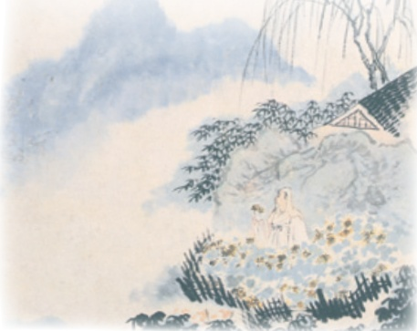

# 诗词五首

## 26 诗词五首

预习

 阅读这五首诗词，初步体会它们各自蕴含的情感。查找五位作者的生平资料，试着结合背景理解作品。

 这五首作品，有古体诗、近体诗，也有词。反复诵读，体会它们不同的韵律特点。

## 饮酒（其五）①

陶渊明

结庐②在人境③，而无车马喧。问君何能尔④？心远地自偏。采菊东篱下，悠然⑤见南山。山气⑥日夕佳，飞鸟相与还。此中有真意，欲辨已忘言

《悠然见南山》【清】石涛作

①选自《陶渊明集校笺（修订本）》卷三（上海古籍出版社2019年版）。《饮酒》是一组五言古诗，共20首，写于作者辞官归隐之后。作者在这组诗的小序中说自己“闲居寡欢……偶有名酒，无夕不饮……既醉之后，辄题数句自娱”。诗作多写饮酒后的所思所感，往往以咏史、咏物、写景的形式来表现。

②〔结庐〕建造房舍。结，建造、构筑。

③〔人境〕尘世。

④〔尔〕如此，这样。

⑤〔悠然〕闲适淡泊的样子。

⑥〔山气〕山间的云气。

⑦〔日夕〕傍晚。

⑧〔忘言〕心中领会真意，不必用语言表达。

## 春望①

杜甫

国破山河在，城②春草木深。感时花溅泪，恨别鸟惊心③。烽火④连三月⑤，家书抵万金。白头搔更短，浑⑥欲不胜簪⑦。

雁门太守行?

李贺

黑云压城城欲摧，甲光向日金鳞开。角声满天秋色里，塞上燕脂凝夜紫。半卷红旗临易水③，霜重鼓寒声不起。报君黄金台④上意，提携玉龙为君死。①选自《杜诗详注》卷四（中华书局1979年版）。此诗为杜甫安史之乱时期在长安所作。唐肃宗至德元载（756）八月，杜甫将家小安置在廊（fū）州（今陕西富县），只身前往灵武（今属宁夏）投奔肃宗，途中为叛军所俘，遂困居长安。该诗作于次年三月。

②〔城〕指长安城，当时被叛军占领。

③〔感时花溅泪，恨别鸟惊心〕感叹时事，见花开却流泪，怅恨离别，闻鸟啼而心惊。④〔烽火〕古时边防报警的烟火。这里借指战事。

⑤〔三月〕指时间很长。

⑥〔浑〕简直。

⑦〔不胜簪（zān)〕插不住簪子。胜，能够承受、禁得起。簪，一种别住发髻的长条状首饰。

⑧选自《李贺诗歌集注》卷一（上海人民出版社1977年版）。雁门太守行，乐府古题。李贺（790—816），字长吉，福昌（今河南宜阳）人，唐代诗人。

⑨〔城欲摧〕城墙仿佛将要坍塌。

①〔甲光向日金鳞开〕铠甲迎着（云缝中射下来的）太阳光，如金色鳞片般闪闪发光。〔角〕军中号角。

②〔塞上燕（yān）脂凝夜紫〕边塞上将士的血迹在寒夜中凝为紫色。燕脂，胭脂，色深红。此句中“燕脂”“夜紫”皆形容战场血迹。

③〔易水〕河名，发源于河北易县。战国时荆轲《易水歌》：“风萧萧兮易水寒，壮士一去兮不复还。”

①④〔黄金台〕相传战国时燕昭王在易水东南筑台，上面放着千金，用来招揽天下贤士。

5〔玉龙〕指宝剑。

## 赤壁①

杜牧

折戟②沉沙铁未销③，自将④磨洗认前朝。东风不与周郎⑥便，铜雀春深锁二乔⑧。

## 渔家傲9

李清照

天接云涛连晓雾，星河欲转千帆舞。仿佛梦魂归帝所，闻天语，殷勤③问我归何处。我报路长嗟日暮，学诗谩⑥有惊人句。九万里风鹏正举。风休住，蓬舟吹取三山去！

## 」第六单元

①选自《樊川诗集注》卷四（上海古籍出版社1978年版）。赤壁，今湖北武汉赤矶山，一说即今湖北赤壁市西北赤壁山。汉献帝建安十三年（208），孙权与刘备联合在此击败曹操大军。诗中所写的赤壁，实为今湖北黄冈的赤鼻矶，作者是借相同的地名抒发感慨。

②〔戟（jǐ)〕古代兵器。

③〔销〕销蚀。

④〔将〕拿，取。

⑤〔认前朝〕辨认出是前朝遗物。前朝，这里指赤壁之战的时代。

⑥〔周郎〕即周瑜（175—210），字公瑾，庐江舒县（今安徽庐江西南）人，东汉末孙策、孙权手下的重要将领。他曾利用东风之势火烧赤壁，大败曹军。

⑦〔铜雀〕即铜雀台。曹操建于邺城（今河北临漳西），因楼顶铸有大铜雀而得名。

⑧〔二乔〕即江东乔公的两个女儿，东吴美女，被称为大乔、小乔。大乔嫁孙策，小乔嫁周瑜。

⑨选自《李清照集校注》卷一（人民文学出版社2019年版）。渔家傲，词牌名。李清照（1084一约1155），号易安居士，章丘（今属山东）人，宋代词人。

①〔云涛〕翻卷如云的波涛。一说指如波涛翻滚的云。

〔星河欲转〕银河流转，指天快亮了。星河，银河。

②〔帝所〕天帝居住的地方。

①③〔殷勤〕情意恳切。

④〔报〕回答。

①5〔嗟〕叹息，慨叹。

①6〔谩(màn)〕同“漫”，空、徒然。

①⑦〔九万里风鹏正举〕（我要）像大鹏鸟那样乘风高飞。举，高飞。《庄子·逍遥游》：“鹏之徙于南冥也，水击三千里，抟扶摇而上者九万里。”

⑧〔蓬舟〕如飞蓬般轻快的船。

①9〔三山〕神话中的蓬莱、方丈、瀛洲三座海上仙山。

## 思考·探究·积累

关于陶渊明《饮酒》（其五)，苏轼这样评述：“因采菊而见山，境与意会，此句最有妙处。近岁俗本皆作望南山’，则此一篇神气都索然矣。”你怎么理解苏轼的这段话？说说你的想法。

二李贺作诗，工于设色，陆游就曾说他的诗“五色炫耀，光夺眼目，使人不敢熟视”。结合《雁门太守行》中表现色彩的词语，发挥想象，用自己的话描述作者呈现的画面。

三细读《赤壁》《渔家傲》，想一想：这两首诗词分别表现了作者对自身才华、命运的哪些认识？查阅相关资料，看看自己的想法是否合理。

四《春望》与《月夜》都是杜诗中的名作，也都作于杜甫困居长安期间。阅读、理解这两首诗，说说它们表达的思想感情有什么异同，在写作手法上各有什么独特之处。

月夜

仅①〔闺中〕女子所住的地方。这里代指作者的妻子。

今夜鄜州月，闺中①只独看。②〔云鬟（huán）〕女子乌黑浓密的头发。

遥怜小儿女，未解忆长安。③〔清辉〕月光。

④〔玉臂〕女子洁白如玉的手臂。

香雾云鬟②湿，清辉③玉臂④寒。

⑤〔虚幌（huǎng）〕薄到透明的帘帷。

何时倚虚幌⑤，双照⑥泪痕干?⑥〔双照〕共照两人。

五背诵这五首诗词。本课诗词中有不少千古传诵的名句，请你任选一两句，发挥联想和想象，描绘你体会到的情境。
