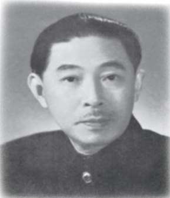

# 背影

**【学科】** 语文 | **【学段/年级】** 初中八年级 | **【册次】** volume_1 | **【单元】** 第四单元  
**【作者/出处】** 朱自清 | **【体裁类别】** 散文

---

## 课文正文与教学内容

过一会说：“我走了，到那边来信！”我望着他走出去。他走了几步，回过头看见我，说：“进去吧，里边没人。”等他的背影混入来来往往的人里，再找不着了，我便进来坐下，我的眼泪又来了。

近几年来，父亲和我都是东奔西走，家中光景是一日不如一日。他少年出外谋生，独立支持，做了许多大事。哪知老境却如此颓唐①！他触目伤怀，自然情不能自已②。情郁③于中，自然要发之于外；家庭琐屑④便往往触他之怒。他待我渐渐不同往日。但最近两年的不见，他终于忘却我的不好，只是惦记着我，惦记着我的儿子。我北来后，他写了一信给我，信中说道：“我身体平安，唯膀子⑤疼痛厉害，举箸⑥提笔，诸多不便，大约大去⑦之期不远矣。”我读到此处，在晶莹的泪光中，又看见那肥胖的、青布棉袍黑布马褂的背影。唉!我不知何时再能与他相见！

## 思考·探究·积累

朗读课文，把写背影的文字找出来，联系全文细细品味，思考并回答下列问题。

1.文章以《背影》为题，“背影”在全文中起了什么作用？

2.文章第6段写父亲过铁道买橘子的过程。在这段文字中，作者是怎样描写父亲的背影的？为什么写得这样详细？

二在这篇文章中，“我”对父亲的情感态度有怎样的变化？这种变化的原因是什么？

三第4段写父亲“本已说定不送我”，却“终于决定还是自己送我去”。细读这一段，结合文中的细节，说说你是怎样理解父亲这一举动背后的心理活动的。

⑤〔膀子〕胳膊。

⑥〔箸(zhù)〕筷子。

⑦〔大去〕委婉语，指死亡。

---

四本文的语言素朴而又典雅，简净而又细致。试以下列语句为例，加以赏析。

1．回家变卖典质，父亲还了亏空；又借钱办了丧事。这些日子，家中光景很是惨淡，一半为了丧事，一半为了父亲赋闲。

2．他给我拣定了靠车门的一张椅子；我将他给我做的紫毛大衣铺好座位。他嘱我路上小心，夜里要警醒些，不要受凉。又嘱托茶房好好照应我。

3．我本来要去的，他不肯，只好让他去。我看见他戴着黑布小帽，穿着黑布大马褂，深青布棉袍，蹒跚地走到铁道边，慢慢探身下去，尚不大难。可是他穿过铁道，要爬上那边月台，就不容易了。

4.他少年出外谋生，独立支持，做了许多大事。哪知老境却如此颓唐！他触目伤怀，自然情不能自已。情郁于中，自然要发之于外；家庭琐屑便往往触他之怒。

## 读读写写

<html><body><table border="1"><tr><td>拭</td><td></td><td></td><td>搀</td><td></td><td></td><td></td><td></td><td></td><td></td><td></td><td></td><td></td><td></td><td>迁</td><td></td><td></td><td></td></tr><tr><td></td><td></td><td></td><td></td><td></td><td></td><td></td><td></td><td></td><td></td><td></td><td></td><td></td><td></td><td></td><td></td><td></td><td></td></tr><tr><td></td><td></td><td></td><td></td><td></td><td></td><td></td><td></td><td></td><td></td><td></td><td></td><td></td><td></td><td></td><td></td><td></td><td></td></tr></table></body></html>

## 朱自清父亲读《背影》

1928年，我（朱国华，朱自清的三弟——编者按）家已搬至扬州东关街仁丰里一所简陋的屋子。秋日的一天，我接到了开明书店寄赠的《背影》散文集，我手捧书本，不敢怠慢，一口气奔上二楼父亲卧室，让他老人家先睹为快。父亲已行动不便，挪到窗前，依靠在小椅上，戴上了老花眼镜，一字一句诵读着儿子的文章《背影》，只见他的手不住地颤抖，昏黄的眼珠，好像猛然放射出光彩。

(摘自朱国华《朱自清与〈背影〉》)

---

## 16 白杨礼赞

茅盾

茅盾

预习

 这篇文章感情充沛，文气酣畅，特别适合朗读。不妨先浏览一遍，了解大意，边读边作一些朗读标记，然后大声朗读，读出文中的激情与豪气。

本文写于1941年抗日战争相持阶段。作者曾说：“《白杨礼赞》非取材于一地或一时，乃在西北高原走了一趟（即赴新疆，离新疆赴延安，又离延安至重庆）以后在重庆写的。”课外查找资料，了解当时的社会背景，思考作者礼赞白杨树的意图。

白杨树实在是不平凡的，我赞美白杨树！

当汽车在望不到边际的高原上奔驰，扑入你的视野的，是黄绿错综的一条大毯子。黄的是土，未开垦的荒地，几百万年前由伟大的自然力堆积成功的黄土高原的外壳；绿的呢，是人类劳力战胜自然的成果，是麦田，和风吹送，翻起了一轮一轮的绿波，——这时你会真心佩服昔人所造的两个字“麦浪”，若不是妙手偶得②，便确是经过锤炼的语言的精华。黄与绿主宰着，无边无垠，
