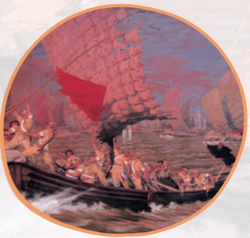

# 散文二篇（永久的生命 / 我为什么而活着）

**【学科】** 语文 | **【学段/年级】** 初中八年级 | **【册次】** volume_1 | **【单元】** 第四单元  
**【作者/出处】** 严文井、罗素 | **【体裁类别】** 哲理散文

---

## 课文正文与教学内容

第四单元83  
阅读15 背影/朱自清84  
16 白杨礼赞/茅盾88  
17* 散文二篇92  
永久的生命/严文井  
  
我为什么而活着/罗素  
18*昆明的雨/汪曾祺96  
阅读综合实践101  
写作语言要连贯103  
整本书阅读  
  
《红岩》106  
第五单元107  
阅读19中国石拱桥/茅以昇108  
20苏州园林/叶圣陶113  
21*人民英雄永垂不朽  
  
-瞻仰首都人民英雄纪念碑/周定舫117  
22*梦回繁华/毛宁125  
阅读综合实践129  
写作说明事物要抓住特征131  
专题学习活动  
  
身边的文化遗产135

---

## 第六单元

143  
阅读23《孟子》三章144  
得道多助，失道寡助  
  
富贵不能淫  
  
生于忧患，死于安乐  
  
24 愚公移山/《列子》148  
25*周亚夫军细柳/司马迁151  
26诗词五首154  
饮酒（其五）/陶渊明  
  
春望/杜甫  
  
雁门太守行/李贺  
  
赤壁/杜牧  
  
渔家傲（天接云涛连晓雾）/李清照  
阅读综合实践158  
写作表达要得体160  
课外古诗词诵读163  
浣溪沙（一曲新词酒一杯）/晏殊  
  
采桑子（轻舟短棹西湖好）/欧阳修  
相见欢（金陵城上西楼）/朱敦儒  
  
如梦令（常记溪亭日暮）/李清照

---

# 第一单元活动·探究

## 活动任务单

新闻是我们了解世界的窗口。每天都有各种各样的新闻，通过报纸、广播、电视、互联网等媒介传播。它们报道新近发生的事实，记录着历史的进程、社会的发展。本单元，我们将跟随新闻作品重回历史现场，触摸时代脉搏；了解常见的新闻体裁及其特点，关注不同媒介在传播新闻时表达上的差异；还将体验新闻的采访过程，试着撰写新闻稿，编辑制作报纸页面、新闻网页等。

## 任务一

新闻阅读。阅读消息、新闻特写、通讯、新闻评论等不同体裁的新闻作品，了解新闻内容，把握不同新闻体裁的特点，学习阅读新闻的方法，探究不同媒体是怎样报道新闻的；养成阅读新闻的习惯，关注新闻本身的发展。

## 任务二

新闻采访。熟悉新闻采访的一般方法和步骤。自主确定报道题材，制订采访方案，草拟采访提纲，分小组进行采访实践，搜集并整理新闻素材。

## 任务三：

新闻写作。一、必做任务，每位同学写一则消息；二、自选任务，撰写新闻特写、通讯等；三、拓展任务，编辑制作报纸页面、新闻网页、短视频等，选择适合的媒介发布。
