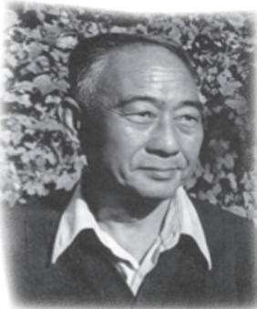
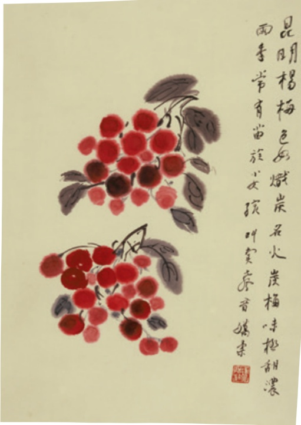

# 昆明的雨

# 18昆明的雨①

汪曾祺

汪曾祺

我想念昆明的雨。

宁坤②要我给他画一张画，要有昆明的特点。我想了一些时候，画了一幅：右上角画了一片倒挂着的浓绿的仙人掌，末端开出一朵金黄色的花；左下画了几朵青头菌和牛肝菌③。题了这样几行字：

昆明人家常于门头挂仙人掌一片以辟邪，仙人掌悬空倒挂，尚能存活开花。于此可见仙人掌生命之顽强，亦可见昆明雨季空气之湿润。雨季则有青头菌、牛肝菌，味极鲜腴④。

我以前不知道有所谓雨季。“雨季”，是到昆明以后才有了具体感受的。

我不记得昆明的雨季有多长，从几月到几月，好像是相当长的。但是并不使人厌烦。因为是下下停停，停停下下，不是连绵不断，下起来没完，而且并不使人气闷。我觉得昆明雨季气压不低，人很舒服。

昆明的雨季是明亮的、丰满的，使人动情的。城春草木深，孟夏草木长⑤。昆明的雨季，是浓绿的。草木的枝叶里的水分都到了饱和状态，显示出过分的、近于夸张的旺盛。

我的那张画是写实的。我确实亲眼看见过倒挂着还能开花的仙人掌。旧日昆明人家门头上用以辟邪的多是这样一些东西：一面小镜子，周围画着八卦，下面便是一片仙人掌，——在仙人掌上扎一个洞，用麻线穿了，挂在钉子上。昆明仙人掌多，且极肥大。有些人家在菜园的周围种了一圈仙人掌以代替篱笆。——种了仙人掌，猪羊便不敢进园吃菜了。仙人掌有刺，猪和羊怕扎。

昆明菌子极多。雨季逛菜市场，随时可以看到各种菌子。最多，也最便宜的是牛肝菌。牛肝菌下来的时候，家家饭馆卖炒牛肝菌，连西南联大食堂的桌子上都可以有一碗。牛肝菌色如牛肝，滑，嫩，鲜，香，很好吃。炒牛肝菌须多放蒜，否则容易使人晕倒。青头菌比牛肝菌略贵。这种菌子炒熟了也还是浅绿色的，格调比牛肝菌高。菌中之王是鸡纵①，味道鲜浓，无可方比②。鸡纵是名贵的山珍，但并不真的贵得惊人。一盘红烧鸡纵的价钱和一碗黄焖鸡不相上下，因为这东西在云南并不难得。有一个笑话：有人从昆明坐火车到呈贡③，在车上看到地上有一棵鸡纵，他跳下去把鸡纵捡了，紧赶两步，还能爬上火车。这笑话用意在说明昆明到呈贡的火车之慢，但也说明鸡纵随处可见。有一种菌子，中吃不中看，叫作干巴菌。乍一看那样子，真叫人怀疑：这种东西也能吃?！颜色深褐带绿，有点像一堆半干的牛粪或一个被踩破了的马蜂窝。里头还有许多草茎、松毛，乱七八糟！可是下点功夫，把草茎松毛择净，撕成蟹腿肉粗细的丝，和青辣椒同炒，入口便会使你张目结舌：这东西这么好吃？！还有一种菌子，中看不中吃，叫鸡油菌。都是一般大小，有一块银圆那样大，滴溜儿圆，颜色浅黄，恰似鸡油一样。这种菌子只能做菜时配色用，没甚味道。

雨季的果子，是杨梅。卖杨梅的都是苗族女孩子，戴一顶小花帽子，穿着扳尖④的绣了满帮花的鞋，坐在人家阶石的一角，不时吆喝一声：“卖杨梅——”声音娇娇的。她们的声音使得昆明雨季的空气更加柔和了。昆明的杨梅很大，有一个乒乓球那样大，颜色黑红黑红的，叫作“火炭梅”。这个名字

起得真好，真是像一球烧得炽红的火炭！一点都不酸！我吃过苏州洞庭山的杨梅、井冈山的杨梅，好像都比不上昆明的火炭梅。

雨季的花是缅桂花。缅桂花即白兰花，北京叫作“把儿兰”（这个名字真不好听）。云南把这种花叫作缅桂花，可能最初这种花是从缅甸传入的，而花的香味又有点像桂花，其实这跟桂花实在没有什么关系。——不过话又说回来，别处叫它白兰、把儿兰，它和兰花也挨不上呀，也不过是因为它很香，香得像兰花。我在家乡看到的白兰多是一人高，昆

《昆明杨梅》汪曾祺作

明的缅桂是大树！我在若园巷二号住过，院里有一棵大缅桂，密密的叶子，把四周房间都映绿了。缅桂盛开的时候，房东（是一个五十多岁的寡妇）就和她的一个养女，搭了梯子上去摘，每天要摘下来好些，拿到花市上去卖。她大概是怕房客们乱摘她的花，时常给各家送去一些。有时送来一个七寸盘子，里面摆得满满的缅桂花！带着雨珠的缅桂花使我的心软软的，不是怀人，不是思乡。

雨，有时是会引起人一点淡淡的乡愁的。李商隐的《夜雨寄北》是为许多久客的游子而写的。我有一天在积雨少住的早晨和德熙①从联大新校舍到莲花池去。看了池里的满池清水，看了着比丘尼装的陈圆圆的石像（传说陈圆圆随

吴三桂到云南后出家，暮年投莲花池而死)，雨又下起来了。莲花池边有一条小街，有一个小酒店，我们走进去，要了一碟猪头肉，半斤市酒①（装在上了绿釉②的土瓷杯里)，坐了下来。雨下大了。酒店有几只鸡，都把脑袋反插在翅膀下面，一只脚着地，一动也不动地在檐下站着。酒店院子里有一架大木香花。昆明木香花很多。有的小河沿岸都是木香。但是这样大的木香却不多见。一棵木香，爬在架上，把院子遮得严严的。密匝匝③的细碎的绿叶，数不清的半开的白花和饱涨的花骨朵，都被雨水淋得湿透了。我们走不了，就这样一直坐到午后。四十年后，我还忘不了那天的情味，写了一首诗：

莲花池外少行人，野店苔痕一寸深。

浊酒一杯天过午，木香花湿雨沉沉。

我想念昆明的雨。

1984年5月19日

## 阅读提示

本文题为《昆明的雨》，却并未用大量笔墨直接写雨，而是从一幅画写起，将记忆中昆明雨季的景、物、事一幕幕展现开来：肥大的仙人掌，好吃与不太好吃的菌子，火炭般的杨梅，带着雨珠的缅桂花，还有卖杨梅的苗族女孩，卖缅桂花的房东母女，更有莲花池边小酒店里与友人的对酌……文章信笔所至，无拘无束，看起来有些“散”，但其中贯串着一条情感线索对昆明生活的喜爱与想念。作者将零散的素材聚拢起来，鲜活、立体地描绘出一个“明亮的、丰满的，使人动情的”昆明雨季。

作者曾经说过：“我想把生活中真实的东西、美好的东西、人的美、人的诗意告诉人们，使人们的心灵得到滋润，增强对生活的信心、信念。”本文正是这

样一篇充满美感和诗意的作品，其中有景物的美、滋味的美、人情的美、氛围的美。可以试着找出自己喜欢的段落，作些圈点批注，并通过朗读加以品味。

汪曾祺的散文往往拾取生活中的琐细事物，娓娓道来，如话家常，平淡自然，却饶有趣味。再找几篇（如《故乡的食物》《翠湖心影》《我的家乡》等)，细细品读，体会作者散文的独特韵味。

## 读读写写

<html><body><table border="1"><tr><td>乍</td><td></td><td></td><td></td><td></td><td></td><td></td><td></td><td></td><td></td><td></td><td></td><td></td><td></td><td></td><td></td><td></td><td></td></tr><tr><td></td><td></td><td></td><td></td><td></td><td></td><td></td><td></td><td></td><td></td><td></td><td></td><td></td><td></td><td></td><td></td><td></td><td></td></tr></table></body></html>

## 句子的主干

句子的主干是指把句子中的定语、状语、补语压缩掉后剩下的部分。对于一个复杂的长单句，找出句子的主干，就能看出它的基本句型，并且可以看出句子的结构是否完整，句子成分之间的搭配是否得当。例如：

我确实亲眼看见过倒挂着还能开花的仙人掌。（汪曾祺《昆明的雨》)

这句话中，“我”是主语，“确实”“亲眼”是状语，“看见”是谓语中心语，“过”是动态助词，表示动作曾经发生，“倒挂着还能开花的”是定语，“仙人掌”是宾语中心语。把状语和定语压缩掉，剩下的句子主干就是：我看见仙人掌。

需要注意的是，句子的主干不等于原来的句子，意思没有原句那样明确，有时意思甚至跟原句相去甚远。特别要提醒的是，如果谓语中心语前面有否定词语(“不”“没”“没有”等)，要把否定词语放在主干当中，以免主干和原句的意思相反。例如：

他从不和别人吵一句嘴。

这个句子的主干应为：他不吵嘴。
