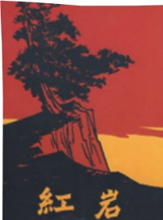

# 整本书阅读 ## 《红岩》

## 整本书阅读

## 《红岩》

《红岩》一出版，就在广大读者中引起了强烈的反应。这是一部震撼人心的共产主义教科书，无论是所反映生活的广度，思想上所达到的深度和所发挥的艺术感染力量，都有巨大的成就。

—孔罗荪、李子云

你一定知道江姐吧？这位面对敌人的毒刑拷打坚贞不屈的共产党员，给几代中国人留下了永不磨灭的印象。她的那句“共产党员的意志是钢铁”，更是令无数读者心潮澎湃。

江姐就是长篇小说《红岩》中的人物之一。这部小说是罗广斌、杨益言以革命回忆录《在烈火中永生》为基础创作的，讲述了重庆解放前夕，重庆的地下党人与垂死挣扎的黑暗势力英勇斗争的故事。在黎明前的至暗时刻，共产党人坚持以《挺进报》为阵地，宣传革命思想；组织罢工、罢课，支持解放战争；组织群众抗丁抗粮，粉碎反动派炸毁城市的图谋。其中最为惊心动魄的，是被捕的地下党人在秘密监狱（渣滓洞和白公馆）这一特殊战场上进行的反压迫、争自由的斗争。作品中种种富有传奇色彩的情节让人激动不已，而贯串其中的革命精神更令人无比景仰。

《红岩》成功地刻画了一批共产党人的光辉形象，除了江姐，还有许云峰、余新江、齐晓轩、刘思扬等，他们“相信胜利，准备牺牲”，是中国人心目中永远的英雄。在革命斗争中，他们舍己为人，互相支持，体现出的同志间的情谊，与他们的高贵品质、革命气节一样，让人备受感动。在他们面前，凶残狡诈而又色厉内荏的叛徒和特务是那么丑恶、可鄙。

阅读这部红色经典作品，让我们一起学习共产党人“在烈火中永生”的光辉事迹，倾听英雄们散发着理想光芒的掷地有声的话语，感受先烈们不畏艰险、无惧牺牲的革命情怀。在感动之余也要思考：今天的我们，应该如何继承先烈的遗志？应该如何为实现中华民族的伟大复兴而尽自己的一份力量?

第五单元

如虹卧波的中国石拱桥，如诗如画的苏州园林，宛如乐章的《清明上河图》，展现了传统文化的无穷魅力；雄伟庄严的人民英雄纪念碑，记录着可歌可泣的革命历程。阅读本单元的说明性文章，可以了解我国人民在建筑、绘画艺术方面的卓越成就，感受中华民族的非凡智慧与杰出创造力。

学习本单元，要提取、整合有价值的信息，准确理解文章的内容与思路，把握说明对象的特征。阅读时，要注意了解文章是如何使用恰当的方法来说明的；还要体会说明性文章语言准确、严谨的特点，增强思维的条理性和严密性。

