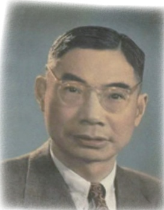
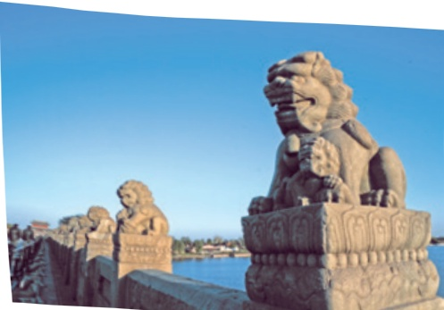
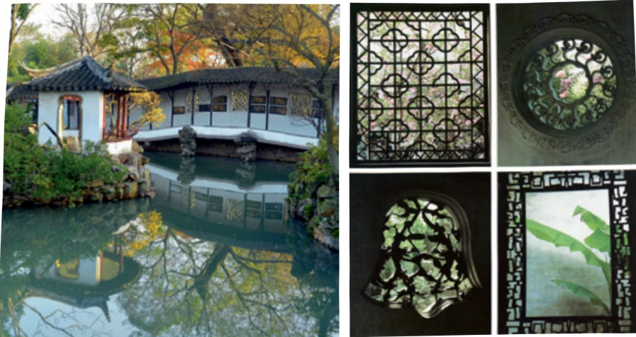

# 中国石拱桥

## 阅读

## 19 中国石拱桥

茅以昇

茅以昇

## 预习

你可能见过各种各样的桥，这些桥有什么共同点？你能结合自己的观察和理解，用一句话说说“桥”是什么吗?

快速阅读课文，看看能否把握有关中国石拱桥的一些重要信息。

石拱桥的桥洞成弧形，就像虹。古代神话里说，雨后彩虹是“人间天上的桥”，通过彩虹就能上天。我国的诗人爱把拱桥比作虹，说拱桥是“卧虹”“飞虹”，把水上拱桥形容为“长虹卧波”。

石拱桥在世界桥梁史上出现得比较早。这种桥不但形式优美，而且结构坚固，能几十年几百年甚至上千年雄跨在江河之上，在交通方面发挥作用。

我国的石拱桥有悠久的历史。《水经注》里提到的“旅人桥②”，大约建成于公元282年，可能是有记载的最早的石拱桥了。我国的石拱桥几乎到处都有。这些桥大小不一，形式多样，有许多是惊人的杰作。其中最著名的当推河北省赵县的赵州桥，还有北京丰台区的卢沟桥。

赵州桥横跨在洨河③上，是世界著名的古代石拱桥，也是造成后一直使用

到现在的最古的石桥。这座桥修建于公元605年左右，到现在已经1300多年①了，还保持着原来的雄姿。到解放的时候，桥身有些残损了，在人民政府的领导下，经过彻底整修，这座古桥又恢复了青春。

赵州桥非常雄伟，全长50.82米，两端宽9.6米，中部略窄，宽约9米。桥的设计完全合乎科学原理，施工技术更是巧妙绝伦。唐朝的张嘉贞②说它“制造奇特，人不知其所以为”。这座桥的特点是：（一）全桥只有一个大拱，长达37.02米，在当时可算是世界上最长的石拱。桥洞不是普通半圆形，而是像一张弓，因而大拱上面的道路没有陡坡，便于车马上下。（二）大拱的两肩上，各有两个小拱。这个创造性的设计，不但节约了石料，减轻了桥身的重量，而且在河水暴涨的时候，还可以增加桥洞的过水量，减轻洪水对桥身的冲击。同时，拱上加拱，桥身也更美观。（三）大拱由28道拱圈拼成，就像这么多同样形状的弓合拢在一起，做成一个弧形的桥洞。每道拱圈都能独立支撑上面的重量，一道坏了，其他各道不致受到影响。（四）全桥结构匀称，和四周景色配合得十分和谐；桥上的石栏石板也雕刻得古朴③美观。唐朝的张鹫④说，远望这座桥就像“初月出云，长虹饮涧”。赵州桥高度的技术水平和不朽的艺术价值，充分显示了我国劳动人民的智慧和力量。桥的主要设计者李春就是一位杰出的工匠，在桥头的碑文里刻着他的名字。

永定河⑤上的卢沟桥，修建于公元1189到1192年间。桥长265米，由11个半圆形的石拱组成，每个石拱长度不一，自16米到21.6米。桥宽约8米，桥面平坦，几乎与河面平行。每两个石拱之间有石砌桥墩，把11个石拱联成一个整体。由于各拱相连，所以这种桥叫作联拱石桥。永定河发水时，来势很猛，以前两岸河堤常被冲毁，但是这座桥极少出事，足见它的坚固。桥面用

卢沟桥上的石狮子

石板铺砌，两旁有石栏石柱。每个柱头上都雕刻着不同姿态的狮子。这些石刻狮子，有的母子相抱，有的交头接耳，有的像倾听水声，有的像注视行人，千态万状，惟妙惟肖①。

早在13世纪，卢沟桥就闻名世界。那时候有个意大利人马可·波罗②来过中国，他的游记里，十分推崇这座桥，说它“是世界上独一无二的”，并且特别欣赏桥栏柱上刻的狮子，说它们“共同构成美丽的奇观”。在国内，这座桥也是历来为人们所称赞的。它地处入都要道，而且建筑优美，“卢沟晓月”很早就成为北京的胜景之一。

卢沟桥在我国人民反抗帝国主义侵略战争的历史上，也是值得纪念的。1937年7月7日中国军队在此抗击日本帝国主义的侵略，揭开了中国人民全面抗战的序幕。

为什么我国的石拱桥会有这样光辉的成就呢？首先，在于我国劳动人民的勤劳和智慧。他们制作石料的工艺极其精巧，能把石料切成整块大石碑，又能把石块雕刻成各种形象。在建筑技术上有很多创造，在起重吊装方面更有意想不到的办法。如福建漳州的江东桥，修建于700多年前，有的石梁一块就有200来吨重，究竟是怎样安装上去的，至今还不完全知道。其次，我国石拱桥的设计施工有优良传统，建成的桥，用料省，结构巧，强度高。再其次，我国富有建筑用的各种石料，便于就地取材，这也为修造石桥提供了有利条件。

两千年来，我国修建了无数的石拱桥。解放后，全国大规模兴建起各种形式的公路桥与铁路桥，其中就有不少石拱桥。1961年，云南省建成了一座世界最长的独拱石桥，名叫“长虹大桥”，石拱长达112.5米。在传统的石拱桥

的基础上，我们还造了大量的钢筋混凝土拱桥，其中“双曲拱桥”是我国劳动人民的新创造，是世界上所仅有的。近几年来，全国造了总长20余万米的这种拱桥，其中最大的一孔，长达150米。我国桥梁事业的飞跃发展，表明了我国社会主义制度的无比优越。

## 思考·探究·积累

文章为了说明中国历代拱桥的特征，选取了许多例子。从课文中找出这些例子，提取关键信息，填写下面的表格。填完之后，纵向看一看，你有哪些发现?

<html><body><table border="1"><tr><td></td><td>名称</td><td>建造时间</td><td>特征</td></tr><tr><td>1</td><td></td><td>约282年</td><td>可能是有记载的最早的石拱桥</td></tr><tr><td>2</td><td>赵州桥</td><td>约605年</td><td></td></tr><tr><td>3</td><td></td><td>1189—1192年</td><td></td></tr><tr><td>4</td><td>江东桥</td><td></td><td></td></tr><tr><td>5</td><td></td><td>1961年</td><td>当时世界上最长的独拱石桥</td></tr><tr><td>6</td><td>双曲拱桥</td><td>解放后</td><td></td></tr></table></body></html>

二根据课文内容，画出赵州桥的示意图，在相应的位置上标出数据。

三说明性文章中常用一些说明方法，如下定义、举例子、作比较、打比方、分类别、画图表、列数字、引用等。看看本文中用了哪些说明方法，找出实例并说说它们的作用。

四结合下列句子中加点的词语，体会说明性文章语言的准确、严谨。

1．《水经注》里提到的“旅人桥”，大约建成于公元282年，可能是有记载的最早的石拱桥了。

2．全桥只有一个大拱，长达37.02米，在当时可算是世界上最长的石拱。

3．永定河上的卢沟桥，修建于公元1189到1192年间。桥长265米，由11个半圆形的石拱组成，每个石拱长度不一，自16米到21.6米。桥宽约8米，桥面平坦，几乎与河面平行。

五茅以昇笔下的赵州桥和卢沟桥设计精巧，结构坚固，形式美观，给人留下了深刻的印象。你的家乡有没有让你印象深刻的建筑？实地考察或借助资料了解这座建筑，制作幻灯片或拍摄短视频，在班上交流。

## 读读写写

<html><body><table border="1"><tr><td></td><td></td><td></td><td></td><td></td><td></td><td></td><td></td><td></td><td></td><td></td><td></td><td></td><td></td><td></td><td></td><td></td></tr><tr><td></td><td></td><td></td><td></td><td></td><td></td><td></td><td></td><td></td><td></td><td></td><td></td><td></td><td></td><td></td><td></td><td></td></tr><tr><td></td><td></td><td></td><td></td><td></td><td></td><td></td><td></td><td></td><td></td><td></td><td></td><td></td><td></td><td></td><td></td><td></td></tr></table></body></html>

## 句子的语气（一）

我们说的每句话都有一定的语气，可能是陈述或疑问的语气，也可能是感叹或祈使的语气。这些不同的语气，在书面上通过不同的标点符号来表示。

根据不同的语气，我们将句子分为陈述句、疑问句、感叹句和祈使句。先读一读下边两组句子，看看它们的语气有什么不同：

<html><body><table border="1"><tr><td>第一组</td><td>第二组</td></tr><tr><td>石拱桥的桥洞成弧形，就像虹。 石拱桥在世界桥梁史上出现得比 较早。 早在13世纪，卢沟桥就闻名世界。 关于这件事，我们的态度很明确。</td><td>为什么我国的石拱桥会有这样光 辉的成就呢? 你是去北京，还是去上海？ 你有没有告诉他真正的原因？ 这难道不是天经地义的事情吗?</td></tr></table></body></html>

显然，第一组都是陈述的语气，句子结尾用句号；第二组都是疑问的语气，句子结尾用问号。

需要注意的是，第二组的疑问句运用了四种不同的疑问方式，回应这些疑问的方式也会有所不同。同学们不妨讨论一下，看看能不能再举出一些例子，归纳出不同疑问句式的不同特点。

# 苏州园林

叶圣陶

预习

 中国古典园林兴起于秦汉，繁荣于唐宋，全盛于明清，是一种独具中国特色的建筑形式，也是人类文明的宝贵财富。你了解它的建筑特点吗？看一些有关古典园林的图片、纪录片，自己作些总结，与同学交流。

快速阅读，抓住文中各段的关键语句，把握课文大意。

苏州园林据说有一百多处，我到过的不过十多处。其他地方的园林我也到过一些。倘若要我说说总的印象，我觉得苏州园林是我国各地园林的标本，各地园林或多或少都受到苏州园林的影响。因此，谁如果要鉴赏我国的园林，苏州园林就不该错过。

设计者和匠师们因地制宜，自出心裁，修建成功的园林当然各个不同。可是苏州各个园林在不同之中有个共同点，似乎设计者和匠师们一致追求的是：务必使游览者无论站在哪个点上，眼前总是一幅完美的图画。为了达到这个目的，他们讲究亭台轩②榭③的布局，讲究假山池沼的配合，讲究花草树木的映衬，讲究近景远景的层次。总之，一切都要为构成完美的图画而存在，决不容许有欠美伤美的败笔。他们唯愿游览者得到“如在画图中”的美感，而他们的

成绩实现了他们的愿望，游览者来到园里，没有一个不心里想着口头说着“如在画图中”的。

我国的建筑，从古代的宫殿到近代的一般住房，绝大部分是对称的，左边怎么样，右边也怎么样。苏州园林可绝不讲究对称，好像故意避免似的。东边有了一个亭子或者一道回廊，西边决不会来一个同样的亭子或者一道同样的回廊。这是为什么？我想，用图画来比方，对称的建筑是图案画，不是美术画，而园林是美术画，美术画要求自然之趣，是不讲究对称的。

苏州园林里都有假山和池沼。假山的堆叠，可以说是一项艺术而不仅是技术。或者是重峦叠嶂，或者是几座小山配合着竹子花木，全在乎设计者和匠师们生平多阅历，胸中有丘壑①，才能使游览者攀登的时候忘却苏州城市，只觉得身在山间。至于池沼，大多引用活水。有些园林池沼宽敞，就把池沼作为全园的中心，其他景物配合着布置。水面假如成河道模样，往往安排桥梁。假如安排两座以上的桥梁，那就一座一个样，决不雷同。池沼或河道的边沿很少砌齐整的石岸，总是高低屈曲任其自然。还在那儿布置几块玲珑的石头，或者种些花草：这也是为了取得从各个角度看都成一幅画的效果。池沼里养着金鱼或

苏州园林中的窗户和墙上的镂空图案

拙政园秋色华致中摄

①〔胸中有丘壑（hè）〕意思是设计者和匠师们有关于山水风景的高明构思。丘壑，山陵与溪谷，喻指深远的意境。

各色鲤鱼，夏秋季节荷花或睡莲开放，游览者看“鱼戏莲叶间”，又是入画的一景。

苏州园林栽种和修剪树木也着眼在画意。高树与低树俯仰生姿。落叶树与常绿树相间，花时不同的多种花树相间，这就一年四季不感到寂寞。没有修剪得像宝塔那样的松柏，没有阅兵式似的道旁树：因为依据中国画的审美观点看，这是不足取的。有几个园里有古老的藤萝，盘曲嶙峋①的枝干就是一幅好画。开花的时候满眼的珠光宝气，使游览者感到无限的繁华和欢悦，可是没法说出来。

游览苏州园林必然会注意到花墙和廊子。有墙壁隔着，有廊子界着，层次多了，景致就见得深了。可是墙壁上有砖砌的各式镂空图案，廊子大多是两边无所依傍的，实际是隔而不隔，界而未界，因而更增加了景致的深度。有几个园林还在适当的位置装上一面大镜子，层次就更多了，几乎可以说把整个园林翻了一番。

游览者必然也不会忽略另外一点，就是苏州园林在每一个角落都注意图画美。阶砌②旁边栽几丛书带草。墙上蔓延着爬山虎或者蔷薇木香。如果开窗正对着白色墙壁，太单调了，给补上几竿竹子或几棵芭蕉。诸如此类，无非要游览者即使就极小范围的局部看，也能得到美的享受。

苏州园林里的门和窗，图案设计和雕镂琢磨功夫都是工艺美术的上品。大致说来，那些门和窗尽量工细而决不庸俗，即使简朴而别具匠心。四扇，八扇，十二扇，综合起来看，谁都要赞叹这是高度的图案美。摄影家挺喜欢这些门和窗，他们斟酌着光和影，摄成称心满意的照片。

苏州园林与北京的园林不同，极少使用彩绘。梁和柱子以及门窗栏杆大多漆广漆③，那是不刺眼的颜色。墙壁白色。有些室内墙壁下半截铺水磨方砖，淡灰色和白色对衬。屋瓦和檐漏④一律淡灰色。这些颜色与草木的绿色配合，引起人们安静闲适的感觉。花开时节，更显得各种花明艳照眼。

可以说的当然不止以上这些，这里不再多写了。

课文中哪一句话最能说明苏州园林的整体特征？作者是从哪几个方面来具体展开说明的?

二课文多数段的首句是对本段内容的概括，说说这种写法的好处。

三揣摩下列句子中加点的词语，回答括号里的问题。

1．倘若要我说说总的印象，我觉得苏州园林是我国各地园林的标本……

（“标本”在这里是什么意思？）

2.对称的建筑是图案画，不是美术画，而园林是美术画……

（“图案画”和“美术画”有什么区别？）

3．假山的堆叠，可以说是一项艺术而不仅是技术。

（“艺术”和“技术”有什么异同？）

4.可是墙壁上有砖砌的各式镂空图案，廊子大多是两边无所依傍的，实际是隔而不隔，界而未界，因而更增加了景致的深度。

（“隔而不隔，界而未界”是什么意思？结合课文插图描述一下这是怎样的情形。）

四从下面两项活动中任选其一，独立或小组合作完成。

1．曹雪芹笔下的大观园被认为“是一个南北名园的综合”（陈从周）。读一读《红楼梦》的第十七回，注意其中描写楼台轩榭、假山池沼和花草树木的内容，看看大观园有哪些特征，与课文所写的苏州园林有什么异同。

2．园林在人类历史中出现得很早，经过长期的发展，形成了不同的园林体系。它们风格各异，“表现着美感的民族特点”（宗白华)。查找资料，了解并比较中国、西亚和欧洲古典园林的主要特点，用表格或思维导图的形式呈现你的认识。

<html><body><table border="1"><tr><td>竿</td><td></td><td></td><td></td><td></td><td></td><td></td><td></td><td></td><td></td><td></td><td></td><td></td><td></td><td></td><td></td><td></td></tr><tr><td></td><td></td><td></td><td></td><td></td><td></td><td></td><td></td><td></td><td></td><td></td><td></td><td></td><td></td><td></td><td></td><td></td></tr><tr><td></td><td></td><td></td><td></td><td></td><td></td><td></td><td></td><td></td><td></td><td></td><td></td><td></td><td></td><td></td><td></td><td></td></tr><tr><td></td><td></td><td></td><td></td><td></td><td></td><td></td><td></td><td></td><td></td><td></td><td></td><td></td><td></td><td></td><td></td><td></td></tr></table></body></html>

