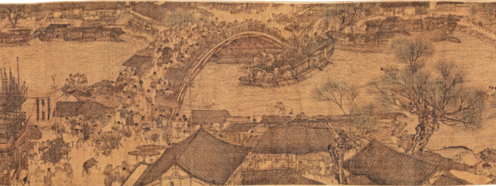

# 梦回繁华

# 22梦回繁华4

毛宁

北宋时期，商业手工业迅速发展，城市布局打破了坊②与市③的严格界限，出现空前的繁荣局面。北宋汴京④商业繁盛，除贵族聚集外，还住有大量的商人、手工业者和市民，城市的文化生活也十分活跃。由此，绘画的题材范围在反映现实生活方面得到了极大的拓展，从唐代以描绘重大历史事件和贵族生活为主，扩展到描绘城乡市井平民生活的各个方面。张择端的《清明上河图》便是北宋风俗画作品中最具代表性的一幅。

张择端，主要活动于北宋末年至南宋初年，生卒年不详，山东东武⑤人，字正道，又字文友。幼读书，游学于汴京，“后习绘事”，徽宗⑥朝进入翰林。据张著题跋，他擅长界画⑦，工舟车、市街、桥梁、城郭。除《清明上河图》外，还有《西湖争标图》相传为他所画。据后代文人考订，《清明上河图》可能作于政和至宣和年间（1111—1125)。那正是北宋统治者在覆灭之前大造盛世假象，以此掩盖内忧外患的时期。建炎⑨之后，南渡的北宋遗民怀念故土，在他们眼中，这幅图卷必有其特殊的意义，正是他们回首故土、梦回繁华的写照。透过此一观念来审视这幅千古名作，我们会发觉那隐藏于繁华背后的心情。

张择端画的《清明上河图》，绢本，设色，纵24.8厘米，横528.7厘米。作品描绘了都城汴京从城郊、汴河到城内街市的繁华景象。整个长卷犹如一部

乐章，由慢板①、柔板，逐渐进入快板、紧板，转而进入尾声，留下无尽的回味。

画面开卷处描绘的是汴京近郊的风光。疏林薄雾，农舍田畴，春寒料峭，赶集的乡人驱赶着往城内送炭的毛驴驮队。在进入大道的岔道上，是众多仆从簇拥的轿乘队伍，从插满柳枝的轿顶可知是踏青扫墓归来的权贵。近处小路上骑驴而行的则是长途跋涉②的行旅。树木新发的枝芽，调节了画面的色彩和疏密，表现出北国早春的气息。画面中段是汴河两岸的繁华情景。汴河是当时南北交通的孔道③，也是北宋王朝国家漕运④的枢纽。巨大的漕船，舳舻相接⑤，忙碌的船工从停泊在河边的粮船上卸下沉重的粮包，纤夫们拖着船逆水行驶，一片繁忙景象。汴河上有一座规模宏敞的拱桥，其桥无柱，以巨木虚架而成，结构精美，宛如飞虹。桥的两端紧连着街市，车水马龙，热闹非凡。一艘准备驶过拱桥的巨大漕船的细节描绘，一直为人们所称道：船正在放倒桅杆准备过桥，船夫们呼唤叫喊，握篙盘索。桥上呼应相接，岸边挥臂助阵，过往行人聚集在桥头围观。而那些赶脚、推车、挑担的人们，却无暇一顾。这紧张的一幕，成为全画的一个高潮。后段描写汴京市区的街道。在高大雄伟的城楼两侧，街道纵横，房屋林立，茶坊、酒肆、脚店⑥、肉铺、寺观、

《清明上河图》(局部)【宋】张择端作

④〔漕运〕旧时指国家利用水道调运粮食。

⑤〔舳舻（zhúlú）相接〕船只首尾衔接。舳，船

尾。舻，船头。

⑥〔脚店〕供人临时歇脚的小客店。

茅厕等一应俱全。各类店铺经营着罗锦布匹、沉檀①香料、香烛纸马。另有医药门诊、大车修理、看相算命、修面整容，应有尽有。街上行人摩肩接踵②，络绎不绝③，士农工商，男女老少，各行各业，无所不备。

《清明上河图》采用了中国传统绘画特有的手卷④形式，以移动的视点摄取对象。全图内容庞大，却繁而不乱，长而不冗，段落清晰，结构严谨。画中人物有五百多个，形态各异。采用兼工带写的手法⑤，线条遒劲⑥，笔法灵动，有别于一般的界画。《清明上河图》是一幅写实性很强的作品，画中所绘景物，与文献中有关汴京的记载基本一致。《东京梦华录》中所记述的街巷、酒楼、饮食果子，以及“天晓诸人入市”“诸色杂卖”等，都能在这画面中找到生动的图释。画中的“孙羊店”“脚店”等，与《东京梦华录》中所记的“曹婆婆肉饼”“正店七十二户……其余皆谓之脚店”等，无有不符。画面细节的刻画也十分真实，如桥梁的结构，车马的样式，人物的衣冠服饰，各行各业人员的活动，皆细致入微。它不是一般热闹场面的记录，而是通过对各阶层人物活动的生动描绘，深刻地揭示出这一特定历史时期的社会生活状况。画中丰富的内容，有着文字无法取代的历史价值，在艺术表现的同时，也是为12世纪中国城市生活状况留下的重要形象资料。

## 阅读提示

本文以《梦回繁华》为题，介绍《清明上河图》这一国宝级画作，描摹北宋时期繁华的市井风情，丰富了人们对当时社会风貌的认识，激发了人们对古

代生活的想象。这幅长卷人物众多，场景复杂，但本文介绍得条理分明、细腻具体，并且挖掘出画面背后的社会历史内涵，使文章显得厚重而有文化韵味。

阅读时可以先浏览全文，了解主要内容，再细读文中的重点段落。细读时要抓住其中的关键语句，梳理各部分的主要内容，看看作者是按怎样的顺序来说明的。还要注意作者的遣词造句，体会大量使用四字短语的表达效果。

## 目读读写写

<html><body><table border="1"><tr><td></td><td></td><td></td><td></td><td></td><td></td><td></td><td></td><td></td><td></td><td></td><td></td><td></td><td></td><td></td><td></td><td></td><td></td></tr><tr><td></td><td></td><td></td><td></td><td></td><td></td><td></td><td></td><td></td><td></td><td></td><td></td><td></td><td></td><td></td><td></td><td></td><td></td></tr><tr><td></td><td></td><td></td><td></td><td></td><td></td><td></td><td></td><td></td><td></td><td></td><td></td><td></td><td></td><td></td><td></td><td></td><td></td></tr><tr><td></td><td></td><td></td><td></td><td></td><td></td><td></td><td></td><td></td><td></td><td></td><td></td><td></td><td></td><td></td><td></td><td></td><td></td></tr></table></body></html>

## 句子的语气（二）

我们看下边两组句子，比较它们语气的不同：

<html><body><table border="1"><tbody><tr><td>联二巢</td><td>唉！我不知何时再能与他相见！</td><td>真是像一球烧得炽红的火炭！</td><td>我要高声赞美白杨树！</td></tr><tr><td>第一组</td><td>你就在此地，不要走动 0</td><td>我走了，到那边来信！</td><td>不准随地吐痰！</td></tr></table></body></html>

显然，第一组句子是在要求别人做什么或不做什么，属于祈使句；第二组句子是用来表示某种感情，属于感叹句。

一般来说，祈使句有命令、请求、催促、劝说等不同的语气。在书面上，语气强烈的句子使用叹号，语气较和缓的则用句号。

过去常常见到这样的标语：“禁止踩踏草坪！”“禁止乱扔废弃物！”现在可能会说：“小草青青，足下留情。”“垃圾进箱，心留余香。”“举手之劳，尽显素养。”同学们讨论一下，意思相同的标语因语气不同可能产生怎样不同的表达效果?
