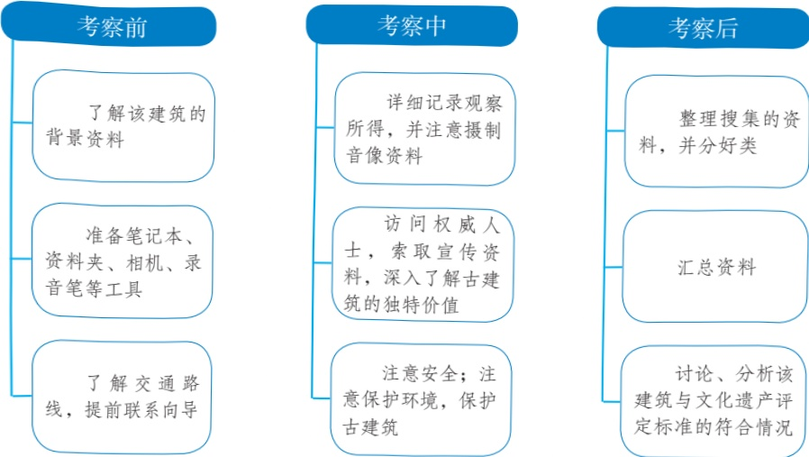
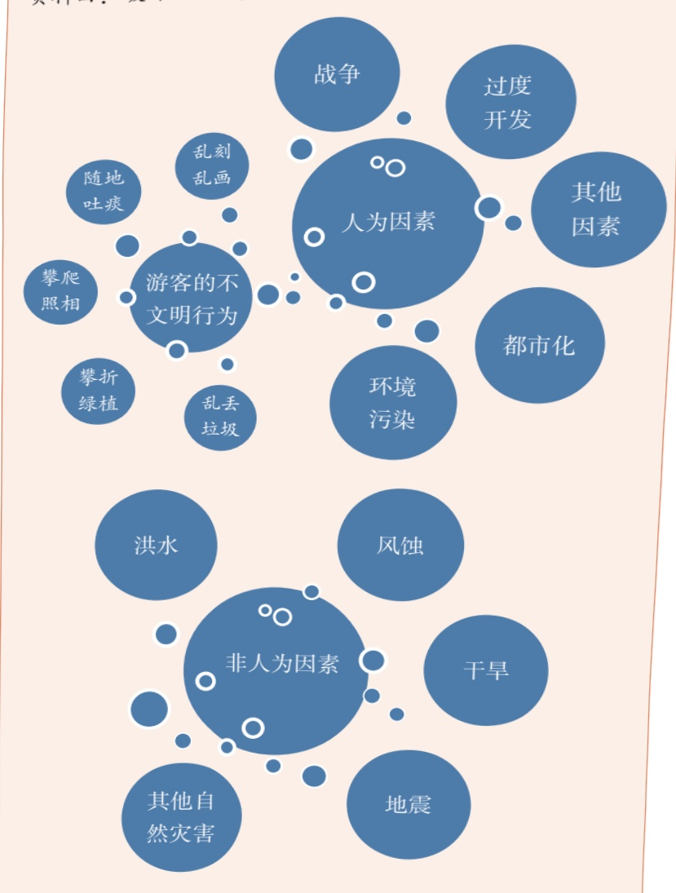

# 写作 实践

有时还可以运用一些生动形象的说明方法，既突出事物的特征，同时也避免文章枯燥乏味。例如《中国拱桥》开篇便说“石拱桥的桥洞成弧形，就像虹”，虽不是严格的定义，却一下就把石拱桥最明显的特征勾勒出来了。又如《梦回繁华》这样说明《清明上河图》节奏感极强的特征：“整个长卷犹如部乐章，由慢板、柔板，逐渐进入快板、紧板，转而进入尾声，留下无尽的回味。”以乐喻画，以简驭繁，有助于读者的理解。

## 写作实践

一利用下面的材料，抓住坎儿井的一两个特征，整理出一篇说明性文章。题目自拟。不少于300字。

①新疆地区多山地、盆地，气候十分干旱，山地承接了较多的降水，成为干旱大地上的一座座“湿岛”。这些水源因干旱区的高温蒸发而大量丧失，为保护这些宝贵的水源，新疆各族人民创造出坎儿井这种利用地下水的巧妙方式。

②坎儿井，其实是一种井、渠结合，在地下引用地下水进行灌溉的水资源利用方式。它依据山势坡度，按引水路线在地面挖出许多竖井，并在地下将这些竖井连通成渠，使深层地下水逐渐转变成浅层地下水，在需要水的地方引出至涝坝（蓄水池)，然后引至农田灌溉。由于水在地下运行，不受地面高温蒸发的影响，保持了水量常年稳定；经过地层过滤，井水也变得清澈甘甜。

③关于坎儿井的来历，比较流行的说法有三种：一是“井渠说”，认为坎儿井与汉武帝时期凿井渠引洛水关系密切。二是“西来说”，认为新疆的坎儿井是从拥有坎儿井最多的古波斯（今伊朗）传来的。三是“本地说”，认为现存最古老的坎儿井通水时间距今至少已500年，坎儿井很可能就是新疆本地的产物。

④不论坎儿井起源于何时何地，可以肯定的是，它是生活在干旱高温的山地、盆地的古代劳动人民的智慧创造。有了坎儿井，他们就有了生存的基础。

⑤坎儿井的开凿是十分艰苦的。在开挖线上，每隔数十米就要挖一口竖井。井下渠道开挖靠点油灯作业，总工程量非常大。而且，挖井人还需要知道什么地方地下有水，从开挖处到出水处要挖多少竖井，每个竖井需挖多深，这都要有丰富的经验。

⑥坎儿井起挖在山地，出水在盆地绿洲，平均长度在3000米以上。在吐鲁番盆地，坎儿井的总长度超过5000千米。

⑦20世纪50年代末，新疆共有坎儿井1784条，年出水量6.826亿立方米，灌溉面积36.3万亩。但随着地面引水工程的建设和机井的普及，加上开挖极为困难，坎儿井在灌溉方面的地位不断下降。2003年，新疆的坎儿井数量已锐减至614条，年出水量减少56%，灌溉面积减少52%。

⑧目前，坎儿井的抢救工程已全面启动，有越来越多曾经干涸的坎儿井又流出了汩汩清水。人们已经认识到，与现代引水技术相比，坎儿井有着保护、净化水资源和不消耗其他能源的优势，其文化价值更是不可估量。

（改编自胡文康《地下人工长河—坎儿井》)

## 提示：

1.仔细阅读材料，归纳坎儿井有哪些不同方面的特征。

2.材料中坎儿井的各个特征既有相对的独立性，相互之间又有联系，写作时要注意这一点。

3.利用材料整理文章不等于节录、照抄，要根据自己的思路，整合、组织材料，还要对材料的表述方式作一定程度的调整。

二在我们的生活中有各种各样的建筑，它们或外观独特，或历史悠久，或有重要的意义，或有特殊的功能。写一篇说明性文章，向大家介绍某一建筑。题目自拟。不少于500字。

## 提示：

1.同学之间互相交流，选择说明对象。这一建筑可以是单体建筑，比如一栋楼、一座桥；也可以是群体建筑，比如一条街巷、一座古城。

2.注意实地观察，发现该建筑的外观、构成、用途等的独特之处。

3.合理安排文章的结构。可以先说明建筑的总体特征，然后从几个方面分别说明该建筑的具体特征。

三农用无人机、智能家居、可穿戴设备、数字支付……现实生活中的科技新产品、新应用层出不穷。选取你最熟悉的一个，自拟题目，写一篇说明性文章，向家中的老人介绍这一产品或应用。不少于500字。

提示：

1.先尽可能多地搜集相关的材料，从中提炼说明对象的主要特征，如基本功能、技术特点、应用场景等。

2.围绕主要特征从不同角度进行说明，可以恰当使用一些说明方法，增强说明的效果。写作时要注意文章的读者对象，使自己的介绍更有针对性。

3.可以插入一些图表或图片，更加清晰直观地呈现说明对象的特征。

## 身边的文化遗产

我们身边有很多宝贵的文化遗产：既有名胜古迹、文物文献等有形的物质文化遗产，也有民间技艺、艺术形式、民俗活动、节庆礼仪等非物质文化遗产；既有传统文化遗产，也有传承革命文化的红色文化遗产。这些文化遗产都彰显出独特的人文价值，凝聚着共同的历史记忆。为进一步加强我国文化遗产的保护，继承和弘扬中华优秀传统文化，国务院决定自2006年起，将每年6月的第二个星期六定为我国的“文化遗产日”，2016年调整设立为“文化和自然遗产日”。

为了更好地保护本地的文化和自然遗产，有关部门准备组织评选本市优秀文化遗产项目，以制定相应的宣传保护措施。请参考“资料夹”中的资料，以班级为单位，组织推荐、评选，并模拟申请和答辩。

## 活动一：文化遗产推荐与评选

全班同学分成若干小组，分别推荐和评选出本组认同的“文化遗产候选项目”。可以是本乡镇、街道的项目，也可以扩大到县、区、市的范围。

1.各小组最好有所分工，避免重复。比如有的负责物质文化遗产，有的负责非物质文化遗产。具体区别可参看“资料一”。

2.自由推荐。首先，阅读“资料一”，了解文化遗产的定义和入选标准。其次，通过回忆、访问、资料搜集等方式，找出你身边符合条件的项目，参考“资料二”，制作资料卡片。

3.小组讨论。组长负责收集组员提交的卡片，召集组员讨论，选出推荐人数最多、认同度最高的项目作为本组的“申遗”项目。

## 活动二：实地考察，搜集资料，撰写申请报告

1.如果有条件，实地考察拟申报的项目。以某古代建筑为例，考察步骤可以参考下面的图表。

搜集资料时要重点关注该建筑的现状，独特的人文价值和历史价值（如考古意义、历史资料价值、建筑学价值等），代表性景观，相关的故事传说、诗文对联等。

2.如果条件不允许，也可以通过阅读书籍、网络搜索、访问老人等方式获取资料。

3.小组分工合作，撰写《优秀文化遗产申请报告》。报告中应该包含的内容有（仍以某古代建筑为例）：

 建筑概述

⚫人文、历史价值

建筑保护现状及需要关注的问题（可参考“资料三”和“资料四”，学习文化遗产保护的经典案例，了解破坏文化遗产的种种因素，并据此具体分析对该建筑进行保护时需要注意哪些方面）

·拟采取的保护措施

4.报告最好图文并茂，适当使用数字化手段。图片与文字相配合，既可以具体形象地展现该建筑的独特魅力，凸显其独特价值；也可以直观地呈现它的保护现状，以引起大家的关注。如果条件允许，可以提交整合了文字、图片、音频、视频等的数字版申请报告。

## 活动三：班级召开模拟答辩会

1．各小组推举一位组员担任“申遗代表”，负责介绍小组推荐的项目；其他组员也要积极参加答辩会。

2.每个小组推举一位组员担任评委，邀请语文老师或相关学科老师担任首席评委，共同组成评审委员会。本小组答辩时，本组评委应该回避。

3.学习委员负责组织答辩会，会同各小组组长确定时间及流程，拟出相关规则，选定主持人。

活动结束，参考“资料五”，以小组为单位，就文化遗产保护与开发献计献策，展开讨论并形成小组意见，在全班展示、交流。

## 资料夹

## 资料一：关于文化遗产的保护

我国是历史悠久的文明古国。在漫长的岁月中，中华民族创造了丰富多彩、弥足珍贵的文化遗产。

文化遗产包括物质文化遗产和非物质文化遗产。物质文化遗产是具有历史、艺术和科学价值的文物，包括古遗址、

中国文化遗产标志

古墓葬、古建筑、石窟寺、石刻、壁画、近代现代重要史迹及代表性建筑等不可移动文物，历史上各时代的重要实物、艺术品、文献、手稿、图书资料等可移动文物，以及在建筑式样、分布均匀或与环境景色结合方面具有突出普遍价值的历史文化名城（街区、村镇）。

## 资料夹

非物质文化遗产是指各种以非物质形态存在的与群众生活密切相关、世代相承的传统文化表现形式，包括口头传统，传统表演艺术，民俗活动和礼仪与节庆，有关自然界和宇宙的民间传统知识和实践，传统手工艺技能等以及与上述传统文化表现形式相关的文化空间。

我国文化遗产蕴含着中华民族特有的精神价值、思维方式、想象力，体现着中华民族的生命力和创造力，是各民族智慧的结晶，也是全人类文明的瑰宝。保护文化遗产，保持民族文化的传承，是联结民族情感纽带、增进民族团结和维护国家统一及社会稳定的重要文化基础，也是维护世界文化多样性和创造性，促进人类共同发展的前提。加强文化遗产保护，是建设社会主义先进文化，贯彻落实科学发展观和构建社会主义和谐社会的必然要求。

文化遗产是不可再生的珍贵资源。随着经济全球化趋势和现代化进程的加快，我国的文化生态正在发生巨大变化，文化遗产及其生存环境受到严重威胁。不少历史文化名城（街区、村镇）、古建筑、古遗址及风景名胜区整体风貌遭到破坏。文物非法交易、盗窃和盗掘古遗址古墓葬以及走私文物的违法犯罪活动在一些地区还没有得到有效遏制，大量珍贵文物流失境外。由于过度开发和不合理利用，许多重要文化遗产消亡或失传。在文化遗存相对丰富的少数民族聚居地区，由于人们生活环境和条件的变迁，民族或区域文化特色消失加快。因此，加强文化遗产保护刻不容缓。

一—《国务院关于加强文化遗产保护的通知》（国发〔2005]42号）

## 资料二：资料卡片示例

<html><body><table border="1"><tr><td>遗产名称</td><td>泰山</td></tr><tr><td>英文名称</td><td>Mount Taishan</td></tr><tr><td>遗产类别</td><td>世界文化与自然双重遗产</td></tr><tr><td>所在地</td><td>山东泰安</td></tr></table></body></html>

## 资料夹

续表

<html><body><table border="1"><tr><td>续表 泰山，世界文化遗产和世界自然遗产，世界地质 公园，中国5A级旅游景区，是中外闻名的游览胜地。 主峰玉皇顶海拔1532.7米，气势雄伟磅礴。 自古以来，中国人就崇拜泰山，有“泰山安， 四海皆安”的说法。在汉族传统文化中，泰山一直有</td></tr><tr><td>“五岳独尊”的美誉。自秦始皇封禅泰山后，历朝 历代帝王不断在泰山封禅和祭祀，并且在泰山上下建 庙塑神，刻石题字。古代的文人雅士更对泰山景仰备 遗产概述 至，前来游览，作诗记文。泰山宏大的山体上留下了 20余处古建筑群，2200余处碑碣石刻。这些石刻大都 文辞优美，书法精湛，制作精巧。泰山现存有石 刻1696处，分为摩崖石刻和碑刻，它们记载了泰山的 历史，也是泰山独特的景观。 泰山风景以壮丽著称。重叠的山势，厚重的形 体，苍松巨石的烘托，云烟的变化，使它在雄浑中兼 有明丽，静穆中透着神奇。 资料三：</td></tr><tr><td>箭扣长城修缮工作的一大亮点，是引入了考古环节，坚持修缮、 考古、研究并重。这为科学编制保护方案提供了全面、系统、科学 的依据。比如，修缮过程中发掘出的石雷、石弹有100多枚，所有出 土文物均进行了登记、拍照，由怀柔区博物馆收存，鉴定文物价值， 决定处理方式。“慢慢修长城，边修边研究”，北京长城保护在修缮 中逐步探索新模式，形成大量可推广的经验。 技术的发展，为长城保护注入了新的力量。一方面，技术助力 长城保护修复更加科学精准。比如在箭扣长城的修缮过程中，考古 工作者运用数字化技术、智能传感器等监测长城本体及周边环境， 改变了以往人工巡视的监测方式。另一方面，数字化成为长城保护 的鲜明特点。比如，拍摄长城纪录片、开发相关小程序等，让更多 人了解长城和长城修缮背后的故事。 ——王珏《研究性修缮助力长城保护》 （2022年9月14日《人民日报》)</td></tr></table></body></html>

资料夹

资料四：破坏文化遗产的主要因素

资料五:《世界遗产青少年教育苏州宣言》

2004年7月，第28届世界遗产委员会会议在中国苏州召开。参加“世界遗产·中国论坛”的代表，把为世界各国青少年提供帮助，

资料夹

实现世界遗产教育的各项目标作为共同的追求。

世界文化和自然遗产是我们共同的财富，它们展现着自然的造化，凝聚了人类的智慧，是我们宝贵的精神财富。

世界遗产青年保卫者标志

府重视世界遗产宣传和教育有关。同时，我们也遗憾地看到，由于战争损毁、旅游发展、自然灾害、环境污染、资金短缺和人们的认识不足等，对一些遗产地造成了不可逆转的破坏。这将导致我们失去多样的物种、美丽的山川，以及祖先所创造的灿烂文化。

我们深刻地认识到，正确地理解和保护世界遗产是我们的共同责任。而世界遗产的未来掌握在今天的青年人手中，他们当中有未来政策的制定者和实施者。加强青年人教育对保护世界遗产至关重要。

近些年来，各国政府越来越重视青少年的世界遗产教育，世界遗产委员会会议也把它列入了重要议程。

1994年联合国教科文组织世界遗产中心与联合国教科文组织联系学校项目网络（ASPnet）发起了称为“年轻人参与世界遗产保护与发展”的区域性世界遗产保护项目。1995年在挪威伯尔根举行的第一次世界遗产青年论坛，1996年5月在克罗地亚举行的第一次欧洲世界遗产青年论坛，1996年9月在赞比亚和津巴布韦举行的第一次非洲地区世界遗产青年论坛，1997年在中国北京举行的第一次亚太地区世界遗产青年论坛等，提出了一系列建设性的建议。联合国教科文组织专门编写了相关教材——《世界遗产与青年人》。

我们根据《保护世界文化和自然遗产公约》等国际文件的精神，制定《世界遗产青少年教育苏州宣言》，作为实现世界遗产青少年教育集体行动的纲领。其目标是：让全世界所有青少年均接受世界遗产教育，确立保护世界遗产的意识，自觉担负起保护世界遗产的责任。

## 资料夹

我们呼吁世界各国政府、机构、团体和协会一起行动：● 各国应大力支持世界遗产青年教育，制定本国的行动纲领，提出具体的目标和措施，作为本国世界遗产青少年教育的行动指南。● 鼓励更多的学校将世界遗产教育列入教学计划，设置相关课程，普及遗产知识。

· 继续举办国际、国家及地区论坛，充分利用广播、电视、书刊、网络等媒体进行遗产教育。

· 对世界遗产青少年教育进行监测和评估，促进其可持续发展。

· 国际社会和各国政府应该围绕世界遗产青少年教育加强国际合作，共同开展工作。同时，帮助欠发达地区建立起教育机制，使全世界的青少年都能够接受世界遗产教育。

● 落实世界遗产青少年教育需要必要的经费，因此，各国政府和国际社会作出具体的财政承诺也十分重要。

教科文组织将在协调世界遗产青少年教育合作中继续发挥作用。为此，建议成立专门的教科文组织领导的工作小组，协调和监督世界各国进行世界遗产青少年教育工作，检查各国履行苏州宣言作出的承诺。

《世界遗产青少年教育苏州宣言》将激励世界各地的年轻人，积极参与世界遗产的保护工作，并在世界遗产的保护中成为活跃的宣传者。这同时将促进各个文化间的多元对话和全世界的和平与发展。

本宣言于2004年7月1日在联合国教科文组织第28届世界遗产委员会会议“世界遗产·中国论坛”上起草、讨论，并递交本届大会审议通过。此后，将制定本宣言的《实施细则》。

2004年7月7日

中国·苏州

——《城市文化遗产保护国际宪章与国内法规选编》

## 第六单元

人应该有怎样的品格与志趣？这些品格与志趣又当如何砥砺与坚守？本单元的古诗文，或以睿智雄辩纵论人生的理想与担当，或以奇特想象寄寓不凡的追求，或以生动事迹彰显人物品格，或以诗意语言抒写人生感悟与思考，都可以在立身处世、涵养德行方面给我们以教益。

学习本单元，要在整体感知课文内容的基础上，理解作者的观点与感情，感受古人的智慧与胸襟。阅读时，要借助注释或工具书，疏通文意；反复诵读，理清文章的脉络层次;还要注意积累常见文言词语和名言警句。

