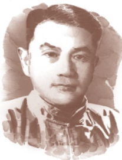

# 安塞腰鼓

**【学科】** 语文 | **【学段/年级】** 初中八年级 | **【册次】** volume_2 | **【单元】** 第一单元  
**【作者/出处】** 刘成章 | **【体裁类别】** 散文

---

## 课文正文与教学内容

尔后最终永远明晰了的大彻大悟！

容不得束缚，容不得羁绊①，容不得闭塞。是挣脱了、冲破了、撞开了的那么一股劲！

好一个安塞腰鼓！

百十个腰鼓发出的沉重响声，碰撞在四野长着酸枣树的山崖上，山崖蓦然②变成牛皮鼓面了，只听见隆隆，隆隆，隆隆。

百十个腰鼓发出的沉重响声，碰撞在遗落了一切冗杂③的观众的心上，观众的心也蓦然变成牛皮鼓面了，也是隆隆，隆隆，隆隆。

隆隆隆隆的豪壮的抒情，隆隆隆隆的严峻的思索，隆隆隆隆的犁尖翻起的杂着草根的土浪，隆隆隆隆的阵痛的发生和排解……

好一个安塞腰鼓！

后生们的胳膊、腿、全身，有力地搏击着，疾速地搏击着，大起大落地搏击着。它震撼着你，烧灼着你，威逼着你。它使你从来没有如此鲜明地感受到生命的存在、活跃和强盛。它使你惊异于那农民衣着包裹着的躯体，那消化着红豆角角老南瓜的躯体，居然可以释放出那么奇伟磅礴的能量！

黄土高原啊，你生养了这些元气淋漓的后生；也只有你，才能承受如此惊心动魄的搏击！

多水的江南是易碎的玻璃，在那儿，打不得这样的腰鼓。

除了黄土高原，哪里再有这么厚这么厚的土层啊！

好一个黄土高原！好一个安塞腰鼓！

每一个舞姿都充满了力量。每一个舞姿都呼呼作响。每一个舞姿都是光和影的匆匆变幻。每一个舞姿都使人战栗在浓烈的艺术享受中，使人叹为观止④。

“好一个安塞腰鼓！”在文中重复多次，注意体会其作用。

---

最后一句话营造出一种怎样的意境？体会结尾的妙处。

## 阅读提示

好一个痛快了山河、蓬勃了想象力的安塞腰鼓！

.

...

愈捶愈烈！痛苦和欢乐，生活和梦幻，摆脱和追求，都在这舞姿和鼓点中，交织！旋转！凝聚！奔突！辐射！翻飞！升华！人，成了茫茫一片；声，成了茫茫一片……

当它戛然而止①的时候，世界出奇地寂静，以至使人感到对她十分陌生了。

简直像来到另一个星球。

耳畔是一声渺远的鸡啼。

安塞腰鼓素以粗犷豪放、刚健雄浑著称。为了展现其力量之美，文章极力铺陈，写得汪洋恣肆，慷慨激昂。例如写腰鼓表演临近高潮，用“交织”“旋转”“凝聚”“奔突”“辐射”“翻飞”“升华”等一连串动词，令人仿佛置身于沸腾的群舞中，应接不暇。

文章句式丰富多样，短句急促有力，长句酣畅淋漓，句式的使用紧密配合氛围的变化；大量运用排比、反复、比喻等修辞手法，让充满激情的语言相互碰撞、应和，汇成一股排山倒海的气势。这是一篇适合朗读的文章，大声朗读几遍，自然能感受到其中强烈的生命律动。

## 读读写写

<html><body><table border="1"><tr><td></td><td></td><td></td><td></td><td></td><td></td><td></td><td></td><td></td><td></td><td></td><td></td><td></td><td></td><td></td><td></td><td></td><td></td></tr><tr><td></td><td></td><td></td><td></td><td></td><td></td><td></td><td></td><td></td><td></td><td></td><td></td><td></td><td></td><td></td><td></td><td></td><td></td></tr><tr><td></td><td></td><td></td><td></td><td></td><td></td><td></td><td></td><td></td><td></td><td></td><td></td><td></td><td></td><td></td><td></td><td></td><td></td></tr></table></body></html>

---

# 4灯笼

吴伯箫

吴伯箫

虽不像扑灯蛾，爱光明而至焚身，小孩子喜欢火，喜欢亮光，却仿佛是天性。放在暗屋子里就哭的宝儿，点亮了灯哭声就止住了。岁梢寒夜，玩火玩灯，除夕燃滴滴金②，放焰火，是孩子群里少有例外的事。尽管大人们怕火火烛烛的危险，要说“玩火黑夜溺③炕”那种迹近恐吓的话，但偷偷还要在神龛里点起烛来。

连活活的太阳算着，一切亮光之中，我爱皎洁的月华，如沸的繁星，同一支夜晚来挑着照路的灯笼。提起灯笼，就会想起三家村的犬吠，村中老头呵狗的声音；就会想起庞大的晃荡着的影子，夜行人咕咕噜噜的私语；想起祖父雪白的胡须，同洪亮大方的谈吐；坡野里想起跳跳的磷火；村边社戏台下想起闹嚷嚷的观众、花生篮、冰糖葫芦，台上的小丑、花脸、《司马懿探山》④。真的，灯笼的缘结得太多了，记忆的网里挤着的就都是。

记得，做着公正乡绅的祖父，晚年每每被邀去五里遥的城里说事，一去一整天。回家总是很晚的。凑巧若是没有月亮的夜，长工李五和我便须应差去接。伴着我们的除了李老五的叙家常，便是一把腰刀、一具灯笼。那时自己对人情世故还不懂，好听点说，心还像素丝样纯洁，什么争讼吃官司，是不在自己意识领域的。祖父好，在路上轻易不提斡旋⑤着的情事，倒是一路数着牵牛织女星谈些进京赶考的掌故—雪夜驰马，荒郊店宿，每每令人忘路之远近。村犬遥遥向灯笼吠了，认得了是主人，近前来却又大摇其尾巴。到家常是二更
