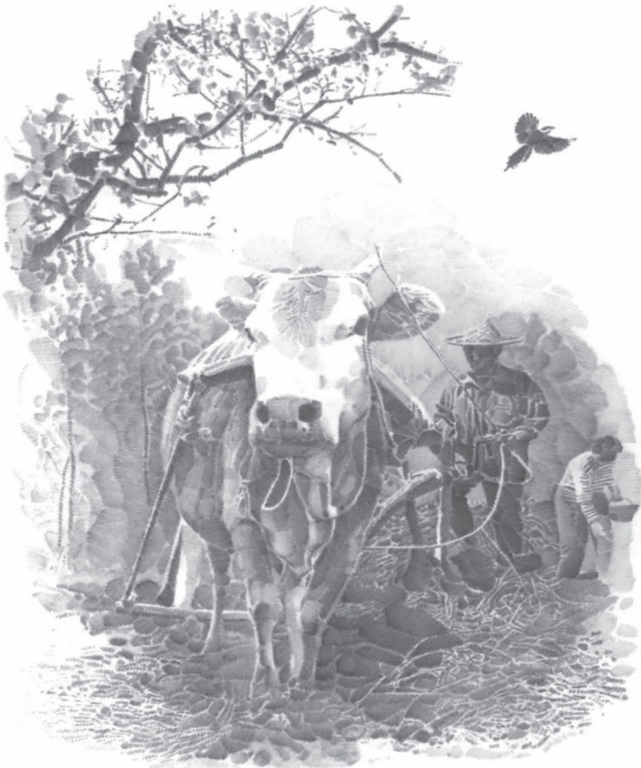

# 大自然的语言

## 5 大自然的语言

竺可桢

竺可桢

## 预习

人类有语言，大自然也有自己的“语言”。“七九河开，八九雁来；九九加一九，耕牛遍地走。”“清明忙种麦，谷雨种大田。”你还知道哪些“大自然的语言”?

物候学研究的许多自然现象与人类的生活息息相关。作者介绍这门学科时，结合实例，娓娓道来，条理清晰，语言准确。快速浏览课文，了解文章的主要内容。

立春过后，大地渐渐从沉睡中苏醒过来。冰雪融化，草木萌发，各种花次第②开放。再过两个月，燕子翩然③归来。不久，布谷鸟也来了。于是转入炎热的夏季，这是植物孕育果实的时期。到了秋天，果实成熟，植物的叶子渐渐变黄，在秋风中簌簌地落下来。北雁南飞，活跃在田间草际的昆虫也都销声匿迹④。到处呈现一片衰草连天的景象，准备迎接风雪载途⑤的寒冬。在地球上温带和亚热带区域里，年年如是，周而复始。

几千年来，劳动人民注意了草木荣枯、候鸟去来等自然现象同气候的关系，据以安排农事。杏花开了，就好像大自然在传语要赶快耕地；桃花开了，又好像在暗示要赶快种谷子。布谷鸟开始唱歌，劳动人民懂得它在唱什么：

“阿公阿婆，割麦插禾①。”这样看来，花香鸟语，草长莺飞，都是大自然的语言。

这些自然现象，我国古代劳动人民称它为物候。物候知识在我国起源很早。古代流传下来的许多农谚②就包含了丰富的物候知识。到了近代，利用物候知识来研究农业生产，已经发展为一门科学，就是物候学。物候学记录植物的生长荣枯，动物的养育往来，如桃花开、燕子来等自然现象，从而了解随着时节推移的气候变化和这种变化对动植物的影响。

物候观测使用的是“活的仪器”，是活生生的生物。它比气象仪器复杂得多，灵敏得多。物候观测的数据反映气温、湿度等气候条件的综合，也反映气候条件对于生物的影响。应用在农事活动里，比较简便，容易掌握。物候对于农业的重要性就在这里。下面是一个例子。

北京的物候记录，1962年的山桃、杏花、苹果、榆叶梅①、西府海棠、丁香、刺槐的花期比1961年迟十天左右，比1960年迟五六天。根据这些物候观测资料，可以判断北京地区1962年农业季节来得较晚。而那年春初种的花生等作物仍然是按照往年日期播种的，结果受到低温的损害。如果能注意到物候延迟，选择适宜的播种日期，这种损失就可能避免。

物候现象的来临决定于哪些因素呢?

首先是纬度。越往北桃花开得越迟，候鸟也来得越晚。值得指出的是物候现象南北差异的日数因季节的差别而不同。我国大陆性气候显著，冬冷夏热。冬季南北温度悬殊，夏季却相差不大。在春天，早春跟晚春也不相同。如在早春三四月间，南京桃花要比北京早开二十天，但是到晚春五月初，南京刺槐开花只比北京早十天。所以在华北常感觉到春季短促，冬天结束，夏天就到了。

经度的差异是影响物候的第二个因素。凡是近海的地方，比同纬度的内陆，冬天温和，春天反而寒冷。所以沿海地区的春天的来临比内陆要迟若干天。如大连纬度在北京以南约1°，但是在大连，连翘②和榆叶梅的盛开都比北京要迟一个星期。又如济南苹果开花在四月中或谷雨节，烟台要到立夏。两地纬度相差无几，但烟台靠海，春天便来得迟了。

影响物候的第三个因素是高下的差异。植物的抽青、开花等物候现象在春夏两季越往高处越迟，而到秋天乔木的落叶则越往高处越早。不过研究这个因素要考虑到特殊的情况。例如秋冬之交，天气晴朗的空中，在一定高度上气温反比低处高。这叫逆温层。由于冷空气比较重，在无风的夜晚，冷空气便向低处流。这种现象在山地秋冬两季，特别是这两季的早晨，极为显著，常会发现山脚有霜而山腰反无霜。在华南丘陵区把热带作物引种在山腰很成功，在山脚反不适宜，就是这个道理。

此外，物候现象来临的迟早还有古今的差异。根据英国南部物候的一种长期记录，拿1741到1750年十年平均的春初七种乔木抽青和开花日期同1921到

1930年十年的平均值相比较，可以看出后者比前者早九天。就是说，春天提前九天。

物候学这门科学接近生物学中的生态学①和气象学中的农业气象学。物候学的研究首先是为了预报农时，选择播种日期。此外还有多方面的意义。物候资料对于安排农作物区划，确定造林和采集树木种子的日期，很有参考价值，还可以利用来引种植物到物候条件相同的地区，也可以利用来避免或减轻害虫的侵害。我国有很大面积的山区土地可以耕种，而山区的气候、土壤对农作物的适应情况，有很多地方还有待调查。为了便利山区的农业发展，开展山区物候观测是必要的。

物候学是关系到农业丰产的科学，我们要进一步加强物候观测，懂得大自然的语言，争取农业更大的丰收。

## 思考探究

—本文题为《大自然的语言》，主要是讲物候现象，你能概括一下“物候”是什么吗？

二阅读相关段落，体会课文说明事理的严密性，回答下列问题。

1.第1一3段是怎样将“物候”这一科学概念一步步引出来的？

2.第7一10段说明物候现象来临的决定因素，采用了怎样的说明顺序？你认为这样的顺序安排是出于什么考虑？

三说明事理有许多方法，如举例子、作比较、列数字、引用等。试从课文中各找出一个例子，说说其作用。

## 积累拓展

四比较下面两段文字的不同特点，体会说明语言的生动性和准确性。

1．杏花开了，就好像大自然在传语要赶快耕地；桃花开了，又好像在暗示要赶快种谷子。布谷鸟开始唱歌，劳动人民懂得它在唱什么：“阿公阿婆，割麦插禾。”

2.此外，物候现象来临的迟早还有古今的差异。根据英国南部物候的一种长期记录，拿1741到1750年十年平均的春初七种乔木抽青和开花日期同1921到1930年十年的平均值相比较，可以看出后者比前者早九天。就是说，春天提前九天。

五这篇文章总结了物候现象来临的四个决定因素。课外查找资料，或根据自己的观察、体验，为课文补充一些例证，还可以探究一下是否有其他决定因素，与同学交流。

## 读读写写

<html><body><table border="1"><tr><td>萌</td><td>发</td><td></td><td></td><td></td><td></td><td></td><td></td><td></td><td></td><td></td><td></td><td></td><td></td><td></td><td></td><td></td></tr><tr><td>悬</td><td>殊</td><td></td><td></td><td></td><td></td><td></td><td></td><td></td><td></td><td></td><td></td><td></td><td></td><td></td><td></td><td></td></tr><tr><td>草</td><td>长</td><td>莺</td><td>飞</td><td></td><td></td><td></td><td></td><td></td><td></td><td></td><td></td><td></td><td></td><td></td><td></td><td></td></tr></table></body></html>

## 句子结构要完整

读读下面这两个句子，看看它们存在什么问题：

（1）看到同志们的认真负责，使我很受教育。

（2）她给我描绘了除夕农民包饺子，守岁守到深夜，初一清晨全家在一起，吃饺子，放鞭炮。

这两个句子共同的问题在于缺少了某个必要的句子成分。句（1）的前一分句省略主语，而后一分句又用“使”开头，这样句子就没有了主语。去掉“看到”或“使”，句子就完整了。句（2）的“描绘”后边本应有一个宾语的中心语(如“情景”)，但由于定语太长，结果漏掉了宾语的中心语。

司名..句子认真读几遍，必要时用上“提取主干”的方法，就不难发现这类语病。
