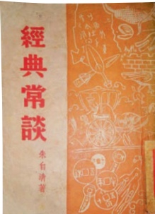

# 名著导读：《经典常谈》

**【学科】** 语文 | **【学段/年级】** 初中八年级 | **【册次】** volume_2 | **【单元】** 第二单元  
**【作者/出处】** 朱自清 | **【体裁类别】** 名著导读

---

## 课文正文与教学内容

# 《经典常谈》选择性阅读

先生一向在发扬、介绍、修正、推进我国传统文化上做功夫，虽说一点一滴、一瓶一钵，却朴实无夸，极其切实。再加上一副冲淡夷旷的笔墨，往往能把顶笨重的事实或最繁复的理论，处分得异常轻盈生动，使人读了先生的文章，不惟忘倦，且可不费力地心领神会。这本《经典常谈》就是我这话一个确切的明证。

——吴小如

书中随处可见那一时代学者共有的严谨的治学方法，并不时闪现真知灼见。他的文化观、历史观，不拘守一家之说，新旧兼容，通达平和，足以给后学者有益的启示。

钱伯城

朱自清不仅是在新诗和散文创作上卓有成就的文学大家，也是对我国传统文化特别是古典文学有深入研究的学者。《经典常谈》是他在20世纪30年代末到40年代初为中学生撰写的一部介绍我国传统文化经典的著作。全书共13篇，介绍了《说文解字》《周易》《史记》等经典著作，并概述了诸子百家、辞赋和历代诗文的情况，以此展示我国古代思想文化的基本面貌。这本书自出版以来，深受广大读者喜爱，产生了很大影响。

以现代的、科学的学术观念研究传统典籍，这是新文化运动开辟的道路。朱自清也是按照这一原则来撰写《经典常谈》的。例如讨论儒家经书时，破除“经书都是圣人所作”的传说，从古代社会生活和思想状况去认识这些典籍的形成，提出了许多精彩的见解。这正体现了现代学术摈弃一味“尊经”“崇古”的旧习，实事求是地审视传统文化的精神。

朱自清的传统文化研究，不只注意到学术的高度和深度，更注意到大众所能接受的广度。他时时留意《经典常谈》是一本写给中学生看的书，格外重视这本书的普及性和通俗性。全书不夸奇炫博，不故作高深，读起来明快利落，不蔓不枝。这种学术写作的境界，不是轻易能够达到的。

《经典常谈》也可以看作一本精彩的学术散文集。这本书不“板着脸说话”，也不平铺直叙，而是以流利畅达的语言娓娓道来，常有引人入胜之处。例如写战国时期的

---

说客：“他们的说辞却不像春秋的辞命那样从容宛转了。他们铺张局势，滔滔不绝，真像背书似的；他们的话，像天花乱坠，有时夸饰，有时诡曲，不问是非，只图激动人主的心。”（《文第十三》）像这样生动传神的精彩笔墨，书中还有很多，让读者能够饶有兴味地了解一个时代、一个群体或一类作品的风貌。

朱自清在《经典常谈》的序言里说，他写这部书，是为了给希望读些经典的中学生做个向导，指点阅读门径，让他们面对浩如烟海的古代典籍不至于茫然无措。叶圣陶曾说，我们读《经典常谈》，切不可死记硬背“书籍名，作者名，作者时代，书籍卷数”这类“不能叫学生得到真实的受用”的知识，要注重了解“古书的来历，其中的大要，历来对于该书有什么问题，直到现在为止，对于该书已经研究到什么程度”，“因这本书的导引，去接触古书”(《读〈经典常谈〉》)。同学们读了《经典常谈》，“把它当作一只船，航到经典的海里去”，这正是朱自清在书中寄寓的殷切希望。

## 读书方法指导

选择性阅读是一种理性的、目的性很强的阅读方式，它往往与阅读者的兴趣、目的密不可分。我国古代学者很重视选择性阅读。苏轼就曾说“书富如入海，百货皆有，人之精力，不能兼收尽取”，所以他建议读书求学之人“每次作一意求之”（《又答王庠书》)，也就是每次阅读只关注某一方面的内容，不贪多求全。我们今天所处的时代，是一个信息爆炸的时代。知识增长的速度大大超过个人的接受速度，引发了学习方式的变革，选择性阅读也变得更加重要。

读整本书，特别是读大部头或内容涉及面较广的作品时，不见得所有的内容都能引起你的兴趣，这时不妨首先选择自己最感兴趣的部分作为切入点。例如读《经典常谈》，如果对古代文学感兴趣，可以先读《诗第十二》《文第十三》两篇；如果对历史感兴趣，则可以从《〈战国策〉第八》《〈史记〉〈汉书〉第九》读起。当然，在重点阅读自己感兴趣的部分的同时，也可以注意寻找新的兴趣点，由此扩展到其他部分，进而阅读整本书。比如在读《文第十三》的过程中，对战国时期的说客产生了兴趣，那就不妨回过头去读对这个群体有着更详细介绍的《<战国策〉第八》。

有时，我们是带着某个具体目的去阅读的，如与课内学习沟通衔接，或解决学习过程中遇到的某个问题，或为正在开展的研究打开思路、寻找资料，等等。这种情况下，可以直接根据目的去选择书中你最需要的内容来阅读。比如学过《<诗经〉二首》之后，你希望拓展了解关于《诗经》的更多知识，就可以去读《经典常谈》中的《<诗经〉第四》；又如你正在与同学开展以汉字文化为主题的研究性学习，就可以去

---

读《经典常谈》中的《〈说文解字〉第一》。

为了更好地进行选择性阅读，需要首先对全书的内容和结构有所了解，最简便的方式就是浏览目录。比如《经典常谈》，从目录就能知道，全书十三篇，每篇谈一种或一类经典，这样就可以根据兴趣或目的加以选择。但有些书的目录没有提供足够的信息，这就需要先大致浏览全书，了解其概貌，再选择感兴趣的或有需要的部分来精读。

## 专题探究

全班共同阅读《经典常谈》，然后根据各自的兴趣选择自己喜欢的专题，也可以另外选择专题，分小组进行探究。

## 专题一：和朱自清一起“谈”经典

这本书介绍了许多传统文化经典。选择你感兴趣的一种，比如《论语》或李白、杜甫的诗，先精读《经典常谈》中的内容，再选读相关经典中你比较熟悉的部分，看看朱自清所“谈”的对你更好地理解经典有哪些帮助，并向同学们谈谈你对经典的新认识。

## 专题二：我向大家介绍经典

朱自清谦称《经典常谈》中“各篇的讨论，尽量采择近人新说”，并没有自己的观点。其实，选择什么样的说法介绍给读者，也能显示出作者的学术眼光与功底。选择《经典常谈》中的一篇深入研读，边读边做好读书笔记，记下重要的事实、主要的观点和自己的心得。根据读书笔记，向全班同学介绍你研读的经典。

## 专题三：读经典的意义

习近平总书记强调，中华优秀传统文化是中华文明的智慧结晶和精华所在，是中华民族的根和魂，是我们在世界文化激荡中站稳脚跟的根基。读了《经典常谈》，你对于当代中学生阅读传统文化经典的意义有哪些认识？以《读经典的意义》为题写一篇短文，谈谈你的看法。

## 自主阅读推荐

## 朱光潜《给青年的十二封信》

作为中学生的你，告别了懵懂的童年，也许开始对很多事物产生迷茫。你是否有时
