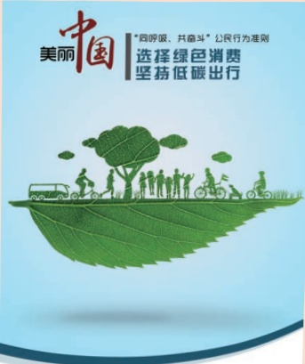
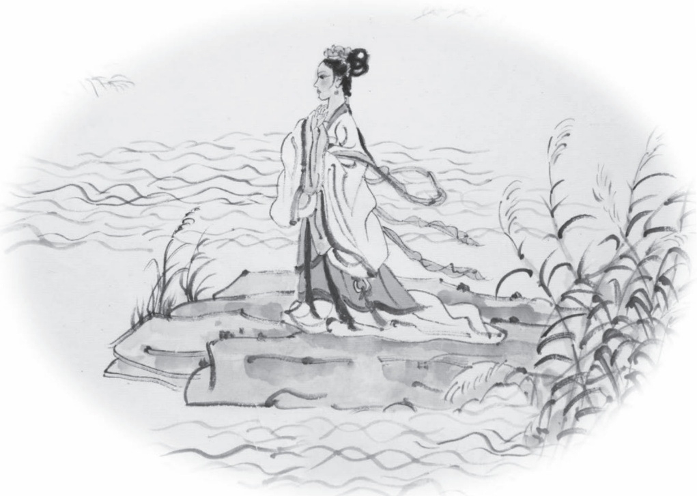
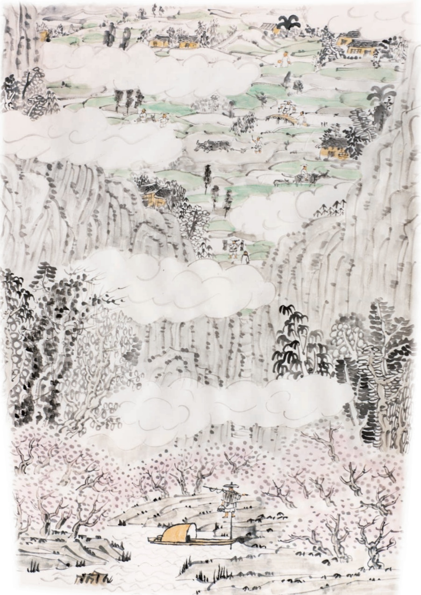

# 写作 实践

## 写作实践

你有自己特别熟悉、喜欢的小天地吧？比如你自已的房间、你在教室里的座位、校园里的某个角落等。以“我的小天地”为话题，写一个片段，向别人介绍它。200字左右。

## 提示：

1.确定说明对象后，先考虑写哪些内容，然后选择合适的说明顺序。

2.写作中，注意准确使用方位词，这样能使介绍更加清楚。

二智能手机、平板电脑、电视机顶盒、无线路由器……，我们生活中的科技新产品层出不穷。选择一种产品，写一篇文章介绍它的功能和使用方法。不少于600字。

## 提示：

1.可以设想一个特定的读者，比如一位长辈，他对你所介绍的产品或技术不太了解，尽量用他能够理解的话进行说明。

2.为了使行文活泼，也可以采用问答的形式来组织全文，但注意要写成说明文，不要写成叙述类文章。

三你生活在城市还是农村？这几年来，你觉得周围的环境有了哪些变化？原因是什么？以“我周围的环境”为话题，写一篇事理说明文，题目自拟。不少于600字。

提示：

1.确定说明对象，如空气、水质、植被、交通状况等，写出它的变化。

2.查找相关资料，说明变化的原因。

3.注意安排好说明顺序。

## 倡导低碳生活

大自然是人类赖以生存发展的基本条件。尊重自然、顺应自然、保护自然，是全面建设社会主义现代化国家的内在要求。我们应当牢固树立和践行绿水青山就是金山银山的理念，倡导简约适度、绿色低碳的生活方式。

班级分工合作，参考“资料夹”中的资料，组织一次主题宣传活动，宣传低碳生活、绿色环保的理念。

## 一、 确定宣传主题

阅读“资料一”，并搜集一些资料，了解什么是低碳生活，以及践行低碳生活的一些原则、做法。围绕“低碳生活，我们可以做什么”的话题，全班一起讨论，确定各组的宣传点。

## 二、 搜集资料，撰写宣传文稿

1．围绕专题，了解相关知识。可以从一些权威网站搜集最新的可靠数据，也可以从地理课本、百科全书中找相应的介绍，还可以访问权威人士，咨询相关学科老师。

2.实地考察，获取直接资料。走出校园，用笔记录，用相机拍摄。例如：选择一条经过治理变得清澈的小河，采访熟悉相关情况的人，了解小河是怎样“复活”的；拍摄小河附近的风景和人们的活动，展现低碳生活的美好。

3.参阅“资料二”“资料三”，撰写宣传文稿。宣传文稿，既要有客观的资料呈现，又要融入自己的感受和思考，还要提出一些切实可行的措施，方便大家践行。

文字资料和图片资料相配合，更能吸引人的目光。

客观的数据和图表，能提升宣传材料的可信度。

带有诗情画意的描述，更容易打动观者的心。

编写几句朗朗上口的宣传口号，创作一支宣传歌曲，宣传效果会加倍。

## 三、 制作宣传材料，开展宣传

1．将搜集到的资料分成不同栏目或板块，制作成宣传材料。形式可以多样，展板、小册子、海报、标语均可。司

2.带着宣传材料，在学校或社区开展宣传，介绍相关环保理念，并提示大家如何践行。宣传活动中，采取环保方式。宣传结束，注意清理活动产生的垃圾。

## 资料夹

## 资料一：习近平总书记有关低碳生活的部分论述

建立绿色低碳发展的经济体系，促进经济社会发展全面绿色转型，才是实现可持续发展的长久之策。要加快形成绿色低碳交通运输方式，加强绿色基础设施建设，推广新能源、智能化、数字化、轻量化交通装备，鼓励引导绿色出行，让交通更加环保、出行更加低碳。

]

式

——2021年12月8日，在中央经济工作会议上的讲话

## 资料二：二氧化碳排放量如何计算

石油及其制品、天然气等）所得到的热能发电的。节约化石能源和使用可再生能源，是减少二氧化碳排放的两个关键。那么，如何计算二氧化碳减排量的多少呢？以发电厂为例，节约1千瓦时（度）电或1千克煤到底减排了多少“二氧化碳”?

根据专家统计：每节约1千瓦时电，就相应节约了0.4千克标准煤，同时减少污染排放0.272千克碳粉尘、0.997千克二氧化碳、0.03千克二氧化硫、0.015千克氮氧化物。

由此可推算出以下公式：节约1千瓦时电=减排0.997千克二氧化碳；

节约1千克标准煤=减排2.493千克二氧化碳。

（说明：以上电的折标煤按等价值，即系数为1千瓦时电=0.4千克标准煤，而1千克原煤=0.7143千克标准煤。)

在日常生活中，每个人也能以自身的行为方式，为节能减排出一份力。以下是生活中二氧化碳排放量的基本计算公式：

家居用电的二氧化碳排放量（千克）=耗电量（千瓦时）×0.785；开车的二氧化碳排放量（千克)=油耗（升）×0.785;

短途飞机旅行（200千米以内）的二氧化碳排放量=千米数×0.275；

中途飞机旅行（200千米到1000千米）的二氧化碳排放量=55+0.105×(千米数-200);

长途飞机旅行（1000千米以上）的二氧化碳排放量=千米数×0.139。——2009年12月10日《中国环境报》

## 资料三：

2015年1月，《“同呼吸、共奋斗”公民行为准则》公益宣传海报由环境保护部面向社会发布。该套海报一共四张，依据环境保护部2014年8月发布的《“同呼吸、共奋斗”公民行为准则》设计制作，旨在倡导公众关注空气质量，养成节电习惯，选择绿色消费，共建美丽中国。下图是其中的一张。

购买绿色产品，循环利用物品优先乘坐公交，尽量骑车步行中华人民共和国环 

资料夹

资料四：《中国应对气候变化的政策与行动》前言

气候变化是全人类的共同挑战。应对气候变化，事关中华民族永续发展，关乎人类前途命运。

中国高度重视应对气候变化。作为世界上最大的发展中国家，中国克服自身经济、社会等方面困难，实施一系列应对气候变化战略、措施和行动，参与全球气候治理，应对气候变化取得了积极成效。

中共十八大以来，在习近平生态文明思想指引下，中国贯彻新发展理念，将应对气候变化摆在国家治理更加突出的位置，不断提高碳排放强度削减幅度，不断强化自主贡献目标，以最大努力提高应对气候变化力度，推动经济社会发展全面绿色转型，建设人与自然和谐共生的现代化。2020年9月22日，中国国家主席习近平在第七十五届联合国大会一般性辩论上郑重宣示：中国将提高国家自主贡献力度，采取更加有力的政策和措施，二氧化碳排放力争于2030年前达到峰值，努力争取2060年前实现碳中和。中国正在为实现这一目标而付诸行动。

作为负责任的国家，中国积极推动共建公平合理、合作共赢的全球气候治理体系，为应对气候变化贡献中国智慧中国力量。面对气候变化严峻挑战，中国愿与国际社会共同努力、并肩前行，助力《巴黎协定》行稳致远，为全球应对气候变化作出更大贡献。

——国务院新闻办公室2021年10月27日发表的《中国应对气候变化的政策与行动》白皮书

## 第三单元

自然美景，幸福生活，人所向往；奇绝艺人，精湛技艺，令人赞叹。这个单元所选古诗文，有的记事，有的记游，有的状物，有的抒情。阅读这些诗文，能够让我们了解古人的思想、情趣，感受他们的智慧，受到美的熏陶和感染。

学习本单元，要先借助注释和工具书读懂课文大意，然后通过反复诵读，领会诗文的丰富内涵，品味精美的语言，并积累一些常用的文言词语。

村中闻有此人，咸①来问讯。自云先世避秦时乱，率妻子②邑人来此绝境③，不复出焉，遂与外人间隔④。问今是何世，乃⑤不知有汉，无论⑥魏晋。此人一一为具言⑦所闻，皆叹惋③。余人各复延⑨至其家，皆出酒食。停数日，辞去。此中人语云⑩：“不足为外人道也。”

既出，得其船，便扶向路，处处志之。及郡下④，诣太守，说如此。太守即遣人随其往，寻向所志，遂迷，不复得路。

南阳⑥刘子骥，高尚士也，闻之，欣然规往。未果，寻病终。后遂无问津者。

## 思考探究

一在读懂课文的基础上，简要讲述这个故事，并背诵全文。

二桃花林的景色和桃花源中的景象有所不同。默读课文前两段，想象其中的画面，说说这些画面给你的感受。

三本文笔法简洁而内涵丰富，试依据课文内容回答问题。

1.此人一一为具言所闻，皆叹惋。

（渔人“具言”的是什么？桃花源中人为什么“叹惋”？）

2.诣太守，说如此。

（这句话中的“如此”包括哪些内容？如果把这些内容一一写出来，表达效果会有什么不同？）

〔不足〕不值得，不必。

①②〔便扶向路〕就顺着旧路（回去）。扶，沿着、

顺着。向，先前的。

①③〔志〕做记号。

①〔及郡下〕到了郡城。及，到。郡，指武陵郡。

5〔诣（yì)〕拜访。

①⑥〔南阳〕郡名，在今河南南阳一带。

①⑦〔刘子骥〕名辚（lín）之，字子骥，《晋书·隐

逸传》里说他“好游山泽”。

⑧〔规〕打算，计划。

9〔未果〕没有实现。

②0〔寻〕随即，不久。

②〔问津〕询问渡口。这里是“访求、探求”的

意思。

四解释下列加点的词。

1.武陵人捕鱼为业2.便舍船，从口入不足为外人道也土地平旷，屋舍俨然3.见渔人，乃大惊4.寻向所志乃不知有汉，无论魏晋未果，寻病终

五古代汉语中有些词语在现代汉语中仍然使用，但是意思已经发生了变化。解释下列加点的词语，注意它们在句中的含义与现代汉语常用义的区别。

1.芳草鲜美，落英缤纷

2.阡陌交通，鸡犬相闻

3.率妻子邑人来此绝境，不复出焉

4.乃不知有汉，无论魏晋

六结合课文及下面节引的《桃花源诗》中的诗句，讨论：“世外桃源”有哪些吸引人的地方？作者借桃花源表达了怎样的社会理想?

相命肆农耕①，日入从所憩②。桑竹垂余荫，菽稷③随时艺④。春蚕收长丝，秋熟靡⑤王税。荒路暖交通，鸡犬互鸣吠。俎豆犹古法⑦，衣裳无新制。童孺纵行歌，斑白欢游诣。

①相命肆农耕：桃花源中人互相勉励致力于耕

田。肆，尽力。

②憩(qì)：休息。

③菽（shū）稷（jì)：泛指粮食作物。

④艺：种植。

⑤靡：无。

⑥暖(ài)：遮蔽。

⑦俎（zǔ）豆犹古法：按照古制进行祭祀。俎

豆，古代祭祀时用的礼器。

⑧斑白：头发花白，指老人。
