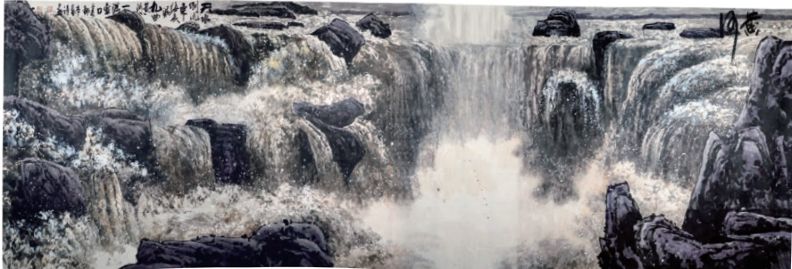

# 壶口瀑布

# 17壶口瀑布

梁衡

预习

壶口瀑布位于黄河中游秦晋大峡谷，河床至此非常狭窄，形如“壶口”，河水急跌而下，汹涌奔腾，声震天地。本文描绘的就是这一胜景。初读课文，感受壶口瀑布的磅礴气势。

细读课文，注意体会作者遣词造句的特点，欣赏精妙的语句。

壶口在晋陕两省的边境上，我曾两次到过那里。

第一次是雨季，临出发时有人告诫：“这个时节看壶口最危险，千万不要到河滩里去，赶巧上游下雨，一个洪峰下来，根本来不及上岸。”果然，车还在半山腰就听见涛声隐隐如雷，河谷里雾气弥漫，我们大着胆子下到滩里，那河就像一锅正沸着的水。壶口瀑布不是从高处落下，让人们仰观垂空的水幕，而是由平地向更低的沟里跌去，人们只能俯视被急急吸去的水流。其时，正是雨季，那沟已被灌得浪沫横溢，但上面的水还是一股劲地冲进去，冲进去……我在雾中想寻找想象中的飞瀑，但水浸沟岸，雾罩乱石，除了扑面而来的水汽，震耳欲聋的涛声，什么也看不见，什么也听不见，只有一个可怕的警觉：仿佛突然就要出现一个洪峰将我们吞没。于是，只急慌慌地扫了几眼，我便匆匆逃离，到了岸上回望那团白烟，心还在不住地跳……

第二次我专选了个枯水季节。春寒刚过，山还未青，谷底显得异常开阔。我们从从容容地下到沟底，这时的黄河像是一张极大的石床，上面铺了一层软软的细沙，踏上去坚实而又松软。我一直走到河心，原来河心还有一条河,是突然凹下去的一条深沟，当地人叫“龙槽”，槽头入水处深不可测，这便是

“壶口”。我依在一块大石头上向上游看去，这龙槽顶着宽宽的河面，正好形成一个“丁”字。河水从五百米宽的河道上排排涌来，其势如千军万马，互相挤着、撞着，推推搡搡，前呼后拥，撞向石壁，排排黄浪霎时碎成堆堆白雪。山是青冷的灰，天是寂寂的蓝，宇宙间仿佛只有这水的存在。当河水正这般畅畅快快地驰骋着时，突然脚下出现一条四十多米宽的深沟，它们还来不及想一下，便一齐跌了进去，更闹，更挤，更急。沟底飞转着一个个漩涡，当地人说，曾有一头黑猪掉进去，再漂上来时，浑身的毛竟被拔得一根不剩。我听了不觉打了一个寒噤①。

《壶口瀑布》都本基作

黄河在这里由宽而窄，由高到低，只见那平坦如席的大水像是被一个无形的大洞吸着，顿然拢成一束，向龙槽里隆隆冲去，先跌在石上，翻个身再跌下去，三跌，四跌，一川大水硬是这样被跌得粉碎，碎成点，碎成雾。从沟底升起一道彩虹，横跨龙槽，穿过雾霭，消失在远山青色的背景中。当然这么窄的壶口一时容不下这么多的水，于是洪流便向两边涌去，沿着龙槽的边沿轰然而下，平平的，大大的，浑厚庄重如一卷飞毯从空抖落。不，简直如一卷钢板出轧②，的确有那种凝重，那种猛烈。尽管这样，壶口还是不能尽收这一川黄浪，于是又有一些各自夺路而走的，乘隙而进的，折返迂回的，它们在龙槽两边的滩壁上散开来，或钻石觅缝，汩汩③如泉；或淌过石板，潺潺成溪；或被夹在石间，哀哀打旋④。还有那顺壁挂下的，亮晶晶的如丝如缕……而这一切都隐在湿漉漉的水雾中，罩在七色彩虹中，像一曲交响乐，一幅写意画。我突

然陷入沉思，眼前这个小小的壶口，怎么一下子集纳了海、河、瀑、泉、雾所有水的形态，兼容了喜、怒、哀、怨、愁——人的各种感情。造物者难道是要在这壶口中浓缩一个世界吗?

看罢水，我再细观脚下的石。这些如钢似铁的顽物竟被水凿得窟窟窍窍，如蜂窝杂陈，更有一些地方被旋出一个个光溜溜的大坑，而整个龙槽就是这样被水齐齐地切下去，切出一道深沟。人常以柔情比水，但至柔至和的水一旦被压迫竟会这样怒不可遏①。原来这柔和之中只有宽厚绝无软弱，当她忍耐到一定程度时就会以力相较，奋力抗争。据《元和郡县图志》②中所载，当年壶口的位置还在这下游一千五百米处。你看，日夜不止，这柔和的水硬将铁硬的石寸寸地剁去。

黄河博大宽厚，柔中有刚；挟而不服，压而不弯；不平则呼，遇强则抗；死地必生，勇往直前。正像一个人，经了许多磨难便有了自己的个性；黄河被两岸的山、地下的石逼得忽上忽下、忽左忽右时，也就铸成了自己伟大的性格。这伟大只在冲过壶口的一刹那才闪现出来被我们看见。

1986年6月

## 思考探究

阅读课文，说说课文分别写了壶口瀑布在雨季和枯水季节的哪些特点。作者写了壶口瀑布的水之后，为什么又写“脚下的石”?

二作者在枯水期来到壶口瀑布，采用了独到的观察角度，写出了独特的景物特征。试结合课文做具体分析。

三作者一边记述所见景象，一边表达自己的感受。找出作者表达感受的文字，说说你的理解。

## 积累拓展

四反复阅读课文第3、4段，品味其语言的妙处，并试着写一段赏析文字。

五游记这一体裁，涉及内容广泛，写法自由，风格多样，读来既能增广见闻，也能带来美的享受，引发心灵的共鸣。课外阅读郁达夫《西溪的晴雨》、徐迟《黄山记》、王充闾《读三峡》等，体会它们在选材、构思、语言等方面的特点。

## 目读读写写

<html><body><table border="1"><tr><td>铸</td><td></td><td></td><td></td><td></td><td></td><td></td><td></td><td></td><td></td><td></td><td></td><td></td><td></td><td></td><td></td><td></td><td></td></tr><tr><td></td><td></td><td></td><td></td><td></td><td></td><td></td><td></td><td></td><td></td><td></td><td></td><td></td><td></td><td></td><td></td><td></td><td></td></tr><tr><td></td><td></td><td></td><td></td><td></td><td></td><td></td><td></td><td></td><td></td><td></td><td></td><td></td><td></td><td></td><td></td><td></td><td></td></tr></table></body></html>

## 句子成分搭配要恰当

句子成分之间的关系，实质上是语义的搭配关系。语义的搭配既要合乎事理，又要符合语言习惯，才能正确地表达思想。

句子成分的搭配，包括主干的搭配、修饰语和中心语的搭配等。检查句子成分搭配是否恰当，也可以采用“提取主干”的方法。

主干搭配不当，通常有主语和谓语搭配不当、动词和宾语搭配不当、主语和宾语搭配不当等几种情况。例如：

（1）全场的目光和掌声都集中到竖立在主席台前的旗杆上。

（2）今年麦子的收成是几年来麦子收成最好的一年。

句（1）的主干是“目光和掌声集中到旗杆上”，而“掌声”是不能“集中到旗杆上”的，这属于主语和谓语搭配不当；句（2）的主干是“收成是一年”，句意不通，这属于主语和宾语搭配不当。

定语、状语、补语等修饰成分与中心语的搭配也会出现不恰当的情况。例如：

南极洲恐龙化石的发现，强烈地证明地壳在进行缓慢但又不可抗拒的运动。状语“强烈”与中心语“证明”搭配不当，可改为“有力”。
