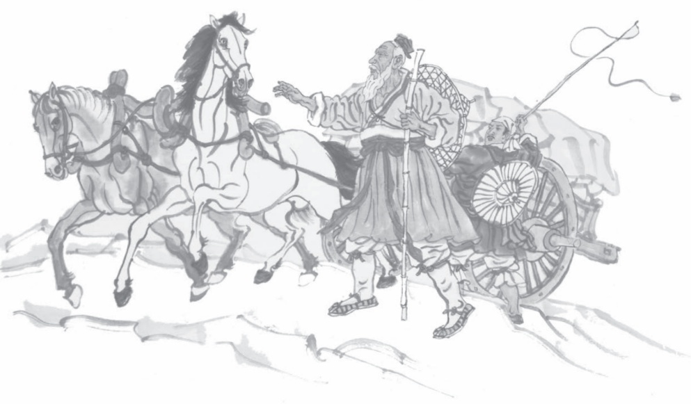

# 写作 实践

一篇好的游记，往往还具有知识性。读者不仅能够从中了解景物的美妙和作者的情怀，还能从中获得相关的知识。例如《在长江源头各拉丹冬》中谈到长江考察热及中外勇士的探险，《一滴水经过丽江》中谈到丽江的历史，谈到东巴文字，都增强了文章的可读性和文化气息。这就需要游览时用心搜集相关材料，在写作时恰如其分地运用。

## 写作实践

游记常常要对某处景物做定点观察，以写出景物的特点。选择一处自己游览过的景点，围绕其中一处风景，写一个片段。200字左右。

提示：

1.选择某一处风景来写，不要贪多，不要面面俱到。

2.细致观察，具体描绘该处风景，不要泛泛而谈。

3.描写风景时要融入一些个人感受，尽可能写出自己独特的体验。

二我们可能都有过旅游的经历。旅途中，我们不仅观赏自然风光，了解民风民俗，同时也会有许多新奇的感受，产生很多思考和遐想。选择一处自己游览过的景点，自拟题目，写一篇游记。不少于600字。

提示：

1.先画出当时的游览路线图，按游览顺序拟出写作提纲。

2.回想游览时最深的印象及总体感受，据此确定材料取舍与叙述详略。

3.在记叙或描写中融入自己的情感，也可以适当加入一些人文景观的介绍或引用他人的描写、评价等，以丰富文章内容。

## 三 参观一处纪念馆（或博物馆、展览馆），以《参观》为题，写一篇参观记。不少于600字。

提示：

1.参观时可以有意识地做一些记录，作为写作的素材。

2.参观过程中看到的东西不可能全都写进作文中，要有重点、有选择地写，做到主次分明，详略得当，重点突出。

3.参观的目的是开阔眼界，增长知识，接受教育。在适当的地方，要点出你所得到的教益或受到的启发。

## 口语交际

## 即席讲话

上课发言时，有些同学思路清晰，言辞流利；另一些同学则磕磕巴巴，语无伦次。其实课堂发言就是一种即席讲话，同学们的不同表现，有时与学习水平高低关系不大，却与能否熟练运用即席讲话的技巧密切相关。

即席讲话一般没有指定的题目，也没有充足的准备时间，事先应尽量了解要参加的活动，略做准备，做到心中有数。有了准备，就能缓解紧张的情绪，有利于临场发挥。

即席讲话，要根据特定的背景、场合决定说什么和怎么说，以取得较佳的讲话效果。有经验的讲话者常常能就地取材，以当时的人、事、景、物、情作为切入点，这样不仅能让自己的讲话妥当、得体，还容易引起听者的共鸣。除此之外，讲话者还要认真聆听，可以由他人的发言引出自己的话。

1929年1月，应教育家陶行知之邀，剧作家田汉率“南国社”来到位于南京郊区的晓庄师范，为师生和附近的农民表演话剧。在欢迎仪式上，陶行知即席致辞：

“今天我是以田汉’的资格欢迎田汉。晓庄是为农民而办的学校，农民是晓庄师生的好朋友。我们的教育是为种田汉而办的教育。……所以，我是以一个种田汉’代表的资格在这儿欢迎田汉。”

田汉随即致答辞：

“陶先生说，他是以田汉’的资格欢迎田汉，实不敢当！我是一个假田汉’，陶先生是个真田汉’，我这个假田汉’能够受到陶先生这个真田汉’以及在座的许多真田汉’的欢迎，实在感到荣幸。我们一定要向真田汉’学习！”

这样巧妙借“名”发挥，不但使讲话热情洋溢，趣味盎然，还表达了陶行知的平民教育思想和田汉“到民间去”的艺术主张，可谓辞理俱佳。

即席讲话不宜长篇大论，要观点明确，针对性强。不能模棱两可，含糊其词；也不能东拉西扯，离题万里。1936年10月22日，鲁迅先生的灵枢在上海万国公墓安葬，出版界代表邹韬奋即席讲话，他说：“今天天色不早，我愿用一句话来纪念鲁迅先生：有人是不战而屈，鲁迅先生是战而不屈。”邹韬奋的话既讽刺了投降派、软骨头，又赞颂了鲁迅先生勇敢战斗、决不屈服的可贵品格，而且切合主题，可谓态度鲜明，掷地有声。

成功的即席讲话，大多有着鲜明的语言特色，或机智敏捷，或幽默诙谐，或精练隽永，或简洁明快，或优美动人，或情真意切。想让自己的即席讲话给别人留下深刻

印象，平时就要注意多说多练，提高自己的口头表达能力。

## 口语实践

以小组为单位，每名同学提供两个话题，本组同学随机抽取，并就自己抽到的话题做两分钟的即席讲话。

## 提示：

1.可以把话题写在纸条上，将纸条混在一起，由同学们轮流抽取。

2.一名同学讲话时，其他同学要注意聆听，并在其讲完后讨论、评价，提出改进意见。

3.当众讲话时，感到紧张是正常的。可以通过深呼吸、微笑等方法来帮助自己放松下来。也可以默默地鼓励自己，以缓解紧张情绪。

## 二 从下列情境中选择一个，本组同学每人做3分钟左右的即席讲话。每组推选一名同学做代表，由语文老师指定情境和讲话时间，分别做即席讲话。

情境1：同学的生日聚会上送祝福

情境2：班会上分享个人读书经验

情境3：学校夏令营结束后谈感受

情境4：代表班级祝老师新年快乐

## 提示：

1.讲话时要考虑所选情境的主题和氛围特点，力求让自己的讲话合情合理。

2.认真聆听，注意与其他同学的讲话相呼应。明确讲话的目的，让自己的讲话内容集中、充实。

3.在准确表情达意的基础上，尽量使自己的语言有特色，吸引人。

## 第六单元

憧憬美好的社会生活，反思现实的生存状态，是经典作品中的永恒主题。本单元所选课文，都是传统的名家名篇。其中有对精神自由的渴望，有对学习生活、理想社会的期望，有“不平则鸣”的呐喊，有对民生疾苦的同情。这些诗文有情趣，有理趣，表现了古人的哲思和情怀。

学习本单元，要在反复诵读的基础上，培养文言语感；注意积累常用文言词语和句式，欣赏课文中精彩的语句；还要学习古人论事说理的技巧，体会他们的人生感悟，从中得到思想启迪和情感陶冶。

