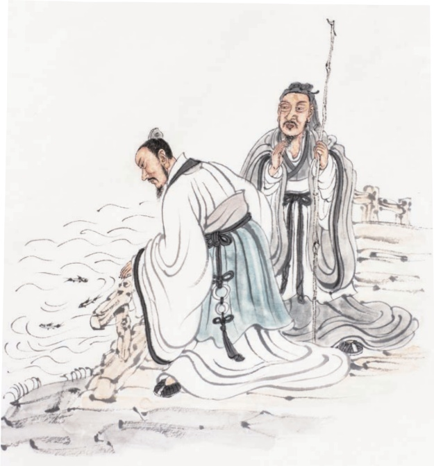

# 《庄子》二则

## 21 《庄子》二则

## 预习

庄子笔下的“鹏”这一形象对后世影响深远。搜集与“鹏”有关的文学形象、诗词名句、成语典故，与同学交流。

 善于运用寓言故事说理，想象雄奇瑰丽，是《庄子》的特色。朗读课文，体会这一特点。

## 北冥有鱼

北冥有鱼，其名为鲲③。鲲之大，不知其几千里也；化而为鸟，其名为鹏。鹏之背，不知其几千里也；怒④而飞，其翼若垂天之云⑤。是鸟也，海运⑥则将徙于南冥。南冥者，天池⑦也。《齐谐》者，志怪者也。《谐》之言曰：“鹏之徙于南冥也，水击⑨三千里，抟扶摇而上者九万里⑩，去以六月息者也。”野马也，尘埃也，生物之以息相吹也。天之苍苍，其正色邪？其远而无所至极邪③？其视下也④，亦若是则已矣。

①选自《庄子集释》（中华书局1961年版）。庄子（约前369一前286），名周，宋国蒙（今河南商丘东北）人，战国时期哲学家，道家学派的代表人物。《庄子》一书是庄子及其后学的著作，现存33篇，包括内篇7篇、外篇15篇、杂篇11篇。本课第一则节选自内篇中的《逍遥游》，第二则节选自外篇中的《秋水》。题目是编者加的。

②〔北冥〕北海。庄子想象中的北海，应该在北方的不毛之地。冥，同“溟”，海。下文的“南冥”指南海。

③〔鲲（kūn）〕大鱼名。

④〔怒〕振奋，这里指用力鼓动翅膀。⑤〔垂天之云〕悬挂在天空的云。

⑥〔海运〕海水运动。古代有“六月海动”之说，海动必有大风，大鹏可借风力南飞。

⑦〔天池〕天然形成的水池。

⑧〔志怪〕记载怪异的事物。志，记载。⑨〔水击〕击水，拍打水面。

⑩〔抟（tuán）扶摇而上者九万里〕乘着旋风盘旋

飞至九万里的高空。抟，盘旋飞翔。扶摇，旋风。〔去以六月息〕凭借着六月的大风离开。息，气息，这里指风。

②〔野马也，尘埃也，生物之以息相吹也〕山野中的雾气，空气中的尘埃，都是生物用气息吹拂的结果。野马，山野中的雾气，奔腾如野马。①③〔天之苍苍，其正色邪？其远而无所至极邪〕天色湛蓝，是它真正的颜色吗？还是因为天空高远而看不到尽头呢？其，表示选择。①④〔其视下也〕大鹏从天空往下看。其，代大鹏。5〔亦若是则已矣〕也不过像人在地面上看天一

样罢了。是，这样。

## 庄子与惠子①游于濠梁②之上

庄子与惠子游于濠梁之上。庄子曰：“鲦鱼③出游从容，是鱼之乐也。”惠子曰：“子非鱼，安知鱼之乐？”庄子曰：“子非我，安知我不知鱼之乐？”惠子曰：“我非子，固不知子矣；子固非鱼也，子之不知鱼之乐，全④矣！”庄子曰：“请循其本⑤。子曰汝安知鱼乐’云者，既已知吾知之而问我，我知之濠上也。”

## 思考探究

背诵《北冥有鱼》，说说文中讲了哪几层意思，作者笔下的“鹏”是个什么样的形象。

二熟读《庄子与惠子游于濠梁之上》，复述这则故事，并回答下列问题。

1.庄子与惠子的论辩十分巧妙，试说说巧妙在哪里。

2.庄子为什么说他知道“鱼之乐”？谈谈你的理解。

## 积累拓展

三解释下列加点的词。

1．怒而飞，其翼若垂天之云

2.《齐谐》者，志怪者也

3．子非鱼，安知鱼之乐

4.请循其本

四李白一生常以大鹏自比，下面这首《上李邕》，是他写给当时德高望重的名士、北海太守李邕的。结合注释，并查阅工具书，说说诗人借助大鹏的形象表达了怎样的情感。

大鹏一日同风起，扶摇直上九万里。

假令风歇时下来，犹能簸却沧溟水。

世人见我恒殊调，见余大言皆冷笑。

宣父①犹能畏后生②，丈夫未可轻年少。

①宣父：指孔子。唐太宗贞观十一年（637）下诏尊称孔子为“宣父”。

②畏后生：语出《论语·子罕》“后生可畏，焉知来者之不如今也”。
