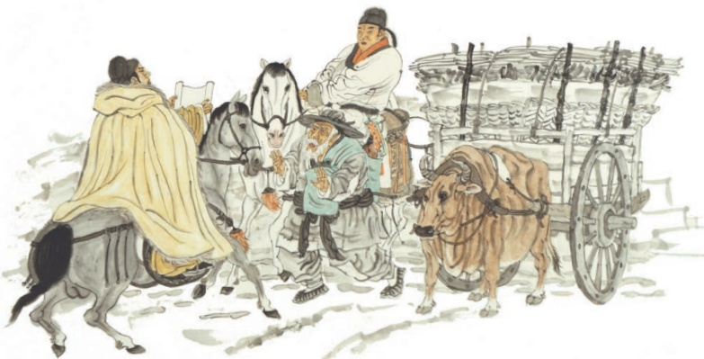

# 唐诗三首

## 24 唐诗三首

预习

杜甫和白居易都是唐代现实主义诗歌的代表诗人。结合注释初步读懂这三首诗歌，感受诗中所描述的社会现实，体会诗人的情怀。

朗诵这三首诗，体会古体诗在句式、用韵等方面的特点。

石壕吏①

杜甫

暮投②石壕村，有吏夜捉人。老翁逾墙走，老妇出门看。

吏呼一何③怒！妇啼一何苦！

听妇前致词④：三男邺城戍⑤。一男附书至⑥，二男新⑦战死。存者且偷生，死者长已③矣！室中更无人，惟有乳下孙。有孙母未去⑩，出入无完裙。老妪力虽衰，请从吏夜归，急应河阳役，犹得备晨炊。

夜久语声绝，如闻泣幽咽③。天明登前途，独与老翁别。

①选自《杜诗详注》卷七（中华书局1979年版）。唐肃宗乾元元年（758），为平定安史之乱，唐军围攻叛军所占的邺（yè）郡（今河南安阳)，胜利在望。次年春，形势发生逆转，唐军全线崩溃，退守河阳（今河南孟州)，并四处抽丁补充兵力。杜甫此时从洛阳回华州（今属陕西渭南），途经新安、石壕、潼关等地，根据目睹的现实写了一组诗，《石壕吏》是其中一首。石壕，即石壕村，在今河南三门峡东南。吏，小官，这里指差役。

②〔投〕投宿。

③〔一何〕多么。

④〔前致词〕走上前去（对差役）说话。

⑤〔戍(shù)〕防守。

⑥〔附书至〕捎信回来。

⑦〔新〕最近。

⑧〔已〕停止，这里指生命结束。

⑨〔乳下孙〕还在吃奶的孙子。

①0〔有孙母未去〕（因为）有孙子在，（所以）他的母亲还没有离去。

〔完裙〕完整的衣服。裙，这里泛指衣服。

②〔老妪（yù）〕老妇。

③〔幽咽（yè）〕形容低微、断续的哭声。

## 茅屋为秋风所破歌①

杜甫

八月秋高风怒号，卷我屋上三重茅②。茅飞渡江洒江郊，高者挂胃③长④林梢，下者飘转沉塘坳⑤。

南村群童欺我老无力，忍能对面为盗贼⑥。公然抱茅入竹去，唇焦口燥呼不得⑦，归来倚杖自叹息。

俄顷风定云墨色，秋天漠漠向昏黑。布衾多年冷似铁，娇儿恶卧踏里裂。床头屋漏无干处，雨脚如麻③未断绝。自经丧乱④少睡眠，长夜沾湿何由彻！

安得广厦千万间，大庇天下寒士16俱欢颜！风雨不动安如山。呜呼！何时眼前突兀见此屋，吾庐独破受冻死亦足！

①选自《杜诗详注》卷十（中华书局1979年版)。这首诗作于唐肃宗上元二年(761)，当时安史之乱还未平定。诗中的茅屋即指成都近郊的草堂。

②〔三重（chóng）茅〕多层茅草。

③〔挂胃（juàn）〕挂着，挂住。胃，挂结。

④〔长（cháng)〕高。

⑤〔沉塘坳（ào)〕沉到池塘水中。坳，低洼的地方。

⑥〔忍能对面为盗贼〕竟然狠心这样当面做抢掠的事。忍，狠心。能，如此、这样。⑦〔呼不得〕喝止不住。

⑧〔俄顷〕一会儿。

⑨〔漠漠〕阴沉迷蒙的样子。

①〔向昏黑〕渐渐黑下来。向，接近。

〔衾（qīn)〕被子。

①②〔娇儿恶卧踏里裂〕孩子睡相不好，把被里蹬破了。

①③〔雨脚如麻〕形容雨点不间断，像下垂的麻线一样密集。

①④〔丧乱〕战乱，指安史之乱。

⑤〔何由彻〕如何挨到天亮。何由，怎能、如何。彻，到，这里是“彻晓”（到天亮）的意思。

6〔寒士〕贫寒的士人。

〔突兀（wù）〕高耸的样子。

## 卖炭翁①

白居易

卖炭翁，伐薪②烧炭南山③中。满面尘灰烟火色，两鬓苍苍④十指黑。卖炭得钱何所营⑤？身上衣裳口中食。可怜身上衣正单，心忧炭贱愿天寒。夜来城外一尺雪，晓驾炭车辗冰辙。牛困人饥日已高，市南门外泥中歇。

翩翩⑦两骑来是谁？黄衣使者白衫儿。手把文书⑨口称敕，回车叱牛牵向北。一车炭，千余斤，宫使驱将④惜不得。半匹红纱一丈绫，系向牛头充炭直。

①选自《白居易集》卷四（中华书局1979年版)。这是诗人创作的组诗《新乐府》五十首中的第三十二首。诗人有自注云：“《卖炭翁》，苦宫市也。”唐德宗贞元末，宫中派宦官到民间市场强行低价买物，名为“宫市”，实为掠夺。

②〔薪〕木柴。

③〔南山〕终南山，属秦岭山脉，在长安城南。④〔苍苍〕灰白。

⑤〔何所营〕做什么用。营，谋求。

⑥〔市〕城市中划定的集中进行交易的场所。唐代长安有东、西两市，两市东、西、南、北各有二门。

⑦〔翩翩〕轻快的样子。

⑧〔黄衣使者白衫儿〕黄衣使者，指太监。白衫儿，指太监手下的爪牙。

⑨〔文书〕公文。

①〔敕（chì）〕指皇帝的命令。

〔回〕掉转。

①②〔叱（chì)〕吆喝。

③〔牵向北〕长安城宫廷在集市北边，所以说“牵向北”。

④〔将〕助词，用于动词之后。

⑤〔惜不得〕吝惜不得。

6〔半匹红纱一丈绫〕唐代商品交易，钱帛并用，但“半匹红纱一丈绫”远远低于一车炭的价值。

〔系〕挂。

⑧〔直〕同“值”，价钱。

## 思考探究

《石壕吏》和《茅屋为秋风所破歌》均为杜甫在安史之乱中的名作，表现了诗人对战争的控诉和对民生疾苦的关怀，但具体的写作手法有所不同。《石壕吏》只是“客观”地叙述，并无情感、态度的直接表露；《茅屋为秋风所破歌》则先描述个人遭际，结尾处借助议论和抒情升华。试结合作品分析这两种写法的表达效果。

二《卖炭翁》讲述了卖炭翁以伐薪烧炭艰难维持生计却横遭掠夺的悲惨故事，从中可以看出当时怎样的社会现实？诗人的态度又是怎样通过对人物、事件的描述表现出来的?

三这三首诗中有不少精彩之处，如《石壕吏》的巧妙构思，《茅屋为秋风所破歌》中对恶劣天气和生活环境的描写，《卖炭翁》中对卖炭老人及宫使形象的刻画等。试结合具体诗句做简要分析。

## 积累拓展

四背诵这三首诗。

五任选一首诗，发挥想象，增加一些细节，改写成一则小故事。

## 新乐府序白居易

序曰：凡九千二百五十二言，断为五十篇。篇无定句，句无定字，系于意，不系于文。首句标其目，卒章显其志，《诗三百》之义也。其辞质而径，欲见之者易谕也。其言直而切，欲闻之者深诫也。其事核而实，使采之者传信也。其体顺而肆，可以播于乐章歌曲也。总而言之，为君、为臣、为民、为物、为事而作，不为文而作也。

（选自《白居易集》卷三）

## 与作

## 学写故事

你一定也有过与这两名同学类似的体验吧？我们以前更多的是听故事、读故事，现在不妨也来尝试写故事吧。

写故事一定要有头有尾，完整地叙述一件事。当然，这件事不能太简单，看了开头就能猜出结局；也不能平铺直叙，平淡无奇，否则无法引起读者的阅读兴趣。在情节发展中设置一些小的悬念，增加一些波折，结尾能出人意料，等等，都是增加故事趣味性的好办法。比如蒲松龄的《狼》，篇幅不长，但写得一波三折，读来引人入胜。不妨再读一遍这篇文章，看看是不是有这样的特点。

故事中的人物要有血有肉，形象丰满，有趣味。比如在《孙权劝学》中，吕蒙就是一个个性鲜明、形象生动的人。由借口“军中多务”不肯读书，到听了孙权的劝告“乃始就学”，到“非复吴下阿蒙”，乃至令人“刮目相看”，表现了他听从劝告、学有所成的进步过程，也体现出他志趣的发展变化。这样写，人物形象才更加丰满。

故事允许有联想、想象的成分。设定故事情节后，可以通过适当的联想和想象去丰富细节，使情节更加曲折，人物更加生动。比如《卖炭翁》中，作者对卖炭老人的
