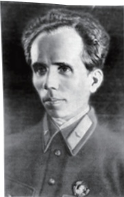

# 名著导读 # 《钢铁是怎样炼成的》摘抄和做笔记

## 名著导读

# 《钢铁是怎样炼成的》摘抄和做笔记

奥斯特洛夫斯基

长篇小说《钢铁是怎样炼成的》散发着那个带传奇色彩的时代急风暴雨的气息，传达了那个时代的气氛，再现了当时的战斗、痛苦和希望。

叶尔绍夫

这本书在我的成长过程中有很大的影响，书中浓郁的英雄主义、理想主义、献身主义在相当长的时间里成为我精神生活最重要的支柱。

——张洁

“人最宝贵的是生命。生命每个人只有一次。人的一生应当这样度过：当回忆往事的时候，他不会因为虚度年华而悔恨，也不会因为碌碌无为而羞愧；在临死的时候，他能够说：我的整个生命和全部精力，都已经献给了世界上最壮丽的事业—为人类的解放而斗争。'”

这段激动人心、被千千万万青年人引以为座右铭的文字，就出自苏联作家尼古拉·奥斯特洛夫斯基的小说《钢铁是怎样炼成的》。当时，奥斯特洛夫斯基已经双目失明，全身瘫痪。这部书是他强忍病痛，在病榻上历时三年写成的。

当一名英国记者问奥斯特洛夫斯基为什么以《钢铁是怎样炼成的》为书名时，他回答说：“钢是在烈火与骤冷中铸造而成的。只有这样它才能坚硬，什么都不惧怕。我们这一代人也是在这样的斗争中、在艰苦的考验中锻炼出来的，并且学会了在生活面前不颓废。”

作为一部闪烁着崇高的理想主义光芒的长篇小说，《钢铁是怎样炼成的》最大的成功之处就在于塑造了保尔·柯察金这一无产阶级英雄形象。他当过童工，从小就在社会最底层饱受折磨和侮辱，后来在朱赫来的影响下逐步走上革命道路。其后他经历了一系列的人生挑战，但无论是战场上的搏杀、感情上的波折，还是工地上的磨难，都没能使他倒下，反而使他更加勇敢，更加坚强。在伤病无情地夺走他的健康，使他不得不躺在病床上的时候，他仍然不向命运屈服，而是克服种种困难，拿起笔来，

以顽强的毅力开始写作，以另一种方式践行着他生命的誓言。可以说，在保尔·柯察金的身上凝聚着那个时代最美好的精神品质——为理想而献身的精神、钢铁般的意志和顽强奋斗的高贵品质。

人到底应该怎样度过自己的一生？怎样才能在革命斗争中成长为真正的钢铁战士？保尔·柯察金以自己的实际行动做出了响亮的回答。

这部小说在艺术上也取得了很高的成就。它写人物以叙事和描写为主，同时穿插内心独白、格言警句、书信和日记等，使人物形象有血有肉。书中的环境描写也相当出色，语言简洁优美，富有表现力。阅读这部名著，不仅可以感受保尔·柯察金巨大的人格魅力，从中汲取精神养料，还可以借鉴写作技巧，提高自已的文学鉴赏水平。

## 读书方法指导

读书时，除了在书中直接圈点批注，还可以做一些摘抄和笔记。摘抄和笔记可以帮助你重温作品内容，积累语言和素材，有助于提升阅读质量，提高分析能力、鉴赏能力和写作能力。

摘抄，就是选摘、抄录原文中的词语、句子、段落等。摘抄的内容可以是原作的典故、警句、精彩片段等，一般要根据学习、借鉴的意图来选择。比如阅读《钢铁是怎样炼成的》，为了提高写作能力，可以摘抄生动传神的细节描写片段、启迪思想的名言警句、写作技巧运用精彩的语段；为了分析评价主人公保尔·柯察金，可以摘抄描写他言谈、举止、心理的片段以及各种人物对他的评价。

做笔记，主要有写提要和写心得两大类。写提要，就是用精练的语言准确概括全书的基本内容或要点。所写的提要，可以是语意连贯的成段文字，可以是按层次和要点罗列的提纲，还可以是能够体现作品结构思路的图表。写心得，则是记录自己阅读时产生的体验、感想，如自己对于作品的内容（人物、情节、情感、思想等）和形式（写作技巧、行文风格、艺术特色等）的看法和评价，以及自己在阅读中生发的新认识、新观点。可以针对作品整体发表感想，也可以只对其中某一个或几个点进行发挥和评论。

在阅读实践中，摘抄和做笔记常常是结合在一起的，有时几则摘抄连贯起来便可以成为作品的提要，有时摘抄之后可以随手记下读书心得。

摘抄和笔记除了自己使用之外，也可以供他人学习参考。比如，为一部作品写的提要可以让没读过的人了解作品，好的读书心得可以启发、引导他人的阅读，都会产

生推介和指导阅读的功效。有些读书笔记，如明末清初顾炎武的《日知录》、现代人钱锺书的《谈艺录》，都已经成了经典著作。

摘抄和笔记还可以在开放的网络平台（如校园网站、班级论坛）上发表，与别人交流分享。

## 专题探究

全班共同阅读《钢铁是怎样炼成的》，然后根据各自的兴趣选择自己喜欢的专题，也可以另外选择专题，分小组进行探究。

## 专题一：保尔·柯察金的成长史

主人公保尔·柯察金在历练与考验中成长，这就如同钢铁在烈火与骤冷中铸造。历练与考验，坎坷与起伏，锻造了保尔·柯察金的信念和意志。梳理保尔·柯察金的成长史，列出提纲，给这位主人公写一个小传。

## 专题二：保尔·柯察金的形象分析

保尔·柯察金具有顽强的毅力、永不言败的精神，他在重重磨砺下无所畏惧，意志如同钢铁般坚强。然而除此之外，他还有温情的一面，比如书中写到的亲情、恋情、友情等。阅读的过程中，摘录一些能够体现保尔·柯察金性格不同侧面的句子和段落，结合这些具体描写，对主人公丰满的艺术形象做出分析。

## 专题三：“红色经典”的现实意义

有人认为，文学要有所担当，“红色经典”作为特定历史时期的精神路标，其厚重感与担当意识在现实生活中依然富有生命力。你怎么看待“红色经典”的现实意义？带着这个问题阅读这部具有年代感的作品，在阅读的过程中留意自己的感受，看看其中哪些段落让你读来觉得困惑，哪些段落依然新鲜刺激，哪些段落令你深受触动。详细记录这些心得体会，整理成读书笔记，并与同学探究“红色经典”的现实意义。

## 自主阅读推荐

## 路遥《平凡的世界》

这是一个平凡的世界。苦难是作品的底色。小说的主人公孙少安、孙少平兄弟，只是两个平凡的农民，一个扎根乡土，一个走进城市。他们没有什么传奇的经历，也没有什么辉煌的业绩，自始至终只能在艰难的生活中奋勇挣扎；甚至生活刚有起色，新的磨难又接踵而至。

这是一个温暖的世界。生活中的磨难没能掩盖生活中的温情。无论是醇厚的父子之爱、纯洁的同窗友情、美好的同事情分、淳朴的乡邻情谊，还是刻骨铭心的纯真爱情，都在荒寒的人生底色上涂抹上温情的色彩，温暖着读者的心。尤其是孙少平和田晓霞之间近乎柏拉图式的爱情，纯真甜美，带着理想主义的浪漫色彩，让人心醉。

这又是一个不平凡的世界。主人公都有着一颗不平凡的心，他们选择了勇敢地面对磨难，把磨难当作前进的动力。哥哥孙少安不安于现状，立志改变乡村贫困的面貌。他自强不息，坚韧不拔，虽经历爱情的挫折和事业上的重重困境，却始终不改初衷，最终成为村里的“冒尖户”。弟弟孙少平渴望走出乡村，融入现代文明。虽然物质生活是贫困的，精神上也是孤独的，但他有着强烈的自尊，决不因生活的苦难而苟且行事，自甘堕落，始终追求着精神世界的完善。他接连遭受了爱情的伤痛和身体的毁伤，意志却没有被摧毁；他选择了平平淡淡的生活，却收获了心灵的高贵和精神的富足。

这是一本很适合青少年读的书，不仅仅因为它是作者路遥的呕心沥血之作，也不仅仅因为它获得过茅盾文学奖，更因为书中描写的个人奋斗和自我精神追求，充满了正能量，会让我们明白生活的意义何在，以及我们应该如何面对未来的生活。

## 罗曼·罗兰《名人传》

我们都喜欢英雄，崇拜英雄。呼唤英雄是人类永恒的情结。说起英雄，我们可能首先会想到冲锋陷阵、保家卫国的战士，锄强扶弱、伸张正义的好汉；其实那些敢于直面人生的苦难，甘愿牺牲个人幸福为人类创建精神家园的人，同样也是令人景仰的英雄。20世纪初，物质至上的观念统治一切，功利主义压倒了精神追求，社会陷入自私自利、污浊与腐败的气氛中，“人类喘不过气来”。有感于此，法国文学家罗曼·罗兰创作了《名人传》（又称《巨人三传》，包括《贝多芬传》《米开朗琪罗传》《托尔斯

泰传》)，借为人类历史上的精神巨人立传，激励人们“打开窗子”，“让自由的空气重新进来！呼吸一下英雄们的气息”。

《名人传》中的三位精神巨人，都是人类历史上极富天才且贡献至伟的人物。读过传记，我们会发现，原来这些令后辈高山仰止的巨人，心中也埋藏着那么多不为人知的痛苦：贝多芬在创作的鼎盛期，遭受到失聪的打击，爱情的缺失、经济的窘迫、侄子的不肖也让他痛苦不已；米开朗琪罗的优柔寡断，使得他一生都在受人摆布，日常琐事的牵绊，影响着他创作才华的发挥；列夫·托尔斯泰拥有财富和地位，却始终处在内心追求与现实处境的矛盾之中。但伟人之所以成为伟人，就在于他们即使面对各种困苦，心中也始终坚守着自我实现的理想。就像贝多芬“以痛苦讴歌欢乐”那样，扼住命运的咽喉，去勇敢地抗争。

作者在《米开朗琪罗传》中说：“伟大的心灵有如峻拔的山峰，……我并不认为一般人都能生活在高山之巅，但不妨一年一度登高礼拜。他们可以在那儿更新肺部的气息和脉管中的血液。在高处，他们会感到更加接近永恒。待回到人生的平原，他们将满怀勇气面对日常的搏斗。”这或许就是今天我们阅读此书的意义所在。
