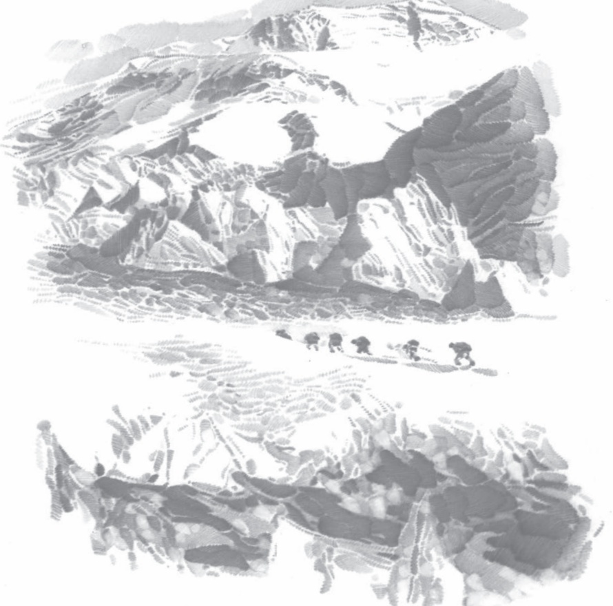

# 庆祝奥林匹克运动 复兴周年

# 16庆祝奥林匹克运动 复兴25周年

顾拜旦

联邦②主席、女士们、先生们：

5年前，在巴黎，在1894年我宣布恢复奥林匹克运动会的地方，世界各国的代表们共聚一堂，同我们一起庆祝奥林匹克运动复兴20周年。5年过去了，在这期间，整个世界分崩离析③。所幸，奥林匹克主义并没有成为这场浩劫的牺牲品，而是无所畏惧、无可指摘地挺了过来。而今，它的眼前突然呈现出更为开阔的视野，这凸显了它即将扮演的崭新角色的意义。

奥林匹克精神开始为渐趋平和而又充满自信的青少年所推崇。古文明的魅力，时有衰退，平和与自信正日益成为其有力的支撑。同时，它们也是那些即将在暴风骤雨中诞生的新生文明必不可少的支柱。然而，人类并非生而就平和自信。还在襁褓④中的婴儿，就已开始担惊受怕。恐惧伴随着他成长的各个阶段，并在他行将就木⑤时，给他致命一击使其崩溃。恐惧是人类工作和休息的天敌，面对它，人类学会用勇气来针锋相对。有些人认为，勇气这一高贵美德只有在我们的祖先身上才能看到，他们因此非常尊重先人。在他们的想象中，勇气之花在我们当代人的手中早已残败凋零了。但是如今，我们知道该在将来采取何种态度了。

勇气是战争中的美德，它能够在时势中造就英雄。正如我最近在一篇关于教育学的文章中所暗示的那样，根除恐惧真正的、能持久发挥效用的良药，更多的是自信而非勇气。自信与它的姊妹平和总是携手并进，相辅相成。这样，我们又回到了适才我提到的奥林匹克主义的实质上来，这也正是奥林匹克主义区

别于一般体育运动的地方，奥林匹克主义包括但又远远超越了一般的体育运动。

请允许我详细阐述一下二者的区别。运动员非常享受努力拼搏的乐趣。他喜欢施加于肌肉和神经上的那种压力感，因为压力往往给人一种胜利在望的感觉，即便有时到最后他未能获胜。这种享受，深入运动员的内心，某种程度上甚至可以说只涉及自身。请想象一下，当这种愉悦向外喷涌，并与对大自然的热爱之情和对艺术的奔放激情融为一体；当它为灿烂阳光所萦绕，为音乐所振奋，或被嵌入圆柱式大厅时，会是怎样的情景。许久以前，就是在这般情景下，古代奥林匹克主义的绚丽梦想在阿尔弗斯河的两岸诞生了。奥林匹克主义曾在许多个世纪里，一直主导着古希腊社会。

然后，我们来到了历史的转折关头。渴求进步但又常常因夸大某种正确思想而误入歧途的人类精神，开始致力于将青少年从平衡状态中挣脱出来。于是，青少年开始为呆板而复杂的教育枷锁所套牢，被在愚蠢的放纵和不明智的严厉交互作用下的道德说教以及拙劣肤浅的世界观所束缚。这就是为何我们要重启奥林匹克时代，并为体格训练的复兴隆重庆祝。我们不断推动盎格鲁－撒克逊人①的运动功利思想向古希腊遗留下来的一呼百应的体育观靠拢，两者逐渐融合为一体。当我在纽约和伦敦对举办奥运会的可能性做出评估之后，我向不朽的古希腊精神祈祷，希望它给这意外中诞生的结合体一剂理想主义的良药。先生们，这25年来我们成功兴建的事业大厦，便是这副模样。诸位适才不断向其表达敬意，若这敬意是针对我这建筑师而来的话，那我着实愧不敢当。它的建筑师不应受到如此赞美，他不过是听从了一种比个人意志更为强大的内心直觉的召唤。他愿意愉快地接受诸位对奥林匹克精神的赞美之词，而他个人，不过是这一理想的第一个仆从。

之前我曾提及1914年6月所举办的周年庆典。当时我们认为，我们庆祝的是奥林匹克主义的完美实现。然而今天，我的印象反而是我正目睹它再次含苞欲放。一项运动，倘若只有有限一部分人被包含在内，在当今时代又怎能称得上完美呢？在当时，有这么多人可能确实是足够的，但今天则不然。它必须要面向大众。的确如此，有什么名义能将大众排除在奥林匹克精神之外呢？有什么样的贵族特权能令一个青年人身上的形体美、肌肉力量、锻炼的毅力以及获胜的意志非得同他的家谱或钱包挂钩呢？上述种种毫无法律依据的矛盾，存活

在萌生它们的这个社会秩序里。在野蛮的军国主义协助下的极权姿态，给了它们致命一击。从道义上讲，这反而是可以自圆其说的。

面对一个需要用基本原则来整顿的全新世界，某些过去一直被视为乌托邦①的原则，如今却变得切实可行。人类必须吸收古文明遗留下来的全部精华，用以构筑未来，其中就包括奥林匹克精神。当然，仅靠奥林匹克精神，并不足以保障社会层面的和平以及更公平、公正地分配人类生产劳动，分配满足物质生活需要的消费必需品，甚至不足以向青少年提供与他们的能力相当而与其家庭出身无关的才智培训机会。但是，奥林匹克精神致力于让社会底层的人们接触到现代工业所塑造的各种锻炼形式，享受到强身健体的乐趣。这就是完美的、民主的奥林匹克精神，今天我们要为它奠定基础。

本次庆典是在欢乐祥和的气氛下举行的。古老的赫尔维蒂②联邦最高委员会及其尊敬的主席，深得人类挚爱的瓦莱州③派出的首席代表，这座美丽而又好客的城市的领导们，远近闻名的歌手，以及历经千挑万选、朝气蓬勃的体操团队，齐聚于此地，为这次盛会赋予了历史自觉性、公民精神、自然性、青春、艺术性等五重声誉。

愿钟爱勇敢者的幸运之神，厚待刚刚决定申办第7届现代奥林匹克运动会的比利时人民的美好愿望。

目前的形势，依然严峻。狂风骤雨之后，我们迎来破晓的黎明。待到中午时分，湛蓝的天空必将万里无云；收获者的双臂，捧满沉甸甸的金黄麦穗。

## 目读读写写

<html><body><table border="1"><tr><td></td><td></td><td></td><td></td><td></td><td></td><td></td><td></td><td></td><td></td><td></td><td></td><td>绚</td><td>丽</td><td></td><td>枷</td><td>锁</td></tr><tr><td></td><td></td><td></td><td></td><td></td><td></td><td></td><td></td><td></td><td></td><td></td><td></td><td></td><td></td><td></td><td></td><td></td></tr><tr><td></td><td></td><td></td><td></td><td></td><td></td><td></td><td></td><td></td><td></td><td></td><td></td><td></td><td></td><td></td><td></td><td></td></tr><tr><td></td><td></td><td></td><td></td><td></td><td></td><td></td><td></td><td></td><td></td><td></td><td></td><td></td><td></td><td></td><td></td><td></td></tr></table></body></html>

②〔赫尔维蒂〕瑞士的旧称。

## 任务二

## 撰写演讲稿

撰写演讲稿，除了可以借鉴一般的写作手法，还要体现出演讲的特征。我们在“任务一”中通过学习演讲词，已经对演讲的特征有了基本的了解。下面提示一些具体的技巧，以帮助大家更好地撰写演讲稿。

要有针对性，做到“心中有听众”。要充分考虑听众的年龄、身份、文化程度、心理需求等，以此来确定演讲的主题、内容和语言风格，这样才能做到有的放矢。

注意写好开头，吸引听众的关注。演讲开头的方式有很多种，可以从问候或感谢语开始，拉近与听众的距离；可以由演讲的缘起、现场的氛围等引入正题；可以开门见山，直奔主题；还可以提出问题，引发思考。本单元所选的几篇演讲词开头各有特点，但都能快速“抓住”听众，值得在写作中效仿。

明确表达观点，把思路展现出来。听现场演讲与读文章的不同在于，听众无法像读者那样反复阅读，慢慢思考。因此,写演讲稿时要注意提高自己观点和思路的“辨识度”，除了观点要明确外，尤其要注意用提示性词语、关联词语和过渡性语句来提示自己的思路，将其更直接、更清晰地呈现出来，不要过多地让听众去揣摩、分析。

精心设计结语，提升演讲的效果。在演讲稿的最后，可以重申观点，加深印象；也可以提出号召，鼓舞人心；还可以幽默调侃，逗大家一笑。好的结语能有效调动听众的情绪，或将他们的思考引向深入。

着力锤炼语言，增强演讲的感染力。演讲稿的语言可以有不同的风格，或庄重严肃，或轻松活泼，但总体来说应该尽可能体现口语化、大众化的特点，尽量避免使用听众不熟悉的文言、方言或生僻词语；多用短句，少用结构复杂的长句。

此外，还可以通过词语的精心选用和比喻、拟人、排比、对偶、设问、反问等修辞手法的巧妙运用来增强语言的表达效果；有意识地锤炼“金句”，给听众以深刻的印象。

现在，请拿起笔来，自己尝试着撰写一篇演讲稿吧。下面的话题可供参考。不少于600字。

我的梦想

O 让爱永驻心中

书香，伴我成长

假设学校组织竞聘学生会主席、团支部书记、校刊主编、校广播站总监、志愿者服务团团长等，你准备竞聘其中某个职务。试撰写一篇演讲稿，阐述你的竞聘主张。

## 任务三

## 举办演讲比赛

在“任务二”撰写演讲稿的基础上，举办一次班级演讲比赛。

1.赛前准备。

（1）个人准备。课外搜集演讲视频、音频资料，了解演讲的基本技巧，并用“任务二”中撰写的演讲稿自己演练。

O 可以搜集历史名人演讲的视频或音频资料，也可以关注网络或电视上热门的演说类节目。

重点关注演讲技巧，如语气、语调、重音、节奏的调配，表情的处理，体态语的运用等。

自己演练时注意借鉴他人的演讲技巧，并熟记演讲词，争取脱稿。

（2）举办小组选拔赛。选择同一题目撰写演讲稿的同学自由组成小组，先在小组内进行选拔比赛，每组选出一到两名同学参加班级演讲比赛。

小组选拔时，一方面要重视演讲的内容，另一方面要考虑演讲技巧的运用（如声音、语气、表情、动作等），通过综合评价，推举优秀代表。

被推举出来的同学，正式比赛前要反复演练。不妨在小组内再演讲一次，听取其他同学的意见，改进提高。

（3）推选主持人，撰写串场词，安排演讲顺序。

（4）推选评委，设置必要的奖项，制订评选细则。

2.现场比赛。

（1）选手要注意临场表现和发挥。

面带微笑，放松心情。如果感到紧张，可以做一下深呼吸，环视全场，调整好自己的状态。

声音清晰、悦耳，音量适中，根据演讲的需要适当调整语速、语气。

站姿自然、沉稳，同时辅以合适的手势动作。

直面听众，适时用眼神与听众交流，观察他们的反应，检验演讲的效果，调整自己的演讲内容、语气和体态。

保持饱满的情绪，一气呵成地完成演讲。

如果在演讲中出现一些突发情况，比如忘词了或者讲错了，要通过放慢语速努力回忆、结合现场情况略做调整、临时应变自圆其说等方式，努力使演讲顺利进行下去。

（2）评委根据评选细则，评出相应奖项，公布获奖名单，也可以给予适当奖励。

（3）获奖同学发表感言，其他同学可以在“微博墙”上留言。评委做精要点评或活动总结。

## 」第四单元

## 第五单元

古人说，读万卷书，行万里路。旅游其实也是一种“阅读”，是认识世界的另一种方式。本单元所选的课文都是游记，通过记述游览见闻，描摹山水风光，吟咏人文胜迹，抒发作者的情思。阅读这类文章，随着作品去想象和遨游世界，可以让我们丰富见闻，增长知识，开阔眼界。

学习本单元，要了解游记的特点，把握作者的游踪、写景的角度和方法，并揣摩和品味语言，欣赏、积累精彩语句。

